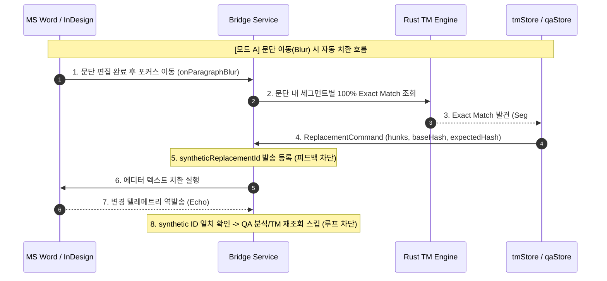

# 자동 치환(자동 번역) 및 [번역 모드](CAT 툴화 + XLIFF) 설계 분석 보고서

---

## 1. 총괄 요약 (Executive Summary)

사용자께서 제안하신 두 가지 기능—**(1) TM 100% 매치 기반 자동 치환(사전 번역)** 및 **(2) 대시보드 [번역 모드] 전환을 통한 CAT 툴화 + 이중언어 XLIFF 저장/클린업**—은 SmartLinter를 단순한 '실시간 보조 검수기'에서 **'독립형 경량 CAT(Computer-Assisted Translation) 플랫폼'**으로 확장하려는 비전을 담고 있습니다.

본 분석에서는 기존 결정 사항([`PHASE0_SOURCE_DATA_CONTRACT_FINDINGS.md`](file:///D:/smartLinter/PHASE0_SOURCE_DATA_CONTRACT_FINDINGS.md)), 최근 폐기된 [붙여넣기]의 실패 교훈, 그리고 현재 구현된 아키텍처([`TMMatchPanel.tsx`](file:///D:/smartLinter/src/components/tm/TMMatchPanel.tsx), [`TMMatchCard.tsx`](file:///D:/smartLinter/src/components/tm/TMMatchCard.tsx), [`qaStore.ts`](file:///D:/smartLinter/src/stores/qaStore.ts), [`tmStore.ts`](file:///D:/smartLinter/src/stores/tmStore.ts))를 기준으로 두 제안의 실행 가능성, 치명적 위험 요인, 그리고 안전한 단계별 추진 방안을 상세히 검토했습니다.

### 🔑 3대 핵심 결론 요약

1. **Phase 0 데이터 계약과의 관계 (완전 공존 가능 — 갈래 (b) 확정):**
   - 제안 2번의 "번역 모드 및 XLIFF 저장"은 에디터의 원문 전제를 뒤흔드는 코어 데이터 계약 수정(갈래 a)이 아니라, **에디터와 대시보드가 상호작용하는 동안 메모리에 축적된 원문↔번역 세그먼트를 XLIFF 1.2 규격의 "사이드카(Sidecar) 파생 산출물"로 사후 내보내는 방식(갈래 b)**으로 정의해야 합니다. 이 경우 Phase 0 결정(에디터 문서는 원문, QA는 monolingual 린터)과 100% 공존할 수 있습니다.
2. **자동 치환(제안 1)의 안전 경계 (엄격한 100% Exact Match + 옵트인):**
   - 퍼지 매치(Fuzzy match, 75~99%) 자동 적용은 절대 불가하며, **오직 100% Exact Match(문장 단위)**에 한해서만 허용되어야 합니다.
   - [붙여넣기] 기능 분석에서 드러난 **"텔레메트리 피드백 루프(자기가 바꾼 텍스트를 사용자가 쓴 원문으로 재인식)"**와 **"타이핑 중 해시 충돌(경쟁 상태)"**을 방지하기 위해 `syntheticReplacementId` 차단 플래그와 단일 문장 트랜잭션 잠금이 필수적입니다.
3. **작업 순서 및 의존성 (Stage 1c 문장 단위 TM 적용 선행 필수):**
   - 두 기능 모두 현재의 **"문단 단위 매칭"** 상태에서는 안전하게 동작할 수 없습니다. 최근 완성된 Stage 1a/1b([`segmenter.rs`](file:///D:/smartLinter/src-tauri/src/tm/segmenter.rs) 및 [`splitIntoSentences`](file:///D:/smartLinter/src/utils/sentenceBoundary.ts)) 기반의 **"문장 단위 TM 검색 및 1-클릭 치환(Stage 1c)"**이 먼저 완성되어야 그 위에 자동 치환과 번역 모드 세그먼트 누적기를 올릴 수 있습니다.

---

## 2. Phase 0 기존 결정과의 정합성 분석

### 2.1 기존 확정 사실 ([`PHASE0_SOURCE_DATA_CONTRACT_FINDINGS.md`](file:///D:/smartLinter/PHASE0_SOURCE_DATA_CONTRACT_FINDINGS.md) §2, §4.3)

* **원문 전제:** Word, InDesign 등 활성 에디터에 열린 문서는 **원문(Source)**입니다.
* **QA 파이프라인:** [`qaStore.ts:953-957`](file:///D:/smartLinter/src/stores/qaStore.ts#L953-L957)에서 `source`를 항상 빈 문자열(`""`)로 고정하여 단일 언어(Monolingual) 린터로 작동합니다.
* **TM 파이프라인:** TM은 QA와 경쟁하는 축이 아니라, 에디터의 원문 문장을 조회 키로 사용하는 **독립된 병렬 지식베이스(DB)**입니다.
* **XLIFF canonical 채택 기각:** Codex가 제안했던 "XLIFF를 내부 표준 계약으로 강제하는 Phase 1 ADR"은 사용자가 명시적으로 기각했습니다.

---

### 2.2 갈래 (a) vs 갈래 (b) 비교 및 판정


| 비교 항목 | (a) 내부 데이터 계약을 Bilingual로 복귀 | (b) XLIFF를 사후 생성 사이드카로 취급 (권고) |
| :--- | :--- | :--- |
| **개념** | 대시보드와 에디터 프로토콜 전체를 XLIFF 기반으로 전면 재설계 | 에디터는 원문 텍스트를 유지하고, 치환/번역 이력을 바탕으로 XLIFF를 "내보내기(Export)" |
| **Phase 0 합의** | ❌ **정면 충돌** (합의 전면 파기) | ✅ **100% 공존** (QA monolingual 전제 그대로 보존) |
| **에디터 프로토콜 영향** | `ParagraphPayload`, `messages.rs`, Word/InDesign 플러그인 전면 수정 | 기존 `ReplacementCommand` 및 텔레메트리 프로토콜 **수정 없음** |
| **리스크 수준** | 🔴 **치명적 (시스템 전면 재개발)** | 🟢 **낮음 (독립 Export 모듈 추가)** |

> **💡 결론:** 제안 2번의 [번역 모드]는 **(b) "사이드카 파생 산출물 사후 생성 모델"**로 정의해야 합니다. 이렇게 구현하면 사용자가 에디터에서 원문을 번역/치환하는 과정에서 대시보드가 번역 쌍을 차곡차곡 모아두었다가 언제든 표준 XLIFF 파일로 추출할 수 있으며, 기존 QA 린터와 에디터 브릿지에는 아무런 부작용을 주지 않습니다.

---

## 3. [질문 1] 자동 치환(자동 번역) 기능 상세 분석

### 3.1 발동 조건 및 일치율(Match Threshold) 기준

자동 치환은 사람의 개입 없이 문서 내용이 직접 변경되는 기능이므로, 매우 보수적인 기준이 적용되어야 합니다.

1. **퍼지 매치(Fuzzy Match, 75% ~ 99%)는 자동 치환 대상에서 절대 제외:**
   - 95% 매치라 할지라도 숫자 1개, 고유명사 1개, 부정어(`not`) 유무가 다를 수 있습니다. 이를 자동 치환하면 **침묵의 오번역(Silent Corruption)**이 발생합니다.
2. **100% Exact Match(단일 문장 단위)만 허용:**
   - 문단 전체가 아닌, **SRX로 분할된 개별 문장**이 TM의 원문과 완벽히 일치(100% Exact Match)하는 경우에만 발동 후보가 됩니다.
   - 단, 동일 원문에 복수의 번역문(1:N 매핑)이 존재하는 TM 충돌 상태일 때는 자동 치환이 즉시 중단되고 수동 선택으로 폴백(Fallback)해야 합니다.

---

### 3.2 트리거 시점 및 실행 모델

자동 치환이 발동되는 트리거는 크게 세 가지 방식이 검토될 수 있습니다.



1. **방식 A: 문단 이동(Blur/Idle) 시 자동 치환 (권장 - 기본 인터랙션)**
   - 사용자가 한 문단을 작성하고 다음 문단으로 넘어가거나(포커스 이동), 2초 이상 타이핑이 멈췄을 때(Idle), 현재 문단 내의 100% 일치 문장을 자동으로 치환합니다.
2. **방식 B: 명시적 "문서 일괄 사전 번역(Pre-Translate All)" (권장 - 배치 작업)**
   - 대시보드 상단에 `[TM 100% 일괄 사전 번역]` 버튼을 두고, 사용자가 누르면 문서 전체의 문장을 스캔하여 100% 일치 항목을 한 번에 치환(진행률 표시 및 사전 시뮬레이션 제공).
3. **방식 C: 실시간 키스트로크 즉시 치환 (절대 금지 ❌)**
   - 타이핑 중에 글자가 자동으로 바뀌면 사용자의 한글 조합(IME)이 깨지고 커서가 튀는 치명적인 타이핑 간섭이 발생합니다.

---

### 3.3 핵심 리스크 방어 (피드백 루프 & 해시 경쟁 상태)

폐기된 [붙여넣기] 기능 분석에서 확인된 위험 요소를 회피하기 위한 구체적 엔지니어링 방안입니다.

#### ① 텔레메트리 피드백 루프 (Echo Loop) 차단
* **문제점:** 대시보드가 문장을 치환하면, 에디터 플러그인(Word `document_listener.ts`, InDesign `text_observer.jsx`)이 이를 "사용자가 직접 문서를 수정한 이벤트"로 감지하여 대시보드로 다시 텔레메트리를 쏩니다. 이로 인해 QA 린터와 TM 매칭이 불필요하게 다시 호출되는 무한 루프가 발생합니다.
* **해결책 (Synthetic Echo Suppression):**
  - 치환 명령 발송 시 `ReplacementCommand.commandId`를 메모리에 `activeSyntheticReplacements` Set으로 등록합니다.
  - 에디터는 치환 직후 발생하는 텔레메트리에 해당 `commandId`를 에코 페이로드로 첨부합니다.
  - 대시보드 브릿지는 자신이 유발한 텔레메트리가 들어오면 **TM 재검색 및 QA LLM 호출을 건너뛰고 상태만 동기화**합니다.

#### ② 타이핑 중 해시 경쟁 상태 (Stale BaseHash Conflict)
* **문제점:** 백그라운드에서 자동 치환 명령이 날아가는 수 밀리초 사이에 사용자가 키보드를 누르면 `baseHash`가 달라져 치환이 거부(Reject)되거나 엉뚱한 위치가 덮어씌워집니다.
* **해결책:**
  - 기존 [`qaStore.ts:520-529`](file:///D:/smartLinter/src/stores/qaStore.ts#L520-L529)의 엄격한 해시 검증(`baseHash` 대조)을 그대로 재사용합니다.
  - 불일치 시 강제로 덮어쓰지 않고 조용히 치환을 중단(Silent Abort)하며, 카드를 '수동 적용 대기' 상태로 남겨둡니다.

---

### 3.4 되돌리기(Undo/Rollback) UX 및 상태머신 통합

* **원클릭 일괄 롤백 바(Rollback Bar):**
  - 자동 치환이 실행되면 대시보드 하단에 토스트 알림을 띄웁니다:
    > *"TM 100% 매치 3개 문장이 자동 번역되었습니다. [모두 되돌리기 (Undo)]"*
* **개별 카드 상태 분기:**
  - 자동 적용된 문장은 [`TMMatchCard.tsx`](file:///D:/smartLinter/src/components/tm/TMMatchCard.tsx)에 `status: 'auto-applied'`로 표시되며, 우측에 `[되돌리기]` 버튼을 제공합니다.
  - 되돌리기 클릭 시 원래 원문으로 역치환하는 `Compensating ReplacementCommand`를 디스패치합니다.

---

### 3.5 제품 철학(Human-in-the-Loop)과의 정합성

* SmartLinter의 기본 철학은 **"사용자가 확인하고 승인한다"**입니다.
* 따라서 자동 치환은 **기본값 OFF (Opt-in)** 토글로 제공되어야 합니다.
* 설정 모달([`SettingsModal.tsx`](file:///D:/smartLinter/src/components/config/SettingsModal.tsx))에 `[TM 100% 매치 자동 치환 활성화]` 스위치를 배치하고, 켤 때 주의 안내(Exact Match만 적용됨)를 고지합니다.

---

### 3.6 단계별 실행 계획 (Phase 1A ~ 1C)

| 단계 | 목표 | 주요 구현 내용 | Release Gate (통과 기준) |
| :--- | :--- | :--- | :--- |
| **Phase 1A** (스파이크) | **관찰 및 시뮬레이션** | • 문서 내 100% Exact Match 세그먼트 카운트 및 UI 표시<br>• 실제 에디터 텍스트 수정은 일절 하지 않음 | 100% 일치율 판정의 정확도 100% 확인, 피드백 루프 미발생 검증 |
| **Phase 1B** | **수동 일괄 사전 번역** | • `[TM 100% 일괄 적용]` 버튼을 통한 사용자 명시적 일괄 치환<br>• 실행 전 매치 목록 프리뷰 모달 제공 | 대용량 문서(100개 문단) 치환 시 오프셋 드리프트 0건, 에코 루프 차단 확인 |
| **Phase 1C** | **백그라운드 자동 치환** | • 문단 Blur 시 100% Exact Match 자동 치환 (Opt-in 토글)<br>• 토스트 알림 및 즉시 Undo 기능 제공 | 타이핑 충돌 시 Silent Abort 동작 실증, Undo 복구율 100% 달성 |

---

## 4. [질문 2] [번역 모드] (CAT 툴화 + XLIFF 저장/클린업) 상세 분석

### 4.1 "번역 모드"의 개념 정의 및 아키텍처 요구사항

현재 대시보드는 **Stateless Bridge**(문서 전체를 메모리에 들고 있지 않고, 에디터가 보낸 현재 활성 문단 `activeParagraph`만 처리) 구조입니다.
대시보드가 Trados와 같은 CAT 도구 형태의 [번역 모드]로 동작하기 위해서는 **문서 세션 상태 누적기(Document Session Accumulator)**가 도입되어야 합니다.

```mermaid
graph LR
    subgraph Native_Editor [Word / InDesign]
        Doc[에디터 원본 문서]
    end

    subgraph SmartLinter_Dashboard [SmartLinter 대시보드]
        direction TB
        ModeToggle[모드 전환: QA 모드 ↔ 번역 모드]
        
        subgraph QA_Mode [QA 검수 모드 (기본)]
            QAPanel[QA 이슈 카드 리스트]
            TMPanel[TM 매치 패널]
        end

        subgraph Translation_Mode [번역 모드 (신규 서페이스)]
            Grid[2열 세그먼트 그리드 (Source | Target)]
            Accumulator[TranslationGridStore<br>(문서 문장별 번역 상태 누적)]
        end
    end

    subgraph Export_Output [파생 산출물]
        XLIFF_File[XLIFF 1.2 / 2.0 파일]
        CleanDoc[클린업 번역 문서]
    end

    Doc <-->|양방향 동기화| Accumulator
    Accumulator -->|Export| XLIFF_File
    Accumulator -->|Export| CleanDoc
```

#### 번역 모드 전환 시 UI/데이터 변화
1. **화면 레이아웃 전환:**
   - 기존 QA 카드 리스트 중심 화면에서 Trados/memoQ 스타일의 **"2열 세그먼트 그리드(좌측: 원문 세그먼트, 우측: 번역문 입력창)"**로 UI 뷰가 전환됩니다.
2. **세그먼트 상태 저장소 (`translationGridStore.ts` 신규):**
   - 에디터 전체 스캔을 통해 문서 내 모든 문단을 문장 단위로 분할하여 `{ segmentId, paragraphId, sourceText, targetText, status: 'untranslated' | 'draft' | 'translated', matchScore }` 배열을 메모리에 유지합니다.

---

### 4.2 "이중언어 XLIFF 저장" vs "클린업 추출" 3대 시나리오 비교

| 시나리오 | 설명 | 기술적 구현 난이도 | 리스크 및 안정성 평가 |
| :--- | :--- | :--- | :--- |
| **(a) XLIFF 사이드카 Export** *(강력 권장)* | 대시보드에 누적된 원문↔번역 세그먼트 쌍을 표준 `.xliff` 파일로 디스크에 저장 | 🟡 **보통 (Rust XLIFF Serializer 작성)** | 🟢 **매우 안전**<br>에디터 문서를 건드리지 않으므로 데이터 손상 위험 0% |
| **(b) XLIFF 기반 독립 번역문서 생성** *(장기 과제)* | 저장된 XLIFF의 번역문만 추출하여 새로운 Word(`.docx`) 또는 InDesign(`.idml`) 파일 생성 | 🔴 **높음 (Native File Generator 필요)** | 🟡 **중간**<br>서식(스타일, 표, 이미지) 완벽 복제 엔진 필요 (`docx-rs`, IDML 패키징) |
| **(c) 에디터 내 직접 이중언어 작성 후 클린업** *(절대 금지 ❌)* | 에디터 문서 자체에 원문+번역문을 위아래로 병기했다가, 나중에 원문 줄을 삭제 | 🔴 **극도로 높음 (대규모 문서 파괴 위험)** | 🔴 **치명적 위험**<br>폐기된 [붙여넣기]의 서식 파괴 및 텔레메트리 폭풍 문제가 수백 배로 증폭 |

> **💡 권고:** **시나리오 (a)**를 1차 목표로 구현해야 합니다. 시나리오 (b)는 대시보드 내보내기 옵션으로 추후 검토할 수 있으며, 시나리오 (c)는 에디터 문서를 직접 파괴하므로 완전히 배제해야 합니다.

---

### 4.3 XLIFF 규격 실사 및 CAT 툴 호환성

#### ① XLIFF 1.2 vs 2.0 비교
* **현업 호환성:** Trados 2019~2024, memoQ, Phrase(Memsource) 등 대부분의 상용 번역 현업 파이프라인은 여전히 **XLIFF 1.2 (`.xlf`, `.sdlxliff`)**를 사실상의 표준으로 사용합니다.
* **권고 규격:** **XLIFF 1.2 Transitional**을 1차 타깃으로 구현하고, 향후 XLIFF 2.0으로 확장 가능한 모듈 구조를 채택합니다.

#### ② XLIFF 1.2 표준 템플릿 설계
```xml
<?xml version="1.0" encoding="UTF-8"?>
<xliff version="1.2" xmlns="urn:oasis:names:tc:xliff:document:1.2">
  <file original="document.docx" source-language="en" target-language="ko" datatype="plaintext">
    <header>
      <tool tool-id="SmartLinter" tool-name="SmartLinter Dashboard" tool-version="2.0"/>
    </header>
    <body>
      <trans-unit id="para-1-seg-0" xml:space="preserve">
        <source>Click the button to continue.</source>
        <target state="translated">계속하려면 버튼을 클릭하십시오.</target>
      </trans-unit>
      <trans-unit id="para-1-seg-1" xml:space="preserve">
        <source>Make sure your data is saved.</source>
        <target state="needs-translation">데이터가 저장되었는지 확인하십시오.</target>
      </trans-unit>
    </body>
  </file>
</xliff>
```

#### ③ 인라인 태그(Inline Tags) 처리와의 연계
* 상용 CAT 툴과의 정합성을 위해 굵게/기울임/각주 등의 서식은 `<bpt id="1">&lt;b&gt;</bpt>`, `<ept id="1">&lt;/b&gt;</ept>`, `<ph id="2"/>` 형태로 XLIFF 내에 직렬화되어야 합니다.
* 이는 로드맵의 **"인라인 태그 보존(Inline Tag Preservation)"** 트랙과 완벽히 일치하므로 태그 추상화 엔진을 공용 모듈로 설계해야 합니다.

---

### 4.4 작업 규모(Effort) 및 기존 로드맵과의 순서/의존성 배치

```mermaid
graph TD
    subgraph Current_Done [완료된 기반]
        S1A[Stage 1a/1b: 공용 SRX 문장 분할기<br>segmenter.rs / splitIntoSentences]
    end

    subgraph Prerequisite_Roadmap [선행 필수 로드맵]
        S1C[Stage 1c: 문장 단위 원클릭 적용 & TM 문장단위 검색]
        TAG[인라인 태그 보존 플레이스홀더 엔진]
    end

    subgraph New_Features [신규 제안 기능 트랙]
        direction TB
        F1[트랙 1: TM 100% 자동 치환<br>(Phase 1A ~ 1C)]
        F2[트랙 2: 번역 모드 그리드 UI & XLIFF Export]
    end

    S1A --> S1C
    S1C --> F1
    S1C --> TAG
    TAG --> F2
```

1. **상대적 작업 규모:**
   - **자동 치환 (트랙 1):** 중간 규모 (약 1.5 ~ 2 스프린트) — 기존 [`TMMatchCard.tsx`](file:///D:/smartLinter/src/components/tm/TMMatchCard.tsx) 및 에디터 브릿지 제어 로직 확장.
   - **번역 모드 + XLIFF (트랙 2):** 대규모 (약 3 ~ 4 스프린트) — 2열 그리드 전용 UI, 대용량 세그먼트 상태 관리자, Rust XLIFF 1.2 생성기 신규 개발.
2. **배치 순서 및 권고 로드맵:**
   - **1단계 (선결 과제):** Stage 1c (문장 단위 원클릭 치환 및 TM 문장단위 검색) 완성.
   - **2단계:** 트랙 1 (TM 100% 자동 치환 스파이크 및 일괄 사전 번역) 구현.
   - **3단계:** 인라인 태그 보존 엔진 구축.
   - **4단계:** 트랙 2 ([번역 모드] 2열 세그먼트 그리드 + XLIFF 1.2 내보내기).

---

## 5. 두 제안 간 상호 의존성 분석

* **독립성:** 두 제안은 기술적으로 **독립적**입니다.
  - 번역 모드(XLIFF)가 없어도 현재의 에디터-대시보드 화면에서 **TM 100% 자동 치환**은 완전히 동작할 수 있습니다.
  - 자동 치환이 없어도 대시보드에 **번역 모드(그리드) 및 XLIFF 내보내기**를 먼저 구축할 수 있습니다.
* **시너지(결합 이점):**
  - 두 기능이 결합되면, [번역 모드] 진입 시 `[TM 100% 일괄 사전 번역]`을 실행하여 일치하는 문장을 그리드에 즉시 채워 넣고, 미번역 문장만 작업자가 번역한 뒤 최종적으로 `[XLIFF 저장]`을 누르는 **완전한 Trados 수준의 번역 워크플로우**가 완성됩니다.

---

## 6. 최종 의사결정 가이드 및 권고 매트릭스

사용자께서 향후 개발 우선순위를 결정하실 수 있도록 정리한 최종 의사결정 매트릭스입니다.

| 기능 제안 | 권고 판정 | 구현 방식 요약 | 핵심 주의사항 및 Gate |
| :--- | :---: | :--- | :--- |
| **1. 자동 치환 (사전 번역)** | **조건부 채택<br>(Phase 1A부터 착수)** | • 100% Exact Match 문장 한정<br>• Opt-in 토글 방식<br>• 문단 Blur 시 발동 + Undo 토스트 | • 피드백 루프 차단용 synthetic ID 검증 필수<br>• Stage 1c 문장 단위 적용 완성 후 결합 |
| **2. [번역 모드] (CAT 툴화)** | **채택 권고<br>(Stage 1c 이후 착수)** | • 대시보드 뷰 전환 (2열 세그먼트 그리드)<br>• `TranslationGridStore` 세그먼트 누적기 | • 에디터 원본 파괴 없는 독립 UI 서페이스로 구현 |
| **3. 이중언어 XLIFF 저장** | **강력 채택<br>(트랙 2 핵심)** | • 갈래 (b) 사이드카 파생 산출물 모델<br>• Rust 기반 XLIFF 1.2 Serializer 작성 | • Phase 0 합의(Monolingual QA)와 100% 공존<br>• 인라인 태그 보존 트랙과 인터페이스 일원화 |
| **4. 클린업 번역문서 추출** | **1단계 보류<br>(장기 검토)** | • XLIFF 사이드카에서 별도 docx/idml 생성 | • 에디터 내 직접 원문 삭제(시나리오 c)는 절대 금지 |

---
*본 분석 문서는 코드 및 파일 수정을 일절 포함하지 않은 순수 아키텍처 자문 결과입니다.*
