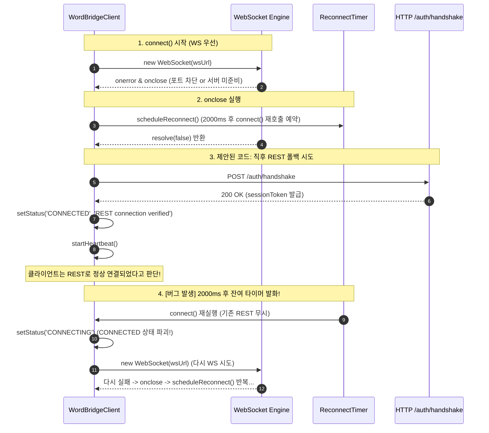

# WordBridgeClient: WebSocket → REST 폴백 부재 수정 설계 검증 보고서

**문서 파일**: `AGY_ANSWER_BRIDGE_CLIENT_WS_REST_FALLBACK.md`  
**대상 소스**: `plugins/word/src/bridge_client.ts`  
**관련 소스**: `plugins/word/__tests__/word_plugin.test.ts`, `shared/protocol/connection_manager.ts`, `src-tauri/src/server/` (`session.rs`, `router.rs`, `ws_handler.rs`)  
**작업 성격**: 코드 수정 없는 아키텍처 및 안전성 심층 분석 / 설계 검증

---

## Executive Summary & 검증 결과 매트릭스

| 검토 항목 | 제안된 단순 방향의 안전성 | 핵심 위험 요인 / 기술적 분석 | 최종 권장 설계 방향 |
| :--- | :---: | :--- | :--- |
| **Q1. 안전성 & Race Condition** | **위험 (Unsafe)** | `connectWebSocket()` 실패 시 `onclose` 핸들러가 이미 `scheduleReconnect()`(백그라운드 타이머)를 예약한 상태에서 직후 REST 폴백을 실행하여 **이중 연결 시도** 및 **타이머 누수** 발생 | `connectWebSocket()` 내부에서 핸드셰이크 단계(`!authResolved`)의 소켓 종료와 세션 유지 후의 소켓 종료를 분리하고, 핸드셰이크 실패 시에는 재연결 타이머를 예약하지 않음 |
| **Q2. 타이머 간섭 & 상태 플래핑** | **100% 발생 위험** | REST 폴백에 성공하여 `CONNECTED` 상태가 되었음에도, 직전에 WS `onclose`가 걸어둔 타이머가 2초 뒤 만료되어 `connect()`를 재호출함 → **정상 연결된 REST 세션을 깨뜨리고 다시 WS 시도로 플래핑(Status Flapping)하는 무한 루프** | REST 성공 시 `clearReconnectTimer()` 및 `reconnectAttempts = 0` 명시, 소켓 폐기 시 `cleanupWebSocket()`을 통해 잔여 리스너(`onerror`, `onclose`)를 즉시 `null` 처리 |
| **Q3. 재연결 우선순위 정책** | **WS 우선(WS-First) 유지 권장** | REST는 단방향(Telemetry 전송)만 가능하며, **Tauri 앱에서 Word로의 [교정 적용] 명령(`REPLACEMENT_COMMAND`) 푸시는 WebSocket만 지원함**. 일시적 순단 환경에서 REST로 영구 고정 시 교정 기능 상실 | **"WS 우선 시도 + 실패 시 즉시 REST 폴백"** 전략 유지. 단, REST로 연결이 유지되는 동안에는 불필요한 백그라운드 WS 폴링을 돌리지 않고, 연결이 완전히 끊어졌을 때만 WS부터 재시도 |
| **Q4. 테스트 커버리지** | **현재 0% (완전 부재)** | `word_plugin.test.ts`는 모두 `enableWebSocket: false`로 하드코딩되어 있어 `connectWebSocket()` 및 Fallback 경로가 전혀 검증되지 않음 | Mock WebSocket Harness를 도입하여 4개 핵심 시나리오(WS onerror 즉시 실패, WS 인증 거부, WS 단락 재연결, REST 폴백 후 상태 불변) 신규 추가 |

---

## Q1 & Q2. 안전성, 타이머 누수 및 상태 플래핑(Status Flapping) 심층 분석

### 1. 문제의 근본 원인: `connectWebSocket()`의 `onclose` 핸들러 동작

현재 `plugins/word/src/bridge_client.ts`의 소켓 연결 로직(Line 326~336)은 다음과 같습니다:

```ts
socket.onclose = (event) => {
    this.clearHeartbeat();
    if (this.status !== 'DISCONNECTED' && !this.isDisposed) {
        this.setStatus('DISCONNECTED', `WebSocket closed (code: ${event.code})`);
        this.scheduleReconnect(); // <-- [문제 지점 1] 핸드셰이크 실패 시에도 타이머 예약!
    }
    if (!authResolved) {
        authResolved = true;
        resolve(false); // <-- connect()에 실패(false) 반환
    }
};
```

제안된 단순 수정 코드(`wsOk`가 `false`일 때 곧바로 `connectRestFallback(token)` 호출)를 적용할 경우, 다음과 같은 **치명적인 상태 플래핑 및 타이머 누수**가 발생합니다:



### 2. 구체적인 결함 메커니즘
1. **타이머 중복 예약 및 Zombie Reconnect**:
   - `connectWebSocket()`의 초기 연결이 실패할 때 `socket.onclose`가 호출되면서 `scheduleReconnect()`가 약 2초(`reconnectDelayMs`) 뒤 `connect()`를 호출하도록 타이머를 겁니다.
   - `connectRestFallback()` 내부에는 `clearReconnectTimer()` 호출이 없으므로, REST 연결이 성공하더라도 백그라운드에 이 타이머가 그대로 살아남습니다.
   - 2초 뒤 타이머가 실행되면, 이미 REST로 정상 작동 중인 클라이언트가 강제로 다시 `connect()`를 실행하여 상태를 `CONNECTING`으로 초기화하고 또다시 실패하는 WS 연결을 시도합니다.
2. **`this.reconnectAttempts` 미초기화**:
   - `connectWebSocket()`은 인증 성공 시 `this.reconnectAttempts = 0;`(Line 298)을 수행하지만, `connectRestFallback()`에는 `this.reconnectAttempts = 0;` 코드가 누락되어 있습니다(Line 361~368).
   - 이로 인해 이후 재시도 횟수 카운터가 계속 누적되어 백오프 딜레이가 비정상적으로 길어지거나 최대 재시도 횟수(`maxReconnectAttempts`)에 조기 도달할 수 있습니다.
3. **폐기되지 않은 WebSocket의 비동기 이벤트 간섭**:
   - WS 연결 실패 후 `this.ws` 참조를 해제하지 않거나 리스너(`onopen`, `onmessage`, `onerror`, `onclose`)를 제거하지 않으면, 브라우저/WebView2 런타임의 지연된 콜백이 REST 연결 완료 이후 뒤늦게 발화하여 상태를 `ERROR`나 `DISCONNECTED`로 덮어쓸 위험이 있습니다.

---

## Q3. 재연결 우선순위 정책: WS 우선(WS-First) vs REST 고정(REST-Sticky)

### 1. 프로토콜 간 기능적 비대칭성 (Functional Asymmetry)

| 항목 | WebSocket 통신 | REST HTTP 통신 |
| :--- | :--- | :--- |
| **Upstream (Word → Tauri)** | `PARAGRAPH_PAYLOAD`, `HEARTBEAT`, `REPLACEMENT_RESULT` 전송 가능 | `POST /telemetry`, `POST /heartbeat`, `POST /replacement/result` 전송 가능 |
| **Downstream (Tauri → Word)** | **`REPLACEMENT_COMMAND` 실시간 푸시 가능 (단독 지원)** | **지원 불가** (Long-polling / SSE 미구현) |
| **핵심 유스케이스** | 배경 텔레메트리 수집 + **Tauri UI [교정 적용] 클릭 시 본문 자동 치환** | 배경 텔레메트리 수집 전용 (단방향) |

### 2. 왜 한번 REST로 성공했다고 해서 영구히 REST로 고정하면 안 되는가?
1. **일시적 서버 기동 지연(Startup Race) 대응**:
   - Word와 Tauri 앱이 동시에 실행될 때, Tauri 백엔드가 포트를 바인딩하기 전 0.1~0.5초 동안 Word가 먼저 `connect()`를 시도할 수 있습니다.
   - 이때 처음에 WS가 실패하여 REST로 폴백되었는데, 만약 "영구 REST 고정" 정책을 취한다면 사용자는 Tauri 앱이 완전히 뜬 이후에도 **[교정 적용] 버튼을 눌렀을 때 Word 본문이 치환되지 않는 치명적인 기능 누락**을 겪게 됩니다.
2. **사내망/보안SW 영구 차단 환경 대응**:
   - 반대로 기업 프록시로 인해 WebSocket(HTTP 101 Upgrade)이 영구적으로 차단된 환경에서는, 로컬 호스트(`127.0.0.1`) 연결이라도 WS 핸드셰이크가 즉시 실패(Fast Fail)합니다.
   - 따라서 매 연결 주기마다 WS를 먼저 찔러보고 즉각(수 밀리초 내) REST로 넘어가도록 구성하면, 영구 차단 환경에서도 실시간 지연 없이 REST로 안정 동작합니다.

### 3. 권장 재연결 정책
> **"WS 우선 시도 + Fast REST Fallback (WS-First with Clean Fallback)"**  
> - 연결이 완전히 끊어져 재연결이 필요할 때는 항상 **WebSocket을 1순위로 탐색**하여 양방향 기능 복구를 시도합니다.
> - WS 실패 시에는 **어떠한 대기 시간이나 좀비 타이머 없이 즉시 REST로 폴백**합니다.
> - **REST로 연결이 성공한 상태에서는 추가적인 재연결 타이머를 절대 가동하지 않습니다** (연결 상태 유지).
> - 향후 통신 에러나 명시적 단락으로 인해 연결이 완전히 끊어졌을 때 비로소 `scheduleReconnect()`가 발화하여 다시 WS부터 탐색을 시작합니다.

---

## Q4. 테스트 커버리지 및 신규 테스트 설계

### 1. 현재 테스트 현황
- `plugins/word/__tests__/word_plugin.test.ts` 파일(Criterion 1~5)은 모든 테스트가 `enableWebSocket: false`로 설정되어 있습니다.
- 따라서 현재 **`connectWebSocket()` 자체의 성공/실패, `onerror`/`onclose` 이벤트, WS→REST 폴백 경로를 검증하는 테스트는 단 1건도 존재하지 않습니다** (0% Coverage).
- 참고: `shared/protocol/__tests__/connection_manager.test.ts`에는 이미 `createMockWebSocketHarness()`를 이용해 WebSocket의 `triggerOpen()`, `triggerMessage()`, `triggerClose()`를 모킹하는 견고한 패턴이 구현되어 있습니다.

### 2. 추가해야 하는 필수 4대 테스트 시나리오

```
[필수 신규 테스트 시나리오 매트릭스]
┌───┬───────────────────────────────────────┬─────────────────────────────────────────────────────────────┐
│ # │ 시나리오 명칭                         │ 검증 내용 및 단언(Assert) 조건                             │
├───┼───────────────────────────────────────┼─────────────────────────────────────────────────────────────┤
│ 1 │ WS 즉시 거부 -> REST 자동 폴백 성공   │ WS 생성 즉시 onerror/onclose 발생 시 connect()가 true를    │
│   │                                       │ 반환하고, status === 'CONNECTED', reconnectTimer === null   │
├───┼───────────────────────────────────────┼─────────────────────────────────────────────────────────────┤
│ 2 │ WS 인증 실패 -> REST 동반 거부        │ WS AUTH_RESPONSE { success: false } 시 소켓이 정리되고      │
│   │                                       │ REST도 401을 받아 최종 status === 'ERROR'로 수렴            │
├───┼───────────────────────────────────────┼─────────────────────────────────────────────────────────────┤
│ 3 │ REST 폴백 성공 후 좀비 타이머 부재    │ WS 실패 -> REST 연결 후 백오프 시간(2000ms)이 경과해도      │
│   │ (No Status Flapping)                  │ connect()가 재호출되지 않고 'CONNECTED' 상태 유지           │
├───┼───────────────────────────────────────┼─────────────────────────────────────────────────────────────┤
│ 4 │ 정상 WS 연결 후 단락 시 재연결 예약   │ WS 연결 성공 후 서버 단락(close 1006) 발생 시에만           │
│   │                                       │ scheduleReconnect()가 단 1회 예약됨을 검증                 │
└───┴───────────────────────────────────────┴─────────────────────────────────────────────────────────────┘
```

---

## 올바른 구현 설계안 (Refined Architecture)

이 문제를 안전하고 완벽하게 해결하기 위한 `WordBridgeClient`의 핀셋 수정(Tweezer Approach) 구조는 다음과 같습니다:

### 1. 핵심 개선 포인트
1. **핸드셰이크 실패 시 `scheduleReconnect()` 호출 억제**:
   `connectWebSocket()` 내부에서 `authResolved`가 `false`인 동안(초기 연결 시도 중) 발생한 `onclose`는 재연결 타이머를 걸지 않고 `resolve(false)`만 반환합니다.
2. **`cleanupWebSocket()` 헬퍼 도입**:
   WS 실패 또는 전환 시 기존 소켓의 이벤트 리스너를 모두 `null` 처리하고 소켓을 안전하게 닫아 잔여 비동기 이벤트 간섭을 원천 차단합니다.
3. **`connectRestFallback()`의 상태 동기화**:
   REST 인증 성공 시 `this.reconnectAttempts = 0;` 및 `this.clearReconnectTimer();`를 명시하여 재시도 카운터와 타이머를 완전히 정리합니다.

### 2. 설계 코드 스니펫 (참고용)

```ts
// 1. connect() 메인 진입점
public async connect(): Promise<boolean> {
    if (this.isDisposed) {
        return false;
    }

    this.clearReconnectTimer();
    const token = await this.resolveToken();

    if (this.enableWebSocket && typeof WebSocket !== 'undefined') {
        const wsOk = await this.connectWebSocket(token);
        if (wsOk) {
            return true;
        }
        if (this.isDisposed) {
            return false;
        }
        // WS 연결 실패 시 잔여 소켓 리스너 및 타이머를 확실히 정리하고 REST 폴백 진행
        this.cleanupWebSocket();
        this.clearReconnectTimer();
        return this.connectRestFallback(token);
    } else {
        return this.connectRestFallback(token);
    }
}

// 2. connectWebSocket() 내부 onclose 핸들러 개선
socket.onclose = (event) => {
    this.clearHeartbeat();
    if (!authResolved) {
        // [핵심] 초기 핸드셰이크 실패 시에는 재연결 타이머를 예약하지 않고 connect()의 REST 폴백에 위임
        authResolved = true;
        resolve(false);
        return;
    }

    // 이미 정상 연결(CONNECTED)되었던 세션이 사후에 끊어졌을 때만 재연결 스케줄링
    if (this.status !== 'DISCONNECTED' && !this.isDisposed) {
        this.setStatus('DISCONNECTED', `WebSocket closed (code: ${event.code})`);
        this.scheduleReconnect();
    }
};

// 3. connectRestFallback() 내부 성공 처리 개선
if (response.ok) {
    const authRes = (await response.json()) as AuthResponse;
    if (authRes.success) {
        this.sessionToken = authRes.sessionToken || null;
        this.reconnectAttempts = 0; // [핵심] 재시도 횟수 초기화
        this.clearReconnectTimer(); // [핵심] 잔여 타이머 완전 제거
        this.setStatus('CONNECTED', 'REST connection verified');
        this.startHeartbeat();
        return true;
    }
}

// 4. cleanupWebSocket() 헬퍼 함수
private cleanupWebSocket(): void {
    if (this.ws) {
        try {
            this.ws.onopen = null;
            this.ws.onmessage = null;
            this.ws.onerror = null;
            this.ws.onclose = null;
            this.ws.close();
        } catch {
            // Ignore close errors
        }
        this.ws = null;
    }
}
```

---

## 결론 및 권장 진행 단계

1. **설계 적합성**:
   - 제안해주신 "WS 실패 시 REST 폴백" 방향은 실환경(사내망/보안SW) 호환성을 위해 **반드시 필요하며 올바른 방향**입니다.
   - 다만 단순 직렬 호출 시 발생하는 **'초기 핸드셰이크 onclose 타이머 예약 버그' 및 '상태 플래핑(Status Flapping)'을 위 설계안과 같이 정밀하게 차단**해야만 100% 안전합니다.
2. **타 파일 영향도**:
   - `runtime_manager.ts`, `document_listener.ts`, `manifest.xml` 등 타 컴포넌트는 `WordBridgeClient.connect()`의 반환값(`Promise<boolean>`) 및 `status` 상태 변경에만 의존하므로, 본 수정으로 인한 **외부 파일 부작용(Side-effect)은 전혀 없습니다**.
3. **다음 단계 권장**:
   - 검토 내용을 확인하신 후, 명시적인 수정 지시(`"수정해줘"`, `"적용해줘"`)를 주시면 위 핀셋 설계안과 함께 `plugins/word/__tests__/word_plugin.test.ts`에 WebSocket Mock 기반 폴백 테스트 스위트를 함께 구현·검증해 드리겠습니다.
