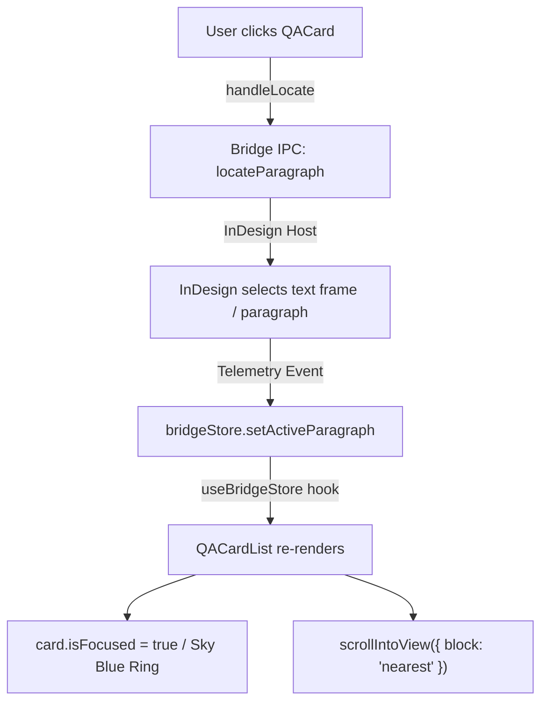

# Analysis & Recommendations: Click Card to Locate Paragraph

This document provides technical analysis and UX recommendations for extending `QACardItem.tsx` so that clicking anywhere on a QA violation card triggers paragraph location in the connected editor (e.g., InDesign).

---

## 1. Coexist vs. Replace Dedicated Button

### Recommendation: **Coexist (Card Click + Dedicated Button)**

**Rationale:**
- **Affordance & Discoverability:** The explicit "위치 보기" button (with the `MapPin` icon) provides an unmistakable visual affordance for new and casual users who do not expect clicking a dashboard card to move the viewport/cursor in an external desktop application (InDesign).
- **Explicit In-Flight Feedback:** When `handleLocate()` is executing, the dedicated button displays an inline loading spinner (`Loader2 animate-spin`). Removing the button leaves the user without a localized visual indicator of the IPC request state unless the entire card is styled with a spinner or overlay.
- **Accessibility & Keyboard Navigation:** The dedicated button provides a standard keyboard focus target (`Tab`, `Space`/`Enter`) and accessible labeling (`title="문단 위치 보기"`, `aria-label`). Retaining it preserves strict WCAG compliance and keyboard navigability without needing complex ARIA widget roles on `<article>`.
- **Fitts's Law / Ergonomics:** Making the entire card surface clickable serves as an ergonomic shortcut for power users, while the explicit button remains for clear intent.
- **UI Treatment:** Add `cursor-pointer` (and subtle active/hover styling) to `<article>` only when the card is locatable (`!readOnly && !!card.paragraphId`), while keeping the button intact.

---

## 2. Event Guarding / Filtering Interactive Descendants

### Recommendation: **Single Outer Handler with Element-Level Matching (`closest(...)`)**

### Analysis of Approaches:

| Approach | Maintainability | Safety | Code Footprint |
| :--- | :--- | :--- | :--- |
| **A. `e.stopPropagation()` in every child** | Low (fragile) | High risk of future regressions | Touches 8+ locations |
| **B. Outer `closest(...)` selector check** | **High (declarative)** | **Zero regression risk for new buttons** | **Single location in `handleCardClick`** |

### Why Outer `closest(...)` is Superior:
`QACardItem` contains numerous interactive descendants:
- Reason tooltip trigger button & hover popover (`reason-tooltip-trigger`, `reason-tooltip-content`)
- Dismiss header button (`dismiss-qa-btn`)
- Suggestion inline editor textarea (`qa-suggestion-editor`)
- Suggestion action buttons (`qa-edit-suggestion-btn`, `qa-suggestion-save-btn`, `qa-suggestion-cancel-btn`)
- Footer action buttons (`qa-locate-paragraph-btn`, `qa-dismiss-action-btn`, `qa-accept-action-btn`)
- Nested components that may evolve (`InlineDiffViewer`, `RollbackAlertCard`, `StaleNotificationBadge`)

Scattering `e.stopPropagation()` across all present and future child buttons is brittle. If a teammate adds a new control (e.g. "Copy text" or a dropdown) and forgets `e.stopPropagation()`, it will trigger an unintended InDesign cursor jump.

### Proposed Pattern:
In the outer `<article>` `onClick` handler:
```tsx
const handleCardClick = (e: React.MouseEvent<HTMLElement>) => {
  const target = e.target as HTMLElement | null;
  if (!target) return;

  // 1. Bail if clicked inside any interactive element or explicit opt-out
  if (
    target.closest(
      'button, textarea, input, select, a, [role="button"], [data-prevent-card-locate]'
    )
  ) {
    return;
  }

  // 2. Bail if user was selecting/copying text (see Question 3)
  const selection = window.getSelection();
  if (selection && !selection.isCollapsed && selection.toString().trim().length > 0) {
    return;
  }

  // 3. Bail if read-only, already locating, or missing paragraphId
  if (readOnly || isLocating || !card.paragraphId) {
    return;
  }

  void handleLocate();
};
```
*Note:* Because SVG icons (e.g., `<svg>`, `<path>`) inside buttons bubble up to the button, `target.closest('button')` reliably catches clicks on icons within buttons as well.

---

## 3. Text Selection Drag Handling

### Recommendation: **Yes, Exclude Text-Selection Drags using `window.getSelection()`**

**Rationale:**
- In SmartLinter, users frequently highlight and copy text from:
  1. `<InlineDiffViewer>` (original segment vs. suggested replacement)
  2. The violation reason text block (`qa-card-reason`)
  3. Header/badge details
- When mouse dragging ends, the browser dispatches `mouseup` and then a synthetic `click` event.
- Without a selection guard, every text-copy action would trigger an unwanted InDesign viewport jump.

### Reliable Low-Effort Check:
```tsx
const selection = window.getSelection();
if (selection && !selection.isCollapsed && selection.toString().trim().length > 0) {
  return;
}
```
- `selection.isCollapsed`: Returns `false` when a text range is actively highlighted.
- `selection.toString().trim().length > 0`: Protects against collapsed selections with whitespace.
- This is standard W3C Selection API supported natively across Chromium / Tauri WebView2 / WebKit.

---

## 4. Active vs. `readOnly` (History View) Cards

### Recommendation: **Exclude Intentionally (`readOnly` cards do not trigger locate)**

**Rationale:**
1. **Current UI Consistency:** `QACardItem.tsx` already hides the "위치 보기" button when `readOnly === true` (lines 351–368). The history view is designed as a static audit trail of past applied/dismissed items.
2. **High Stale/Invalid Risk:** For historical cards (applied/dismissed minutes or hours ago), document text and structure have often changed. Attempting `locateParagraph` on historical entries frequently leads to `NOT_FOUND` or `AMBIGUOUS`.
3. **State Side Effects:** On `NOT_FOUND`, `handleLocate()` invokes `onMarkObsolete?.(card.id)` or sets `locateError`. In the history view, `onMarkObsolete` is not passed, and displaying local warning banners on archival history cards creates confusing UX.
4. **User Expectation:** Clicking a card in an archival history log should behave like a static report item.

---

## 5. Interaction with Active-Paragraph Highlight & Auto-Scroll (602edf1, 1eb70eb)

### Recommendation: **Harmless Positive Feedback Loop (No Ping-Pong / Jitter Risk)**

### Flow Analysis:


### Key Technical Observations:
1. **No Infinite Loop:** The flow is strictly unidirectional. The incoming telemetry from InDesign updates `useBridgeStore.activeParagraph`, which updates React visual state (`isFocused` highlight) and does **not** re-invoke `locateParagraph()`.
2. **Scroll Stability (`block: 'nearest'`):** In `QACardList.tsx` (lines 65–68), `scrollIntoView` uses `block: 'nearest'`. Since the user just clicked the card, the card is already within the visible viewport; `block: 'nearest'` results in a smooth no-op (no scroll jump or viewport jitter).
3. **Immediate Visual Confirmation:** The telemetry round-trip causes `isFocused` to turn `true`, immediately illuminating the sky-blue highlight ring (`ring-[1.5px] ring-sky-400/70`) around the clicked card. This provides reassuring visual confirmation that InDesign has synchronized with the selected card.
4. **Multiple Violations on Same Paragraph:** If two cards share the same `paragraphId`, both will highlight with the active ring when either is clicked, which is consistent with the multi-issue paragraph model.
5. **Idempotency Guard:** `handleLocate` is already guarded by `isLocating` state, preventing duplicate IPC dispatches if the user clicks repeatedly.

---

## Summary Matrix

| Question | Decision | Implementation Summary |
| :--- | :--- | :--- |
| **Q1: Coexist vs. Replace** | **Coexist** | Keep explicit "위치 보기" button; add outer `<article>` click handler. |
| **Q2: Child Event Guarding** | **Outer `closest(...)` check** | `target.closest('button, textarea, input, select, a, [role="button"]')` in outer handler. |
| **Q3: Text Selection Drag** | **Exclude** | Ignore click if `window.getSelection()?.toString().trim().length > 0`. |
| **Q4: `readOnly` / History View** | **Exclude** | Only active when `!readOnly && !!card.paragraphId`. |
| **Q5: Telemetry / Auto-Scroll Loop** | **Safe & Verified** | Unidirectional flow; `block: 'nearest'` prevents scroll jump; provides instant `isFocused` visual sync. |
