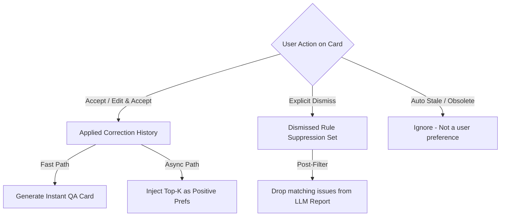

# SmartLinter: Correction History Feedback & Suppression Architecture Analysis

This document provides a comprehensive architectural analysis and recommendation answering the 6 questions outlined in [QUESTION_CORRECTION_HISTORY_FEEDBACK.md](file:///D:/data/dev/App/SmartLinter/QUESTION_CORRECTION_HISTORY_FEEDBACK.md).

---

## Executive Summary

- **Core Verdict:** Approaches **(a)** (deterministic mechanical replay) and **(b)** (LLM prompt context injection) are **complementary tiers**, not mutually exclusive alternatives.
- **Immediate Default:** **(a) Deterministic Fast-Path with Exact Normalized Segment Matching** is the essential, high-ROI baseline. It delivers 0ms instant feedback, 100% deterministic consistency, and zero GPU/token overhead for repeat typos and terminology fixes.
- **Matching Granularity:** Strictly **Exact Normalized Sub-segment Matching** for mechanical replay. Fuzzy matching (<100%) must never trigger automatic card mutation due to severe false-positive risks (reaffirming lessons from Task F→K→L).
- **Asymmetric History Handling:** 
  - `appliedCards` (Positive) $\rightarrow$ Fast-path replay + Top-K LLM prompt enrichment.
  - `dismissedCards` (Negative) $\rightarrow$ **Deterministic Post-Filter Suppression** (drop identical issue tuples before UI display, avoiding prompt pollution).
- **Scope & Delivery:** Split into **Phase 1** (Storage + Exact Fast-Path + Post-Filter Suppression) and **Phase 2** (LLM Top-K Prompt Micro-Injection).

---

## Detailed Answers to the 6 Questions

### 1. (a) Deterministic Mechanical Replay vs. (b) LLM Prompt Context Injection

> **Question 1:** Between (a) a deterministic/mechanical replay and (b) injecting the correction history into the LLM prompt context -- which is the better default, or is this not an either/or?

#### Analysis & Recommendation
They are **not an either/or**; they address different latency profiles, cognitive certainty tiers, and failure modes:

1. **Why (a) is the mandatory default baseline:**
   - **Zero Latency:** Mechanical lookup runs in `< 5ms` directly in client memory upon paragraph entry, compared to Ollama's `7.2s` (mean) ~ `14.5s` (p95) inference latency on the target RTX 3050 hardware ([SPIKE_RESULTS_TASK3.md](file:///D:/data/dev/App/SmartLinter/SPIKE_RESULTS_TASK3.md)).
   - **Deterministic Guarantee:** When a user fixes a specific typo (e.g. `"일오일"` $\rightarrow$ `"일요일"`), re-evaluating it with a 7B LLM risks non-deterministic phrasing, omissions, or hallucinated alternative corrections.
   - **Resource Conservation:** Prevents unnecessary queuing and GPU thrashing in [`MicroScopingQueue`](file:///D:/data/dev/App/SmartLinter/src-tauri/src/ai/micro_queue.rs).

2. **Where (b) adds value:**
   - (b) addresses semantic generalization (e.g., learning that passive constructions like `"-되어집니다"` should generally be rewritten as `"-합니다"` across differing root verbs).
   - However, (b) cannot provide instant typing-time feedback and carries token/prompt-tuning overhead.

**Verdict:** **(a)** must be the primary fast-path default. **(b)** should be layered on top as an asynchronous context enhancer during full LLM analysis.

---

### 2. Concrete Matching Granularity & TM Engine Reuse

> **Question 2:** What's the concrete matching granularity for (a)? Exact normalized-text match only vs fuzzy match? Should this reuse the existing TM fuzzy-match engine (`tmStore`/N-gram matcher from Task 14)?

#### Analysis & Recommendation

```
[Matching Granularity Spectrum & Risk Assessment]

   Granularity Level               Safety     Action
   ─────────────────────────────────────────────────────────────────────────────
1. Exact Segment (originalSegment)  [100%]    -> Instant Synthetic QA Card / Auto-Suggest
2. Exact Full Paragraph             [100%]    -> Handled natively by TM (100% Match)
3. Fuzzy Segment (< 100%)           [RISKY]   -> DO NOT Auto-Generate QA Cards
4. Fuzzy Paragraph (75% ~ 85%)      [RISKY]   -> Keep in TM Panel only (Reference only)
```

1. **Matching Granularity for (a):**
   - **Must be Exact Normalized Sub-Segment Match (`normalizeText(originalSegment)`):**
     - Normalize whitespace, casing, and trailing punctuation using [`normalizeText`](file:///D:/data/dev/App/SmartLinter/src/utils/tmMatcher.ts#L18-L24).
     - When a new paragraph contains the exact `originalSegment`, trigger the cached correction immediately.
   - **Why Fuzzy Matching for (a) is Dangerous:**
     - The project has been burned twice by overly broad heuristic matching:
       - **Task F $\rightarrow$ K $\rightarrow$ L incident** ([ORCHESTRATOR_STATUS.md](file:///D:/data/dev/App/SmartLinter/ORCHESTRATOR_STATUS.md#L48-L53)): Broad fuzzy/cross-paragraph matching led to accidental card deletion and false positive reconciliations.
       - **`locateParagraph` NOT_FOUND conflation**: Broad heuristics matched wrong story segments.
     - Fuzzy matching on short text segments (e.g. 3~6 Korean characters) yields high collision rates (e.g. 75% similarity between `"일오일"` and `"일요일"` or `"월요일"`). If mechanical replay is fuzzy, it will suggest invalid replacements.

2. **Reusing the TM Fuzzy Match Engine:**
   - **Reuse the Code / Algorithm (`TsFuzzyMatcher`):** Yes. [`TsFuzzyMatcher`](file:///D:/data/dev/App/SmartLinter/src/utils/tmMatcher.ts#L148-L382) already provides optimized exact indexing (`exactIndex`), N-gram indexing, and Levenshtein distance calculations.
   - **Separate the Store Instance:** Do **not** mix runtime correction history into the user's formal imported TM database ([`useTmStore`](file:///D:/data/dev/App/SmartLinter/src/stores/tmStore.ts)). Maintain a dedicated `CorrectionHistoryMatcher` instance.
   - **Threshold Rule:** For mechanical QA card emission, enforce `score === 1.0` (EXACT). Reserve lower scores ($< 1.0$) exclusively for reference suggestions, never automated QA card generation.

---

### 3. Storage & Symmetric vs. Asymmetric Treatment of Accepted/Dismissed Cards

> **Question 3:** Should accepted (`appliedCards`) and dismissed (`dismissedCards`) histories be treated identically, or differently? Should dismissal suppress future flags or only deprioritize?

#### Analysis & Recommendation

Accepted and dismissed cards have fundamentally different semantics and **must be handled asymmetrically**:



1. **`appliedCards` (Positive Signal):**
   - **Semantics:** Clear, unambiguous user preference.
   - **Action:** 
     - Fast-Path: Immediate card generation on matching `originalSegment`.
     - LLM Prompt: Injected as positive style/terminology rules.
     - Long-term: Option to export directly to TM/Glossary.

2. **`dismissedCards` (Negative / Rejection Signal):**
   - **Semantics:** The user explicitly rejected the suggestion (e.g., false positive, valid specialized jargon, or disliked stylistic change).
   - **Distinction between Explicit Dismissal and Obsolete:**
     - Cards moved to history via `stale_obsolete` (e.g., direct editing in editor) must **not** be treated as rejections.
     - Only cards with explicit `status === 'dismissed'` constitute negative feedback.
   - **Suppression Strategy: Hard Post-Filter Suppression:**
     - Keyed by tuple: `(category, normalized(originalSegment), normalized(suggestedSegment))`.
     - When the LLM (or fast path) produces a report, [`addReport`](file:///D:/data/dev/App/SmartLinter/src/stores/qaStore.ts#L144-L207) checks this set. If an identical violation tuple exists in the dismissed history, **it is silently dropped before reaching the UI**.
     - **Why Post-Filter is superior to Deprioritization or Negative Prompting:**
       - Deprioritizing (e.g. lowering severity to INFO) still clutters the UI with rejected suggestions.
       - Negative prompting ("Do not suggest X") wastes valuable prompt tokens and often induces negative hallucination in 7B local models.
       - Hard post-filtering is $O(1)$, 100% deterministic, and zero-cost in tokens.

---

### 4. LLM-Context Injection (b) Without Token/Latency Inflation

> **Question 4:** If the LLM-context approach (b) is used, how should correction history be surfaced in prompt without blowing up token budget / latency? Is Top-K via TM search engine the right bound?

#### Analysis & Recommendation

Per [SPIKE_RESULTS_TASK3.md](file:///D:/data/dev/App/SmartLinter/SPIKE_RESULTS_TASK3.md), the "No Samples & JSON Force" compressed prompt averages **188.4 tokens**, achieving ~30% faster latency than few-shot prompts. Injecting an unbounded history would destroy this optimization.

```
[Compressed Prompt Layout with Dynamic Micro-Scoping]

+-------------------------------------------------------------------------+
| SYSTEM: Monolingual/Bilingual QA Instruction (~100 tokens)              |
| JSON Force Schema                                                       |
+-------------------------------------------------------------------------+
| USER PREFERENCES (Dynamic Top-K, K <= 2, ~20-35 tokens):                |
| - Apply: "오브젝트" -> "객체"                                            |
| - Apply: "일오일" -> "일요일"                                            |
+-------------------------------------------------------------------------+
| PAYLOAD: SRC / TGT (~60-100 tokens)                                     |
+-------------------------------------------------------------------------+
Total: ~180 - 235 tokens (Safely within the 250-token fast prefill ceiling)
```

1. **Bounded Top-K Micro-Scoping ($K \le 2$):**
   - Use the in-memory matcher to query `AcceptedCorrectionHistory` against the current paragraph's `text`.
   - **Zero-Match Case ($K=0$):** If no past corrections match substrings or keywords of the paragraph, **inject zero extra tokens**. The prompt remains 100% Zero-Shot.
   - **Match Case ($K \le 2$):** Inject at most the top 2 highest-scoring relevant corrections.
2. **Compact Micro-Format:**
   - Surface as a concise `User Preferences:` block:
     ```text
     User Preferences:
     - "오브젝트" -> "객체"
     ```
   - This adds only ~15–30 tokens. With Ollama's prompt evaluation speed exceeding 4,500 tok/s on GPU ([SPIKE_RESULTS_TASK3.md](file:///D:/data/dev/App/SmartLinter/SPIKE_RESULTS_TASK3.md#L76)), the prefill overhead is under `7ms`.
3. **Dismissed Entries Excluded from Prompt:**
   - Never inject dismissed entries into the LLM prompt. Handle them strictly via client-side/Rust post-filtering (as established in Q3).

---

### 5. Complementary Architecture (Two-Tier Fast-Path + Async LLM)

> **Question 5:** Are these two approaches actually complementary rather than competing -- e.g. (a) as an instant fast path falling through to LLM analysis (optionally enriched per (b))?

#### Analysis & Recommendation

**Yes, they are fundamentally complementary and form a coherent 2-Tier pipeline.**

```
                           [ New Paragraph Detected ]
                                       │
                    ┌──────────────────┴──────────────────┐
                    ▼                                     ▼
          [ Tier 1: Fast-Path ]                 [ Tier 2: Async LLM ]
           Latency: < 5ms                        Latency: ~7-10s
                    │                                     │
         Exact Segment Match in                 Retrieve Top-K (K<=2)
        AcceptedCorrectionHistory               Matching Past Corrections
                    │                                     │
         Emit Instant QA Card(s)                Build Compressed Prompt
         (Badge: '이전 수정 이력')                with Micro-Scoped Rules
                    │                                     │
                    │                           MicroScopingQueue (Ollama)
                    │                                     │
                    │                           Parse QaReport Output
                    │                                     │
                    │                           Post-Filter:
                    │                           1. Deduplicate with Tier 1
                    │                           2. Suppress Dismissed Tuples
                    │                                     │
                    └──────────────────┬──────────────────┘
                                       ▼
                       [ Unified QACardList View ]
```

#### Pipeline Step-by-Step:
1. **Paragraph Telemetry Arrives:**
   - Client receives `new-paragraph-detected`.
2. **Immediate Tier 1 Execution ($< 5\text{ms}$):**
   - Exact-match scan runs against `AcceptedCorrectionHistory`.
   - If matches are found, instant synthetic QA cards are added with a distinct badge (e.g. `[기록 재사용]` / `[이력 기반]`), allowing the user to apply them immediately with zero wait time.
3. **Debounced Tier 2 LLM Analysis (1000ms debounce $\rightarrow$ Ollama):**
   - Looks up Top-K ($K \le 2$) relevant accepted corrections for context injection.
   - LLM executes structural, contextual, and stylistic analysis.
   - When the LLM report arrives:
     - **Deduplication:** Drops issues that match cards already spawned in Tier 1.
     - **Suppression:** Drops issues matching `DismissedRuleHistory`.
     - Appends any new, novel issue cards to [`useQaStore`](file:///D:/data/dev/App/SmartLinter/src/stores/qaStore.ts).

---

### 6. Scope, Priority, and Task Breakdown

> **Question 6:** Rough scope/priority: is this a single task, or does it need to be split (e.g. storage + exact-match fast path first, LLM-context injection as a later follow-up)?

#### Analysis & Recommendation

This must be **split into 2 discrete, incremental tasks** to adhere to our blast radius minimization and cross-agent verification rules ([ORCHESTRATOR_STATUS.md](file:///D:/data/dev/App/SmartLinter/ORCHESTRATOR_STATUS.md#L145)):

```
[Implementation Roadmap]

┌────────────────────────────────────────────────────────────────────────┐
│ Phase 1: Storage, Deterministic Fast-Path & Suppression Post-Filter     │
│          (High Impact, Low Risk, Pure Frontend/Store Layer)            │
├────────────────────────────────────────────────────────────────────────┤
│ 1. Dedicated `historyStore` / persistent cache for:                    │
│    - `acceptedCorrections`: Map<normalizedOriginal, suggested>         │
│    - `dismissedRules`: Set<category + original + suggested>            │
│ 2. Hook `acceptCard` / inline edit accept into `acceptedCorrections`.  │
│ 3. Hook `dismissCard` into `dismissedRules`.                           │
│ 4. Fast-path exact segment scanner in `new-paragraph-detected`.        │
│ 5. Post-filtering suppression in `addReport`.                          │
│ 6. UI Badge distinguishing history-replayed cards from LLM cards.      │
└──────────────────────────────────┬─────────────────────────────────────┘
                                   │ Verify & Validate
                                   ▼
┌────────────────────────────────────────────────────────────────────────┐
│ Phase 2: LLM Prompt Micro-Scoping & Top-K Context Injection           │
│          (Precision Tuning, Rust & IPC Pipeline Layer)                 │
├────────────────────────────────────────────────────────────────────────┤
│ 1. Update `analyzeParagraph` payload to include Top-K relevant history.│
│ 2. Extend Rust `PromptBuilder` to support `user_preferences` block.    │
│ 3. Add prompt token estimation tests & JSON compliance assertions.     │
│ 4. Live Ollama integration tests to confirm zero latency regression.   │
└────────────────────────────────────────────────────────────────────────┘
```

### Why this split is optimal:
- **Phase 1 delivers 90% of the immediate user-requested value** (replaying fixed typos like `"일오일"` $\rightarrow$ `"일요일"` without LLM latency, and suppressing unwanted suggestions). It touches only TypeScript/Zustand and involves zero Rust IPC or prompt schema risk.
- **Phase 2 enhances general intelligence** without blocking the immediate, high-priority user workflow.

---

## Summary Matrix

| Dimension | Phase 1: Mechanical Replay & Suppression | Phase 2: LLM Context Enrichment |
| :--- | :--- | :--- |
| **Trigger** | Instant upon paragraph text detection | Asynchronous Ollama scan (1s debounce) |
| **Latency** | $< 5\text{ms}$ (Instant) | $7\text{s} \sim 10\text{s}$ (Background) |
| **Matching Logic** | Exact normalized substring match ($100\%$) | Top-K similarity ($K \le 2$) via N-gram |
| **Accepted Cards** | Generates instant QA Card (`[이력 기반]`) | Injected as concise `User Preferences` |
| **Dismissed Cards** | Ignored by fast-path | Deterministically post-filtered (dropped) |
| **Risk / Blast Radius**| Very low (deterministic client store logic) | Medium (requires prompt & parser tuning) |
