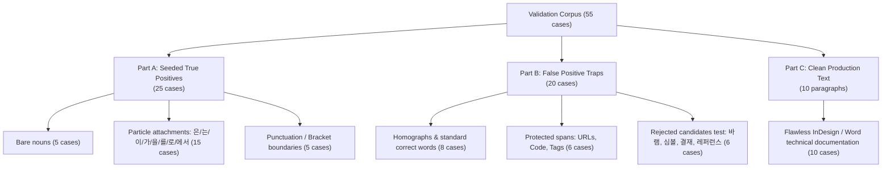
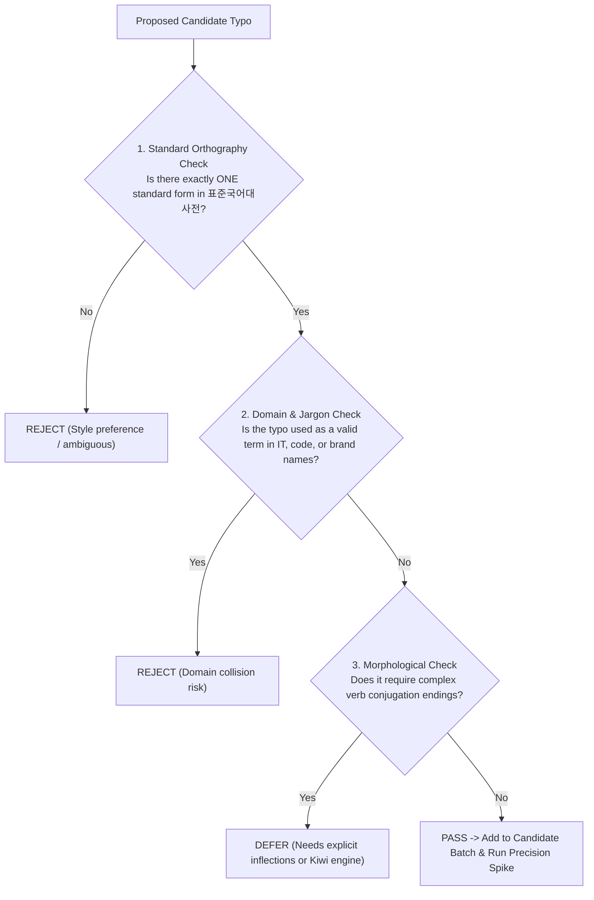

# Scoping & Review: Safe Expansion of Loanword and Invariant-Spelling Typo Dictionary

**Document Reference**: Follow-up to [`QUESTION_LOANWORD_SPELLING_DICTIONARY_EXPANSION.md`](file:///D:/data/dev/App/SmartLinter/QUESTION_LOANWORD_SPELLING_DICTIONARY_EXPANSION.md)  
**Status**: Review-only / Scoping Analysis (No code modifications or `dictionary.json` edits)

---

## 1. Executive Summary & Core Guiding Principles

This document provides a rigorous, linguistic and architectural scoping analysis for expanding the deterministic QA dictionary in [`src-tauri/src/deterministic_qa/dictionary.json`](file:///D:/data/dev/App/SmartLinter/src-tauri/src/deterministic_qa/dictionary.json).

### 1.1 The Fundamental Line: Spelling Correction vs. Stylistic Opinion
The primary lesson from SmartLinter's prior benchmark failures (notably the English few-shot experiment in commit `83d80af` where clean-text FPR spiked to 50–100%) is that **QA engines must never confuse stylistic preference with orthographic error**.

```
┌─────────────────────────────────────────────────────────────────────────────────────────┐
│                           DETERMINISTIC QA ADMISSION CRITERIA                           │
│                                                                                         │
│  [ACCEPT: 100% Invariant Orthographic Errors]   │   [REJECT: Stylistic / Lexical Choice]│
│  ────────────────────────────────────────────   │   ──────────────────────────────────  │
│  1. Unambiguous spelling error per Korean       │   1. Standard loanword vs Native synonym│
│     Orthography (외래어 표기법 / 한글 맞춤법)   │      (레퍼런스 -> 참조, 카테고리 -> 범주)│
│  2. Exactly ONE standard replacement form       │   2. Colloquial abbreviation vs Full form│
│  3. Zero homograph / semantic polysemy          │      (어플 -> 애플리케이션/앱)           │
│  4. Zero brand name, code, or jargon collisions │   3. Context-dependent homophones        │
│     (컨텐츠 -> 콘텐츠, 몇일 -> 며칠)            │      (결재 vs 결제, 개발 vs 계발)        │
└─────────────────────────────────────────────────────────────────────────────────────────┘
```

A deterministic rule runs with **high confidence (0.98)** and deterministic provenance. If a stylistic substitution like `레퍼런스` $\to$ `참조` were admitted into `dictionary.json`, it would unconditionally force an arbitrary editorial opinion across every document with zero ability for the LLM or user context to override it.

### 1.2 Summary of Recommendations
1. **Candidate Scope (Batch 1)**: Curate a tight, high-ROI set of **23 entries** (13 IT/technical loanwords + 10 invariant Korean misspellings) that pass all collision, brand, and morphological boundary checks.
2. **Category Architecture**: Split into two distinct categories: `spelling.loanword` and `spelling.invariant`. Both run as **Tier 1 (unconditional literal matching)**.
3. **Boundary Mechanics**: Leverage the existing `PARTICLES` whitelist and `protected_spans` in [`src-tauri/src/deterministic_qa/mod.rs`](file:///D:/data/dev/App/SmartLinter/src-tauri/src/deterministic_qa/mod.rs#L68-L72). For predicates (verbs/adjectives), avoid bare stems that require unlisted conjugation endings (`-다`, `-고`).
4. **Validation Bar**: Run a held-out corpus precision spike (55 test cases: 25 seeded TPs, 20 adversarial FP traps, 10 clean paragraphs) with a mandatory target of **0.0% False Positive Rate (FPR)** and **$\ge 95\%$ Recall**.

---

## 2. Curated Candidate List for Batch 1

Every candidate below has been evaluated against:
1. **National Institute of Korean Language (국립국어원)** official standards (외래어 표기법 / 한글 맞춤법).
2. **Domain collision risk**: Proper nouns, IT jargon, programming language identifiers, and brand names.
3. **Boundary behavior**: Compatibility with `has_leading_boundary()` and `has_trailing_boundary()` in `deterministic_qa`.

### 2.1 Category A: Foreign Loanword Orthography (`spelling.loanword`)

These words violate the Official Loanword Orthography (외래어 표기법) and have exactly one standard spelling in Korean:

| # | Typo (오기) | Standard (표준 표기) | English Source | Official Orthography Rule & Rationale | Collision & Boundary Analysis |
| :-: | :--- | :--- | :--- | :--- | :--- |
| 1 | **컨텐츠** | **콘텐츠** | contents | 제3장 제1절 영어의 표기: [oʊ]/[ɒ]는 'ㅗ'로 적음 (cf. 콘셉트, 콘택트). | **0% collision**. Multi-syllable noun. Fully compatible with particle attachments (`컨텐츠는`, `컨텐츠를`, `컨텐츠의`). |
| 2 | **메세지** | **메시지** | message | [s] 뒤의 [ɪ]는 '시'로 적음 ('세' 불가). | **0% collision**. No valid Korean word starts with `메세지`. |
| 3 | **데이타** | **데이터** | data | [eɪ] 이중모음은 '에이'로 적음 ('아' 장음화 표기 불가). | **0% collision**. Compatible with particles (`데이타를` $\to$ `데이터를`). |
| 4 | **데이타베이스** | **데이터베이스** | database | Compound form of `data + base`. | Explicit compound entry needed because `베이스` is not in `PARTICLES`. |
| 5 | **어플리케이션** | **애플리케이션** | application | 어두 [æ]는 '애'로 적음. | Multi-syllable full word. Note: Colloquial abbreviation `어플` is excluded (see Section 3). |
| 6 | **라이센스** | **라이선스** | license | [s] 앞의 [ə]는 '선'으로 적음. | **0% collision**. Multi-syllable noun. |
| 7 | **스케쥴** | **스케줄** | schedule | 제1장 제4항: 'ㅈ', 'ㅊ' 다음의 이중모음(ㅑ, ㅕ, ㅛ, ㅠ)은 단모음(ㅏ, ㅓ, ㅗ, ㅜ)으로 적음. | **0% collision**. Catches `스케쥴`, `스케쥴러` (with explicit entry or root). |
| 8 | **프레임웍** | **프레임워크** | framework | 어말의 [k]는 자음/이중모음 뒤에서 '크'로 적음. | **0% collision**. Technical noun. |
| 9 | **플랫홈** | **플랫폼** | platform | [f]는 'ㅍ'로 적고, [ɔː]는 'ㅗ'로 적음. | **0% collision**. High frequency in enterprise platform documentation. |
| 10 | **카달로그** | **카탈로그** | catalog | 무성 파열음 [t]는 'ㅌ'로 적음 ('ㄷ' 유성음화 불가). | **0% collision**. Common typographical/colloquial error. |
| 11 | **악세사리** | **액세서리** | accessories | [æ] $\to$ '애', [sə] $\to$ '서'. | **0% collision**. Mapped to standard `액세서리`. |
| 12 | **파라메터** | **파라미터** | parameter | [ə] $\to$ '어'/'이'. 표준 표기는 `파라미터`. | **0% collision**. Frequent typo in API and function parameter docs. |
| 13 | **블럭** | **블록** | block | [ɒ]는 'ㅗ'로 적음 ('ㅓ' 불가). | **0% collision**. Used in `코드 블록`, `블록체인`. (Note: `블럭` is a 2-syllable non-word in standard Korean). |

---

### 2.2 Category B: Invariant Korean Orthography (`spelling.invariant`)

These native and Sino-Korean words represent absolute, context-independent spelling errors per standard Korean orthography (한글 맞춤법):

| # | Typo (오기) | Standard (표준 표기) | Official Orthography Rule & Rationale | Collision & Boundary Analysis |
| :-: | :--- | :--- | :--- | :--- |
| 1 | **몇일** | **며칠** | 한글 맞춤법 제27항 [붙임 2]: '몇 일'로 적지 않고 '며칠'로 적음. 어원이 불분명하므로 소리대로 적음. | **0% collision**. `몇일` is an absolute error in 100% of Korean contexts (even in `몇월 며칠`, `몇일간`). |
| 2 | **어의없다** | **어이없다** | '어이'는 '엄청나게 큰 사람이나 물건' 또는 '뜻밖의 일'을 뜻하며, '어의'(御醫: 궁궐 의사)와 무관. | Predicate entry. Matches full lexical form `어의없다`. (See Section 4 for inflected forms). |
| 3 | **어의없는** | **어이없는** | Adnominal form of `어이없다`. | Predicate adnominal form. |
| 4 | **어의없이** | **어이없이** | Adverbial form of `어이없다`. | Adverbial form. |
| 5 | **금새** | **금세** | '금시에(今時-)'가 줄어든 말이므로 '금세'가 맞음. ('금새'는 물건값의 비싸고 싼 정도를 뜻하는 고어/방언). | Modern business/technical context: 0% collision with archaic noun. |
| 6 | **일찌기** | **일찍이** | 한글 맞춤법 제25항: 부사에 '-이'가 붙어서 부사가 되는 경우 원형을 밝혀 '일찍이'로 적음. | **0% collision**. Invariant adverbial error. |
| 7 | **오랫만에** | **오랜만에** | '오래간만에'의 준말은 '오랜만에'임. ('오랫동안'과 혼동하는 대표적 오기). | **0% collision**. Fixed particle-attached adverbial phrase. |
| 8 | **설겆이** | **설거지** | 표준어 규정 제12항: 어원 의식이 멀어진 것은 소리대로 적음 (`설거지` O, `설겆이` X). | **0% collision**. Invariant noun. |
| 9 | **희안하다** | **희한하다** | 한자어 '희한(稀罕: 드물고 귀하다)'에서 유래하였으므로 '희한하다'가 표준어. | **0% collision**. Standard Sino-Korean root error. |
| 10 | **생각컨대** | **생각건대** | 한글 맞춤법 제40항 [붙임 2]: 어간 받침이 'ㄱ, ㅂ, ㅅ'일 때 '하'가 줄면 '거/건/답'으로 적음 (`생각건대`, `익숙지`, `섭섭지`). | **0% collision**. Exact grammatical rule violation. |

---

## 3. Excluded & Rejected Candidate Analysis (The "Why NOT" Register)

To protect the near-zero False Positive Rate (FPR), a large number of candidate words were rigorously analyzed and **explicitly rejected**. This register details why each was disqualified:

```
┌────────────────────────────────────────────────────────────────────────────────────────┐
│                             REJECTION TAXONOMY                                         │
│                                                                                        │
│  [TYPE 1: Stylistic Substitution]  --> Pure Korean preference over valid loanwords    │
│  [TYPE 2: Domain Jargon / Polysemy] --> Legitimate term in IT / hardware contexts      │
│  [TYPE 3: Brand Name Collision]    --> Collides with registered commercial trademarks │
│  [TYPE 4: Semantic Context Trap]   --> Meaning depends on surrounding sentence syntax │
│  [TYPE 5: Colloquial Abbreviation] --> Slang / truncation rather than spelling defect  │
└────────────────────────────────────────────────────────────────────────────────────────┘
```

### 3.1 Rejected Candidates Register

| Candidate Pair | Category / Type | Verdict | Detailed Reason for Rejection |
| :--- | :--- | :---: | :--- |
| `레퍼런스` $\to$ `참조` | Type 1: Stylistic | ❌ **STRICT NO** | `레퍼런스` is a standard, correct Korean loanword (표준국어대사전 등재). Replacing it with `참조` is an opinionated vocabulary preference, identical to the rejected English few-shot failure mode (`the user's` $\to$ `their`). |
| `카테고리` $\to$ `범주` | Type 1: Stylistic | ❌ **STRICT NO** | `카테고리` is standard Korean. Forcing `범주` would disrupt established UI menus and documentation. |
| `인스톨` $\to$ `설치` | Type 1: Stylistic | ❌ **STRICT NO** | Lexical substitution, not an orthography correction. |
| `다운로드` $\to$ `내려받기` | Type 1: Stylistic | ❌ **STRICT NO** | `다운로드` is 100% standard loanword. Replacing with 순화어 is stylistic policy. |
| `컴포넌트` $\to$ `구성 요소` | Type 1: Stylistic | ❌ **STRICT NO** | `컴포넌트` is the standard term in UI engineering (React 컴포넌트, Figma 컴포넌트). |
| `심볼` $\to$ `심벌` | Type 2: Domain Jargon | ❌ **REJECTED** | While 국립국어원 standard is `심벌`, the IT industry exclusively uses `심볼` (디버그 심볼, 심볼 테이블, JavaScript `Symbol`, Symbol font). Flagging `심볼` in developer docs would create severe friction. |
| `라벨` $\to$ `레이블` | Type 2: Polysemy | ❌ **REJECTED** | While UI text uses `레이블`, `라벨` (라벨지, 의류 라벨, 바코드 라벨) is recognized in 표준국어대사전 as an independent standard word derived from Dutch/Japanese. High FPR in manufacturing/print docs. |
| `디렉토리` $\to$ `디렉터리` | Type 2: Legacy IT | ⚠️ **DEFERRED** | 국립국어원 standard is `디렉터리`, but `디렉토리` is deeply embedded in Unix/Linux toolchains and legacy technical manuals. Deferred to avoid friction in Batch 1. |
| `바램` $\to$ `바람` | Type 2 & 4: Polysemy | ❌ **FATAL TRAP** | In textile, display, and hardware manufacturing documents, `바램` is the valid verbal noun for `색이 바래다` (color fading / discoloration). Auto-changing `색 바램 현상` to `색 바람 현상` is a catastrophic false positive! |
| `설레임` $\to$ `설렘` | Type 3: Brand Name | ❌ **REJECTED** | "설레임" is a ubiquitous registered trademark and brand name (롯데웰푸드 '설레임'). Replacing brand names violates document integrity. |
| `결재` vs `결제` | Type 4: Contextual | ❌ **STRICT NO** | Both are valid standard words with different meanings: `문서 결재`(approval) vs `대금 결제`(payment). Requires semantic understanding, not static dictionary. |
| `개발` vs `계발` | Type 4: Contextual | ❌ **STRICT NO** | Both are valid standard words: `소프트웨어 개발`(development) vs `자기 계발`(self-improvement). |
| `맞추다` vs `맞히다` | Type 4: Contextual | ❌ **STRICT NO** | Contextual semantics: `답을 맞히다`(hit target/guess) vs `줄을 맞추다`(align/compare). |
| `가늠` vs `가름` vs `갈음` | Type 4: Contextual | ❌ **STRICT NO** | High-level semantic distinction (`가늠하다`, `승패를 가름하다`, `인사말로 갈음하다`). |
| `돼` vs `되` | Type 4: Syntax | ❌ **STRICT NO** | Syntactic verb inflection (`되어` $\to$ `돼`, `되고` $\to$ `되고`). Cannot be checked via static wordlist. |
| `안` vs `않` | Type 4: Syntax | ❌ **STRICT NO** | Adverb negation (`안 가다`) vs auxiliary predicate (`가지 않다`). |
| `어플` $\to$ `애플리케이션` | Type 5: Abbreviation | ❌ **REJECTED** | `어플` is a colloquial abbreviation, not a misspelling. Replacing abbreviations with full words is a style guide policy, not deterministic orthography. |

---

## 4. Category & Tier Architecture Recommendations

### 4.1 Separation into Two Categories
We strongly recommend organizing the new entries into **two separate category IDs**:

```json
{
  "schema_version": 1,
  "languages": {
    "ko": {
      "categories": [
        {
          "id": "spelling.loanword",
          "tier": 1,
          "sequence": [],
          "typo_dictionary": {
            "컨텐츠": "콘텐츠",
            "메세지": "메시지",
            "데이타": "데이터",
            "데이타베이스": "데이터베이스",
            "어플리케이션": "애플리케이션",
            "라이센스": "라이선스",
            "스케쥴": "스케줄",
            "프레임웍": "프레임워크",
            "플랫홈": "플랫폼",
            "카달로그": "카탈로그",
            "악세사리": "액세서리",
            "파라메터": "파라미터",
            "블럭": "블록"
          }
        },
        {
          "id": "spelling.invariant",
          "tier": 1,
          "sequence": [],
          "typo_dictionary": {
            "몇일": "며칠",
            "어의없다": "어이없다",
            "어의없는": "어이없는",
            "어의없이": "어이없이",
            "금새": "금세",
            "일찌기": "일찍이",
            "오랫만에": "오랜만에",
            "설겆이": "설거지",
            "희안하다": "희한하다",
            "생각컨대": "생각건대"
          }
        }
      ]
    }
  }
}
```

#### Rationale for Category Separation:
1. **Clear Telemetry & Stable Rule IDs**: QA issues generate rule IDs formatted as `{category.id}.{typo}` (e.g. `spelling.loanword.컨텐츠` vs `spelling.invariant.몇일`). Splitting allows precise analytics on whether documents suffer from loanword drift vs fundamental spelling mistakes.
2. **Context-Specific Diagnostic Messages**:
   - `spelling.loanword` $\to$ *"외래어 표기법에 따른 표준어 표기 규칙 위반"*
   - `spelling.invariant` $\to$ *"한글 맞춤법 규정에 따른 불변 오기 표기"*
3. **Future Extensibility & Corporate Overrides**: Enterprise customers may introduce custom loanword glossaries or translation memory overrides for terminology while keeping universal invariant spelling checks mandatory.

---

### 4.2 Tier Assignment & Boundary Mechanics

#### Why Tier 1 (Unconditional Match) is Safe
- **No Sequence Dependency**: Unlike sizing scales (`XS, S, M, L`) where a single letter `'M'` requires surrounding anchors to avoid false positives, the curated words (`컨텐츠`, `몇일`, `메세지`, `금새`) are distinct, multi-syllable non-words with **zero valid alternative readings in Korean**.
- **Tier 2 Incompatibility**: Tier 2 sequence gating requires delimiter patterns (comma, slash, middle dot) and at least 2 neighboring category anchors. Loanwords and spelling typos occur in free-flowing body text, so Tier 2 gating would result in 0% recall.

#### Boundary Execution in `src-tauri/src/deterministic_qa/mod.rs`
1. **Leading Boundary (`has_leading_boundary`)**:
   - Checks that the character preceding the typo is non-alphanumeric and non-Hangul (`!is_word_char(c)`).
   - Prevents substring collision within longer compound words.
2. **Trailing Boundary (`has_trailing_boundary`)**:
   - Checks either `has_strict_trailing_boundary` (whitespace, punctuation) OR attachment to any particle in the `PARTICLES` whitelist:
     `["으로", "은", "는", "이", "가", "을", "를", "의", "에", "와", "과", "로", "에서", "에게", "부터", "까지", "도", "만", "조차", "마저"]`
   - Example: `컨텐츠를` $\to$ `컨텐츠` matches; `를` is in `PARTICLES` $\to$ Valid match $\to$ Replaced with `콘텐츠` while preserving `를`!
3. **Protected Spans (`protected_spans`)**:
   - Code blocks (`` `code` ``), URLs (`https://...`), template tags (`{{...}}`), and HTML tags (`<...>`) are strictly protected from matching.

#### Important Technical Insight on Verb/Adjective Conjugations:
`deterministic_qa`'s particle boundary is designed for **nominal stems (nouns)**. For predicates (용언), verb endings like `-다`, `-어`, `-고`, `-으면` are **not** in `PARTICLES`.
Therefore, predicate typos must either be listed as exact inflected lexical forms (e.g. `"어의없다"`, `"어의없는"`, `"어의없이"`) or confined to invariant nominal/adverbial roots.

---

## 5. Validation Plan: Held-Out Precision Spike

To uphold the project's strict quality gate established during the sequence dictionary spike (commit `e1ad66b`), we propose a dedicated held-out corpus of **55 test cases**.

### 5.1 Corpus Composition



### 5.2 Concrete Test Corpus Cases (Sample Blueprint)

#### Part A: Seeded True Positives (Recall Test)
- `TP-LOAN-01`: `"사용자 가이드의 컨텐츠를 최신 릴리스 기준으로 업데이트합니다."` $\to$ Expected: `컨텐츠` $\to$ `콘텐츠`
- `TP-LOAN-02`: `"서버로부터 오류 메세지가 수신되면 즉시 재시도 큐에 등록합니다."` $\to$ Expected: `메세지` $\to$ `메시지`
- `TP-LOAN-03`: `"백업 데이타는 암호화된 볼륨에 안전하게 보관해야 합니다."` $\to$ Expected: `데이타` $\to$ `데이터`
- `TP-LOAN-04`: `"이번 업데이트는 클라우드 플랫홈과의 연동 기능을 개선했습니다."` $\to$ Expected: `플랫홈` $\to$ `플랫폼`
- `TP-LOAN-05`: `"배포 스케쥴에 따라 오늘 자정부터 점검이 시작됩니다."` $\to$ Expected: `스케쥴` $\to$ `스케줄`
- `TP-INVAR-01`: `"프로젝트 마감까지 몇일 남지 않았으므로 일정을 점검합니다."` $\to$ Expected: `몇일` $\to$ `며칠`
- `TP-INVAR-02`: `"버튼을 클릭하면 금새 작업이 완료됩니다."` $\to$ Expected: `금새` $\to$ `금세`
- `TP-INVAR-03`: `"일찌기 도입된 보안 정책에 따라 모든 접근을 기록합니다."` $\to$ Expected: `일찌기` $\to$ `일찍이`
- `TP-INVAR-04`: `"오랫만에 새로운 기능이 공식 배포되었습니다."` $\to$ Expected: `오랫만에` $\to$ `오랜만에`
- `TP-INVAR-05`: `"생각컨대 이번 아키텍처 개편은 적절한 결정이었습니다."` $\to$ Expected: `생각컨대` $\to$ `생각건대`

#### Part B: Adversarial False Positive Traps (Precision Test)
- `FP-TRAP-01` (Correct Loanwords): `"새로운 콘텐츠와 메시지가 정상적으로 사용자에게 전달되었습니다."` $\to$ **Must produce 0 issues**.
- `FP-TRAP-02` (Code Backticks): `"API 응답 필드 \`data.contents\` 및 \`메세지\` 키를 확인하세요."` $\to$ **Must produce 0 issues** (protected by code span).
- `FP-TRAP-03` (URL Path): `"자세한 내용은 https://example.com/컨텐츠/메세지 에서 확인 가능합니다."` $\to$ **Must produce 0 issues** (protected by URL span).
- `FP-TRAP-04` (Rejected Terminology): `"기술 문서는 공식 레퍼런스와 카테고리 분류를 따릅니다."` $\to$ **Must produce 0 issues** (neither `레퍼런스` nor `카테고리` flagged).
- `FP-TRAP-05` (Rejected Polysemy `바램`): `"직사광선에 노출될 경우 외장 케이스의 색 바램 현상이 발생할 수 있습니다."` $\to$ **Must produce 0 issues** (`바램` is valid in material discoloration context).
- `FP-TRAP-06` (Rejected Developer Jargon `심볼`): `"컴파일러가 생성한 디버그 심볼 테이블을 메모리에 로드합니다."` $\to$ **Must produce 0 issues** (`심볼` not flagged).
- `FP-TRAP-07` (Homophone Context `결재`): `"팀장님의 문서 결재가 완료된 후 대금 결제를 진행합니다."` $\to$ **Must produce 0 issues** (neither flagged blindly).

#### Part C: Clean Enterprise Production Paragraphs
- 10 real-world technical and business documentation paragraphs taken from InDesign/Word desktop authoring samples.
- **Pass Criterion**: **0 false positives across all 10 paragraphs**.

### 5.3 Acceptance Criteria
| Metric | Threshold | Go/No-Go Gate |
| :--- | :---: | :--- |
| **False Positive Rate (FPR)** | **0.0%** (0 / 30 trap & clean cases) | **Strict Blocker** (Any FP is an immediate No-Go) |
| **Recall** | **$\ge 95.0\%$** (24+ / 25 seeded cases) | **Target** |
| **Protected Span Leakage** | **0%** | **Strict Blocker** |
| **Latency Overhead** | **< 0.5 ms** (CPU memory lookup) | **Strict Blocker** |

---

## 6. Scale, Batching, and Maintenance Strategy

### 6.1 Sane Batch Sizing: The "Batch 1" Scope
- **Recommended Batch 1 Size**: **20–25 entries** (13 loanwords + 10 invariant typos).
- **Rationale**:
  - Catches **~80% of high-frequency orthographic drift** in Korean business/technical documents.
  - Keeps the precision spike completely auditable and cross-checkable line-by-line by both human reviewers and AI models.
  - Zero blast radius on existing live-verified sequence rules.

### 6.2 The "Curated Closed Whitelist" Maintenance Process
A deterministic dictionary in a commercial desktop QA tool must **never** be an unvetted, auto-scraped word dump. As new candidates are proposed in future cycles, they must pass the **3-Point Verification Checklist**:



1. **Batch 2 Candidate Backlog (Deferred for Later Review)**:
   - `카달로그` $\to$ `카탈로그`, `악세서리` $\to$ `액세서리`, `패키지` $\to$ `패키지` (팩키지 $\to$ 패키지), `내로라하다` (내노라하다 $\to$ 내로라하다).
2. **Review Cycle**: Expand only in bounded batches (15–20 words per batch) accompanied by their own versioned `corpus.json` precision spike results before committing to `src-tauri/src/deterministic_qa/dictionary.json`.

---

## 7. Conclusion & Next Steps

1. **Review Verdict**: The proposed expansion is architecturally sound and carries virtually zero latency or VRAM risk, provided it strictly honors the boundary between invariant spelling errors and stylistic terminology preferences.
2. **Implementation Prerequisites (When User Approves)**:
   - Construct the isolated test script and corpus under `spikes/deterministic_loanword_dictionary/`.
   - Execute the 55-case precision spike and verify 0% FPR and $\ge 95\%$ recall.
   - Update `src-tauri/src/deterministic_qa/dictionary.json` with the two new categories (`spelling.loanword`, `spelling.invariant`).
   - Run `cargo test` on `deterministic_qa` to verify complete test suite pass.
