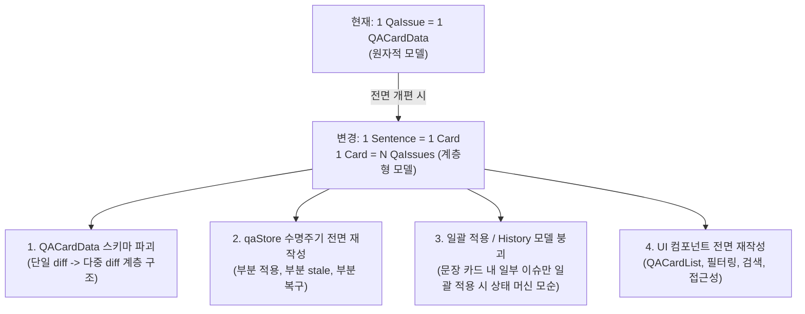
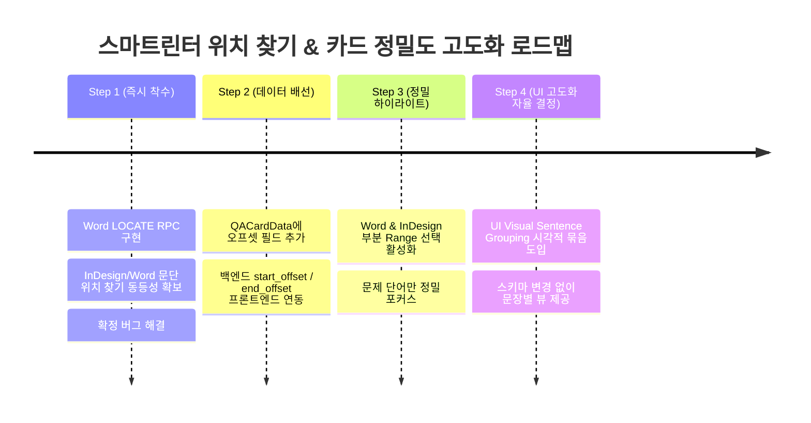

# Word 위치 찾기 미지원 + 문장 단위 카드/하이라이트 정밀도 설계 자문 보고서

## 1. 종합 요약 및 자문 의견 매트릭스

| 항목 | 성격 | 권장 방향 | 스코프 / 난이도 | 즉시 착수 여부 |
| :--- | :--- | :--- | :--- | :--- |
| **1. Word "위치 보기" 오류** | **확정 버그** (백엔드 라우팅 누락) | `LOCATE_REQUEST` / `LOCATE_RESPONSE` 단일 RPC 프로토콜 추가 및 Office.js `select()` 연결 | **Small** (1단계 작업, 기구축된 Snapshot 인프라 패턴 재사용) | **즉시 착수 권장** |
| **2. 문장 단위 카드 통합** | **설계 변경** (사용자 제안) | **백엔드/스토어 전면 재설계 비추천**.<br>원자적(Issue) 데이터 모델은 유지하고 **프론트엔드 시각적 그룹핑(Visual Sentence Grouping)** 절충안 적용 | **Large** (전면 재설계 시)<br>**Small~Medium** (UI 시각 그룹핑 시) | **보류 후 단계적 적용** |
| **3. 문제 구간 부분 하이라이트** | **기능 고도화** (사용자 제안) | Rust 백엔드에서 생성된 `start_offset`을 `QACardData`까지 전달하고, Word/InDesign 부분 Range 선택 구현 | **Medium** (프론트엔드 스키마 연동 + 플러그인 DOM Range 선택) | **1번 완료 후 2단계 착수** |

---

## 2. [항목 1 분석] Word "위치 보기" 미지원 원인 및 RPC 설계 스코핑

### 2.1 현상 및 근본 원인 분석
- **현상:** Word 세션에서 QA 카드의 [위치 보기] 클릭 시 사용자에게 `"InDesign 연결 상태를 확인할 수 없습니다"` 또는 `"문단을 찾을 수 없습니다"`라는 엉뚱한 오류 팝업 발생.
- **코드 레벨 원인:**
  1. [`src-tauri/src/commands.rs:343-363`](file:///D:/data/dev/App/SmartLinter/src-tauri/src/commands.rs#L343-L363)의 `locate_paragraph_in_editor`가 `session.editor_type != EditorType::InDesign`인 경우 무조건 에러(`"Locate paragraph is supported only for InDesign"`)를 반환하도록 하드코딩되어 있음.
  2. [`src/components/qa/QACardItem.tsx:145-151`](file:///D:/data/dev/App/SmartLinter/src/components/qa/QACardItem.tsx#L145-L151)의 catch/error 핸들러가 해당 에러를 수신하면 InDesign 전용 에러 메시지를 노출함.
  3. Word 플러그인([`plugins/word/src/`](file:///D:/data/dev/App/SmartLinter/plugins/word/src/))에는 읽기 전용 스냅샷(`LIVE_SNAPSHOT_REQUEST`)만 구현되어 있고, 특정 문단으로 화면을 스크롤/포커스 이동시키는 위치 찾기 RPC 핸들러가 배선되지 않음.

### 2.2 RPC 아키텍처 및 메시지 프로토콜 설계
스냅샷(`LIVE_SNAPSHOT`)은 여러 문단을 한 번에 읽는 **다중 읽기(Batch Read-only)** 작업이었지만, 위치 찾기(`LOCATE`)는 특정 1개 문단/구간으로 뷰포트를 이동시키는 **단일 포커스 액션(Single Interactive Selection)**입니다.

따라서 오늘 구축된 `SessionManager`의 **요청-응답 상관관계 ID(Correlation ID) + oneshot 채널 + Timeout(3초)** 인프라 패턴을 그대로 재사용하되, 명확한 새 프로토콜 타입을 정의해야 합니다.

```typescript
// shared/protocol/types.ts & src-tauri/src/protocol/messages.rs

export interface LocateRequest {
  /** 요청-응답 매칭을 위한 고유 토큰 */
  requestId: string;
  /** 대상 문단 ID (예: word-para-a1b2c3d4e5f6) */
  paragraphId: string;
  /** 정합성 검증용 해시 */
  baseHash?: string;
  /** (항목 3 확장 대비) 선택적 UTF-16 오프셋 */
  startOffset?: number;
  endOffset?: number;
}

export type LocateStatus = 
  | 'FOUND'             // 위치 탐색 및 선택/스크롤 성공
  | 'NOT_FOUND'         // 문서 내 해당 문단 부재
  | 'AMBIGUOUS'         // 동일 해시 문단 다수 존재하여 특정 불가
  | 'SELECTION_FAILED'  // 문단은 찾았으나 읽기 전용/잠금 상태로 선택 불가
  | 'BUSY'              // Word가 다른 작업 중이거나 응답 지연
  | 'ERROR';            // Office.js 런타임 예외

export interface LocateResponse {
  requestId: string;
  status: LocateStatus;
  message?: string;
}
```

### 2.3 Office.js (Word) 포커스/스크롤 메커니즘
Word JavaScript API에서는 특정 문단이나 Range 객체에 대해 `select()` 메서드를 호출하면 Word가 **자동으로 해당 위치로 스크롤하고 커서/선택 영역을 활성화**합니다.

```typescript
// plugins/word/src/locator_provider.ts (예시)
await Word.run(async (context) => {
  const paragraphs = context.document.body.paragraphs;
  paragraphs.load('text');
  await context.sync();

  // 1. Candidate 수집 (snapshot_provider와 동일한 안전 규칙)
  const matches = [];
  for (const p of paragraphs.items) {
    const hash = computeParagraphHash(p.text || '');
    const paraId = `word-para-${hash.slice(0, 12)}`;
    if (paraId === request.paragraphId && (!request.baseHash || hash === request.baseHash)) {
      matches.push(p);
    }
  }

  if (matches.length === 0) return { status: 'NOT_FOUND' };
  if (matches.length > 1) return { status: 'AMBIGUOUS' };

  // 2. 단일 매칭 문단 선택 및 포커스 이동 (뷰포트 자동 스크롤)
  const targetParagraph = matches[0];
  targetParagraph.select('Select'); // Word.SelectionMode.select
  await context.sync();

  return { status: 'FOUND', message: 'Paragraph selected in Word' };
});
```

### 2.4 구현 범위 및 스코핑 (Scope)
- **수정 대상 파일:**
  1. `shared/protocol/types.ts` & `src-tauri/src/protocol/messages.rs`: `LocateRequest`, `LocateResponse`, `BridgeMessage` 추가
  2. `src-tauri/src/server/session.rs`: `pending_locates` 맵, `request_locate()`, `complete_locate()` 추가
  3. `src-tauri/src/server/ws_handler.rs`: `BridgeMessage::LocateResponse` 수신 라우팅
  4. `src-tauri/src/commands.rs`: `locate_paragraph_in_editor`에서 Word 세션일 때 `session_manager.request_locate()` 호출
  5. `plugins/word/src/locator_provider.ts`: Word 문단 탐색 및 `select()` 실행기 작성
  6. `plugins/word/src/bridge_client.ts`: `LOCATE_REQUEST` 수신 리스너 및 응답 송신
  7. `src/components/qa/QACardItem.tsx`: 에러 메시지의 "InDesign" 문구를 에디터 중립적("문서 연결 상태...")으로 수정
- **소요 공수:** 0.5일 ~ 1일 (명확한 버그로 즉시 안전하게 구현 가능).

---

## 3. [항목 2 분석] 문장 단위 카드/분석 제안에 대한 타당성 검토

### 3.1 한국어 문장 분리(Sentence Boundary Disambiguation, SBD)의 리스크
사용자 제안처럼 마침표(`.`), 느낌표(`!`), 물음표(`?`) 등의 구두점으로 문단을 사전에 쪼개서 분석하거나 카드를 만드는 방식은 한국어 도메인에서 심각한 오작동 리스크를 유발합니다.

1. **규칙 기반 문장 분리의 함정 (과거 조사 호응 화이트리스트와 동일한 문제 발생):**
   - **외래어/약어/직함:** `Dr. Hong`, `Prof. Kim`, `e.g.`, `etc.`, `v1.2.3`, `3.14%`, `(주)한국` 등에서 문장이 중간에 잘림.
   - **대화문 및 인용부호:** `"지금 바로 시작하세요."라고 말했다.`처럼 마침표 뒤에 바로 따옴표와 조사가 붙는 경우 분리 실패.
   - **말줄임표 및 중복 문장부호:** `정말입니까...?!`, `진행 상황......`
   - **괄호 내 부가 설명:** `(자세한 내용은 [부록 1.] 참조.)`
   - **종결 어미 뒤 띄어쓰기 누락:** `완료했습니다.다음으로 넘어갑니다.` (한국어 실무 문서에서 빈번)
2. **LLM 문맥(Context) 유실 리스크:**
   - 문단을 문장 단위로 쪼개서 LLM에 보내면 **앞뒤 문맥(대명사 참조, 주어 생략, 용어 일관성, 문장 간 접속사 호응)**을 완전히 잃어버려 LLM의 교정 품질이 급격히 저하됩니다.
3. **호출 비용 및 지연 시간(Latency) 폭증:**
   - 1개 문단(평균 3~5문장)당 1회 호출하던 것을 문장마다 N회 호출하게 되어 LLM 큐 대기열 병목 및 비용이 3~5배 증가합니다.

### 3.2 "문장 단위 카드 + 카드 내 다중 이슈 표시"로 변경 시 영향 범위
만약 카드 모델 자체를 "문장 단위(1 Sentence = 1 Card, Card has many Issues)"로 전면 재설계할 경우, 프로젝트 전체에 걸친 파괴적 변경(Breaking Changes)이 발생합니다.



1. **스키마 및 상태 머신 모순 (부분 적용 문제):**
   - 한 문장 카드 안에 [맞춤법 이슈 A]와 [외래어 표기 이슈 B]가 들어있을 때, 사용자가 A만 수락하고 B는 거절하고 싶다면?
   - 카드의 상태는 `applied`인가 `pending`인가?
   - A가 적용되어 문서가 변경되면 문장 전체 해시가 바뀌는데, 남아있는 B의 `baseHash`와 오프셋은 어떻게 실시간 보정할 것인가?
2. **동일 이슈 일괄 적용(`getNormalizedIssueKey`)과의 충돌:**
   - 일괄 적용은 "문서 전체에서 동일한 단어 교정"을 한 번에 적용하는 기능입니다.
   - 문장 단위 카드로 묶이면, 일괄 적용 시 여러 문장 카드 속의 특정 서브 아이템들만 파편적으로 적용되면서 카드 UI 동기화가 극도로 복잡해집니다.
3. **기존 인프라의 역할 명확화:**
   - `conflict_group_id`: 문장 묶음용이 아니라, 결정론적 규칙과 LLM 제안이 **문자열 구간이 부분 겹침(Partial Overlap)**될 때 충돌을 표시하기 위한 union-find ID입니다.
   - `start_offset`/`end_offset`: 문단 내 문자 위치일 뿐 문장 ID가 아닙니다.

### 3.3 권장 대안: "데이터 모델 유지 + UI Visual Sentence Grouping (시각적 묶음)"
전면 스키마 재설계 대신, **기존의 안전하고 검증된 원자적 데이터 모델(`QaIssue` = 1 카드)을 100% 유지하면서 프론트엔드 UI 렌더링 계층에서만 같은 문장에 속한 카드를 시각적으로 그룹핑**하는 절충안을 강력히 권장합니다.

- **작동 방식:**
  - 백엔드 분석, `qaStore`, 트랜잭션, 롤백, stale 검증 로직은 단 1줄도 바꾸지 않습니다.
  - 프론트엔드 `QACardList`가 렌더링할 때, 동일 문단 내에서 같은 문장 범위(또는 인접한 오프셋)를 공유하는 카드들을 시각적인 "문장 프레임/아코디언" 헤더 아래로 모아서 보여줍니다.
- **장점:**
  - 사용자 기대치("이 문장에 문제가 2개 있구나")를 완벽히 충족.
  - 각 이슈별 독립 적용/거절/롤백의 원자적 안전성을 온전히 보존.
  - 개발 공수 최소화 (백엔드 리스크 0%, UI 컴포넌트 레벨의 단순 그룹 래퍼 추가).

---

## 4. [항목 3 분석] 문제 구간 정밀 하이라이트 (Partial Span Highlight)

### 4.1 `start_offset`/`end_offset`의 현주소 코드 검증 결과
코드베이스 정밀 분석 결과는 다음과 같습니다:

1. **결정론적 사전 검사 (Deterministic QA):**
   - [`src-tauri/src/deterministic_qa/mod.rs:303`](file:///D:/data/dev/App/SmartLinter/src-tauri/src/deterministic_qa/mod.rs#L303) 등에서 UTF-16 오프셋(`start_offset`, `end_offset`)을 **정상적으로 정확히 계산하여 반환**하고 있습니다.
2. **LLM QA 검사:**
   - LLM이 반환하는 JSON 파싱 단계에서는 오프셋이 `None`으로 시작합니다.
   - **하지만,** [`src-tauri/src/deterministic_qa/mod.rs:238-256`](file:///D:/data/dev/App/SmartLinter/src-tauri/src/deterministic_qa/mod.rs#L238-L256)의 `populate_unambiguous_offset` 함수가 `report.issues`를 머지할 때, LLM 이슈의 `original_segment`가 문단 내에서 **단 한 번(유일하게) 등장하면 Rust 백엔드가 정확한 UTF-16 `start_offset`/`end_offset`을 계산하여 채워 넣습니다.** (문단 내 2회 이상 중복 출현 시에만 안전을 위해 `None` 유지).
3. **프론트엔드 누락 (데이터 유실):**
   - [`src/types/qa.ts`](file:///D:/data/dev/App/SmartLinter/src/types/qa.ts)의 `QACardData` 인터페이스에 `startOffset`, `endOffset` 필드가 선언되어 있지 않으며, `qaStore.ts`의 `addReport` 함수에서 카드로 변환할 때 이 데이터를 복사하지 않고 버리고 있습니다.
   - **결론:** 백엔드는 이미 상당수의 오프셋을 안정적으로 계산하고 있으나, 프론트엔드 전달 단계에서 버려지고 있는 상태입니다.

### 4.2 에디터별 부분 선택(Partial Selection) 기술적 가능성 검증

#### A. Adobe InDesign (ExtendScript DOM)
- **가능 여부:** **100% 가능 (이미 검증된 API 보유)**
- **구현 방식:**
  - 현재 `atomic_replacer.jsx`는 문단 전체 `inApp.select(paragraph.texts[0])`를 호출하고 있습니다.
  - 하지만 치환 로직(`applyHunkToParagraph`)에서는 이미 `paragraph.characters.itemByRange(start, end - 1)`를 능숙하게 다루고 있습니다.
  - 따라서 locate 시 `startOffset`/`endOffset`이 유효하다면:
    ```javascript
    var charRange = paragraph.characters.itemByRange(command.startOffset, command.endOffset - 1);
    inApp.select(charRange);
    ```
    를 호출하면 InDesign 상에서 **해당 오타 단어만 파란색 블록으로 정확하게 하이라이트**됩니다.

#### B. MS Word (Office.js)
- **가능 여부:** **100% 가능 (Search Range 기반)**
- **구현 방식:**
  - Office.js에서는 문자 오프셋 인덱싱보다 **문단 내 텍스트 검색(`paragraph.search`)**이 훨씬 안정적이고 서식 변화에 강인합니다.
  - `originalSegment`가 유일 매칭될 때 해당 `Word.Range`를 얻어 `range.select('Select')`를 실행하면 **Word 화면에서 해당 문제 단어만 정확히 선택 블록**이 씌워집니다.

### 4.3 에디터 간 일관성 및 단계별 실행 전략
- **질문 답변:** Word에만 먼저 정밀 하이라이트를 붙여도 프로토콜 구조상(Optional 필드) 깨지지 않지만, 사용자 경험상 InDesign은 문단 전체가 잡히고 Word는 단어만 잡히면 일관성 문제가 제기될 수 있습니다.
- **권장 로드맵:**
  1. **Phase 1:** Word에 기본 문단 단위 위치 찾기(`LOCATE_REQUEST`)를 구현하여 1번 버그를 즉시 해소 (InDesign과 기능 동등성 달성).
  2. **Phase 2:** `QACardData`에 `startOffset`/`endOffset` 필드를 추가하여 Rust 백엔드의 오프셋 데이터 보존.
  3. **Phase 3:** Word 및 InDesign 양쪽 플러그인에 `originalSegment` 및 `startOffset` 기반의 **정밀 부분 하이라이트(Partial Range Selection)**를 동시에 적용.

---

## 5. 최종 권장 로드맵 및 실행 제안



1. **지금 당장 할 일:** **1번 [확정 버그] Word 위치 보기 지원**에 즉시 착수합니다. (RPC 정의 및 Word `paragraph.select` 배선).
2. **보류할 일:** **2번 문장 단위 카드 전면 개편**은 스키마 파괴 및 트랜잭션 복잡도 리스크가 매우 크므로 보류하고, 추후 필요 시 **프론트엔드 시각적 그룹핑(Visual Grouping)**으로 진행합니다.
3. **다음 단계:** 1번 완료 후 `QACardData`에 오프셋을 배선하고 **3번 문제 구간 정밀 하이라이트**를 Word/InDesign 양쪽에 공통 적용합니다.
