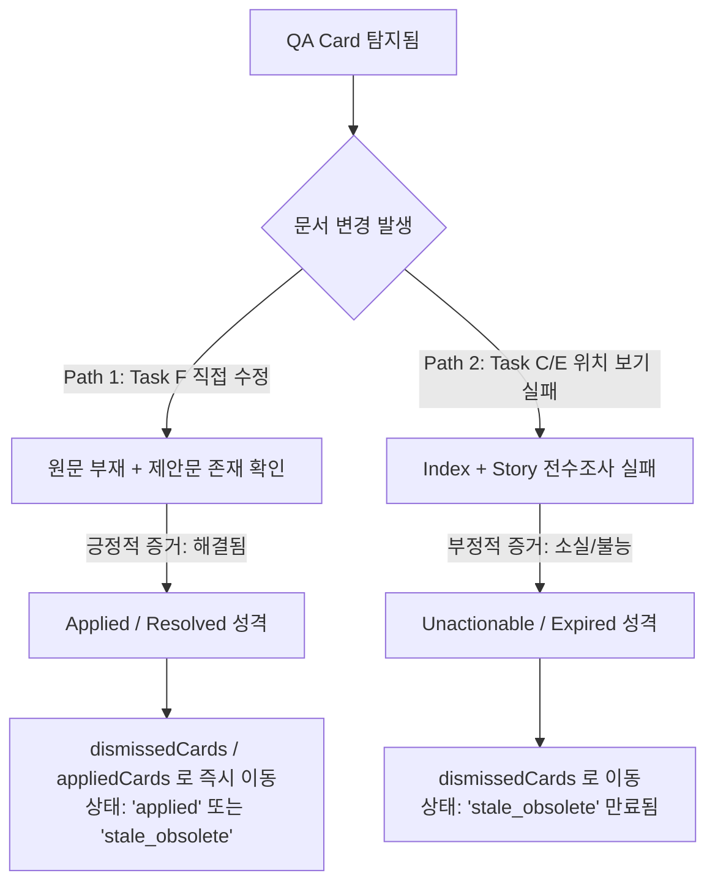

# SmartLinter QA Card Lifecycle Analysis: `stale_obsolete` Handling

> **문서 목적**: `QUESTION_OBSOLETE_CARD_LIFECYCLE.md`에서 제기된 4가지 질문에 대한 코드베이스 기반 심층 분석 및 아키텍처/UX 관점의 권장안 제시 (분석 전용, 코드 변경 없음).

---

## 1. Executive Summary & Root Cause Context

### 1.1 현재 불일치(Inconsistency)의 근본 원인
현재 코드베이스에서 `stale_obsolete` 상태를 생성하는 경로는 두 가지가 있으나, **데이터 처리 방식이 서로 불일치**합니다:

| 발생 경로 | 발생 트리거 | 처리 로직 (`qaStore.ts`) | 실제 UI 동작 |
| :--- | :--- | :--- | :--- |
| **Path 1 (Task F)** | 새 텔레메트리에서 동일 문단(`paragraphId`)의 원문이 사라지고 제안문이 나타남 (직접 수정 감지) | `cards`에서 제거하고 `dismissedCards`에 `status: 'stale_obsolete'`로 추가 | **활성 목록에서 자동 제거됨**, '기록' 탭에 '만료됨'으로 보관 |
| **Path 2 (Task C/E)** | 사용자가 [위치 보기] 클릭 시 InDesign Story 전체 재스캔 후에도 `baseHash` 문단을 찾지 못함 (`locateParagraph: not found`) | `cards` 안에서 해당 카드의 `status`만 `'stale_obsolete'`로 변경 (`markCardObsolete`) | **활성 목록에 영구 잔류** ([적용] 비활성화, 배너 표시, 사용자가 수동 [무시] 눌러야 퇴장) |

### 1.2 왜 Path 2는 활성 목록에 영구 잔류하는가?
- **히스토리 뷰의 등장 시점 차이**: Task F/E 구현 시점에는 '기록(Archive/History)' 탭이 존재하지 않았습니다. 당시에는 카드가 `cards`에서 빠지면 UI에서 완전히 증발했기 때문에, "문단을 찾을 수 없다"는 사실을 사용자에게 알리기 위해 `cards` 내부에 비활성화된 상태로 남겨두었습니다.
- **Task M(커밋 `9039a38`) 이후 상황 변화**: '진행 중' / '기록' 탭 분리와 `readOnly` 모드가 도입되었으며, `QACardItem`에는 이미 `card.status === 'stale_obsolete'`일 때 **"만료됨"** 배지를 표시하는 렌더링 경로가 준비되어 있습니다.
- **결과적인 부작용**: 사용자가 문단을 삭제한 후 [위치 보기]를 누르면, 적용도 불가능하고 위치도 없는 "죽은 카드"가 활성 작업 영역을 영원히 차지하며 수동 정리를 요구하는 UX 노이즈가 발생하고 있습니다.

---

## 2. 질문별 심층 분석 및 답변

---

### Q1. `stale_obsolete`는 활성 목록에서 자동 정리(auto-clear)되어야 하는가, 아니면 지금처럼 수동 무시될 때까지 남아있어야 하는가?

### **답변: 활성 목록(`cards`)에서 자동 정리(Soft Auto-Clear)되어 `dismissedCards`로 이동해야 합니다.**

#### 분석 근거:
1. **활성 목록(`cards`)의 정의와 책임**:
   - `cards`는 사용자가 "검토하고 조치할 수 있는 실행 가능한 작업(Actionable Work Items)"의 큐여야 합니다.
   - `stale_obsolete` 카드는 [적용]이 원천 차단(`isAcceptDisabled = true`)되고, InDesign 내 위치 추적도 불가능한 **비실행(Non-actionable) 상태**입니다. 이를 활성 큐에 계속 두는 것은 사용자의 인지 부하(Cognitive Load)를 높이고 수동 클릭을 강요합니다.
2. **완전 삭제(Hard Delete) vs 보관 이동(Soft Archive)**:
   - 과거 Task F $\rightarrow$ K $\rightarrow$ L 사고에서 발생한 공포는 카드가 **"어디에도 남지 않고 영구 증발(Silent Hard Deletion)"**했기 때문입니다.
   - 하지만 이제는 Task M으로 구축된 `dismissedCards` ('기록' 뷰)가 존재합니다. `cards`에서 빠져도 '기록' 탭에서 언제든 "만료됨" 상태로 확인할 수 있으므로 데이터 유실 위험이 없습니다.
3. **일관성(Consistency)**:
   - 이미 Task F의 직접 수정 감지는 `dismissedCards`로 카드를 자동 이동시키고 있습니다. [위치 보기] 실패로 인한 obsolete 역시 동일한 보관소(`dismissedCards`)로 수렴하는 것이 아키텍처상 일관됩니다.

---

### Q2. 자동 정리(Auto-clear)의 안전한 신뢰도 시그널(Confidence Signal)은 무엇인가? (단일 시그널 vs 2차 확인 시그널)

### **답변: 트리거의 성격(수동 유저 액션 vs 백그라운드 자동 수신)에 따라 시그널 요구 수준을 분리해야 합니다.**

| 구분 | 트리거 시나리오 | 안전한 신뢰도 시그널 기준 | 근거 |
| :--- | :--- | :--- | :--- |
| **User-Initiated (수동)** | 사용자가 **[위치 보기]** 클릭 | **단일 `locateParagraph: not found`로 즉시 보관 가능** (단, 사용자 피드백 제공) | 사용자가 명시적으로 클릭하여 InDesign 전체 Story에 걸친 선형 해시 스캔(`findParagraphByHashInStory`)이 실패했음을 확인한 순간이므로 신뢰도가 충분함. |
| **Background-Automated (자동)** | 백그라운드 **텔레메트리/리포트** 수신 | **엄격한 단일 문단 일치(Strict Exact Match)** (`paragraphId` 일치 + `!includes(orig)` + `includes(sugg)` + 후보 1개) | Task L에서 확립된 원칙. Story 전체 추정 매칭은 짧은 문단 오탐 위험이 있으므로 절대 금지. |
| **Background-Deletion (문단 소멸 감지)** | 사용자가 문단을 통째로 지운 경우 | **2차 텔레메트리 또는 전체 배치 스캔 확인 전까지는 백그라운드 자동 삭제 보류** | InDesign의 일시적 포커스 아웃, 타이핑 중 일시적 빈 문단 상태 등 일시적 현상(Transient State)일 수 있으므로 단발성 텔레메트리로 지우면 오삭제 위험. |

#### 핵심 판단 기준:
- **[위치 보기] 실패 시**: 사용자가 보고 있는 상태에서 발생한 이벤트이므로, 2차 확인 대기 없이 즉시 `dismissedCards`로 이동시키되, UI에 토스트("해당 문단을 찾을 수 없어 [기록]으로 이동되었습니다")를 띄우거나 즉각적인 피드백을 주는 것으로 충분합니다.
- **백그라운드 감지 시**: Task L의 엄격한 Tier 1(정확한 `paragraphId` 일치) 조건이 충족될 때만 단일 텔레메트리로 정리하고, `paragraphId`가 다른 문단 소멸 추정은 섣부르게 자동 정리하지 않습니다.

---

### Q3. 두 경로(Task F "제안문 치환 확인" vs Task C/E "위치/해시 미발견") 간의 유의미한 차이와 분리 규칙이 필요한가?

### **답변: 네, 시맨틱(Semantic)과 증거의 성격이 완전히 다르므로 명확히 분리 관리되어야 합니다.**

#### 두 경로의 구조적 차이 비교:

1. **Task F (직접 수정 감지)**:
   - **증거 성격**: **긍정적 증거 (Positive Proof)**. 교정 제안 내용(`suggestedSegment`)이 실제 본문에 입력된 것이 확인됨.
   - **시맨틱**: **"이슈가 성공적으로 해결됨 (Resolved)"**.
   - **위험도**: 매우 낮음. 사용자가 의도한 교정이 반영되었으므로 카드가 사라져도 사용자는 "작업이 잘 끝났다"고 인식함.
   - **분류 권장**: 장기적으로는 `dismissedCards`보다는 `appliedCards` 또는 '직접 수정 해결'로 취급되어야 할 성격.

2. **Task C/E ([위치 보기] Story 전수 스캔 실패)**:
   - **증거 성격**: **부정적 증거 (Negative Proof / Absence of Evidence)**. 문서 전체를 뒤졌으나 해당 원문 해시를 가진 문단이 어디에도 없음.
   - **시맨틱**: **"문단이 삭제/변형되어 더 이상 조치 불가능 (Expired / Unlocatable)"**.
   - **위험도**: 중간 (원문이 해결된 것이 아니라, 문단이 통째로 삭제되었거나 대폭 재작성되었을 가능성).
   - **분류 권장**: `dismissedCards`의 `stale_obsolete` ("만료됨")으로 분류하는 것이 정확함.

---

### Q4. 더 단순하고 안전한 대안(Alternative)이 있는가?

### **답변: 가장 안전하고 직관적인 대안은 "History(기록) 뷰로의 자동 라우팅 + UX 안내 토스트" 모델입니다.**

새로운 복잡한 2차 확인 타이머나 폴링 엔진을 만들 필요 없이, 이미 존재하는 인프라를 활용하여 아래와 같이 정돈하는 것이 가장 단순하고 견고합니다.

#### 구체적 대안 구조 (Recommended Design):

1. **`markCardObsolete`의 동작 완성 (1줄 수정 수준의 단순성)**:
   - 현재 `markCardObsolete(cardId)`는 `cards`에 카드를 남겨둔 채 `status`만 바꿉니다.
   - 이를 `addReport`의 Task F 로직과 동일하게:
     `cards`에서 해당 카드를 빼고 $\rightarrow$ `dismissedCards`에 `{ ...card, status: 'stale_obsolete' }`로 삽입하도록 통일합니다.
2. **사용자 피드백 (UX 피드백 루프)**:
   - 사용자가 [위치 보기]를 눌렀는데 문단이 없어 `found: false`가 떨어지면:
     - 카드가 활성 탭에서 사라지며 '기록' 탭의 카운트가 `+1` 올라감.
     - 하단 또는 해당 영역에 경량 알림/토스트 표시:
       > *"해당 문단을 찾을 수 없어 카드가 [기록] 탭(만료됨)으로 이동되었습니다."*
   - 사용자는 카드가 버그로 사라진 것이 아니라 정상적으로 보관되었음을 즉시 인지할 수 있고, 필요 시 언제든 '기록' 탭에서 내용을 열람할 수 있습니다.
3. **복구/재확인 안전망 (Zero Loss Guarantee)**:
   - 사용자가 '기록' 탭에서 해당 카드를 보면 "만료됨" 배지와 함께 원문/제안문/사유가 그대로 보존되어 있습니다.
   - 만약 InDesign의 일시적 오류였더라도 정보 자체가 날아가지 않으므로 안전합니다.

---

## 3. 최종 요약 및 권장 조치 방안

| 항목 | 권장 방향 |
| :--- | :--- |
| **Q1. Auto-clear 여부** | **Yes (Soft Auto-clear)**. 활성 목록(`cards`)에서 제거하고 `dismissedCards`로 보관 이동. |
| **Q2. 신뢰도 시그널** | [위치 보기] 클릭 실패 시에는 **단일 `locateParagraph: not found` 즉시 처리**. 백그라운드 감지 시에는 **Task L의 Strict Exact Match 원칙 엄수**. |
| **Q3. 두 경로 분리 여부** | **Yes**. Task F는 '해결 완료(Resolved)' 맥락, Task C/E는 '만료/유실(Expired)' 맥락으로 명확히 구분. |
| **Q4. 최적의 대안** | **`markCardObsolete`를 `dismissedCards` 라우팅으로 전환 + UX 안내 토스트 제공**. 이미 구현된 Task M(기록 탭 및 "만료됨" 배지)을 100% 활용하는 가장 깔끔한 해결책. |

---
*(본 문서는 분석 및 권고안이며, 실제 코드 수정은 사용자/오케스트레이터의 승인 후 별도 태스크로 진행됩니다.)*
