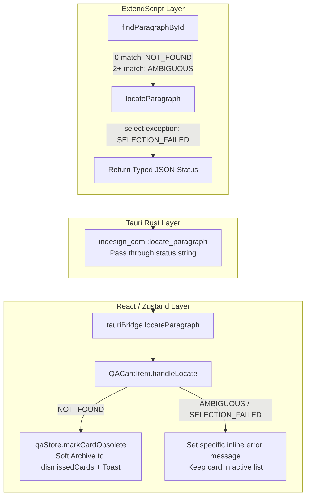

# Reconciled Recommendation: Obsolete QA Card Lifecycle (Round 2)

> **문서 목적**: [`QUESTION_OBSOLETE_CARD_LIFECYCLE_ROUND2.md`](file:///D:/data/dev/App/SmartLinter/QUESTION_OBSOLETE_CARD_LIFECYCLE_ROUND2.md)에서 제기된 [위치 보기(Locate)] 실패 시의 3가지 케이스 혼재(Conflation) 문제를 분석하고, Codex와 agy의 입장을 완전히 통합한 **단일 합의 권고안(Single Reconciled Recommendation)**을 제시합니다.

---

## 1. Executive Summary & Convergence (최종 합의 선언)

**양측(agy & Codex)은 완벽히 단일 결론으로 수렴(Converged)했습니다.**

1. **Premise 교정**:
   - 기존 agy의 *"단일 `NOT_FOUND`로 즉시 보관(Archive)"* 전제는 [`atomic_replacer.jsx`](file:///D:/data/dev/App/SmartLinter/plugins/indesign/extendscript/atomic_replacer.jsx#L246-L277)가 **① 실제 0개 일치(소멸)**뿐 아니라 **② 2개 이상 일치(모호성)** 및 **③ 선택 예외(잠긴 프레임 등)**까지 전부 동일한 `NOT_FOUND` 문자열로 반환하고 있었으므로, **현재 상태 그대로 즉시 보관 처리하는 것은 오탐(False Positive) 위험이 있어 성립할 수 없음**을 확인했습니다.
   - 기존 Codex가 제안했던 *"2차 텔레메트리 비동기 확인 파이프라인"*은 결함 있는 `NOT_FOUND` 시그널을 외부에서 보완하려던 방어책이었으나, **ExtendScript 호스트 레이어에서 3가지 케이스를 명시적 타입(`NOT_FOUND` vs `AMBIGUOUS` vs `SELECTION_FAILED`)으로 분기하여 반환**하면 복잡한 2차 텔레메트리 관찰 파이프라인 없이도 즉시 안전성이 확보됩니다.
2. **단일 권고안 요약**:
   - **ExtendScript 및 브릿지 레이어**: `locateParagraph`의 반환 상태를 `FOUND`, `NOT_FOUND`(0개 일치), `AMBIGUOUS`(2개 이상 일치), `SELECTION_FAILED`(선택 실패), `ERROR`(문서/엔진 오류)로 **명확히 세분화(Typed Status)**합니다.
   - **프론트엔드 라우팅**:
     - **`NOT_FOUND` (확정 소멸)**: 활성 목록(`cards`)에서 즉시 소프트 아카이빙하여 `dismissedCards`('기록' 탭)로 이동 (`status: 'stale_obsolete'`). 사용자에게는 토스트 안내 제공.
     - **`AMBIGUOUS` / `SELECTION_FAILED` / `ERROR` (존재하거나 일시적 실패)**: 카드를 활성 목록(`cards`)에 유지하고, 상황에 맞는 구체적인 안내 메시지(다시 시도 / 수동 확인)를 표시합니다.
   - **작업 단위**: 이는 복잡한 다단계 프로젝트가 아니며, **단일 작업(Single Task)으로 완성 가능한 깔끔하고 컴팩트한 변경**입니다.

---

## 2. 질문별 상세 분석 및 답변

---

### Q1. 확인된 3가지 케이스 혼재가 기존 입장을 어떻게 변경시키는가?

#### 1. agy의 입장 교정
- **기존 입장**: 사용자가 [위치 보기]를 클릭했을 때 InDesign Story 전체를 해시로 전수 재스캔하므로, 실패(`NOT_FOUND`)는 문단이 삭제되었음을 입증하는 충분한 신뢰도 시그널이다.
- **코드 검증 후 교정**:
  - [`findParagraphById`](file:///D:/data/dev/App/SmartLinter/plugins/indesign/extendscript/atomic_replacer.jsx#L123-L125)는 `matches.length > 1`일 때 `null`을 반환합니다 (Case 2: 모호성).
  - [`locateParagraph`](file:///D:/data/dev/App/SmartLinter/plugins/indesign/extendscript/atomic_replacer.jsx#L274-L276)는 문단을 찾아도 `inApp.select()`가 실패하면 `status: 'NOT_FOUND'`를 반환합니다 (Case 3: 선택 실패).
  - 따라서 **현재의 raw `NOT_FOUND`를 신뢰하여 즉시 보관 처리하면, 실제 문서에 여전히 존재하는 문단(동일 문단 다수 존재 또는 잠긴 프레임)의 카드가 [기록]으로 잘못 퇴출되는 심각한 결함**이 발생합니다.
  - 결론: **raw `NOT_FOUND` 단일 시그널로 무조건 아카이빙하던 기존 논리는 철회**하며, 호스트 레이어의 상태 분기가 선행되어야 함에 전적으로 동의합니다.

#### 2. Codex의 입장 교정
- **기존 입장**: `NOT_FOUND`가 여러 케이스를 혼재하므로, 즉시 아카이빙하지 말고 이후의 2차 텔레메트리 관찰/타임스탬프 검증을 거쳐 확정해야 한다.
- **코드 검증 후 교정**:
  - Codex가 1차 답변(Section 2)에서 이미 지적했듯이: *"Prefer a host-side revalidation/rescan that can report a typed result (`absent`, `ambiguous`, `host_unavailable`, `selection_failed`)... Archive only on `absent`; leave the card in a retryable/transient stale state for the others."*
  - 즉, 원인(ExtendScript의 반환값 혼재)을 직접 수정하면, 불확실한 백그라운드 2차 텔레메트리를 기다리는 복잡한 큐/타이머 머신을 구축할 필요가 없어집니다.
  - 결론: **ExtendScript에서 명시적인 Typed Status를 반환하도록 수정함으로써, 2차 텔레메트리 레이어 없이도 단일 Locate 응답만으로 안전하고 완결된 처리가 가능**해집니다.

---

### Q2. 3가지 케이스에 대한 상태값 분기 및 프론트엔드 라우팅이 충분한가?

### **답변: 네, 완벽히 충분하며 가장 안전하고 우아한 해결책입니다.**

ExtendScript의 [`locateParagraph`](file:///D:/data/dev/App/SmartLinter/plugins/indesign/extendscript/atomic_replacer.jsx#L246-L277) 및 관련 브릿지에서 반환값을 아래와 같이 5가지 명시적 상태로 구분하고, 프론트엔드에서 각각에 맞게 라우팅합니다:

| 반환 Status | InDesign 실제 상태 | 카드의 생명주기 (Lifecycle) | 사용자 UI 피드백 (Message / Toast) |
| :--- | :--- | :--- | :--- |
| **`FOUND`** | 문단 발견 및 `select()` 성공 | `cards`에 유지 (활성 상태 유지) | (정상 위치 이동 완료) |
| **`NOT_FOUND`** *(Case 1)* | Story 전체 전수조사 결과 일치 후보 **0개** (실제 소멸/대폭 수정) | **활성 `cards`에서 제거 $\rightarrow$ `dismissedCards`('기록' 탭)로 이동** (`status: 'stale_obsolete'`) | 토스트 안내: *"문단이 문서에서 삭제되었거나 변경되어 카드가 [기록] 탭으로 이동되었습니다."* |
| **`AMBIGUOUS`** *(Case 2)* | Story 전체 전수조사 결과 일치 후보 **2개 이상** (동일 텍스트 다수) | **`cards`에 그대로 유지** (활성 유지, [적용]은 비활성화 또는 주의 요망) | 카드 내 에러 배너: *"동일한 내용의 문단이 문서 내 여러 개 존재하여 자동으로 위치를 특정할 수 없습니다. 직접 문단을 확인해주세요."* |
| **`SELECTION_FAILED`** *(Case 3)* | 문단은 고유하게 특정되었으나 `inApp.select()` 예외 발생 (잠긴 레이어/프레임, 텍스트 편집 중) | **`cards`에 그대로 유지** (활성 유지) | 카드 내 에러 배너: *"문단을 찾았으나 선택할 수 없습니다 (잠긴 프레임 또는 편집 중). 잠금을 해제하거나 편집을 종료한 후 다시 시도해주세요."* |
| **`ERROR`** | 활성 문서 없음, 데몬 미초기화, 잘못된 파라미터 등 시스템 오류 | **`cards`에 그대로 유지** (활성 유지) | 카드 내 에러 배너 / 토스트: *"InDesign 연결 오류가 발생했습니다. 다시 시도해주세요."* |

#### 왜 이 방식이 완벽한가?
1. **False Positive 원천 차단**: 진짜 문서에서 사라진 경우(`NOT_FOUND`: 0개 일치)에만 카드가 활성 큐에서 퇴출됩니다.
2. **사용자 액션 보존**: Case 2(동일 문단 다수)와 Case 3(잠긴 프레임)은 사용자가 문서를 확인하고 잠금을 풀거나 직접 조치할 수 있도록 활성 목록에 남아있게 됩니다.
3. **일관성 확보**: Case 1(`NOT_FOUND`)은 Task M의 '기록' 탭으로 자연스럽게 보관되어 활성 작업 목록의 노이즈를 완전히 제거합니다.

---

### Q3. 이 변경은 단일 태스크(Single Task) 규모인가, 아니면 2차 텔레메트리 레이어가 여전히 필요한가?

### **답변: 2차 텔레메트리 레이어는 필요 없으며, 깔끔한 단일 태스크(Single Task)로 완성됩니다.**

#### 1. 2차 텔레메트리 레이어가 불필요한 이유
- 사용자 클릭 기반 [위치 보기]는 **사용자가 능동적으로 실행하는 On-Demand 동기 명령**입니다.
- ExtendScript가 Story의 모든 문단을 이미 루프 돌며 해시 비교를 마쳤고, 결과가 `0개 일치`임이 확실하다면 이것은 이미 **결정론적이고 권위 있는(Authoritative) 증거**입니다.
- 백그라운드 텔레메트리는 사용자가 문서를 편집할 때 비동기로 발생하는 수동적 이벤트이므로, [위치 보기] 클릭 결과에 굳이 비동기 텔레메트리 대기 큐를 얹는 것은 불필요한 복잡도(타이머, 타임스탬프 대조, 상태 머신 오버헤드)만 가중시킵니다.

#### 2. 단일 태스크의 명확한 구현 범위 (Scope of Single Task)
이 작업은 모든 레이어가 매우 정갈하게 연결되어 있어 하나의 작업으로 안전하게 완료할 수 있습니다:

1. **ExtendScript (`atomic_replacer.jsx`)**:
   - [`findParagraphById`](file:///D:/data/dev/App/SmartLinter/plugins/indesign/extendscript/atomic_replacer.jsx#L61-L133)가 단순 `null` 대신 `{ status: 'FOUND', paragraph }`, `{ status: 'NOT_FOUND' }`, `{ status: 'AMBIGUOUS' }` 구조를 반환하거나 카운트를 식별할 수 있도록 개선.
   - [`locateParagraph`](file:///D:/data/dev/App/SmartLinter/plugins/indesign/extendscript/atomic_replacer.jsx#L246-L277)에서 세분화된 상태 반환 (`NOT_FOUND`, `AMBIGUOUS`, `SELECTION_FAILED`, `FOUND`).
2. **Rust & TS Bridge (`indesign_com.rs`, `tauriBridge.ts`)**:
   - `status` 문자열을 그대로 전달 (`{ status: string, message?: string }`).
3. **React Store & Component (`qaStore.ts`, `QACardItem.tsx`)**:
   - [`qaStore.markCardObsolete`](file:///D:/data/dev/App/SmartLinter/src/stores/qaStore.ts#L223-L231): `cards`에서 제거하고 `dismissedCards`로 `{ ...card, status: 'stale_obsolete' }` 보관 이동.
   - [`QACardItem.handleLocate`](file:///D:/data/dev/App/SmartLinter/src/components/qa/QACardItem.tsx#L78-L92): 반환된 `status`에 따라 `NOT_FOUND`일 때만 `onMarkObsolete`를 호출하고, 나머지는 상태별 맞춤 에러 메시지를 표시.

---

## 3. 결론 요약 (Unified Conclusion)

| 질문 | 최종 합의 결론 |
| :--- | :--- |
| **Q1. 입장 변화** | - **agy**: raw `NOT_FOUND` 단일 아카이빙 입장 철회 (3-way conflation 인지). - **Codex**: ExtendScript 상태 세분화 시 복잡한 2차 텔레메트리 대기 불필요함에 동의. |
| **Q2. 해결책 적합성** | **완벽히 적합함**. - `NOT_FOUND`(0개): `dismissedCards`로 소프트 자동 보관. - `AMBIGUOUS`(다수) / `SELECTION_FAILED`(선택 에러): 활성 `cards` 유지 + 친절한 안내 메시지. |
| **Q3. 태스크 규모** | **단일 태스크(Single Task)로 진행 권장**. 호스트 응답 세분화 + 프론트엔드 분기 라우팅으로 깔끔하게 완료 가능. |

---
*(본 문서는 분석 및 합의 권고안이며, 실제 코드 수정은 사용자/오케스트레이터의 승인 후 별도 태스크로 진행됩니다.)*
