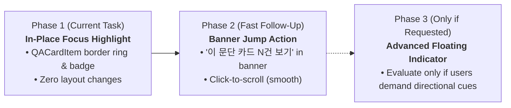

# Analysis & Design Review: Off-Screen Focused Card Indicator

> **Document Purpose**: Technical and UX design analysis for the 4 questions raised in [`QUESTION_OFFSCREEN_FOCUS_INDICATOR.md`](file:///D:/data/dev/App/SmartLinter/QUESTION_OFFSCREEN_FOCUS_INDICATOR.md) regarding how to handle QA cards matching the active paragraph when they are outside the visible scroll viewport. (Analysis only — no code modifications).

---

## Executive Summary & Core Verdict

| Question | Short Answer / Recommendation | Key Rationale |
| :--- | :--- | :--- |
| **Q1. First Pass Worth?** | **Acceptable & Recommended to ship Highlight-Only first.** | Keeps initial change minimal; validates whether users actually lose track of cards before adding UI overhead. |
| **Q2. Lightweight Indicator Design** | **Option 3 (Active Paragraph Banner / Header Jump Button)** over floating pills or minimap. | 100% state-driven (no DOM layout math), non-intrusive, zero floating overlay clipping, 1-click user-initiated scroll. |
| **Q3. DOM & Test Feasibility (`jsdom`)** | **DOM measurement in `jsdom` is severely limited** (returns 0 for geometry). Floating/minimap approaches require brittle mock gymnastics. | Lack of layout engine in `jsdom` is a decisive technical reason to prefer the state-derived Banner Jump approach. |
| **Q4. Scope & Priority Staging** | **Ship Highlight-Only now $\rightarrow$ Fast immediate follow-up for Banner Jump button if needed.** | Decouples pure styling from scrolling/navigation UI; zero regression risk for immediate release. |

---

## Detailed Answers to the 4 Questions

---

### Question 1: Is this worth solving at all in a first pass, or is it acceptable to ship highlight-only (no off-screen indicator) and see if it's actually a problem in practice?

#### Recommendation: **Acceptable and Recommended to ship Highlight-Only first.**

#### Analysis & Rationale:

1. **Context of Real-World Usage**:
   - `SmartLinter` operates primarily on paragraph-level real-time analysis. In typical editing sessions, the number of active pending cards in [`qaStore`](file:///D:/data/dev/App/SmartLinter/src/stores/qaStore.ts) ranges between 1 and 10 cards.
   - For 1–5 cards, all cards fit comfortably within the default scrollable container height (`h-full` in [`QACardList.tsx`](file:///D:/data/dev/App/SmartLinter/src/components/qa/QACardList.tsx#L157-L160)), meaning the active card is already visible within the viewport without scrolling.
   - Off-screen scenarios only occur when:
     - The document has accumulated many unhandled issues (>8–10 cards), AND
     - The user has scrolled the QA card list away from the section corresponding to their current cursor position.

2. **YAGNI (You Aren't Gonna Need It) & Avoiding Premature UI Clutter**:
   - Introducing floating overlays, directional arrows, or minimap bars adds visual noise and potential interaction conflicts (e.g. floating pills obscuring card action buttons or diff lines).
   - Shipping highlight-only first establishes the baseline visual language (`ring-2 ring-indigo-500`, active badge) without introducing complex scrolling edge cases.

3. **Zero Negative Side Effects**:
   - Highlighting in-place without an off-screen indicator does not break or misalign any existing data. The card remains strictly in its deterministic chronological position.
   - If the user scrolls manually through the list, the highlighted card stands out immediately when it enters the viewport.

---

### Question 2: If it should be solved, what is a lightweight, low-risk way to indicate off-screen focus without a full minimap?

#### Evaluation of Evaluated Options:

| Approach | UX Affordance | Implementation Complexity | Layout / Visual Risk | Testability (`jsdom`) |
| :--- | :--- | :--- | :--- | :--- |
| **Option A: Floating Edge Pills**<br/>(`▲ 위쪽에 있음` / `▼ 아래쪽에 있음`) | High (shows direction) | Medium (scroll listeners, intersection tracking) | Medium (can obscure top/bottom card buttons; sticky position shifts) | ❌ Poor (requires layout mocks) |
| **Option B: Scrollbar Minimap**<br/>(proportional track markers) | High (visual overview) | High (proportional coordinate mapping with dynamic card heights) | High (custom scrollbars break native OS scrolling & DPI scaling) | ❌ Poor (requires layout mocks) |
| **Option C: Banner / Header Jump Button**<br/>(`이 문단 카드 N건 [보기]`) | **High (clear, 1-click jump)** | **Low (pure React state calculation)** | **Zero (rendered in static flow or fixed header)** | **✅ Excellent (pure state + spy `scrollIntoView`)** |

#### Recommended Solution: **Option C (Active Paragraph Banner / Header "이 문단 카드 N건 [보기]" Jump Button)**

```tsx
// Conceptual Implementation in QACardList or Active Paragraph Banner:
const activeParagraphCardCount = useMemo(() => {
  if (!activeParagraph?.paragraphId) return 0;
  return filteredCards.filter((c) => c.paragraphId === activeParagraph.paragraphId).length;
}, [filteredCards, activeParagraph?.paragraphId]);

const handleScrollToActiveCard = () => {
  if (!activeParagraph?.paragraphId) return;
  const targetCard = filteredCards.find((c) => c.paragraphId === activeParagraph.paragraphId);
  if (!targetCard) return;
  
  const el = document.querySelector(`[data-testid="qa-card-item-${targetCard.id}"]`);
  el?.scrollIntoView({ behavior: 'smooth', block: 'nearest' });
};
```

#### Why Option C is Superior:
1. **100% State-Driven**:
   - Does NOT require checking `scrollTop`, `offsetTop`, or `getBoundingClientRect` to decide whether to render.
   - It simply checks `activeParagraphCardCount > 0`.
2. **Ambient Awareness**:
   - The user immediately sees: `"현재 문단에 대한 이슈 2건이 목록에 있습니다 [보기]"` directly inside the active paragraph banner (or sticky top header).
3. **User-Initiated Smooth Jump**:
   - Clicking `[보기]` smoothly scrolls to the card without forcing automatic viewport jumping during active typing.
4. **No Overlay Occlusion**:
   - Unlike floating chips at the top/bottom edges of the scroll area, this does not cover up the "모두 무시" button, filter tabs, or card diff lines.

---

### Question 3: Technical Feasibility & DOM Measurement in Vitest + jsdom

#### Finding: **jsdom does NOT support real layout geometry. DOM-measurement-based solutions create severe test flakiness.**

#### Technical Breakdown:

1. **jsdom Layout Limitations**:
   - `jsdom` (used in [`vite.config.ts`](file:///D:/data/dev/App/SmartLinter/vite.config.ts#L29) via Vitest) implements the DOM tree and event system, but has **no CSS layout or rendering engine**.
   - Under `jsdom`:
     - `element.getBoundingClientRect()` always returns `{ top: 0, left: 0, bottom: 0, right: 0, width: 0, height: 0 }`.
     - `element.offsetTop`, `offsetLeft`, `offsetWidth`, `offsetHeight` are always `0`.
     - `container.scrollTop`, `scrollHeight`, `clientHeight` are always `0`.
     - `window.IntersectionObserver` is undefined by default.

2. **Testing Overhead for Option A/B (Floating Pills & Minimap)**:
   - To test whether a floating pill appears when a card is scrolled above or below the viewport in `QACardList.test.tsx`, you would have to manually monkey-patch:
     ```ts
     // Brittle mock required for jsdom:
     vi.spyOn(cardElement, 'getBoundingClientRect').mockReturnValue({ top: -150, ... } as DOMRect);
     vi.spyOn(scrollContainer, 'getBoundingClientRect').mockReturnValue({ top: 0, bottom: 600, ... } as DOMRect);
     ```
   - These tests only verify your artificial mock coordinates, not actual browser layout logic, creating brittle and maintenance-heavy tests.

3. **Testing Simplicity for Option C (State-Derived Jump Button)**:
   - The presence of the jump button depends entirely on `activeParagraph.paragraphId` matching cards in the store.
   - Testing is clean, deterministic, and mock-free:
     ```ts
     // Clean and robust test in jsdom:
     it('renders jump button when active paragraph has matching cards', () => {
       useQaStore.getState().addCard({ id: 'c1', paragraphId: 'para-1', ... });
       useBridgeStore.getState().addParagraph({ paragraphId: 'para-1', ... });
       
       render(<QACardList />);
       expect(screen.getByTestId('active-paragraph-jump-btn')).toHaveTextContent('이 문단 카드 1건 보기');
       
       // Verify scroll invocation on click
       const scrollSpy = vi.fn();
       window.HTMLElement.prototype.scrollIntoView = scrollSpy;
       fireEvent.click(screen.getByTestId('active-paragraph-jump-btn'));
       expect(scrollSpy).toHaveBeenCalled();
     });
     ```

4. **Verdict on Q3**:
   - The limitations of `jsdom` provide a very strong technical justification to **avoid real-time DOM collision/scroll measurement** and instead use **state-driven banner indicators**.

---

### Question 4: Rough Scope & Priority Relative to Highlight-Only Feature

#### Proposed Phasing & Staging:



#### Staging Breakdown:

1. **Phase 1 (Current Scope — Immediate Release)**:
   - **Scope**: In-place visual highlight on matching [`QACardItem`](file:///D:/data/dev/App/SmartLinter/src/components/qa/QACardItem.tsx) (e.g. `ring-2 ring-indigo-500/80` and `"현재 문단"` badge).
   - **Work**: ~15–20 lines across `QACardItem.tsx` and `QACardList.tsx`.
   - **Risk**: Zero.

2. **Phase 2 (Fast Follow-Up — 1 Minor Task)**:
   - **Scope**: Add `"이 문단 카드 N건 [보기]"` to the Active Paragraph context banner in [`QACardList.tsx`](file:///D:/data/dev/App/SmartLinter/src/components/qa/QACardList.tsx#L162-L184).
   - **Work**: ~25 lines + 1 unit test in `QACardList.test.tsx`.
   - **Trigger**: Can be shipped immediately after Phase 1, or bundled as a minor polish task.

3. **Phase 3 (Deferred / Likely Unnecessary)**:
   - **Scope**: Floating directional edge pills (`▲ 위쪽에 있음` / `▼ 아래쪽에 있음`) or scrollbar minimap markers.
   - **Decision**: Defer indefinitely until concrete user telemetry or explicit user requests demonstrate that the Phase 2 banner jump is insufficient.

---

## Conclusion

We recommend proceeding with **Highlight-Only (In-Place)** for the current task. If an off-screen awareness mechanism is desired either now or in an immediate follow-up, **Option 3 (Active Paragraph Banner Jump Button)** is the most robust, maintainable, and test-friendly approach.
