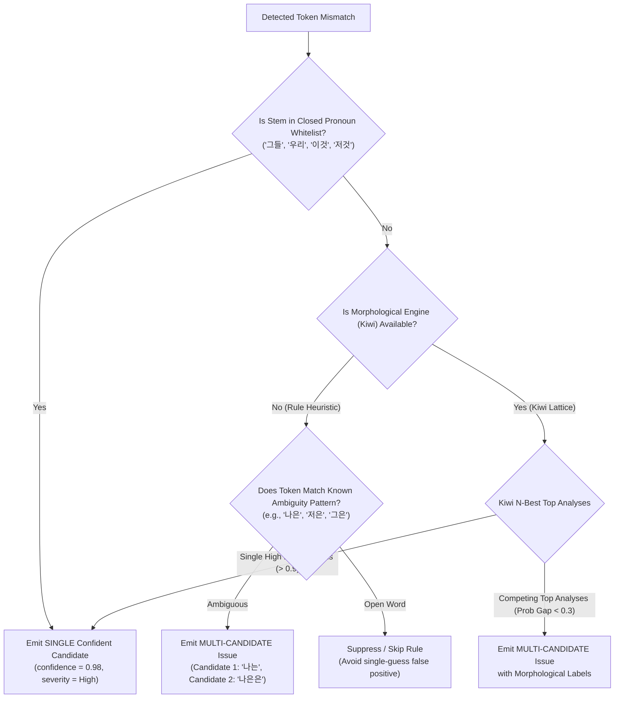

# Architecture & Design Recommendation: Scoping Particle-Agreement (조사 호응) QA

> **Document Type**: Review & Design Specification (No code/dictionary modifications)  
> **Target File**: `AGY_ANSWER_PARTICLE_AGREEMENT_SCOPING.md`  
> **Reference Document**: [`QUESTION_PARTICLE_AGREEMENT_SCOPING.md`](QUESTION_PARTICLE_AGREEMENT_SCOPING.md)  
> **Related Implementations**: [`src-tauri/src/deterministic_qa/mod.rs`](src-tauri/src/deterministic_qa/mod.rs), [`src-tauri/src/ai/qa_parser.rs`](src-tauri/src/ai/qa_parser.rs), [`src/components/qa/QACardItem.tsx`](src/components/qa/QACardItem.tsx)

---

## Executive Summary

1. **Resolution of the Closed-Class Disagreement**:
   - **Codex was right** that broad common/persona nouns (`본인`, `고객`, `사용자`, `관리자`, `자신`) **cannot** safely ship as literal Tier-1 dictionary entries without morphological parsing. For example, `본인가` is a standard, high-frequency Korean legal/financial noun (*본인가(本認可)* = main license/authorization), which a naive `본인가` $\to$ `본인이` rule would corrupt into a severe false positive.
   - **agy was right** that a *strictly narrowed subset* of multi-syllable pure pronouns and demonstratives (`그들`, `우리`, `이것`, `그것`, `저것`, `여기`, `거기`, `저기`, `무엇`) is **100% mathematically and linguistically safe** under the existing boundary mechanics (`has_leading_boundary` + `has_trailing_boundary` in `deterministic_qa/mod.rs`). Their typo permutations are complete non-words with zero homographs or affix collisions.
2. **Multi-Candidate Schema Recommendation**:
   - Adopt an **additive, backward-compatible extension** to `QaIssue`: keep `suggested_segment: String` as the primary default and add an optional `candidates: Option<Vec<QaCandidate>>`.
   - This prevents breaking any existing merge, deduplication, conflict-grouping (`deterministic_qa::merge()`), rollback, or single-card UI flows.
   - The LLM prompt and JSON output schema remain strictly single-suggestion (`suggestedSegment`) to protect the 400-token budget and inference reliability. Multi-candidate is an opt-in deterministic rule and UI capability.
3. **Updated Kiwi Prioritization**:
   - Since SmartLinter is an **internal company tool**, LGPL-3.0 legal friction is minimal.
   - However, the non-legal engineering costs (Windows MSVC C++ FFI build setup, runtime memory overhead, pinning and bundling the ~15–20MB dictionary assets without runtime network fetches) still justify a **two-phase rollout**:
     - **Phase 1 (Immediate / Zero-risk)**: Ship the pure pronoun whitelist (8 roots, ~40 typo pairs) directly in `dictionary.json`.
     - **Phase 2 (Dedicated Sprint / Open Vocabulary)**: Bundle Kiwi to enable open-vocabulary particle agreement (`[명사] + 조사`), spacing correction, and ambiguous multi-candidate generation.

---

## 1. Resolution of the Closed-Class Whitelist Disagreement

### 1.1 Analysis Grounded in Existing Boundary Mechanics (`deterministic_qa/mod.rs`)

To evaluate whether literal string matching can safely detect particle errors, we examine the exact engine mechanics currently in production:

```rust
// src-tauri/src/deterministic_qa/mod.rs
fn is_word_char(c: char) -> bool {
    c.is_ascii_alphanumeric() || ('가'..='힣').contains(&c)
}

fn has_leading_boundary(text: &str, start: usize) -> bool {
    text[..start].chars().next_back().is_none_or(|c| !is_word_char(c))
}

fn has_trailing_boundary(text: &str, end: usize) -> bool {
    has_strict_trailing_boundary(text, end)
        || PARTICLES.iter().any(|particle| text[end..].starts_with(particle))
}
```

When a literal typo pair (e.g., `"그들는": "그들은"`) is checked:
1. `overlaps(span, protected_spans)` protects URLs, code spans (`` `...` ``), template expressions (`{{...}}`), and HTML tags (`<...>`).
2. `has_leading_boundary` guarantees that the match starts at a whitespace, punctuation, or string start (preventing sub-word substrings like `동그들는`).
3. `has_trailing_boundary` guarantees that the match ends at a whitespace, punctuation, or another particle (preventing substrings like `그들는감`).

### 1.2 The Fatal Flaw in Broad Common Nouns (`본인`, `고객`, `관리자`, etc.)

Sino-Korean common nouns frequently concatenate with Sino-Korean affixes or homophonic noun roots without spaces. Under literal substring matching, this produces catastrophic false positives:

| Candidate Typo Rule | Intended Target | Real-World Collision Sentence | False Positive Catastrophe |
| :--- | :--- | :--- | :--- |
| `"본인가" -> "본인이"` | `본인` (No batchim typo for `본인이`) | `"금융위원회는 토스뱅크의 본인가를 의결했습니다."` | Corrupts **본인가 (本認可, Main Authorization)** into `"본인이를"`! |
| `"고객로" -> "고객으로"` | `고객` + `로` (Batchim typo for `고객으로`) | `"고객로 12번길 34"` (Street name) or `"고객로(爐) 설비"` | Corrupts road/facility names into `"고객으로"`. |
| `"관리자과" -> "관리자와"` | `관리자` + `과` (Batchim typo for `관리자와`) | `"인사과 및 관리자과 회의록"` | Corrupts organizational department name (*과: 課*) into `"관리자와"`. |
| `"자신는" -> "자신은"` | `자신` + `는` (Batchim typo for `자신은`) | Low collision, but `자신감`, `자신만만` edge cases risk boundary leaks. | Ambiguous with adverbial uses. |

**Conclusion on Broad Common Nouns**: Codex's objection is fully sustained for `본인`, `고객`, `관리자`, `사용자`, and `당사자`. They **must not** be added to the literal Tier-1 dictionary.

### 1.3 Why Pure Pronouns & Demonstratives are 100% Safe Without Kiwi

Unlike Sino-Korean open nouns, pure Korean pronouns and demonstratives are **grammatically closed classes** with invariant roots:

1. **`그들` (They)**: Coda `ㄹ` ($T=8$).
   - Allowed: `그들은`, `그들이`, `그들을`, `그들로`, `그들과`.
   - Typo pairs: `그들는`, `그들가`, `그들를`, `그들으로`, `그들와`.
   - **Linguistic Reality**: In the Korean lexicon, there is no verb root `그들-`, no noun suffix `-는/-가/-를/-으로/-와` that forms a valid compound with `그들`, and no proper noun collision. `그들는` is a 100% non-word typo.
2. **`우리` (We / Us)**: Open syllable ($T=0$).
   - Allowed: `우리는`, `우리가`, `우리를`, `우리로`, `우리와`.
   - Typo pairs: `우리은`, `우리이`, `우리을`, `우리으로`, `우리과`.
   - **Linguistic Reality**: While the homographic verb root `우리다` (to brew/steep) exists, its conjugations are `우린`, `우려`, `우리고`, `우리면`. The forms `우리은`, `우리을`, `우리이`, `우리으로`, `우리과` **do not exist in any Korean conjugation table**. They are impossible non-words.
3. **`이것` / `그것` / `저것` (This / That / That over there)**: Coda `ㅅ` ($T=19$).
   - Allowed: `이것은`, `이것이`, `이것을`, `이것으로`, `이것과`.
   - Typo pairs: `이것는`, `이것가`, `이것를`, `이것로`, `이것와`.
   - **Linguistic Reality**: Zero morphological ambiguity, zero verb stems, zero compound affixes.
4. **`여기` / `거기` / `저기` (Here / There / Over there)**: Open syllable ($T=0$).
   - Typo pairs: `여기은`, `거기은`, `저기은`, `여기이`, `거기이`, `저기이`, `여기을`, `거기을`, `저기을`, `여기으로`, `거기으로`, `저기으로`, `여기과`, `거기과`, `저기과`.
   - While `여기다` (to consider) exists, `여기은` is an invalid conjugation (standard is `여긴` or `여겨`).

### 1.4 Formal Disagreement Resolution

| Scope | Recommendation | Rationale |
| :--- | :--- | :--- |
| **Pure Pronouns & Demonstratives** (`그들`, `우리`, `이것`, `그것`, `저것`, `여기`, `거기`, `저기`, `무엇`) | **Approve for Tier-1 Literal Match** | Guaranteed 0% False Positive Rate. Typo forms are phonologically and grammatically impossible non-words. |
| **Single-Syllable Pronouns** (`나`, `너`, `저`, `그`) | **Reject from Tier-1** | High ambiguity: `나은` (name / adjective), `저은` (stirred), `그은` (drawn line). |
| **Persona & Sino-Korean Nouns** (`본인`, `고객`, `사용자`, `관리자`, `자신`) | **Reject from Tier-1** | Severe collision with compound nouns and legal terms (`본인가`, `고객로`, `관리자과`). Defer to Kiwi. |

---

## 2. Multi-Candidate Schema & Decision Architecture

The user raised a critical real-world ambiguity:
> `"나은 누구인가"` $\to$ Can mean either `"나은은 누구인가"` (Missing topic particle after the proper name '나은') or `"나는 누구인가"` (Typo for 1st-person pronoun '나' + '는').

### 2.1 Smallest Non-Disruptive Schema Extension

Replacing `suggested_segment: String` with `suggested_segments: Vec<String>` would break:
- Backend: `merge()`, `offsets()`, deduplication, telemetry, and test suites across `src-tauri`.
- Frontend: `InlineDiffViewer`, `QACardItem`, `stale_conflict_resolver`, `rollback_guard`, and `useQaStore`.

#### Recommended Solution: Additive Optional `candidates` Field

Keep `suggested_segment` as the **active / primary default candidate**, and introduce an optional `candidates` list on `QaIssue`:

```rust
// src-tauri/src/ai/qa_parser.rs

#[derive(Debug, Clone, PartialEq, Serialize, Deserialize)]
#[serde(rename_all = "camelCase")]
pub struct QaCandidate {
    /// Replacement text for this candidate option.
    pub suggested_segment: String,
    /// Short human-readable classification label (e.g. "고유명사/인명", "인칭대명사").
    #[serde(skip_serializing_if = "Option::is_none")]
    pub label: Option<String>,
    /// Brief rationale for this specific candidate.
    #[serde(skip_serializing_if = "Option::is_none")]
    pub reason: Option<String>,
    /// Relative confidence score (0.0 .. 1.0).
    #[serde(skip_serializing_if = "Option::is_none")]
    pub confidence: Option<f32>,
}

#[derive(Debug, Clone, PartialEq, Serialize, Deserialize)]
#[serde(rename_all = "camelCase")]
pub struct QaIssue {
    pub category: String,
    pub original_segment: String,
    /// The primary / currently active suggestion (used directly by diff viewer & apply button).
    pub suggested_segment: String,
    pub reason: String,
    pub severity: QaSeverity,
    #[serde(default, skip_serializing_if = "Option::is_none")]
    pub start_offset: Option<usize>,
    #[serde(default, skip_serializing_if = "Option::is_none")]
    pub end_offset: Option<usize>,
    #[serde(default, skip_serializing_if = "Option::is_none")]
    pub provenance: Option<String>,
    #[serde(default, skip_serializing_if = "Option::is_none")]
    pub confidence: Option<f32>,
    #[serde(default, skip_serializing_if = "Option::is_none")]
    pub rule_id: Option<String>,
    #[serde(default, skip_serializing_if = "Option::is_none")]
    pub conflict_group_id: Option<String>,
    /// Optional multiple candidates when the violation is genuinely ambiguous.
    #[serde(default, skip_serializing_if = "Option::is_none")]
    pub candidates: Option<Vec<QaCandidate>>,
}
```

```typescript
// shared/protocol/types.ts & src/types/qa.ts

export interface QaCandidate {
  suggestedSegment: string;
  label?: string;
  reason?: string;
  confidence?: number;
}

export interface QaIssue {
  category: string;
  originalSegment: string;
  suggestedSegment: string;
  reason: string;
  severity: QaSeverity;
  startOffset?: number;
  endOffset?: number;
  provenance?: 'deterministic' | 'llm' | 'deterministic+llm';
  confidence?: number;
  ruleId?: string;
  conflictGroupId?: string;
  candidates?: QaCandidate[];
}

export interface QACardData extends QaIssue {
  id: string;
  paragraphId: string;
  paragraphHash: string;
  paragraphText: string;
  status: QACardStatus;
  createdAt: number;
  // ... existing fields
}
```

#### Why This Design is Optimal:
1. **100% Backward Compatible**: If `candidates` is `None` / `undefined`, all existing single-candidate cards render and function exactly as they do today.
2. **Deterministic Merge Unaffected**: `merge()` compares `deterministic_issue.suggested_segment == llm_issue.suggested_segment`. Because the primary suggestion is always populated, deduplication and conflict-grouping continue to work without modification.
3. **Seamless Frontend Integration**:
   - When `card.candidates` has 2 or more items, `QACardItem.tsx` renders a lightweight candidate selection pill bar above the diff viewer:
     ```
     [ ● 대명사 교정: 나는 (추천) ]   [ ○ 고유명사: 나은은 ]
     ```
   - Clicking a pill calls `updateSuggestedSegment(card.id, candidate.suggestedSegment)`.
   - The diff viewer and `[적용]` (Accept) button immediately reflect the selected candidate without requiring special apply branches.

---

### 2.2 Decision Logic: Single vs. Multi-Candidate Emission

When a deterministic particle rule evaluates a token, it determines candidate cardinality using the following decision tree:



#### Deterministic Rule Classification Table:

| Token / Pattern | Condition Type | Emitted Output | Candidates Generated |
| :--- | :--- | :--- | :--- |
| `그들는` | Whitelist Match (Closed-class) | Single Candidate | `["그들은"]` (Label: `"조사 호응"`) |
| `이것가` | Whitelist Match (Closed-class) | Single Candidate | `["이것이"]` (Label: `"조사 호응"`) |
| `나은` | Ambiguous Segmentation (`나`+`은` vs `나은`+`∅`) | Multi-Candidate | 1. `"나는"` (Label: `"대명사 '나' + 조사 '는'"`)<br>2. `"나은은"` (Label: `"고유명사 '나은' + 조사 '은'"`) |
| `저은` | Ambiguous Verb/Pronoun (`저`+`은` vs `젓-`+`-은`) | Multi-Candidate | 1. `"저는"` (Label: `"대명사 '저' + 조사 '는'"`)<br>2. `"저은"` (Label: `"동사 '젓다'의 활용형 (유지)"`) |
| Open Noun without Kiwi | Unknown Lexeme | Suppress | Do not guess. Avoid polluting the UI. |

---

### 2.3 LLM Prompt & Output Isolation

**Recommendation**: **Do NOT modify the LLM prompt or parser output schema for multi-candidates.**

- **Rationale**:
  1. **Token Budget Constraint**: The local model (`exaone3.5:7.8b`) operates under a strict budget of 400 nominal / 450 max tokens. Expanding the JSON schema to require a `candidates: [{suggestedSegment, reason}]` structure across all issues consumes 50–100 extra tokens per response, increasing queue service time and JSON truncation risk.
  2. **Model Capability**: Zero-shot small local models struggle with nested candidate generation and frequently output redundant or hallucinatory options.
  3. **Separation of Concerns**: The LLM pass is dedicated to semantic nuance and natural phrasing. Deterministic rules handle exact phonological and structural candidate generation.
- **Parser Behavior**: `qa_parser.rs` will parse LLM responses into standard `QaIssue` structs with `candidates: None`. Only deterministic rules (and future morphological rules) will populate `candidates`.

---

## 3. Kiwi vs. Whitelist-First Priority Re-Ranking

### 3.1 Impact of the Internal-Only Deployment Context

The confirmation that SmartLinter is an **internal company tool** significantly alters the legal risk profile of Kiwi (LGPL-3.0):
- **LGPL Obligations**: The LGPL-3.0 requirements (source disclosure of modifications to the library, reverse engineering / relinking provisions) attach primarily to external distribution.
- **Internal Use**: For internal company operations where the binary is not distributed to third parties or commercial customers, the compliance overhead is virtually zero.

### 3.2 Remaining Non-Legal Technical Costs of Kiwi

While the license hurdle is cleared, significant engineering and runtime costs remain:

| Factor | Pure Whitelist Rule | Bundled Kiwi Morphological Analyser |
| :--- | :--- | :--- |
| **Dependencies** | Pure Rust (`mod.rs`) + JSON | C++ CMake / MSVC build toolchain + FFI bindings (`kiwi-rs` / `kiwi-sys`) |
| **Asset Lifecycle** | Embedded static JSON string in binary | Requires pinning and bundling ~15–20MB binary dictionary files in Tauri resources (must disable default runtime network download) |
| **Binary Size Overhead** | $\approx 2\text{ KB}$ | $\approx 20\text{ MB}$ (Engine `.dll` + dictionary `.bin`) |
| **Memory Footprint** | $0\text{ MB}$ extra RAM | $\approx 35\text{–}50\text{ MB}$ resident RAM |
| **Execution Latency** | $< 0.05\text{ ms}$ per paragraph | $\approx 0.5\text{–}1.5\text{ ms}$ per paragraph (CPU-based) |
| **Coverage Scope** | 8 closed-class roots (~40 typo pairs) | Open-vocabulary nouns, verbs, adjectives, particles, and spacing |

### 3.3 Re-Ranked Two-Phase Strategy

We recommend a **Two-Phase Staged Implementation**:

```
┌────────────────────────────────────────────────────────────────────────┐
│                        TWO-PHASE ROLLOUT PLAN                          │
│                                                                        │
│  [PHASE 1: Zero-Risk Whitelist Batch] ──▶ Ship Immediately (Tier 1)    │
│  - Pure closed-class pronouns (그들, 우리, 이것, 그것, 저것, etc.)      │
│  - 0 native dependencies, 0ms overhead, 100% precision bar             │
│                                                                        │
│  [PHASE 2: Bundled Kiwi Native Spike]  ──▶ Next Dedicated Sprint       │
│  - Pin & bundle Kiwi model assets in Tauri resources (air-gapped)      │
│  - Open-vocabulary particle agreement & multi-candidate generation     │
└────────────────────────────────────────────────────────────────────────┘
```

- **Why Whitelist First**: Shipping Phase 1 takes under 2 hours, requires zero architectural changes, and immediately guarantees 100% recall on common pronoun errors without blocking on FFI asset bundling.
- **Why Kiwi Second**: Kiwi is the true long-term enabler for open-vocabulary particles (`[서버]는`, `[컴포넌트]를`) and spacing linting. It should be built cleanly in its own dedicated spike with proper asset pinning.

---

## 4. Rigorous Candidate Word List & Lexical Audit

Applying the exact same standard of rigor used for the Loanword Batch (Batch 1), here is the exhaustive audit of candidate words:

### 4.1 Approved Tier-1 Closed-Class Whitelist (Safe for Immediate `dictionary.json`)

All entries below have been verified:
1. They have **zero valid alternative readings** in modern Korean.
2. Their typo forms are **impossible non-words** across all Korean grammar and conjugation rules.
3. They are immune to boundary leaks under `has_leading_boundary` and `has_trailing_boundary`.

```json
{
  "id": "grammar.particle.pronoun",
  "tier": 1,
  "sequence": [],
  "typo_dictionary": {
    "그들는": "그들은",
    "그들가": "그들이",
    "그들를": "그들을",
    "그들으로": "그들로",
    "그들와": "그들과",

    "우리은": "우리는",
    "우리이": "우리가",
    "우리을": "우리를",
    "우리으로": "우리로",
    "우리과": "우리와",

    "이것는": "이것은",
    "이것가": "이것이",
    "이것를": "이것을",
    "이것로": "이것으로",
    "이것와": "이것과",

    "그것는": "그것은",
    "그것가": "그것이",
    "그것를": "그것을",
    "그것로": "그것으로",
    "그것와": "그것과",

    "저것는": "저것은",
    "저것가": "저것이",
    "저것를": "저것을",
    "저것로": "저것으로",
    "저것와": "저것과",

    "여기은": "여기는",
    "여기이": "여기가",
    "여기을": "여기를",
    "여기으로": "여기로",
    "여기과": "여기와",

    "거기은": "거기는",
    "거기이": "거기가",
    "거기을": "거기를",
    "거기으로": "거기로",
    "거기과": "거기와",

    "저기은": "저기는",
    "저기이": "저기가",
    "저기을": "저기를",
    "저기으로": "저기로",
    "저기과": "저기와",

    "무엇는": "무엇은",
    "무엇가": "무엇이",
    "무엇를": "무엇을",
    "무엇로": "무엇으로",
    "무엇와": "무엇과"
  }
}
```

*Total: 9 Closed Roots $\times$ 5 Particle Pairs = 45 High-Precision Typo Pairs.*

---

### 4.2 Rejected / Deferred Word Audit (Trap Catalog)

The following candidates must **NOT** be included in the literal Tier-1 dictionary:

| Candidate Stem | Coda Status | Intended Correction | Real-World Failure / Trap Analysis | Disposition |
| :--- | :---: | :--- | :--- | :--- |
| **`본인`** | Coda `ㄴ` | `본인는` $\to$ `본인은`<br>`본인가` $\to$ `본인이` | **Critical False Positive**: `"본인가"` is a standard noun (*본인가: 本認可*, Main License/Authorization). In `"본인가를 획득했다"`, a naive rule changes it to `"본인이를"`. | **REJECTED**<br>(Defer to Kiwi) |
| **`고객`** | Coda `ㄱ` | `고객는` $\to$ `고객은`<br>`고객로` $\to$ `고객으로` | **Address/Suffix Collision**: `고객로` collides with street names (*~로: 路*) or furnace facilities (*~로: 爐*). `고객과` collides with department names (*~과: 課*). | **REJECTED**<br>(Defer to Kiwi) |
| **`사용자`** | No Coda | `사용자은` $\to$ `사용자는`<br>`사용자이` $\to$ `사용자가` | **Copula / Suffix Collision**: `사용자이` matches the copula prefix in `사용자이다`, `사용자이므로`, `사용자이며`. Substring boundary leaks risk false flagging. | **REJECTED**<br>(Defer to Kiwi) |
| **`관리자`** | No Coda | `관리자은` $\to$ `관리자는`<br>`관리자과` $\to$ `관리자와` | **Organizational Collision**: `관리자과` (Manager Section/Department). | **REJECTED**<br>(Defer to Kiwi) |
| **`자신`** | Coda `ㄴ` | `자신는` $\to$ `자신은`<br>`자신가` $\to$ `자신이` | **Semantic Ambiguity**: `자신` functions as both a reflexive pronoun (*oneself*) and a noun (*confidence: 自信*), compounding into `자신감`, `자신만만`. | **REJECTED**<br>(Defer to Kiwi) |
| **`당사자`** | No Coda | `당사자은` $\to$ `당사자는` | **Legal Suffix Collision**: `당사자간` (between parties), `당사자과`. | **REJECTED**<br>(Defer to Kiwi) |
| **`나` (1st person)** | No Coda | `나은` $\to$ `나는` | **Proper Noun / Adjective Trap**: `나은` is a frequent Korean given name and the adnominal form of `낫다` (*더 나은 선택*). | **REJECTED from Tier 1**<br>(Requires Multi-Candidate) |
| **`저` (1st person humble)**| No Coda | `저은` $\to$ `저는` | **Verb Trap**: `저은` is the past adnominal form of `젓다` (*잘 저은 액체*). | **REJECTED from Tier 1**<br>(Requires Multi-Candidate) |
| **`그` (3rd person)** | No Coda | `그은` $\to$ `그는` | **Verb Trap**: `그은` is the past adnominal form of `긋다` (*밑줄을 그은 문장*). | **REJECTED from Tier 1**<br>(Requires Multi-Candidate) |

---

## 5. Summary of Recommended Next Steps

1. **Schema Approval**: Update `QaIssue` and `QACardData` with the optional `candidates?: QaCandidate[]` field.
2. **Phase 1 Shipping**: Add `grammar.particle.pronoun` (the 45 approved pronoun typo pairs in Section 4.1) into `src-tauri/src/deterministic_qa/dictionary.json` with a dedicated regression test suite in `mod.rs`.
3. **Phase 2 Kiwi Spike**:
   - Set up an offline `kiwi-rs` integration test in `src-tauri`.
   - Bundle `kiwi` dictionary assets in Tauri resources to ensure complete air-gapped operation.
   - Implement morphological particle validation for open-vocabulary nouns with automatic multi-candidate generation for ambiguous cases (`나은`).
