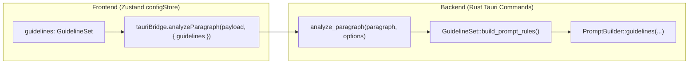
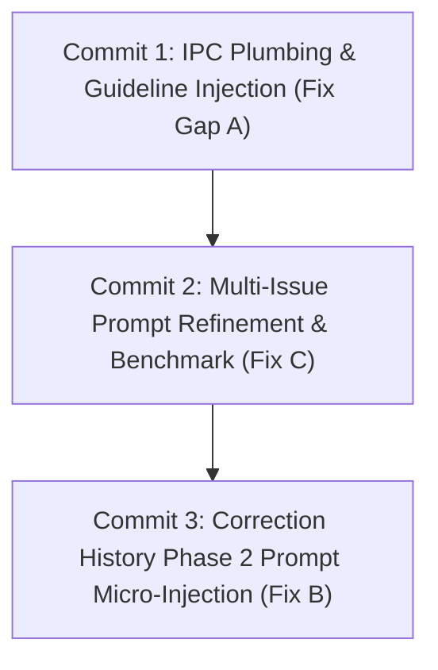

# SmartLinter: Prompt Pipeline Three Fixes Analysis & Recommendations

This document provides a comprehensive architectural analysis and concrete recommendations answering the 5 questions in [QUESTION_PROMPT_PIPELINE_THREE_FIXES.md](file:///D:/data/dev/App/SmartLinter/QUESTION_PROMPT_PIPELINE_THREE_FIXES.md).

---

## Executive Summary

| Dimension | Recommendation / Verdict |
| :--- | :--- |
| **1. Guideline Wiring** | Use a dedicated, optional `AnalysisOptions` context DTO passed alongside `ParagraphPayload` to `analyze_paragraph`. Pass the raw `GuidelineSet` struct directly to Rust so [`GuidelineSet::build_prompt_rules()`](file:///D:/data/dev/App/SmartLinter/src-tauri/src/tm/guideline_loader.rs#L128-L141) remains the single source of truth without duplicating formatting logic in TypeScript. |
| **2. Correction-History Retrieval** | **Frontend-driven Top-K retrieval ($K \le 2$)**: The frontend evaluates `appliedCards` against active paragraph text using substring/token matching and sends 0–2 `CorrectionPreference` objects in `AnalysisOptions`. Keeps Rust stateless and prompt overhead at zero when $K=0$. |
| **3. Multi-Issue Prompting** | **Instruction-only refinement** ("Detect and list all distinct issues..."). Avoid few-shot examples (+120–180 tokens), which would regress the Task 3 latency gain. Validate empirically using the existing [`spikes/task3_llm_latency/`](file:///D:/data/dev/App/SmartLinter/spikes/task3_llm_latency/) benchmark on Ollama (`qwen2.5:7b`). |
| **4. Combined Token Budget** | Raise nominal budget ceiling from **250 to 450–500 tokens**. Under pressure, enforce a strict truncation hierarchy: **Instruction/Schema & Paragraph Payload (Protected) > Correction History ($K \le 2$) > Guidelines (Truncatable if custom rules exceed 150 tokens)**. |
| **5. Scope & Sequencing** | Cohesive **single-design architecture** delivered as **3 sequential commits**: (1) IPC Plumbing & Guideline Injection $\rightarrow$ (2) Multi-Issue Prompt Wording & Benchmark $\rightarrow$ (3) Correction History Phase 2 Prompt Micro-Injection. |

---

## 1. Guideline Wiring

### 1.1. Parameter Architecture: Where Guideline Data Belongs

We evaluated three options for passing loaded guideline data from the frontend to [`analyze_paragraph`](file:///D:/data/dev/App/SmartLinter/src-tauri/src/commands.rs#L113-L141):

```
Option (a): Add field to ParagraphPayload
   [Editor Plugin] ──WebSocket──> [Bridge Server] ──> [ParagraphPayload] (POLLUTED)
   * BAD: ParagraphPayload is the shared wire protocol for Word/InDesign editor telemetry.
   * Coupling editor telemetry types with desktop dashboard QA state causes protocol drift.

Option (b): Sibling scalar arguments on analyze_paragraph
   invoke('analyze_paragraph', { paragraph, guidelines, history, ... })
   * MEDIOCRE: Fragile Tauri IPC signature that requires signature churn for every new feature.

Option (c) [RECOMMENDED]: Dedicated `AnalysisOptions` Context DTO
   invoke('analyze_paragraph', { paragraph, options: { guidelines, userPreferences } })
   * CLEAN: Preserves ParagraphPayload purity while encapsulating all dashboard-level QA context.
```

#### Detailed Rationale for Option (c):
1. **Separation of Concerns:** [`ParagraphPayload`](file:///D:/data/dev/App/SmartLinter/src-tauri/src/protocol/messages.rs#L64-L86) represents native editor document telemetry (shared across WebSocket with Word Office.js and InDesign ExtendScript). It should strictly reflect editor state (`paragraphId`, `text`, `hash`, `isLocked`, `timestamp`).
2. **Extensibility for Ask B (Correction History):** Creating a typed `AnalysisOptions` (or `AnalysisContextDto`) allows guidelines (Ask A) and correction history (Ask B) to share the same clean envelope without altering `ParagraphPayload` or continuously refactoring command signatures.

### 1.2. Struct vs Pre-formatted String: Keep Rust as Single Source of Truth

The frontend should **send the raw `GuidelineSet` struct** rather than a pre-formatted string.



#### Why passing `GuidelineSet` is superior:
1. **Zero Code Duplication:** [`GuidelineSet`](file:///D:/data/dev/App/SmartLinter/src/types/config.ts#L39-L44) in TypeScript already mirrors [`GuidelineSet`](file:///D:/data/dev/App/SmartLinter/src-tauri/src/tm/guideline_loader.rs#L86-L98) 1:1 via serde `camelCase`. 
2. **Existing Implementation Ready:** Rust already has [`GuidelineSet::build_prompt_rules()`](file:///D:/data/dev/App/SmartLinter/src-tauri/src/tm/guideline_loader.rs#L128-L141) fully implemented, tested, and optimized. Pre-formatting in TypeScript would require duplicating the `to_prompt_line()` formatting rules, bracket logic, and fallback branches in TS.
3. **Enables Backend Token Budgeting:** If custom guidelines exceed the token budget (Question 4), Rust can inspect `rules: Vec<QaRule>` and apply rule-level truncation/prioritization. A pre-flattened string loses rule boundaries and cannot be safely truncated.

### 1.3. Concrete Wire DTO Shape

```rust
// In src-tauri/src/commands.rs or ai/types.rs
#[derive(Debug, Clone, Default, Deserialize)]
#[serde(rename_all = "camelCase")]
pub struct AnalysisOptions {
    #[serde(default)]
    pub guidelines: Option<GuidelineSet>,
    #[serde(default)]
    pub user_preferences: Option<Vec<CorrectionPreferenceDto>>,
}
```

In [`src-tauri/src/commands.rs`](file:///D:/data/dev/App/SmartLinter/src-tauri/src/commands.rs):
```rust
#[tauri::command]
pub async fn analyze_paragraph(
    paragraph: ParagraphPayload,
    options: Option<AnalysisOptions>,
    queue: State<'_, MicroScopingQueue>,
) -> Result<QaReport, String> {
    let mut builder = PromptBuilder::new()
        .source(&paragraph.source)
        .target(&paragraph.text);

    if let Some(opts) = options {
        if let Some(guidelines) = opts.guidelines {
            let rules_str = guidelines.build_prompt_rules();
            if !rules_str.is_empty() {
                builder = builder.guidelines(rules_str);
            }
        }
        if let Some(prefs) = opts.user_preferences {
            builder = builder.user_preferences(prefs);
        }
    }

    let req = builder.build_queue_request(&paragraph.paragraph_id);
    let job_result = queue.submit(req).await.map_err(|e| format!("LLM QA inference error: {}", e))?;
    let report = QaParser::parse(&job_result.response);
    Ok(report)
}
```

---

## 2. Correction-History Retrieval Mechanics

### 2.1. Responsibility Split: Frontend Top-K Retrieval vs Backend State

The **frontend must compute Top-K ($K \le 2$) relevant entries** and forward only the matched items.

```
[ Frontend qaStore ]                           [ Backend Rust / MicroScopingQueue ]
  appliedCards in Memory
  │
  ├─ Query paragraph.text against history
  ├─ Substring match / Keyword overlap
  ├─ Extract Top-K (K <= 2, ~20-35 tokens)
  │
  └─ Send { userPreferences: [Top-K] } ────IPC────> PromptBuilder (Stateless)
                                                     Injects into system prompt
                                                     Zero extra tokens if K == 0
```

#### Rationale:
1. **Stateless Backend Principle:** The Rust backend is designed as a stateless AI queue (`MicroScopingQueue`) and IPC bridge. It has no persistent database or history index.
2. **Zero IPC Overhead:** Sending the entire unbounded `appliedCards` array across Tauri IPC on every debounced keystroke is wasteful. Computing Top-K locally on the client takes `< 1ms` and transfers only 0 to 2 compact objects.
3. **Zero GPU/Token Overhead on Unrelated Paragraphs ($K=0$):** When no past corrections match the current paragraph, `userPreferences` is omitted/empty, preserving the 100% Zero-Shot baseline (~188 tokens).

### 2.2. Retrieval Logic on Frontend

In [`qaStore.ts`](file:///D:/data/dev/App/SmartLinter/src/stores/qaStore.ts) / `tmMatcher.ts`:
- **Filter 1 (Positive Signal Only):** Query strictly from `appliedCards` (accepted corrections). Never query or inject `dismissedCards` or `stale_obsolete` cards into the prompt.
- **Filter 2 (Relevance Scoring):**
  1. Exact substring match: Does `paragraph.text.includes(card.originalSegment)`? (Score: 1.0)
  2. Substring root/token match: Does the card share high similarity ($> 0.85$) with any token in the paragraph?
- **Filter 3 (Cap Top-K):** Take top $K \le 2$ items, deduplicated by `(originalSegment, suggestedSegment)`.

### 2.3. Wire DTO & Prompt Formatting

#### Wire DTO:
```rust
#[derive(Debug, Clone, PartialEq, Eq, Serialize, Deserialize)]
#[serde(rename_all = "camelCase")]
pub struct CorrectionPreferenceDto {
    pub original_segment: String,
    pub suggested_segment: String,
    #[serde(skip_serializing_if = "Option::is_none")]
    pub category: Option<String>,
}
```

#### In [`prompt_builder.rs`](file:///D:/data/dev/App/SmartLinter/src-tauri/src/ai/prompt_builder.rs):
```rust
// Formatted into the system prompt when present:
User Preferences:
- "오브젝트" -> "객체"
- "일오일" -> "일요일"
```
This adds only **~15 to 30 tokens**, well within the fast prefill capacity of Ollama GPU execution.

---

## 3. Multi-Issue Prompt Wording

### 3.1. Why 7B Models Settle for a Single Issue

In local models like `qwen2.5:7b`, two factors drive the single-issue bias:
1. **Schema Exemplar Anchoring:** In `{"status":"PASS"|"FAIL","issues":[{"category":"..."}]}`, the JSON schema contains an array with a single template element. Under JSON mode/constrained decoding, small models often treat this as a structural constraint to output exactly 1 element.
2. **First-Match Early Exit:** Once a model identifies an obvious low-hanging error (e.g. a spacing or punctuation issue), it closes the JSON object and finishes without continuing its scan through the paragraph.

### 3.2. Instruction Refinement vs. 1-Shot Example

```
Approach 1: Concise Instruction Clause (+15-20 tokens) [RECOMMENDED]
   "Detect and list ALL distinct issues found in the text (do not stop after the first issue).
    Return issues: [] only if the text is completely clean."
   * Zero-shot latency preserved.
   * High adherence on instruction-tuned models (Qwen 2.5).

Approach 2: 1-Shot Example (+120-180 tokens) [REJECTED]
   Include a complete 2-issue JSON response example in the prompt.
   * Regresses prompt tokens by 60-100%.
   * Increases prefill latency and risks few-shot category bias (overfitting to example categories).
```

### 3.3. Proposed Prompt Wording

Update [`COMPRESSED_SYSTEM_INSTRUCTION`](file:///D:/data/dev/App/SmartLinter/src-tauri/src/ai/prompt_builder.rs#L9-L10) and [`MONOLINGUAL_SYSTEM_INSTRUCTION`](file:///D:/data/dev/App/SmartLinter/src-tauri/src/ai/prompt_builder.rs#L12-L13):

#### Bilingual System Instruction:
```text
You are a fast bilingual paragraph QA linter. Check the Korean target against the source for translation fidelity, terminology, numbers, omissions, grammar, passive voice, and punctuation. Inspect the entire target text and list ALL distinct issues found (do not stop after the first issue). Return issues: [] only if the text is completely clean.
Output JSON only matching this schema:
{"status":"PASS"|"FAIL","issues":[{"category":"...","originalSegment":"...","suggestedSegment":"...","reason":"...","severity":"LOW"|"MEDIUM"|"HIGH"}]}
```

#### Monolingual System Instruction:
```text
You are a fast Korean monolingual paragraph QA linter. Inspect the Korean text itself for spelling, typos, spacing, particles, verb endings, grammar, unnatural expressions, passive voice, and punctuation. Inspect the entire text and list ALL distinct issues found (do not stop after the first issue). Return issues: [] only if the text is completely clean.
Output JSON only matching this schema:
{"status":"PASS"|"FAIL","issues":[{"category":"...","originalSegment":"...","suggestedSegment":"...","reason":"...","severity":"LOW"|"MEDIUM"|"HIGH"}]}
```

### 3.4. Empirical Benchmark Validation Requirement

This prompt modification **must be validated using the existing Ollama benchmark harness** in [`spikes/task3_llm_latency/`](file:///D:/data/dev/App/SmartLinter/spikes/task3_llm_latency/):
1. **Dataset Extension:** Add 5 test paragraphs containing 2–3 known simultaneous defects (e.g. Typo `"일오일"` + Spacing `"3 으로"` + Passive `"업데이트되어지게 됩니다"`).
2. **Benchmark Execution:** Run `run_spike_tests.py` against `qwen2.5:7b` (Q4_K_M) on the target RTX 3050 hardware.
3. **Metrics to Confirm:**
   - Multi-issue recall: $\ge 85\%$ of multi-issue paragraphs return all genuine issues.
   - Mean latency: remains $\le 8.0\text{s}$ (preserving the ~7.2s baseline).
   - JSON validity: strictly $100.0\%$.

---

## 4. Combined Token & Latency Budget

### 4.1. Token Breakdown for a Full Analysis Request

| Component | Token Count | Status / Conditionality |
| :--- | :---: | :--- |
| **Base System Instruction & JSON Schema** | ~110 tokens | Mandatory (Fixed) |
| **Multi-Issue Directive** | ~15 tokens | Mandatory (Fixed) |
| **Input Paragraph Payload (SRC + TGT)** | ~80–120 tokens | Mandatory (Protected) |
| **User Preferences / Correction History ($K \le 2$)** | 0 or ~25–35 tokens | Dynamic (Omitted if $K=0$) |
| **Project Guidelines (`DEFAULT_GUIDELINES`)** | ~70 tokens | Included when active |
| **Custom Guidelines (Uploaded `.agents` file)** | ~50–300+ tokens | Truncatable if exceeding budget |
| **Total Typical Request** | **~275 – 350 tokens** | **Well within GPU prefill envelope** |

### 4.2. Revised Budget Ceiling & Latency Impact

- **Previous Ceiling:** ~250 tokens (designed for minimal Zero-Shot without guidelines).
- **Recommended New Nominal Ceiling:** **450 – 500 tokens**.
- **Hardware/Latency Justification:**
  Per [SPIKE_RESULTS_TASK3.md](file:///D:/data/dev/App/SmartLinter/SPIKE_RESULTS_TASK3.md#L76), Ollama's prompt evaluation speed (prefill) on RTX 3050 exceeds **4,500 tok/s**. Evaluating 400 tokens takes **$< 90\text{ms}$** (TTFT remains under 300ms). The generation phase (~42 tok/s) accounts for 98% of wall latency. A 400-token prompt does not noticeably slow down the user experience.

### 4.3. Budget Pressure & Truncation Hierarchy

If a user uploads an unusually large `.agents` file or analyzes a 250-word paragraph, total tokens could exceed 500. Under budget pressure, apply this strict truncation order:

```
[ Truncation Priority: Least Critical to Most Critical ]

1. Custom Guidelines (TRUNCATE FIRST):
   - Cap guideline rules block at max 150 tokens (~4-6 highest priority rules).
   - Log a debug warning if custom guidelines are truncated.

2. User Preferences / History (TRUNCATE SECOND):
   - Drop from K=2 to K=1 if total prompt exceeds 450 tokens.

3. Paragraph Payload (PROTECTED - NEVER TRUNCATE):
   - Never truncate source or target text (truncation causes false passes / corrupted offsets).

4. Base System Instruction & JSON Schema (PROTECTED - NEVER TRUNCATE):
   - Essential for syntax integrity and deterministic output.
```

---

## 5. Scope & Implementation Sequencing

### 5.1. Coherent Design, 3 Atomic Commits

While these three items converge on the same `analyze_paragraph` execution path, they should be landed as **3 sequential, verified commits** to maintain isolation, rollback safety, and testability.



### 5.2. Detailed Landing Sequence

#### Commit 1: IPC Plumbing & Guideline Injection (Fix Gap A)
- **Scope:**
  1. Define `AnalysisOptions` in Rust (`src-tauri/src/commands.rs`) and TypeScript (`src/types/tauriBridge.ts`).
  2. Update `tauriBridge.analyzeParagraph(paragraph, options)` to pass `options`.
  3. In `qaStore.ts`, retrieve `useConfigStore.getState().guidelines` and supply it to `analyzeParagraph`.
  4. In `commands.rs`, call `guidelines.build_prompt_rules()` and inject into `PromptBuilder`.
  5. Add unit tests for `PromptBuilder` and mock tests for `analyze_paragraph`.
- **Validation:** Verify that rules from `DEFAULT_GUIDELINES` and custom `.agents` files appear in the generated prompt and influence QA output.

#### Commit 2: Multi-Issue Prompt Refinement & Benchmark Validation (Fix C)
- **Scope:**
  1. Update `COMPRESSED_SYSTEM_INSTRUCTION` and `MONOLINGUAL_SYSTEM_INSTRUCTION` in `prompt_builder.rs` with the multi-issue directive.
  2. Add multi-issue test fixtures in `spikes/task3_llm_latency/dataset.json`.
  3. Run `run_spike_tests.py` with Ollama to verify multi-issue recall and ensure no latency regression.
  4. Update Rust prompt builder unit tests.
- **Validation:** Confirm that paragraphs with multiple defects (e.g. `"일오일, 월요일, 화요일"`) return all distinct issues in the parsed report.

#### Commit 3: Correction History Phase 2 Prompt Micro-Injection (Fix B)
- **Scope:**
  1. Implement Top-K ($K \le 2$) in-memory lookup in `qaStore.ts` for `appliedCards` matching the target paragraph.
  2. Pass matched items as `userPreferences` in `AnalysisOptions`.
  3. Extend `PromptBuilder` to format `User Preferences:` block and enforce token budget limits ($< 500$ tokens).
  4. Add unit tests verifying prompt generation when $K=0$, $K=1$, and $K=2$.
- **Validation:** Verify that accepted corrections are dynamically reflected in LLM prompts for matching paragraphs with zero overhead on non-matching paragraphs.

---

## 6. Summary Comparison Matrix

| Aspect | Current Baseline | Proposed Design |
| :--- | :--- | :--- |
| **Guideline Path** | Parsed in TS only; never passed to Rust | Passed via `AnalysisOptions`; formatted by Rust `build_prompt_rules()` |
| **Correction History Path** | Displayed in UI & exact fast-path only | Exact fast-path + Top-K ($K \le 2$) prompt injection via `AnalysisOptions` |
| **Multi-Issue Recall** | Frequently stops after 1 issue | Exhaustive enumeration instruction; benchmark-verified multi-issue recall |
| **Prompt Token Ceiling** | ~250 tokens | 450–500 tokens (with strict truncation hierarchy) |
| **`ParagraphPayload` Protocol** | Unchanged | Cleanly decoupled from dashboard QA context |
| **Risk / Blast Radius** | Zero-Shot fast, but blind to user rules | Fully context-aware while strictly preserving $< 90\text{ms}$ prefill performance |
