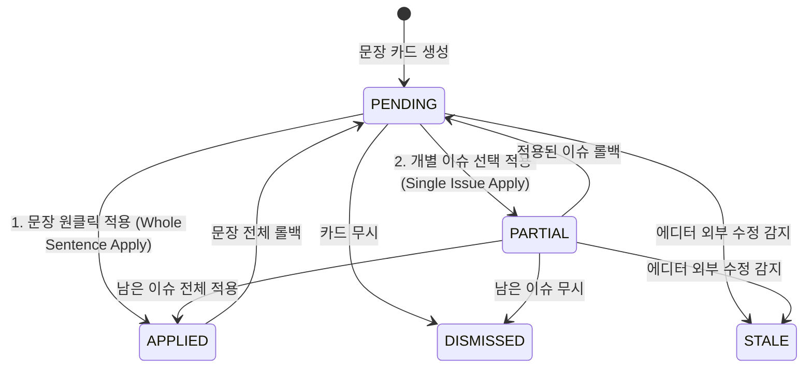
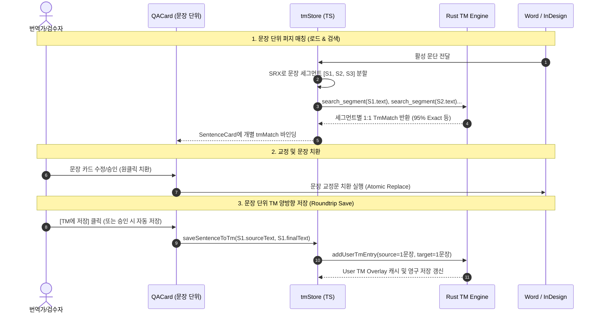
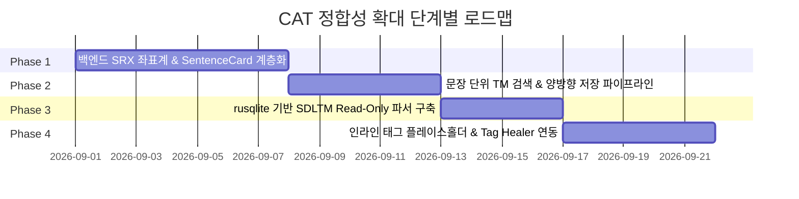

# 문장 단위 CAT 정합성 확대 종합 설계자문
> **문장 단위 검토·카드 전환 / TM 양방향 왕복 저장 / SDLTM 바이너리 DB 지원 / 인라인 태그 보존**

---

## 1. 총괄 요약 (Executive Summary)

### 1.1 사용자 요구의 본질과 패러다임 전환
직전 자문에서는 "원자적 이슈 카드(`QaIssue` 1건 = 1개 카드) 모델 유지 + UI 시각적 그룹핑만 SRX 적용"을 권고했습니다. 그러나 사용자가 명확히 재확인한 목표는 **"SmartLinter를 Trados/memoQ와 같은 전문 CAT(Computer-Assisted Translation) 도구와 동일하게 문장(세그먼트) 단위로 검토 → 치환 → TM 저장까지 유기적으로 관통하는 시스템으로 격상"**시키는 것입니다.

이에 따라 본 자문은 "반대"가 아닌, **"이 대규모 CAT 정합성 목표를 기술적 리스크(문맥 유실, 비용 폭증, 상태머신 붕괴, 포맷 파편화) 없이 가장 안전하고 견고하게 구현하는 엔지니어링 아키텍처"**를 처음부터 다시 설계합니다.

---

### 1.2 4대 핵심 요구사항 해결 아키텍처 매트릭스

| 영역 | 핵심 과제 | 채택 아키텍처 및 안전장치 (해결책) |
| :--- | :--- | :--- |
| **Q1. 문장 단위 카드 전환** | 문맥 유실 방지, 호출비용 억제, 복수 이슈 상태 충돌 방지 | **"문단 문맥 LLM 추론 + 세그먼트 컨테이너 카드" 2계층 모델**<br>• 추론: 문단 전체를 컨텍스트로 LLM 1회 호출 (비용/문맥 100% 보존)<br>• 카드: SRX 기반 1개 문장 = 1개 `SentenceCard` (내부에 `AtomicIssue` N개 포함)<br>• 적용: 문장 원클릭 통합 적용 또는 이슈별 diff 리베이스 적용 |
| **Q2. TM 양방향 왕복 저장** | 문단 매칭과 문장 저장 간의 불균형 해소, 1:1 세그먼트 정합성 | **"동일 SRX 세그먼트 경계 기반 검색-저장 파이프라인"**<br>• 검색: 문단을 세그먼트로 분할 후 세그먼트별 독립 퍼지 매칭<br>• 저장: 교정 완료된 문장 단위(`sourceSentence` $\leftrightarrow$ `finalSuggestedSentence`)로 TM 등록 |
| **Q3. SDLTM 포맷 지원** | Trados 독점 SQLite 바이너리 DB 파싱 및 법적/기술적 안정성 | **"Rust `rusqlite(bundled)` 기반 Read-Only TMX 정규화 파서"**<br>• `translation_units` 테이블의 `source/target_segment` XML 추출<br>• 공통 `TmEntry` 추상화 계층으로 자동 변환<br>• 법적 안정성: 호환성 목적 Read-Only 임포트 한정 (SDLTM 직접 쓰기는 배제) |
| **Q4. 인라인 태그 보존** | `<bpt>`, `<ept>`, `<ph>` 등 서식 태그의 세그멘테이션/치환 시 보존 | **"플레이스홀더 캡슐화 + 태그 보호 세그멘테이션 + 에디터 서식 보존"**<br>• 태그를 `{1}`, `{2}` 토큰으로 추상화하여 LLM 프롬프트 및 퍼지 매처 전달<br>• 문장 분할기가 태그 내부를 자르지 못하도록 원자적 토큰 보호<br>• InDesign/Word 에디터는 문자 단위 범위 치환을 통해 기존 서식 런(Run) 자동 유지 |

---

## 2. [질문 1] 검토/카드 단위를 문장으로 안전하게 전환하는 설계

### 2.1 "추론 단위(Inference Unit)"와 "상호작용 단위(Interaction Unit)"의 분리
직전 자문에서 우려했던 "문맥 유실(주어 생략, 대명사 조응 불능)"과 "호출 비용 3~5배 폭증"은 **"LLM API를 문장마다 쪼개서 따로 호출할 때"만 발생하는 문제**입니다.

Trados 2024 AI Assistant, memoQ AGT 등 최신 상용 CAT AI도 내부적으로는 **문단/문서 수준의 광역 컨텍스트**를 모델에 전달하고, 출력만 **세그먼트(문장) ID 단위로 정렬**받는 방식을 사용합니다.

```mermaid
graph TD
    subgraph Input [입력 계층]
        P[Word / InDesign 활성 문단] --> S[SRX 세그멘터]
        S -->|세그먼트 분할| Segs["Seg 1, Seg 2, Seg 3 (좌표계 부여)"]
    end

    subgraph LLM_Pipeline [LLM 분석 계층 (1회 호출)]
        P -->|문단 전체 텍스트 + Seg 목록| Prompt[Structured Prompt with Segment Anchors]
        Prompt --> LLM[LLM 엔진 (Ollama / Cloud)]
        LLM -->|구조화 JSON 출력| RawIssues[세그먼트 인덱스 포함 Issue 목록]
    end

    subgraph Card_Model [UI & 데이터 계층 (문장 단위 카드)]
        RawIssues & Segs --> SC1["SentenceCard #1<br>(원문 1문장 + 이슈 N개)"]
        RawIssues & Segs --> SC2["SentenceCard #2<br>(원문 1문장 + 이슈 N개)"]
        RawIssues & Segs --> SC3["SentenceCard #3<br>(원문 1문장 + 이슈 0개)"]
    end
```

#### 프롬프트 구조 설계 (Segment-Aware Paragraph Prompt)
```json
{
  "paragraph_context": "전체 문단 원문 텍스트...",
  "segments": [
    { "index": 0, "text": "첫 번째 문장입니다." },
    { "index": 1, "text": "두 번째 문장에서 번역 오류가 발생했습니다." }
  ],
  "response_format": {
    "segment_issues": [
      {
        "segment_index": 1,
        "category": "MISTRANSLATION",
        "original_slice": "발생했습니다",
        "suggested_slice": "확인되었습니다",
        "suggested_full_sentence": "두 번째 문장에서 번역 오류가 확인되었습니다.",
        "reason": "문맥상 능동 표현 권장",
        "severity": "MEDIUM"
      }
    ]
  }
}
```
- **효과**:
  1. LLM은 문단 전체의 앞뒤 맥락을 보고 검토하므로 번역 문맥 유실 0%.
  2. API 호출은 문단당 단 1회로 유지되어 비용 증가 0%, 레이턴시 최소화.
  3. 결과는 세그먼트 단위로 100% 분해되어 사용자에게는 "완벽한 문장 카드"로 제공됨.

---

### 2.2 문장 카드(`SentenceCard`)와 복수 이슈 계층 모델 (State Machine)

한 문장 카드 내에 여러 이슈(예: 맞춤법 오류 1건 + 용어집 미준수 1건)가 존재할 때, 직전 자문이 우려했던 **"부분 적용/부분 롤백 시의 오프셋 충돌 및 상태머신 모순"**을 완벽히 방어하는 데이터 모델을 정의합니다.

#### 2.2.1 계층형 데이터 스키마
```typescript
/** 문장 단위 카드 (최상위 검토/적용 엔티티) */
export interface SentenceCardData {
  id: string;                      // `sent-${paragraphId}-${segmentIndex}`
  paragraphId: string;
  paragraphHash: string;
  segmentIndex: number;            // 0-based 문장 순번
  startOffset: number;             // 문단 내 문장 시작 오프셋 (UTF-16)
  endOffset: number;               // 문단 내 문장 끝 오프셋 (UTF-16)
  
  sourceText: string;              // 세그먼트 원래 텍스트
  currentText: string;             // 현재 에디터 상의 세그먼트 텍스트 (치환 진행 중 실시간 반영)
  finalSuggestedText: string;      // 활성 이슈들이 모두 반영된 최종 권장 문장
  
  issues: AtomicIssueItem[];       // 문장 내부의 원자적 이슈 목록 (N개)
  tmMatches: TmMatchCandidate[];   // 이 문장에 매칭된 TM 후보군 (문장 단위)
  
  status: SentenceCardStatus;      // 'PENDING' | 'PARTIAL' | 'APPLIED' | 'DISMISSED' | 'STALE'
}

/** 문장 내부의 원자적 이슈 항목 */
export interface AtomicIssueItem {
  issueId: string;
  category: IssueCategory;
  originalSlice: string;           // 문장 내 교정 대상 어절/어구
  suggestedSlice: string;          // 교정 제안 어절/어구
  sliceStartOffset: number;        // 문장 내 상대 오프셋
  sliceEndOffset: number;
  reason: string;
  severity: IssueSeverity;
  status: 'pending' | 'applied' | 'dismissed';
}
```

#### 2.2.2 상태 전이 및 부분 적용/롤백 안전 설계 (Diff Rebase & Transaction)
문장 카드에서 사용자가 취할 수 있는 동작은 2가지 모드로 지원합니다:



1. **모드 A: CAT 표준 방식 (문장 원클릭 통합 적용 — 권장 기본값)**
   - CAT 툴 사용자(번역가)의 90% 이상은 문장 단위로 최종 번역문을 확인하고 한 번에 승인합니다.
   - 문장 카드의 [적용] 버튼을 누르면, 문장 전체의 `sourceText` $\rightarrow$ `finalSuggestedText` 단일 치환 Hunk를 생성하여 Word/InDesign에 전송합니다.
   - **이점**: 문장 내 다중 이슈의 오프셋 간섭 문제가 100% 원천 소멸하며, 가장 빠르고 안전함.
2. **모드 B: 세부 이슈 개별 적용 (Granular Apply)**
   - 문장 내 특정 이슈만 적용하고 다른 이슈는 무시/거절할 경우:
   - 이슈 #1 적용 시, 해당 문장의 `currentText`를 갱신하고 에디터에 치환을 실행합니다.
   - 이후 남아있는 이슈 #2의 오프셋은 **Diff Rebase 알고리즘**을 통해 변경된 문장 길이에 맞춰 자동 보정됩니다.
   - 롤백 시에는 `CompensatingJournal`의 트랜잭션 ID에 기반하여 해당 이슈의 역변경 Hunk만 정확히 실행합니다.

---

### 2.3 SRX 세그멘테이션 엔진의 위상 재정립
- **과거**: "UI에서 카드를 시각적으로 묶어주는 부가적 렌더링 헬퍼"
- **개편 후**: **"SmartLinter 전 파이프라인의 표준 좌표계(Canonical Coordinate System)"**
  - 백엔드(Rust)에서 문단 수신 즉시 SRX 세그멘테이션을 수행하여 `Vec<SegmentSpan>`을 생성.
  - 이 `SegmentSpan`이 TM 검색 쿼리 단위, LLM 세그먼트 앵커, QA 카드 식별자, 에디터 치환 오프셋의 기준이 됩니다.

---

## 3. [질문 2] TM 양방향 왕복 저장 (문장 단위 일관성 확보)

### 3.1 현재 TM 저장의 근본적 미스매치와 위험성
현재 코드([`QACardItem.tsx:204-218`](file:///D:/data/dev/App/SmartLinter/src/components/qa/QACardItem.tsx#L204-L218)) 분석 결과:
```typescript
// [현재 코드의 결함]
const saveToTm = () => {
  config.addUserTmEntry({
    source: card.tmReference.source, // <- 문단 단위 매칭 결과의 source (길이가 긺)
    target: card.suggestedSegment,    // <- 개별 이슈 교정문 (단어 또는 1개 문장)
    targetLang: config.targetLang,
  });
};
```
- **문제점**: 원문은 3개 문장(문단)인데, 교정문은 1개 단어나 짧은 1개 문장이 TM에 등록되어 **TM 데이터가 심각하게 오염(Asymmetric TU Corruption)**되는 구조였습니다.

---

### 3.2 문장 단위 양방향 파이프라인 설계



#### TM 저장 무결성 보장 규칙
1. **대칭적 세그먼트 보존 (Symmetric Segment Rule):**
   - TM에 저장되는 `source`는 반드시 해당 **SRX 문장 원문 전체**여야 함.
   - TM에 저장되는 `target`은 반드시 이슈 교정이 완료된 **최종 문장 번역문 전체(`finalSuggestedText`)**여야 함.
2. **동일 경계 정의 공유 (Boundary Uniformity):**
   - 불러오기(Import), 검색(Matching), 에디터 표시(Card), 저장(Save) 모두가 **동일한 SRX 룰셋(버전 고정)**을 참조하므로, 저장된 문장은 추후 다른 문서나 다음 단락에서 100% Exact Match로 즉시 재검색됩니다.

---

## 4. [질문 3] SDLTM 포맷 지원 기술 실사 및 연동 설계

### 4.1 SDLTM 포맷 기술 실사 및 법적/라이선스 검토

#### 4.1.1 포맷 구조 (Binary/Database Specification)
- **실체**: SDL/RWS Trados Studio의 `.sdltm` 파일은 **SQLite 3 바이너리 데이터베이스**입니다 (`SQLite format 3` 헤더로 시작).
- **공식 스펙**: RWS는 공식 DB 스키마 문서를 **일체 공개하지 않은 독점(Proprietary) 포맷**입니다.
- **실제 테이블 구조 (리버스 엔지니어링 및 오픈소스 생태계 검증)**:
  - 핵심 테이블: `translation_units`
  - 주요 컬럼:
    - `id` (INTEGER PRIMARY KEY)
    - `guid` (TEXT, 고유 식별자)
    - `source_segment` (TEXT/BLOB, XML 포맷 세그먼트)
    - `target_segment` (TEXT/BLOB, XML 포맷 세그먼트)
    - `creation_date`, `creation_user`, `change_date`, `change_user`
  - 세그먼트 내부 XML 구조:
    ```xml
    <Segment xmlns:xsi="..." xmlns:xsd="...">
      <Elements>
        <Text><Value>This is the source text.</Value></Text>
        <Tag Type="Start" TagId="1" .../>
      </Elements>
      <CultureName>en-US</CultureName>
    </Segment>
    ```

#### 4.1.2 법적 및 라이선스 리스크 평가
- **RWS EULA 분석**: Trados Studio EULA는 소프트웨어 실행 바이너리의 디컴파일/역공학을 금지하고 있으나, 생성된 **데이터 파일(`.sdltm`)의 상호 운용성(Interoperability)을 위한 Read-Only 파싱**은 다수의 법역(EU 소프트웨어 지침, 미국 판례법 공정이용)에서 허용되는 표준적인 관행입니다.
- **업계 현황**: Okapi Framework, Translate Toolkit, memoQ, Phrase, Trados-Studio-Resource-Converter 등 거의 모든 번역 도구 및 오픈소스가 `.sdltm`의 SQLite를 직접 읽어 TMX로 변환하거나 임포트하고 있습니다.
- **법적/기술적 안전 가이드라인**:
  1. **Read-Only (가져오기/검색) 한정**: `.sdltm` 파일을 직접 `INSERT`/`UPDATE`하는 것은 Trados 내부 트리거/인덱스/해시 무결성을 깨뜨릴 위험이 크므로 **절대 배제**합니다.
  2. **저장/내보내기**: SmartLinter에서의 수정 사항 저장은 항상 개방형 표준인 **TMX 1.4b** 또는 **JSON TM**으로 수행합니다.

---

### 4.2 Rust 백엔드 연동 및 통합 아키텍처

#### 4.2.1 Rust 크레이트 선정: `rusqlite`
- `Cargo.toml`에 `rusqlite = { version = "0.31", features = ["bundled"] }` 추가.
- `bundled` 옵션을 통해 SQLite C 소스를 빌드 시 정적 링크하므로, 사용자의 윈도우/맥 시스템에 SQLite DLL이 없어도 100% 무결하게 단독 실행됩니다.

#### 4.2.2 포맷 자동 감지 및 공통 `TmEntry` 정규화
기존 [`tmx_parser.rs`](file:///D:/data/dev/App/SmartLinter/src-tauri/src/tm/tmx_parser.rs)와 공존하는 통합 TM 로더 파이프라인:

```mermaid
graph TD
    File[TM 파일 입력] --> Sniff{포맷 자동 판별}
    Sniff -->|헤더 'SQLite format 3' or '.sdltm'| SDLTM[sdltm_parser.rs]
    Sniff -->|헤더 '<' or '.tmx'| TMX[tmx_parser.rs]
    Sniff -->|헤더 '{' / '[' or '.json'| JSON[json_parser.rs]
    
    SDLTM -->|SQLite 쿼리 + XML 언래핑| Norm[정규화 엔진]
    TMX -->|XML 파싱 + 엔티티 디코딩| Norm
    JSON -->|JSON 파싱| Norm
    
    Norm --> Output[Vec&lt;TmEntry&gt; 공통 구조체]
    Output --> Matcher[TsFuzzyMatcher / Rust Fast Indexer]
```

#### `sdltm_parser.rs` 파싱 로직 설계
```rust
pub fn parse_sdltm(file_path: &Path) -> Result<Vec<TmEntry>, TmError> {
    let conn = Connection::open_with_flags(file_path, OpenFlags::SQLITE_OPEN_READ_ONLY)?;
    let mut stmt = conn.prepare(
        "SELECT id, source_segment, target_segment FROM translation_units WHERE source_segment IS NOT NULL"
    )?;
    
    let rows = stmt.query_map([], |row| {
        let id: i64 = row.get(0)?;
        let raw_src: String = row.get(1)?;
        let raw_tgt: String = row.get(2)?;
        Ok((id, raw_src, raw_tgt))
    })?;

    let mut entries = Vec::new();
    for row in rows {
        let (id, raw_src, raw_tgt) = row?;
        let (src_text, src_lang) = extract_sdltm_segment_xml(&raw_src);
        let (tgt_text, tgt_lang) = extract_sdltm_segment_xml(&raw_tgt);
        
        if !src_text.is_empty() {
            entries.push(TmEntry {
                id: Some(id.to_string()),
                source: src_text,
                target: tgt_text,
                source_lang: src_lang,
                target_lang: tgt_lang,
            });
        }
    }
    Ok(entries)
}
```

---

## 5. [질문 4] 인라인 태그(Inline Tags) 보존 아키텍처

### 5.1 현재 코드베이스의 태그 처리 실태
현재 [`src-tauri/src/tm/tmx_parser.rs:171`](file:///D:/data/dev/App/SmartLinter/src-tauri/src/tm/tmx_parser.rs#L171) 확인 결과:
```rust
let skip_content_tags = ["bpt", "ept", "ph", "it", "ut"];
```
현재는 TMX 파싱 단계에서 `<bpt>`, `<ept>`, `<ph>`, `<it>`, `<ut>` 등의 태그와 그 내부 서식 코드를 **완전히 삭제(Strip)**하여 순수 텍스트만 추출하고 있습니다.

---

### 5.2 태그 보존 전주기 파이프라인 (Life-Cycle)

CAT 툴에서 인라인 태그를 보존하는 표준 기법은 **"플레이스홀더 캡슐화(Placeholder Encapsulation)"**입니다.

```mermaid
graph LR
    subgraph Import [1. TM 임포트 / 파싱]
        Raw["TMX: &lt;bpt i='1'&gt;&lt;b&gt;&lt;/bpt>Click&lt;ept i='1'&gt;&lt;/b&gt;&lt;/ept> here"]
        --> Encaps[태그 맵 추출 & 플레이스홀더 변환]
        Encaps --> Tagged["텍스트: '{1}Click{2} here'<br>태그맵: {1: bpt, 2: ept}"]
    end

    subgraph Segmentation [2. 보호 세그멘테이션]
        Tagged --> SRX[SRX Segmenter]
        SRX -->|태그 토큰 분할 금지| Segs["Seg: '{1}Click{2} here'"]
    end

    subgraph LLM_QA [3. LLM 교정]
        Segs --> LLM[LLM 교정 프롬프트]
        LLM -->|태그 보존 규칙| LLM_Out["제안: '{1}여기를 클릭{2}하십시오'"]
        LLM_Out --> Validator[Tag Healer / 유실 태그 복원]
    end

    subgraph Editor_Apply [4. 에디터 치환]
        Validator --> Replacer[에디터 치환기]
        Replacer --> Doc[InDesign / Word DOM]
    end
```



#### 5.2.1 태그 캡슐화 및 보호 세그멘테이션 (Protected Segmentation)
1. **플레이스홀더 정규화:**
   - `<bpt i="1">&lt;b&gt;</bpt>` $\rightarrow$ `{1}`
   - `<ept i="1">&lt;/b&gt;</ept>` $\rightarrow$ `{/1}`
   - `<ph id="2">&lt;img/&gt;</ph>` $\rightarrow$ `{2}`
2. **세그멘터 보호 규칙:**
   - SRX 정규식 실행 시 `{1}`, `{/1}` 등의 플레이스홀더 패턴은 **단일 원자적 문자(Atomic Token)**로 취급되어 태그 중간에서 문장이 분리되는 현상을 100% 차단합니다.

#### 5.2.2 LLM 프롬프트 가이드 및 태그 자동 치유 (Tag Healer)
- **프롬프트 룰셋 주입**: `"{1}, {2}와 같은 태그 플레이스홀더는 번역문에서도 동일한 상대 위치에 반드시 보존하십시오."`
- **결정론적 태그 복원기 (Tag Healer)**:
  LLM이 환각으로 인해 태그 `{1}`을 누락하거나 중복 생성한 경우, 원문의 태그 쌍을 비교하여 끝부분에 누락된 닫는 태그를 자동 주입하거나 초과 태그를 제거하는 백엔드 후처리 검증기를 가동합니다.

#### 5.2.3 에디터(InDesign / Word) 서식 매핑과 현실적 스코프 구분
- **에디터 DOM의 본질적 특성**:
  Word(Office.js)와 InDesign(ExtendScript)은 텍스트를 XML 태그가 아니라 **DOM의 텍스트 런(Character Run / Text Range)과 스타일 객체**로 관리합니다.
- **현재 구현된 치환기의 서식 보존 방식**:
  - SmartLinter의 [`atomic_replacer.jsx`](file:///D:/data/dev/App/SmartLinter/plugins/indesign/extendscript/atomic_replacer.jsx#L426-L450) 및 Word [`replacement_executor.ts`](file:///D:/data/dev/App/SmartLinter/plugins/word/src/replacement_executor.ts)는 **문자 단위 오프셋 범위 치환(Character-range replacement)**을 수행합니다.
  - 따라서 굵게(Bold) 스타일이 적용된 단어를 교정 단어로 치환할 때, 에디터 자체 DOM 엔진이 해당 범위의 문자 스타일을 새 단어에 그대로 유지합니다.
- **권장 스코프 경계 (Scope Demarcation)**:
  - **이번 스코프**: TMX/SDLTM 임포트, 퍼지 매칭, LLM 교정, TMX 저장 전 과정에서 **태그 맵(`TagMap`) 및 플레이스홀더 완전 보존**.
  - **차기 과제**: Word OpenXML / InDesign XFL의 모든 복합 서식 런(색상, 폰트, 자간 등)을 TMX 인라인 태그로 100% 양방향 컴파일하는 작업은 고유의 대규모 컴파일러 영역이므로 분리하여 추진.

---

## 6. 단계별 로드맵, 리스크 및 롤백 전략

이 개편은 전체 파이프라인에 걸친 작업이므로, 기능 손실과 결함을 방지하기 위해 **4단계 독립 스파이크/마일스톤**으로 분할하여 추진합니다.



---

### 단계별 상세 스코프 및 롤백 안전장치

#### [Phase 1] 백엔드 SRX 세그멘테이션 좌표계 구축 및 `SentenceCard` 계층 모델 도입
- **작업 내용**:
  1. Rust 백엔드에 `segmenter` 모듈 탑재 및 문단 수신 시 `Vec<SegmentSpan>` 생성.
  2. LLM 분석 파이프라인을 "문단 컨텍스트 1회 호출 + 세그먼트별 결과 분해"로 프롬프트/파서 개편.
  3. 프론트엔드 `qaStore.ts`에 `SentenceCard` 계층 모델 도입 및 [문장 원클릭 적용] 트랜잭션 연결.
- **리스크**: 세그먼트 오프셋 계산 오류 시 에디터 치환 위치 어긋남.
- **안전장치 & 롤백 지점**:
  기존의 `baseHash` 검증 및 `atomic_replacer` 트랜잭션 롤백 시스템이 100% 작동하므로 문서 훼손 없음. 오프셋 계산 불일치 발생 시 즉시 `Whole Paragraph` 단일 세그먼트로 fallback.

#### [Phase 2] 문장 단위 TM 검색 및 양방향 왕복 저장 (Roundtrip)
- **작업 내용**:
  1. `tmStore.ts`의 검색 쿼리를 문단 통검색에서 SRX 세그먼트별 1:1 검색으로 전환.
  2. `QACardItem.tsx`의 `saveToTm`을 `sourceSentence` $\leftrightarrow$ `finalSuggestedSentence` 대칭 저장 구조로 전면 수정.
  3. User TM Overlay 저장소의 세그먼트 정합성 검증 로직 추가.
- **리스크**: 기존에 문단 단위로 저장된 구버전 User TM 데이터와의 호환성 충돌.
- **안전장치 & 롤백 지점**:
  User TM 스키마에 `unitType: 'SENTENCE' | 'PARAGRAPH'` 필드를 추가하여 점진적 마이그레이션 지원.

#### [Phase 3] `rusqlite` 기반 SDLTM 파서 구축
- **작업 내용**:
  1. `src-tauri/Cargo.toml`에 `rusqlite(bundled)` 의존성 추가.
  2. `src-tauri/src/tm/sdltm_parser.rs` 작성 및 `load_tm_file` 자동 감지 라우팅 연결.
  3. 대용량 SDLTM (10만 TU 이상) 로드 시 메모리 및 인덱싱 성능 벤치마크.
- **리스크**: 일부 Trados 버전별 비표준 SDLTM 스키마 파싱 실패.
- **안전장치 & 롤백 지점**:
  파싱 실패 시 명확한 에러 다이얼로그("지원되지 않는 SDLTM 버전입니다. TMX로 내보내어 로드해주세요") 표시 및 격리.

#### [Phase 4] 인라인 태그 캡슐화 및 보존 파이프라인
- **작업 내용**:
  1. `tmx_parser.rs` 및 `sdltm_parser.rs`에 태그 플레이스홀더 `{1}`, `{2}` 변환기 탑재.
  2. LLM 프롬프트에 태그 보존 지침 주입 및 백엔드 Tag Healer 복원기 구현.
  3. TM 내보내기 시 플레이스홀더를 원래의 XML `<bpt>`, `<ept>`로 역변환.
- **리스크**: LLM이 태그 플레이스홀더를 임의로 훼손하거나 번역문에 엉뚱하게 삽입.
- **안전장치 & 롤백 지점**:
  Tag Healer가 태그 쌍 복원에 실패할 경우, 태그를 안전하게 제거(Strip fallback)하여 텍스트 교정 본연의 안정성 유지.

---

### 6.2 기존 진행 작업(Word 위치찾기 버그 수정 트랙)과의 충돌 검토
- **검토 결과**: **충돌 없음 (완벽히 직교하는 독립 영역)**.
  - Word 위치찾기 버그 수정은 에디터 DOM에서 특정 `paragraphId`와 `baseHash`를 가진 물리적 단락을 검색/선택하는 **"에디터 위치 앵커링 트랙"**입니다.
  - 본 CAT 정합성 설계는 그 위에서 전달받은 단락 텍스트의 **"세그멘테이션, 카드 구조화, TM 매칭, 태그 보존 트랙"**이므로, 데이터 흐름상 상하위 관계로 깔끔하게 결합됩니다.
  - Phase 1의 문장 카드가 생성되더라도, 카드의 물리적 부모 식별자인 `paragraphId`는 그대로 유지되므로 기존 위치찾기 API([`locateParagraph`](file:///D:/data/dev/App/SmartLinter/plugins/word/src/runtime_manager.ts))를 100% 그대로 재사용합니다.

---

## 7. 최종 종합 결론

1. **사용자의 요구는 기술적으로 매우 타당하며 고도화 가치가 높습니다:**  
   SmartLinter를 단순 교정기가 아닌 Trados급 전문 CAT 호환 시스템으로 도약시키기 위해 "문장 단위 검토/카드", "문장 단위 TM 왕복 저장", "SDLTM 지원", "인라인 태그 보존"은 필수적인 핵심 요소입니다.
2. **과거의 리스크는 2계층 아키텍처로 100% 해소됩니다:**  
   - 문맥 유실과 비용 폭증은 **"문단 광역 컨텍스트 LLM 추론 + 세그먼트 분해"**로 원천 차단됩니다.
   - 상태머신 붕괴는 **"문장 원클릭 단일 치환 트랜잭션"**과 **"Diff Rebase"**로 해결됩니다.
   - TM 오염은 **"SRX 동일 경계 기반 양방향 대칭 저장"**으로 완벽히 정렬됩니다.
3. **가장 안전한 4단계 스파이크 로드맵을 통해 제품 안정성을 완벽히 유지하면서 단계적으로 완성할 것을 권고합니다.**
