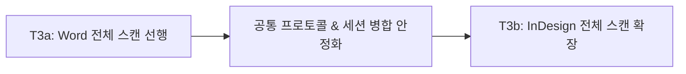

# AGY_ANSWER_TRANSLATION_MODE_T3.md: 트랙 C 번역 모드 T3(문서 전체 스캔) 아키텍처 및 설계 자문

## 1. 개요 및 핵심 아키텍처 원칙

T3(문서 전체 스캔)는 단일 문단 포커스 기반의 T1 세션 스파이크와 T2 단순 XLIFF export를 넘어, **"호스트 문서 전체의 구조화된 텍스트 수집 및 번역 세션화"**를 담당하는 핵심 인프라 단계입니다.

기존 코드베이스(`plugins/word/`, `plugins/indesign/`, `src-tauri/`, `src/`) 실측 분석을 바탕으로 수립한 4대 핵심 아키텍처 원칙은 다음과 같습니다:

1. **사용자 초안 절대 보존 (Zero Data Loss):** 전체 스캔 재실행 또는 에디터 동기화 시 기존에 사용자가 입력한 번역 초안(`targetDraft`), 수정 이력(`isUserEdited`), TM 제안 상태를 어떠한 경우에도 덮어쓰거나 유실하지 않는다.
2. **LLM 비관여 순수 로컬 파이프라인 (0-Token, 100% Local):** T3 전체 스캔은 QA 배치 분석(LLM 호출 수반)과 완전히 분리된 "문서 텍스트 추출 + 로컬 TM 매칭" 작업으로, 밀리초 단위로 완료되는 무비용 로컬 연산이다.
3. **Fail-Closed 온디맨드 무결성 검증:** 상시 전체 백그라운드 폴링으로 인한 에디터 부하(Word.run 충돌, InDesign COM UI 프리징)를 배제하고, 에디터 이벤트 기반 부분 감지와 Export/동기화 시점의 1회 전수 스냅샷 대조를 결합한다.
4. **단계적 전개 (T3a Word 선행 → T3b InDesign 후속):** 공통 프로토콜과 대시보드 병합 로직을 Word에서 먼저 검증한 후 InDesign ExtendScript/COM 계층으로 확장한다.

---

## 2. 세부 질문별 설계 결정 및 분석

### [질문 1] paragraphId 스킴을 T3에서 어떻게 통일할 것인가

#### 현상 분석 및 문제점
- **Word 현황:** 현재 `word-para-<contentHash 앞 12자>` 형태의 순수 콘텐츠 해시를 사용합니다([`document_listener.ts`](file:///D:/smartLinter/plugins/word/src/document_listener.ts#L303-L304)). 문서 내 물리적 위치 정보가 없어서 동일한 텍스트를 가진 복수 문단("주의", "목차", 빈 줄, 공통 헤더 등)이 존재할 경우 `snapshot_provider.ts`에서 `AMBIGUOUS`로 분류되어 식별이 불가능해집니다.
- **InDesign 현황:** `indesign-para-<storyId>-<paragraphIndex>` 형태의 위치 기반 식별자를 사용하며([`text_observer.jsx`](file:///D:/smartLinter/plugins/indesign/extendscript/text_observer.jsx#L310-L311)), 콘텐츠 해시는 별도 필드(`hash`)로 분리되어 있습니다.
- **T1 세그먼트 ID 계약:** T1 수정 결과 `segmentId = `${paragraphId}_${segmentIndex}_${paragraphHash}`` 규칙([`translationSessionStore.ts`](file:///D:/smartLinter/src/stores/translationSessionStore.ts#L96))이 확정되어 있습니다.

#### 설계 결정: Word의 위치 기반 합성 ID 도입 (`word-para-body-<index>-<hash12>`)
Word에서도 전체 스캔 시점에 확정되는 문서 순서 인덱스를 결합한 합성 ID 체계를 적용합니다.

```typescript
// Word T3 전체 스캔 시 생성 ID
const paragraphId = `word-para-body-${bodyIndex}-${contentHash.slice(0, 12)}`;

// InDesign T3 전체 스캔 시 생성 ID (기존 체계 유지)
const paragraphId = `indesign-para-${storyId}-${paragraphIndex}`;
```

#### T1 세그먼트 ID와의 정합성 및 단일 포커스 이벤트 연계
1. **세그먼트 고유성 보장:** `paragraphId`에 위치 정보(`bodyIndex`)가 포함됨으로써 동일 텍스트 문단들이라도 서로 다른 `segmentId`를 부여받아 XLIFF trans-unit 중복 및 세그먼트 충돌이 원천 방지됩니다.
2. **단일 포커스 이벤트 호환성:**
   - 단일 포커스 이벤트(`document_listener.ts`)가 발생했을 때, T3 전체 스캔이 이미 실행된 세션이라면 `translationSessionStore`는 `text` 및 `hash`를 대조하여 세션 내 세그먼트를 조회합니다.
   - 단일 이벤트에서 body 전체 인덱스를 매번 O(N)으로 구하지 못하더라도, `hash`와 최근 포커스 컨텍스트를 통해 세션 세그먼트와 안전하게 1:1 매핑됩니다.

---

### [질문 2] Word 스캔은 기존 인프라 확장인가, 신규인가

#### 설계 결정: 모듈 분리형 확장 (`document_scanner.ts` 신규 함수 추가)
기존 `queryLiveParagraphSnapshots`([`snapshot_provider.ts`](file:///D:/smartLinter/plugins/word/src/snapshot_provider.ts#L17))의 순회 패턴을 재사용하되, **전체 수집 전용 신규 함수 `enumerateAllDocumentParagraphs`를 독립 모듈로 분리**합니다.

#### 근거
1. **책임의 분리 (SRP):**
   - `queryLiveParagraphSnapshots`: 주어진 `paragraphIds`의 생존 여부(`FOUND`, `NOT_FOUND`, `AMBIGUOUS`)를 판별하는 **"사후 검증(Verification)"** 전용.
   - `enumerateAllDocumentParagraphs`: 문서 0번부터 N-1번 문단까지 순회하며 `ParagraphPayload[]`를 추출하는 **"전수 수집(Enumeration)"** 전용.
2. **성능 및 안전성:**
   - Word Office.js의 `context.document.body.paragraphs.load('text')` 및 1회 `context.sync()` 루프는 수천 문단이라도 100~300ms 이내에 완료됩니다.
   - 검증 로직과 수집 로직을 분리함으로써 기존의 Live Revert 및 Telemetry 경로에 대한 회귀 위험을 제로(0)로 만듭니다.

---

### [질문 3] InDesign 전체 열거를 어디까지 다룰 것인가

#### 설계 결정: (b) 모든 유효 스토리(`doc.stories`) 본문 수집 + 복합 요소 제외 및 메타데이터 통지
InDesign 문서의 복잡한 DOM 구조를 고려하여 1차 스코프를 명확히 정의하고, 누락 항목을 사용자에게 투명하게 알립니다.

```
[InDesign T3 수집 범위]
├── 수집 대상: doc.stories[*].paragraphs (본문 스토리, 독립 텍스트 프레임, 스레드된 프레임)
└── 제외 대상:
    ├── Table Cells (표 내부 문단) — 중첩 구조로 인한 오프셋/인덱스 왜곡 방지
    ├── Footnotes / Endnotes (각주/미주 문단)
    └── Overset / Unplaced Stories (프레임에 배치되지 않은 숨김 텍스트)
```

#### 제외 항목 통지 UX (T2 배너 패턴 재사용)
- 스캔 완료 시 백엔드/플러그인이 `ScanSummary` 메타데이터를 반환합니다:
  ```typescript
  export interface ScanSummary {
    totalStories: number;
    scannedParagraphs: number;
    skippedTablesCount: number;
    skippedFootnotesCount: number;
    lockedParagraphsCount: number;
  }
  ```
- 표나 각주가 스킵되었을 경우, 대시보드 번역 모드 상단에 T2의 `needs-validation` 배너와 동일한 시각적 패턴으로 안내를 띄웁니다:
  > **ℹ️ 문서 수집 완료 (일부 항목 제외)**
  > 본문 문단 45개를 수집했습니다. (표 내부 텍스트 2개, 각주 3개는 현재 지원 범위에서 제외되었습니다.)

---

### [질문 4] 스캔 결과와 기존 세션(T1 경로)의 병합 정책

#### 핵심 원칙: "사용자 초안 우선 비파괴적 병합 (Non-Destructive Upsert)"
사용자가 이미 번역 모드에서 작성한 `targetDraft` 및 상태는 스캔 재실행 시 절대 덮어쓰거나 삭제하지 않습니다.

#### 세그먼트 병합 매트릭스
| 상태 분류 | 조건 | 병합 처리 방식 | 비고 |
| :--- | :--- | :--- | :--- |
| **Case A. 기존 세그먼트 유지** | 동일 `paragraphId` + 동일 `sourceHash` | 기존의 `targetDraft`, `origin`, `isUserEdited`, `status`, `detectedAt`을 **100% 보존** | 스캔 결과로 덮어쓰기 절대 금지 |
| **Case B. 신규 세그먼트 추가** | 세션에 없는 새로운 문단 발견 | 로컬 TM 매칭 실행 후 `suggested` 또는 `untranslated`로 신규 등록 | `isUserEdited: false` |
| **Case C. 문서 내 텍스트 변경** | 동일 `paragraphId` + 달라진 `sourceHash` | 1) 기존 세그먼트: `status = 'needs-validation'`으로 전환하여 기존 번역 초안 보존<br>2) 신규 세그먼트: 변경된 텍스트로 신규 생성 | T1 불변 스냅샷 원칙 준수 |
| **Case D. 문서에서 삭제된 문단** | 세션에는 있으나 스캔 결과에 없음 | 1) 사용자 입력 있음(`isUserEdited: true`): 삭제하지 않고 `status = 'needs-validation'` 마킹 보존<br>2) 사용자 입력 없음: 세션에서 안전하게 정리(Prune) | 사용자 작업 결과물 유실 방지 |

#### 정렬 순서 (Ordering Policy)
스캔 시 반환되는 `documentOrderIndex`를 세그먼트 메타데이터에 기록하여, 대시보드 리스트 렌더링 및 XLIFF export 시 문서의 실제 물리적 순서대로 정렬되도록 개선합니다([`xliffExport.ts:27-46`](file:///D:/smartLinter/src/utils/xliffExport.ts#L27-L46)의 `detectedAt` 기반 임시 정렬 대체).

---

### [질문 5] 변경 감지·stale 판정 모델

#### 설계 결정: (a) 온디맨드 1회 전수 재검증 + 에디터 이벤트 기반 부분 감지 (Fail-Closed)
T1/T2에서 확립된 검증 철학을 그대로 계승합니다.

1. **상시 전체 폴링 금지:** Office.js와 InDesign COM 환경에서 문서를 상시 주기적으로 전수 폴링하는 것은 에디터 스레드 경합 및 심각한 렉을 유발하므로 수행하지 않습니다.
2. **에디터 이벤트 기반 실시간 부분 감지:** 작업 중 사용자가 에디터에서 특정 문단을 수정하면, 기존 `document_listener` / `text_observer`가 발행하는 단일 텔레메트리를 통해 해당 세그먼트만 즉시 `needs-validation`으로 전이됩니다.
3. **Export 시점 1회 전수 스냅샷 재검증 (Pre-Export Validation):**
   - 사용자가 "Export XLIFF"를 클릭하면, Word의 `queryLiveParagraphSnapshots` / InDesign의 `getLiveParagraphSnapshots`를 1회 호출하여 세션 내 모든 문단의 해시를 라이브 문서와 대조합니다.
   - 하나라도 변경되었거나 누락된 문단이 있으면 `needs-validation`으로 마킹하고 Export를 차단(Fail-Closed)하며 사용자에게 변경 사실을 알립니다.

---

### [질문 6] 스캔 트리거·진행률 UX와 취소

#### QA 배치 스캔 vs 번역 세션 수집의 분리
- **QA 배치 스캔:** 문단별 LLM 프롬프트 생성, 추론, JSON 파싱 등 긴 시간과 API 비용이 소요되는 무거운 비동기 작업 → 기존 `BatchProgressBar.tsx` 및 `configStore.startBatchScan` 유지.
- **번역 모드 T3 스캔:** 호스트 DOM 텍스트 읽기 + 인메모리 TM 일치 조회로 구성된 **순수 100% 로컬 연산 (LLM 전혀 미사용, 0 Token)**. 통상 500문단 기준 0.5초 이내에 완료됩니다.

#### UX 및 트리거 설계
1. **스토어 분리:** `translationSessionStore`에 번역 모드 전용 액션(`scanFullDocument()`, `isScanning`, `scanStats`)을 신설합니다.
2. **인라인 피드백 UI:** 번역 모드 툴바의 "문서 전체 수집" 버튼 클릭 시, 모달 팝업 대신 버튼 내 인라인 스피너와 번역 목록 상단 상태 표시("48개 문단 수집 완료, TM 12개 자동 매칭됨")로 신속하게 완료 피드백을 제공합니다.
3. **취소(`abort`) 처리:** 순수 로컬 수집은 거의 즉시 끝나므로 복잡한 비동기 작업 취소 핸들러보다는 10초 타임아웃 가드와 스캔 실패 시의 상태 복구(Rollback to previous state)를 중심으로 구현합니다.

---

### [질문 7] 호스트 범위와 착수 순서

#### 설계 결정: 2단계 분할 착수 권장 (T3a Word 선행 → T3b InDesign 후속)
Claude의 분석과 제안에 **전적으로 동의**합니다.



1. **T3a (Word 선행):**
   - Word는 `body.paragraphs` 순회 인프라와 WebSocket 통신이 이미 검증되어 있습니다.
   - Word를 통해 프로토콜(`ENUMERATE_DOCUMENT_REQUEST/RESPONSE`), 대시보드 세그먼트 병합 정책, UI 인라인 프로그레스, 문서 순서 정렬을 빠르게 완성하고 통합 테스트를 통과시킵니다.
2. **T3b (InDesign 후속):**
   - T3a에서 확정된 인터페이스 규격에 맞춰 InDesign ExtendScript(`document_scanner.jsx` 또는 `smartlinter_daemon.jsx` 확장) 및 Rust COM(`indesign_com.rs`) DoScript 연동을 구현합니다.
   - 호스트별 복잡도를 격리하여 안정성을 극대화합니다.

---

## 3. 프로토콜 및 데이터 인터페이스 규격 (T3 요약)

### 3.1 호스트 브릿지 신규 메시지 정의 (`shared/protocol/types.ts`)

```typescript
/** 전체 문서 스캔 요청 */
export interface EnumerateDocumentRequest {
  requestId: string;
  editorType: EditorType;
  options?: {
    includeLocked?: boolean;
  };
}

/** 수집된 개별 문단 엔트리 */
export interface ScannedParagraphEntry {
  paragraphId: string;
  text: string;
  hash: string;
  documentOrderIndex: number;
  isLocked?: boolean;
  storyId?: string; // InDesign
}

/** 전체 문서 스캔 응답 */
export interface EnumerateDocumentResponse {
  requestId: string;
  sourceDocumentName: string;
  paragraphs: ScannedParagraphEntry[];
  summary: {
    totalCount: number;
    skippedCount: number;
    warnings?: string[];
  };
}
```

---

## 4. 최종 권고 및 다음 단계

| 단계 | 작업 내용 | 영향 받는 영역 |
| :--- | :--- | :--- |
| **1단계: T3a Word 전체 스캔** | 1. `plugins/word/src/document_scanner.ts` 구현<br>2. `word-para-body-<index>-<hash>` ID 생성<br>3. `translationSessionStore.scanFullDocument()` 병합 로직 및 문서 순서 정렬 구현 | `plugins/word/`, `src/stores/` |
| **2단계: T3a 검증 및 UI 완성** | 1. 번역 모드 툴바 전체 수집 버튼 및 피드백 연결<br>2. 사용자 초안 보존 단위 테스트 및 XLIFF export 정렬 검증 | `src/components/`, `src/utils/` |
| **3단계: T3b InDesign 확장** | 1. InDesign ExtendScript `enumerateStories` 스크립트 작성<br>2. `src-tauri/src/indesign_com.rs` COM DoScript 배선<br>3. InDesign 환경 전체 스캔 및 제외 항목 통지 검증 | `plugins/indesign/`, `src-tauri/` |
