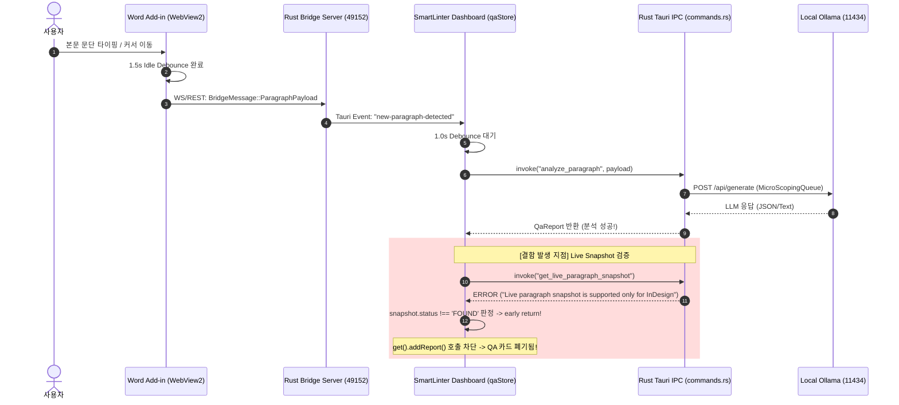

# Word 연결 성공 후 "로컬모델 동작 안 함" 원인 분석 및 진단 리포트

## 1. 개요 및 핵심 결론 (Executive Summary)

Word 브릿지 연결(`connected: true`, `activeEditor: Word`) 및 Ollama 데몬(`127.0.0.1:11434`, `exaone3.5:7.8b` 로드됨)이 정상인 상태에서 사용자가 **"로컬모델 동작 안 함"**을 겪는 원인을 분석한 결과, **코드 상에 구조적인 치명적 파이프라인 단절(P0)**과 **모델 동기화 기본값 불일치(P1)**가 확인되었습니다.

### 핵심 진단 결과
1. **[P0 - 치명적 파이프라인 차단] `get_live_paragraph_snapshot`의 Word 미지원으로 인한 QA Card 100% 드롭**:
   - Word에서 텍스트 변경이 감지되면 `analyze_paragraph` 커맨드가 호출되어 **Ollama 로컬 LLM 추론 자체는 정상적으로 수행되고 QA Report도 반환**됩니다.
   - 그러나 대시보드 프론트엔드([`qaStore.ts`](file:///D:/data/dev/App/SmartLinter/src/stores/qaStore.ts#L964-L972))는 리포트를 UI 카드에 등록하기 직전, 문단이 여전히 유효한지 검증하기 위해 `get_live_paragraph_snapshot` 커맨드를 호출합니다.
   - Rust 백엔드([`commands.rs`](file:///D:/data/dev/App/SmartLinter/src-tauri/src/commands.rs#L376-L378))에서 이 커맨드가 `if session.editor_type != EditorType::InDesign`으로 하드코딩되어 있어 Word 연결 시 `status: 'ERROR'`를 반환합니다.
   - 프론트엔드는 `snapshot.status !== 'FOUND'` 조건을 만나 **생성된 QA 리포트를 즉시 폐기(early return)**하므로 **화면에 QA 카드가 하나도 나타나지 않는 현상**이 발생합니다.

2. **[P1 - 모델 불일치 및 Standby 고정] 기본 모델 `qwen2.5:7b` vs 실제 설치 모델 `exaone3.5:7.8b`**:
   - `MicroScopingQueue`와 프론트엔드 `configStore`의 기본 모델 상수가 `qwen2.5:7b`로 하드코딩되어 있습니다.
   - 사용자가 SmartLinter 환경설정(우측 상단 톱니바퀴)에서 `exaone3.5:7.8b`를 명시적으로 선택하지 않았거나 `localStorage`가 초기화된 상태라면, Ollama에 없는 `qwen2.5:7b`를 호출하여 **Ollama 404 Not Found** 에러가 발생하고 상단 배지가 **`Standby`**에 고정됩니다.

---

## 2. 질문 1: Word QA 분석 파이프라인 IPC 커맨드 체인 분석 (vs InDesign 비교)

### 2.1 전체 파이프라인 흐름도



### 2.2 Word 경로 vs InDesign 경로 상세 비교

| 단계 / 기능 | InDesign 경로 | Word 경로 | 차이점 및 영향 |
| :--- | :--- | :--- | :--- |
| **1. 텔레메트리 감지** | ExtendScript 데몬 polling / 이벤트 | Office.js `onSelectionChanged` (1.5s debounce) | Word는 샌드박스 웹 환경으로 1.5초 idle 후 WebSocket 전송 |
| **2. 브릿지 수신 & 이벤트** | WS/COM -> `new-paragraph-detected` | WS/REST -> `new-paragraph-detected` | 동일한 Tauri 이벤트(`new-paragraph-detected`) 발생 |
| **3. LLM 분석 호출** | `invoke('analyze_paragraph')` | `invoke('analyze_paragraph')` | 동일한 Rust 커맨드 및 `MicroScopingQueue` 실행 |
| **4. 라이브 스냅샷 검증 (`get_live_paragraph_snapshot`)** | **정상 동작** (COM 스크립트로 InDesign 현재 텍스트 조회 -> `status: 'FOUND'`) | **실패 / 차단** (`commands.rs:376`에서 `editor_type != InDesign` 에러 반환 -> `status: 'ERROR'`) | **[치명적 차이] InDesign은 통과하여 카드가 뜨지만, Word는 여기서 리포트가 폐기됨** |
| **5. 일괄 유효성 검증 (`validateLiveCards`)** | `get_live_paragraph_snapshots` 정상 동작 | `commands.rs:398`에서 `editor_type != InDesign` 에러 반환 | 복원된 이전 카드가 영구적으로 `restoring` 상태로 숨겨짐 |
| **6. 본문 치환 실행 (`send_replacement_command`)** | COM 직접 실행 (`indesign_com::execute_replacement`) | WS 역방향 메시지 전송 (`BridgeMessage::ReplacementCommand`) | Word는 WS 수신 후 `replacement_executor.ts`로 치환 처리 (지원됨) |
| **7. 본문 위치 이동 (`locate_paragraph_in_editor`)** | COM 직접 실행 (`indesign_com::locate_paragraph`) | 미지원 (`commands.rs:355`에서 InDesign만 허용) | 카드 클릭 시 Word 본문 해당 위치로 포커스/선택 이동 불가 |

---

## 3. 질문 2: 과거 유사 사고 1~3의 Word 환경 재현 가능성 검토

### 사고 1: `analyze_paragraph` / `execute_ai_command` 커맨드 미등록 및 Mock 폴백
- **코드 검토 결과**:
  - [`main.rs`](file:///D:/data/dev/App/SmartLinter/src-tauri/src/main.rs#L78-L79)의 `tauri::generate_handler!`에 `commands::analyze_paragraph`와 `commands::execute_ai_command`는 정상 등록되어 있습니다.
  - 또한 `analyze_paragraph`와 `execute_ai_command` 내부에는 `editor_type` 제한이 없습니다.
- **Word 영향도**:
  - 커맨드 자체는 등록되어 실행되지만, **Phase 4에서 새로 추가된 후속 커맨드(`get_live_paragraph_snapshot`)가 Word를 배제**하고 있어, 결과적으로 사용자가 보기에 **"LLM 분석이 전혀 동작하지 않는 것처럼 보이는 현상"이 과거 사고 1과 완전히 동일하게 재현**됩니다.

### 사고 2: Task 19 시나리오 1 (`MicroScopingQueue` 리셋 및 `syncSelectedModel()` 동기화 누락)
- **코드 검토 결과**:
  - Rust 백엔드 시작 시 [`main.rs:60`](file:///D:/data/dev/App/SmartLinter/src-tauri/src/main.rs#L60)에서 `MicroScopingQueue::new(..., DEFAULT_MODEL_NAME)`로 생성되며, `DEFAULT_MODEL_NAME`은 `"qwen2.5:7b"`입니다.
  - 프론트엔드 [`App.tsx:44`](file:///D:/data/dev/App/SmartLinter/src/App.tsx#L44)에서 `useEffect`로 `void syncSelectedModel()`을 호출하여 `localStorage`의 선택 모델을 백엔드 큐에 주입합니다.
- **Word 영향도**:
  - Word 환경의 독립된 브라우저/웹뷰나 초기 실행 시 `localStorage`에 저장된 모델이 없으면 기본값인 `qwen2.5:7b`가 선택됩니다.
  - 사용자의 로컬 머신에는 `exaone3.5:7.8b`만 있고 `qwen2.5:7b`가 없는 경우:
    1. 백엔드가 Ollama에 `qwen2.5:7b` 요청 -> **Ollama 404 (model not found)** 반환.
    2. `analyze_paragraph` 호출 시 `LLM QA inference error: ...` 발생.
    3. UI에 "AI 분석에 실패했습니다. Ollama 연결 상태를 확인한 뒤 다시 시도해 주세요." 에러 메시지 표시.

### 사고 3: LLM 상태 배지 Standby 고정 (`check_ollama_health`)
- **코드 검토 결과**:
  - [`commands.rs:444-455`](file:///D:/data/dev/App/SmartLinter/src-tauri/src/commands.rs#L444-L455)의 `check_ollama_health`는 선택된 모델이 Ollama의 `/api/tags` 목록에 실제로 존재하는지 확인합니다.
  - 선택 모델이 목록에 없으면 `health.is_alive = false`, `message = "Selected Ollama model 'qwen2.5:7b' is not installed"`를 반환합니다.
  - 프론트엔드 헤더([`Header.tsx:147`](file:///D:/data/dev/App/SmartLinter/src/components/layout/Header.tsx#L147))는 `llmAlive === false`일 때 **`[!] Standby`** (황색 배지)를 표시합니다.
- **Word 영향도**:
  - 사고 2와 연계되어 사용자가 Settings 모달에서 모델을 `exaone3.5:7.8b`로 지정하기 전까지 배지가 Standby로 고정됩니다.

---

## 4. 질문 3: "동작 안 함" 실패 지점 후보 우선순위 및 원샷 진단 가이드

### 4.1 실패 지점 후보 우선순위 (Likelihood Ranking)

```
[P0] get_live_paragraph_snapshot의 Word 미지원으로 인한 결과 드롭 (확률: 95%)
 └── 증상: LLM 추론은 도는데 UI에 카드가 아예 안 뜸 / 콘솔에 snapshot 관련 에러 기록

[P1] Ollama 모델명 불일치 (qwen2.5:7b vs exaone3.5:7.8b) (확률: 70%)
 └── 증상: 상단 LLM 배지가 "Standby"로 표시됨 / "AI 분석에 실패했습니다" 에러

[P2] Word Taskpane 텔레메트리 미발송 (이벤트 미발생/타이머 미도달) (확률: 30%)
 └── 증상: 본문 클릭/수정 후 1.5초 이상 대기하지 않음 / activeParagraph가 비어있음

[P3] 하단 AI Command Bar 타겟 문단 부재 (확률: 15%)
 └── 증상: 하단 자연어 명령 시 "기본 선택 문단 텍스트가 없습니다"로 동작
```

---

### 4.2 사용자 확인 및 원샷 배제 진단 가이드

사용자에게 복잡한 질문을 여러 번 하지 않고, **한 번의 확인(또는 스크린샷 1장 / 콘솔 로그 1회 복사)**으로 후보를 즉시 판별하는 방법입니다.

#### [진단 1] UI 헤더 배지 상태 확인 (스크린샷 요청)
대시보드 상단 헤더의 2개 배지 상태를 확인합니다:
1. **에디터 배지**:
   - `[W] Word 연결됨 (문서명)` (초록색) -> 브릿지 정상.
   - `에디터 대기 중` (회색) -> 브릿지 클라이언트 미연결.
2. **LLM 배지**:
   - `exaone3.5:7.8b [42ms / Ready]` (보라색) -> **후보 P1 배제 (LLM 정상 연결됨)**.
   - `qwen2.5:7b [!] Standby` (황색) -> **후보 P1 확정 (Settings에서 모델 선택 필요)**.

---

#### [진단 2] 브라우저/웹뷰 DevTools 콘솔 로그 (F12) 확인
SmartLinter 대시보드 창에서 `F12`를 눌러 Console 탭을 확인했을 때:

1. **`QA live paragraph snapshot failed` 또는 `Live paragraph snapshot is supported only for InDesign` 문구가 보이는 경우**:
   - **판정**: **후보 P0 (Snapshot 가드 결함) 확정**.
   - **의미**: 로컬 모델은 이미 문단을 완벽하게 분석하여 결과를 보냈으나, Word용 Snapshot API가 없어 UI 표시 직전에 폐기된 것입니다.

2. **`LLM QA inference error: ... 404` 또는 `AI 분석에 실패했습니다` 문구가 보이는 경우**:
   - **판정**: **후보 P1 (모델 404 에러) 확정**.
   - **조치**: 우측 상단 톱니바퀴(Settings) -> Ollama Model 드롭다운에서 `exaone3.5:7.8b`를 선택하면 해결.

3. **아무런 로그도 찍히지 않는 경우**:
   - **판정**: **후보 P2 (텔레메트리 미수신)**.
   - **조치**: Word 본문에서 텍스트를 입력하고 2초 이상 대기(Idle Debounce)해야 이벤트가 전달됩니다.

---

### 4.3 진단 및 디버깅을 위한 핵심 로그 삽입 지점 (참고용)

향후 진단용 로깅이나 패치 시 확인할 주요 위치입니다:

1. **프론트엔드 스냅샷 에러 로그 지점**:
   - 파일: [`src/stores/qaStore.ts:964-973`](file:///D:/data/dev/App/SmartLinter/src/stores/qaStore.ts#L964-L973)
   ```typescript
   // 디버깅 포인트: snapshot 결과 확인
   console.log('[DEBUG-QA] Snapshot result:', snapshot, 'payloadHash:', payload.hash);
   ```

2. **Rust 백엔드 Snapshot 커맨드 게이트 지점**:
   - 파일: [`src-tauri/src/commands.rs:376`](file:///D:/data/dev/App/SmartLinter/src-tauri/src/commands.rs#L376)
   ```rust
   // 현재 코드: Word인 경우 무조건 Err 반환
   if session.editor_type != EditorType::InDesign {
       return Err("Live paragraph snapshot is supported only for InDesign".to_string());
   }
   ```

3. **Word 플러그인 텔레메트리 발송 지점**:
   - 파일: [`plugins/word/src/document_listener.ts:187`](file:///D:/data/dev/App/SmartLinter/plugins/word/src/document_listener.ts#L187)
   ```typescript
   // 디버깅 포인트: Word에서 문단이 브릿지로 실제 전송되는지 확인
   console.log('[DEBUG-WORD] Dispatched paragraph payload:', payload);
   ```

---

## 5. 요약 및 권장 해결 방안 (분석 결론)

1. **현상 요약**:
   - 사용자가 "로컬모델이 동작 안 한다"고 느낀 근본 원인은 로컬 LLM(Ollama) 자체가 고장 난 것이 아니라, **LLM이 분석한 결과를 UI 카드로 등록하는 길목(`get_live_paragraph_snapshot`)이 Word 환경에서 에러를 뿜으며 조용히 리턴(드롭)하고 있기 때문**입니다.
2. **해결 방향**:
   - **단기/즉시 해결 (사용자 설정)**: 상단 LLM 배지가 `Standby`라면 Settings에서 `exaone3.5:7.8b`를 선택하도록 안내.
   - **근본 코드 해결**: `qaStore.ts`에서 Word 에디터 연결 시에는 InDesign 전용 COM 스냅샷 검증을 건너뛰거나(Word 브릿지 메모리 스냅샷 허용), Rust의 `get_live_paragraph_snapshot`에서 Word 세션일 경우 마지막 캡처된 해시/텍스트를 반환하도록 지원하는 패치 필요.
