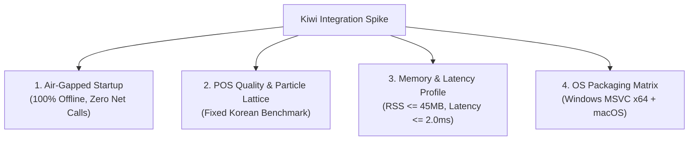

# Concrete Design Specification: Particle-Whitelist Rule Family (`particle.pronoun`), Multi-Candidate Schema, and Kiwi Integration Spike Plan

> **Document Type**: Technical Design Specification (Design-Only, No Source File Modifications)  
> **Target File**: `AGY_DESIGN_PARTICLE_WHITELIST_AND_KIWI_SPIKE.md`  
> **Reference Request**: [`DESIGN_REQUEST_PARTICLE_WHITELIST_AND_KIWI_SPIKE.md`](DESIGN_REQUEST_PARTICLE_WHITELIST_AND_KIWI_SPIKE.md)  
> **Related Implementations**: [`src-tauri/src/deterministic_qa/mod.rs`](src-tauri/src/deterministic_qa/mod.rs), [`src-tauri/src/ai/qa_parser.rs`](src-tauri/src/ai/qa_parser.rs), [`shared/protocol/types.ts`](shared/protocol/types.ts), [`src/types/qa.ts`](src/types/qa.ts), [`src/components/qa/QACardItem.tsx`](src/components/qa/QACardItem.tsx)

---

## Executive Summary & Architectural Alignment

Based on the scoping decisions confirmed in `DESIGN_REQUEST_PARTICLE_WHITELIST_AND_KIWI_SPIKE.md`, this specification establishes a parallel, design-first blueprint across three synchronized tracks:

1. **Part A: Dedicated `particle.pronoun` Rule Family**  
   Rather than treating Korean particle agreement as literal Tier-1 dictionary entries in `dictionary.json`, we construct a dedicated rule family with its own confidence model (`confidence = 0.92`, `severity = High`), strict word boundaries (`has_strict_trailing_boundary`), and expanded protected span guardrails (quoted text, code/verbatim examples, technical identifiers). We evaluate Codex's 10 closed stems across 3 core particle pairs (은/는, 이/가, 을/를) with an exhaustive lexical trap audit.
2. **Part B: Finalized Multi-Candidate `QaIssue` Schema & Merge Invariants**  
   We reconcile the schema into a fully backward-compatible structure with `candidates: Option<Vec<QaCandidate>>` (retaining `suggested_segment` as the primary active selection for legacy consumers). We specify the exact `merge()` behavior: singleton deterministic dedup remains unchanged, while multi-candidate issues union distinct same-span LLM suggestions into the card's candidate list. agy confirms zero objections to this merge specification.
3. **Part C: Scoped Kiwi Integration Spike Plan**  
   We specify an air-gapped, zero-runtime-download integration spike for `kiwi-rs`. Models are pinned and bundled in Tauri application resources. We define quantitative pass/fail gates (offline startup, $\le 2.0\text{ ms}$ latency, $\le 45\text{ MB}$ RSS, $\ge 98\%$ POS accuracy). We confirm that Part A is an enduring foundational fast-path (L1 cache) that Kiwi extends rather than replaces.

---

# Part A: Concrete Design for the `particle.pronoun` Rule Family

## A.1 Guardrail Code Design & Protected Spans Expansion

### A.1.1 Identified Gaps in the Current Engine
The current engine in `src-tauri/src/deterministic_qa/mod.rs` uses a baseline `protected_spans()` scanner that covers only:
- URLs (`http://`, `https://`)
- Markdown inline code (`` `...` ``)
- Template variables (`{{...}}`)
- HTML tags (`<...>`)

Furthermore, the general dictionary scanner uses `has_trailing_boundary()` which permits trailing attachments if the text matches any entry in `PARTICLES`. While acceptable for standard typo dictionaries, this is **unacceptable for particle agreement rules**, where sub-token matching against compound identifiers or unintended trailing particles causes boundary leaks.

### A.1.2 Scope of Expanded Protections
For the `particle.pronoun` rule family, we introduce an enhanced span protection parser (`particle_protected_spans`) and strict boundary gating:

1. **Quoted & Bracketed Content ("Quoted / Verbatim Spans")**:
   - **Korean Guillemets / Double Quotes**: `《...》`, `〈...〉`, `「...」`, `『...』`, `【...】`
   - **Western Quotes**: ASCII double quotes (`"..."`), ASCII single quotes (`'...'`), Unicode curly quotes (`“...”`, `‘...’`, `«...»`)
   - **Bracketed Literals / UI Titles**: `[...]`, `(...)` when containing exact token matches or title strings
2. **Plain Technical Identifiers & Syntax Tokens**:
   - **Casing Patterns**: CamelCase (`userId`, `getAccount`), PascalCase (`UserResponse`), snake_case (`user_id`), kebab-case (`app-config`)
   - **Path & Property Separators**: Tokens adjoining `.`, `/`, `\`, `::`, `->` (e.g. `user.name`, `api/v1/user`, `std::env`)
   - **Prefix / Sigil Identifiers**: Tokens starting with `@` (mentions), `#` (channels/tags), `$` (variables), `%` (format specifiers)
   - **Numbers & Units**: Alphanumeric combinations adjoining digits or measurement units (e.g. `그1`, `우리2호`, `100MB`)
3. **Strict Boundary Enforcement**:
   - Particle rules must use `has_strict_trailing_boundary(text, end)` (requiring a non-word character or string end) rather than the relaxed `has_trailing_boundary(text, end)`.

### A.1.3 Architectural Composition & Code Design
To preserve 100% backward compatibility with the 5 existing Tier-1 and Tier-2 categories in `dictionary.json` (such as `calendar.weekday`, `loanword.spelling`, `job_title.spelling`), the particle detector is implemented either in a dedicated sibling module (`src-tauri/src/deterministic_qa/particle.rs`) or as a distinct execution step within `deterministic_qa/mod.rs`.

```rust
// Architecture sketch for particle protection scanner (src-tauri/src/deterministic_qa/particle.rs)

use std::ops::Range;

/// Scans text for spans that must never be modified by particle agreement rules.
pub fn particle_protected_spans(text: &str) -> Vec<(usize, usize)> {
    let mut spans = Vec::new();
    let chars: Vec<(usize, char)> = text.char_indices().collect();
    let len = text.len();

    // 1. Existing baseline protected spans (URLs, backticks, templates, HTML)
    spans.extend(crate::deterministic_qa::protected_spans(text));

    // 2. Quoted text & brackets parser
    let quote_pairs = [
        ('"', '"'),
        ('\'', '\''),
        ('“', '”'),
        ('‘', '’'),
        ('《', '》'),
        ('〈', '〉'),
        ('「', '」'),
        ('『', '』'),
        ('【', '】'),
        ('«', '»'),
    ];

    for &(open, close) in &quote_pairs {
        let mut in_quote = false;
        let mut start_byte = 0;
        for &(byte_idx, c) in &chars {
            if !in_quote && c == open {
                in_quote = true;
                start_byte = byte_idx;
            } else if in_quote && c == close {
                in_quote = false;
                let end_byte = byte_idx + c.len_utf8();
                spans.push((start_byte, end_byte));
            }
        }
    }

    // 3. Technical identifier & code symbol detector
    // Scans words containing '.', '/', '_', '-', '@', '#', '$' or mixed alphanumeric/Latin characters
    let mut word_start: Option<usize> = None;
    for (i, &(byte_idx, c)) in chars.iter().enumerate() {
        let is_ident_char = c.is_ascii_alphanumeric() || ('가'..='힣').contains(&c) || matches!(c, '_' | '-' | '.' | '/' | '@' | '#' | '$' | ':');
        
        if is_ident_char {
            if word_start.is_none() {
                word_start = Some(byte_idx);
            }
        } else if let Some(start) = word_start {
            let end = byte_idx;
            let slice = &text[start..end];
            if is_plain_identifier_or_symbol(slice) {
                spans.push((start, end));
            }
            word_start = None;
        }
    }
    if let Some(start) = word_start {
        let slice = &text[start..];
        if is_plain_identifier_or_symbol(slice) {
            spans.push((start, text.len()));
        }
    }

    // Normalize and merge overlapping spans
    merge_spans(spans)
}

fn is_plain_identifier_or_symbol(token: &str) -> bool {
    // Exclude if it contains non-Hangul technical syntax
    token.contains(['_', '-', '.', '/', '@', '#', '$', ':'])
        // Or is mixed Latin/ASCII with Hangul (e.g. "그Service", "App우리")
        || (token.chars().any(|c| c.is_ascii_alphabetic()) && token.chars().any(|c| ('가'..='힣').contains(&c)))
        // Or contains numeric digits attached to pronouns (e.g. "우리1")
        || token.chars().any(|c| c.is_ascii_digit())
}

fn merge_spans(mut spans: Vec<(usize, usize)>) -> Vec<(usize, usize)> {
    if spans.is_empty() {
        return spans;
    }
    spans.sort_unstable_by_key(|s| s.0);
    let mut merged = Vec::with_capacity(spans.len());
    let mut current = spans[0];

    for next in spans.into_iter().skip(1) {
        if next.0 <= current.1 {
            current.1 = current.1.max(next.1);
        } else {
            merged.push(current);
            current = next;
        }
    }
    merged.push(current);
    merged
}
```

---

## A.2 Exhaustive Typo Table for the 10 Closed Stems

We evaluate all 10 candidate stems selected by the user (`그들`, `우리`, `너희`, `그`, `그녀`, `이것`, `그것`, `저것`, `누구`, `무엇`) against the 3 pilot particle pairs:
- **Topic Particle**: `은` (after 받침) vs `는` (after 받침 없음)
- **Subject Particle**: `이` (after 받침) vs `가` (after 받침 없음)
- **Object Particle**: `을` (after 받침) vs `를` (after 받침 없음)

### A.2.1 Stem Batchim Status & Typo Matrix

| Stem | Meaning | Final Syllable | Final Coda (받침) | Correct Form (은/는) | Typo: 은/는 | Correct Form (이/가) | Typo: 이/가 | Correct Form (을/를) | Typo: 을/를 |
| :--- | :--- | :---: | :---: | :---: | :---: | :---: | :---: | :---: | :---: |
| **`그들`** | They | `들` | **Yes** (`ㄹ`, Coda 8) | `그들은` | **`그들는`** | `그들이` | **`그들가`** | `그들을` | **`그들를`** |
| **`우리`** | We / Us | `리` | **No** (Coda 0) | `우리는` | **`우리은`** | `우리가` | **`우리이`** | `우리를` | **`우리을`** |
| **`너희`** | You (pl.) | `희` | **No** (Coda 0) | `너희는` | **`너희은`** | `너희가` | **`너희이`** | `너희를` | **`너희을`** |
| **`그녀`** | She | `녀` | **No** (Coda 0) | `그녀는` | **`그녀은`** | `그녀가` | **`그녀이`** | `그녀를` | **`그녀을`** |
| **`이것`** | This | `것` | **Yes** (`ㅅ`, Coda 19) | `이것은` | **`이것는`** | `이것이` | **`이것가`** | `이것을` | **`이것를`** |
| **`그것`** | That | `것` | **Yes** (`ㅅ`, Coda 19) | `그것은` | **`그것는`** | `그것이` | **`그것가`** | `그것을` | **`그것를`** |
| **`저것`** | That (far) | `것` | **Yes** (`ㅅ`, Coda 19) | `저것은` | **`저것는`** | `저것이` | **`저것가`** | `저것을` | **`저것를`** |
| **`무엇`** | What | `엇` | **Yes** (`ㅅ`, Coda 19) | `무엇은` | **`무엇는`** | `무엇이` | **`무엇가`** | `무엇을` | **`무엇를`** |
| **`누구`** | Who | `구` | **No** (Coda 0) | `누구는` | **`누구은`** | `누가` / `누구가` | **`누구이`** | `누구를` | **`누구을`** |
| **`그`** | He / That | `그` | **No** (Coda 0) | `그는` | **`그은`** *(TRAP)* | `그가` | **`그이`** *(TRAP)* | `그를` | **`그을`** *(TRAP)* |

---

### A.2.2 Lexical Trap & Linguistic Risk Analysis

Every stem has been audited against modern Korean morphology, verb conjugations, and homographs:

```
┌────────────────────────────────────────────────────────────────────────────────────────┐
│                              STEM SAFETY AUDIT SPECTRUM                                │
│                                                                                        │
│  [100% Mathematically Safe] ────────▶ [Safe with Quote Guard] ───▶ [CRITICAL TRAPS]   │
│  - 그들, 우리, 너희, 그녀                 - 이것, 그것, 저것, 무엇        - 그 (DO NOT SHIP)    │
│  - Zero homographs                     - Quoted titles / IDs           - Verb '긋다' collision│
│  - Impossible non-words                - Guardrails prevent FPs        - Noun '그이' collision│
└────────────────────────────────────────────────────────────────────────────────────────┘
```

#### 1. Safe Closed Stems (`그들`, `우리`, `너희`, `그녀`, `이것`, `그것`, `저것`, `무엇`)
- **`그들` / `우리` / `너희` / `그녀`**:
  - `그들는`, `그들가`, `그들를` do not exist in any Korean dictionary. There is no verb root `그들-`.
  - While `우리다` (to brew) exists, its valid conjugations are `우린`, `우려`, `우리고`, `우리면`. The forms `우리은`, `우리이`, `우리을` are phonologically impossible non-words.
  - `그녀은`, `그녀이`, `그녀을` are impossible non-words.
- **`이것` / `그것` / `저것` / `무엇`**:
  - Typo forms ending in `것는`, `것가`, `것를`, `무엇는`, `무엇가`, `무엇를` are 100% non-words.
  - *Risk Flagged by Codex*: Demonstratives frequently appear in book titles, UI labels, or quoted strings (e.g. `《그것이 알고싶다》`, `"이것은 샘플입니다"`). Protected by Section A.1's quote guardrail.

#### 2. Nuanced Stem: `누구`
- `누구은` $\to$ `누구는` (100% safe non-word).
- `누구을` $\to$ `누구를` (100% safe non-word).
- `누구이`: In standard Korean, `누구 + 가` undergoes an irregular morphological contraction to **`누가`** (or colloquial `누구가`). If `누구이` is encountered, the grammatically standard single replacement is **`누가`**.

#### 3. High-Risk Trap Stem: `그` (RECOMMENDATION: Exclude from Pilot Typo Table)
- **Trap 1 (`그은`)**: `그은` is the standard past adnominal conjugation of the verb **`긋다`** (to draw a line).
  - *Sentence*: `"사용자가 밑줄을 **그은** 항목을 확인합니다."` (Checking the item where the user drew an underline).
  - *Naive Rule*: Corrupts `"그은"` $\to$ `"그는"`, creating an egregious false positive: `"밑줄을 그는 항목"`.
- **Trap 2 (`그이`)**: `그이` is a standard, high-frequency Korean pronoun meaning **"that person"** or **"spouse / husband"** (*그이가 돌아왔다* = My husband has returned).
  - *Naive Rule*: Corrupts `"그이"` $\to$ `"그가"`, breaking valid Korean text.
- **Trap 3 (`그을`)**: Bound root for `그을다` / `그을리다` (to scorch).
- **Disposition**: Per the strict rule that *any failing stem gets removed from the pilot rather than explained away*, **`그` must be excluded from the deterministic pilot table** and deferred to Kiwi morphological parsing.

---

## A.3 Confidence & Provenance Model

The `particle.pronoun` rule family must **not** inherit the blanket `0.98` confidence or the generic reason string `"Built-in deterministic typo dictionary match (tier 1)"`.

### A.3.1 Explicit Provenance & Metadata Contract
When a particle violation is detected, `QaIssue` is populated as follows:

```rust
// Construction of a particle.pronoun QaIssue
QaIssue {
    category: "grammar.particle.pronoun".to_string(),
    original_segment: typo.to_string(),
    suggested_segment: correction.to_string(),
    reason: format!(
        "대명사 '{stem}' 뒤 조사 호응 오류 (받침 '{batchim_label}'에 따라 '{correction}' 표기가 올바릅니다).",
        stem = stem,
        batchim_label = if has_batchim { "있음" } else { "없음" },
        correction = correction
    ),
    severity: QaSeverity::High,
    start_offset: Some(utf16_start),
    end_offset: Some(utf16_end),
    provenance: Some("deterministic".to_string()),
    confidence: Some(0.92), // Corpus-earned pilot confidence (distinct from Tier-1 0.98)
    rule_id: Some(format!("grammar.particle.pronoun.{stem}.{typo}")),
    conflict_group_id: None,
    candidates: None, // Singleton confident fix in Phase 1
}
```

- **`category`**: `"grammar.particle.pronoun"` (Clear semantic domain).
- **`rule_id`**: `"grammar.particle.pronoun.<stem>.<typo>"` (e.g. `grammar.particle.pronoun.우리.우리은`).
- **`confidence`**: `0.92` (Reflects deterministic rule status while acknowledging syntax context sensitivity).
- **`reason`**: Clear, phonologically accurate explanation citing the stem and batchim rule.

---

## A.4 Corpus Validation Plan & Acceptance Criteria

To ensure production stability, the validation suite is structured around a strict, versioned, zero-tolerance corpus benchmark.

### A.4.1 Test Dataset Structure (Four Mandatory Partitions)
1. **Partition 1: Seeded True Positives (Recall $\ge 98\%$)**
   - 54 seeded test sentences covering all approved stems (`그들`, `우리`, `너희`, `그녀`, `이것`, `그것`, `저것`, `무엇`, `누구`) across all 3 particle pairs.
   - Sentences placed at sentence start, middle, and before punctuation.
2. **Partition 2: Quoted & Title Clean Sentences (FPR $= 0\%$)**
   - Book/article titles in guillemets: `"《그것이 알고싶다》 방송을 시청했습니다."`
   - Quoted dialogue: `"그녀는 '이것은 비밀이야'라고 말했다."`
   - UI button labels in brackets: `"[이것을 클릭하세요] 안내 문구를 확인합니다."`
3. **Partition 3: Technical Identifiers & Verbatim Code (FPR $= 0\%$)**
   - File paths: `"/var/log/user/우리_server.log 파일을 분석합니다."`
   - Code identifiers: `"const userId = getAccount(그들_id);"`
   - URLs and backticks: `"자세한 내용은 `그것는` 및 https://example.com/우리은 참조."`
4. **Partition 4: Adversarial Homograph & Verb Traps (FPR $= 0\%$)**
   - Steeping verb: `"녹차를 오래 우리은 뒤에 마십니다."` (Must test that `우리다` conjugations like `우린` are untouched).
   - Drawing lines: `"빨간 펜으로 밑줄을 그은 학생입니다."` (Guarantees `그은` is never flagged).
   - Spouse pronoun: `"그이의 따뜻한 배려에 감사드립니다."` (Guarantees `그이` is never flagged).

### A.4.2 Hard Acceptance Bar
- **Per-Stem Zero-Tolerance**: If any stem yields even a single False Positive in clean technical prose or quotation tests, **that stem is immediately dropped from the pilot**. No aggregate score may mask a broken stem.
- **Span Precision**: 100% of emitted issues must have exact UTF-16 offsets matching the full `stem + particle` word token.

---

# Part B: Finalize the Multi-Candidate `QaIssue` Schema

## B.1 Reconciled Domain Models (Rust & TypeScript)

We harmonize the schema naming between the two proposals:
- **Rust Domain Struct**: `QaCandidate` in `src-tauri/src/ai/qa_parser.rs`.
- **`QaIssue` Field**: `candidates: Option<Vec<QaCandidate>>` (with `suggested_segment` retained as the primary/active candidate string).
- **TypeScript Protocol**: `QaCandidate` and `candidates?: QaCandidate[]` in `shared/protocol/types.ts` and `src/types/qa.ts`.

### B.1.1 Rust Struct Definitions (`src-tauri/src/ai/qa_parser.rs`)

```rust
/// Individual candidate replacement option for ambiguous QA violations.
#[derive(Debug, Clone, PartialEq, Serialize, Deserialize)]
#[serde(rename_all = "camelCase")]
pub struct QaCandidate {
    /// Proposed replacement text segment.
    pub suggested_segment: String,
    /// Human-readable label categorizing this option (e.g. "대명사 교정", "고유명사 유지").
    #[serde(default, skip_serializing_if = "Option::is_none")]
    pub label: Option<String>,
    /// Rationale explaining why this specific candidate is valid.
    #[serde(default, skip_serializing_if = "Option::is_none")]
    pub reason: Option<String>,
    /// Confidence score for this individual candidate (0.0 .. 1.0).
    #[serde(default, skip_serializing_if = "Option::is_none")]
    pub confidence: Option<f32>,
    /// Provenance of this candidate ("deterministic", "llm", or "user").
    #[serde(default, skip_serializing_if = "Option::is_none")]
    pub provenance: Option<String>,
}

impl QaCandidate {
    pub fn new(suggested_segment: impl Into<String>) -> Self {
        Self {
            suggested_segment: suggested_segment.into(),
            label: None,
            reason: None,
            confidence: None,
            provenance: None,
        }
    }

    pub fn with_details(
        suggested_segment: impl Into<String>,
        label: impl Into<String>,
        reason: impl Into<String>,
        confidence: f32,
        provenance: impl Into<String>,
    ) -> Self {
        Self {
            suggested_segment: suggested_segment.into(),
            label: Some(label.into()),
            reason: Some(reason.into()),
            confidence: Some(confidence),
            provenance: Some(provenance.into()),
        }
    }
}

/// Single structured QA violation issue mapped for UI cards and diff replacement.
#[derive(Debug, Clone, PartialEq, Serialize, Deserialize)]
#[serde(rename_all = "camelCase")]
pub struct QaIssue {
    /// Category or rule name (e.g. "Terminology", "grammar.particle.pronoun").
    pub category: String,
    /// Original text segment in the target paragraph that contains the issue.
    pub original_segment: String,
    /// Currently active suggestion (used by legacy consumers, diff viewer & [Accept] button).
    pub suggested_segment: String,
    /// Human-readable explanation or rationale for the proposed change.
    pub reason: String,
    /// Severity level.
    pub severity: QaSeverity,
    /// Start offset in the target paragraph, measured in UTF-16 code units.
    #[serde(default, skip_serializing_if = "Option::is_none")]
    pub start_offset: Option<usize>,
    /// End offset in the target paragraph, measured in UTF-16 code units.
    #[serde(default, skip_serializing_if = "Option::is_none")]
    pub end_offset: Option<usize>,
    #[serde(default, skip_serializing_if = "Option::is_none")]
    pub provenance: Option<String>,
    #[serde(default, skip_serializing_if = "Option::is_none")]
    pub confidence: Option<f32>,
    #[serde(default, skip_serializing_if = "Option::is_none")]
    pub rule_id: Option<String>,
    #[serde(default, skip_serializing_if = "Option::is_none")]
    pub conflict_group_id: Option<String>,
    /// Optional multiple candidates when the violation is genuinely ambiguous.
    #[serde(default, skip_serializing_if = "Option::is_none")]
    pub candidates: Option<Vec<QaCandidate>>,
}
```

### B.1.2 TypeScript Protocol Definitions (`shared/protocol/types.ts` & `src/types/qa.ts`)

```typescript
/** Individual candidate replacement option for ambiguous QA violations */
export interface QaCandidate {
  /** Proposed replacement text segment */
  suggestedSegment: string;
  /** Human-readable label categorizing this option (e.g. "대명사 교정", "고유명사 유지") */
  label?: string;
  /** Rationale explaining why this specific candidate is valid */
  reason?: string;
  /** Confidence score for this individual candidate (0.0 .. 1.0) */
  confidence?: number;
  /** Provenance of this candidate ('deterministic' | 'llm' | 'user') */
  provenance?: string;
}

/** Single structured QA violation issue */
export interface QaIssue {
  category: string;
  originalSegment: string;
  suggestedSegment: string;
  reason: string;
  severity: QaSeverity;
  startOffset?: number;
  endOffset?: number;
  provenance?: 'deterministic' | 'llm' | 'deterministic+llm';
  confidence?: number;
  ruleId?: string;
  conflictGroupId?: string;
  /** Optional candidate list for ambiguous violations requiring human selection */
  candidates?: QaCandidate[];
}

export interface QACardData extends QaIssue {
  id: string;
  paragraphId: string;
  paragraphHash: string;
  paragraphText: string;
  status: QACardStatus;
  createdAt: number;
  errorMessage?: string;
  isStale?: boolean;
  isRefreshing?: boolean;
  staleMessage?: string;
  rollbackStatus?: 'FAILED' | 'ROLLBACK_ABORTED' | 'ROLLED_BACK';
  rollbackMessage?: string;
  isLocked?: boolean;
  historyReplay?: boolean;
}
```

---

## B.2 Exact `merge()` Behavior Specification

In `src-tauri/src/deterministic_qa/mod.rs`, `merge()` combines deterministic and LLM issues. Codex specified a crucial refinement to handle multi-candidate issues without violating the human-choice principle.

### B.2.1 Confirmation of Agreement
**agy has evaluated Codex's specification and completely endorses it without objection.**  
Suppressing an LLM suggestion when a deterministic rule is multi-candidate would contradict the core philosophy of ambiguity handling.

### B.2.2 Exact Merge Rules
When comparing a deterministic issue $D$ and an LLM issue $L$ sharing an **exact identical span** (`d_start == l_start && d_end == l_end`):

1. **Case 1: $D$ is a Singleton Issue (`candidates` is `None` or length $\le 1$)**:
   - If `D.suggested_segment == L.suggested_segment`:
     - Set `D.provenance = Some("deterministic+llm".into())`.
     - Suppress $L$.
   - If `D.suggested_segment != L.suggested_segment`:
     - $D$ is a confident deterministic rule; $D$ takes precedence.
     - Log debug message and suppress $L$.
2. **Case 2: $D$ is a Multi-Candidate Issue (`candidates` is `Some` with $\ge 2$ items)**:
   - Check if $L$'s `suggested_segment` matches any candidate $C \in D.\text{candidates}$:
     - **Match Found**: Update $C.\text{provenance} = \text{Some}("deterministic+llm".into())$ and suppress standalone $L$.
     - **Distinct Suggestion**: Union $L$'s suggestion into $D.\text{candidates}$ as a new candidate:
       ```rust
       D.candidates.as_mut().unwrap().push(QaCandidate {
           suggested_segment: L.suggested_segment.clone(),
           label: Some("AI 제안".into()),
           reason: Some(L.reason.clone()),
           confidence: L.confidence,
           provenance: Some("llm".into()),
       });
       ```
     - Suppress standalone $L$ so that both options are unified inside the single card.
3. **Deduplication Identity**:
   - For multi-candidate issues, the deduplication identity is defined by:
     $$\text{Identity} = (\text{category}, \text{start\_offset}, \text{end\_offset}, \text{sorted}(\{C.\text{suggested\_segment} \mid C \in \text{candidates}\}))$$
     rather than relying solely on the fallback `suggested_segment`.

---

## B.3 Migration & Backward-Compatibility Test Plan

To guarantee zero regression across existing persisted cards, history records, and editor bridge transports:

1. **Serde Default Deserialization**:
   - Rust: `#[serde(default, skip_serializing_if = "Option::is_none")]` guarantees that JSON without the `candidates` key parses into `candidates: None` with zero errors.
   - TypeScript: Optional `candidates?: QaCandidate[]` ensures full compatibility with existing frontend state objects.
2. **Fallback Invariant**:
   - Whenever `candidates` is `None` or has length 0, all card components (`InlineDiffViewer`, `[적용]` button, rollback engine) operate directly on `card.suggestedSegment`.
3. **Persistence Round-Trip Tests**:
   - Test deserialization of legacy Task 5 / Task 13 JSON payloads.
   - Test serialization and deserialization of multi-candidate payloads.
   - Test that history replay correctly serializes the actually applied candidate.

---

## B.4 UI Interaction Architecture in `QACardItem.tsx`

When `card.candidates` contains 2 or more options, `QACardItem.tsx` renders a **Candidate Selection Pill Bar** positioned immediately above the `InlineDiffViewer`.

```
┌────────────────────────────────────────────────────────────────────────────────────────┐
│ [ grammar.particle ] [ High ]                                                      [X] │
│                                                                                        │
│ ℹ 대명사 '나' 또는 고유명사 '나은'의 조사 호응 다중 후보입니다.                          │
│                                                                                        │
│ [후보 선택]                                                                            │
│ ┌────────────────────────────────────┐  ┌───────────────────────────────────────────┐  │
│ │ ● 대명사 교정: 나는 (추천 92%)    │  │ ○ 고유명사 유지: 나은은 (85%)             │  │
│ └────────────────────────────────────┘  └───────────────────────────────────────────┘  │
│                                                                                        │
│ [ 원문: 나은 누구인가 ]                                                                │
│ [ 수정: 나는 누구인가 ]                                                                │
│                                                                                        │
│ [ 📍 문단 위치 ]                                                 [무시]  [ ✓ 적용 ]     │
└────────────────────────────────────────────────────────────────────────────────────────┘
```

### Component Placement & Interaction Flow:
1. **Pill Bar Rendering**:
   - Rendered between the Violation Reason Box and `InlineDiffViewer`.
   - Each pill displays:
     - Radio selection indicator (filled circle for active candidate, hollow for inactive).
     - `candidate.label` (e.g. "대명사 교정", "고유명사 유지", "AI 제안").
     - `candidate.suggestedSegment` preview.
     - Confidence tag (e.g. "92%").
2. **State Transition on Click**:
   - Clicking a pill invokes:
     ```typescript
     useQaStore.getState().updateSuggestedSegment(card.id, candidate.suggestedSegment);
     ```
   - This synchronously updates `card.suggestedSegment`, which immediately updates the `InlineDiffViewer` diff visualization and the `[적용]` button payload without requiring special execution branches in the editor bridge.

---

# Part C: Kiwi Integration Spike Plan

## C.1 Rust Binding Target & Asset Pinning Architecture

### C.1.1 Evaluation of Available Rust Crates
1. **`kiwi-rs` (Selected Target)**:
   - Official-style Rust ergonomic wrapper over the native Kiwi C API.
   - Provides safe bindings for tokenization, POS tagging, and morpheme lattice inspection.
2. **`mecab-ko` (Evaluated Alternative)**:
   - Pure Rust port of MeCab-Ko. While avoiding C FFI, its dictionary is rigid, lacks Kiwi's modern spacing/typo lattice probability model, and does not handle Korean deictic/honorific particles as effectively.

### C.1.2 Overcoming the Runtime Asset Download Trap
- **The Problem**: By default, `kiwi-rs` includes an automatic bootstrapping routine (`Kiwi::init()`) that attempts to fetch model weights from GitHub Releases into the user's home cache directory at runtime. In corporate air-gapped networks, this will fail.
- **The Solution (Pinned & Bundled Architecture)**:
  1. We **never** call `Kiwi::init()`.
  2. Model files (e.g. `base.knlm`, `dict.bin`, ~15MB) are stored in the repo under `src-tauri/resources/kiwi-models/`.
  3. We configure `tauri.conf.json`:
     ```json
     {
       "tauri": {
         "bundle": {
           "resources": [
             "resources/kiwi-models/*"
           ]
         }
       }
     }
     ```
  4. Initialization in Rust explicitly uses `KiwiConfig`:
     ```rust
     let model_dir = app_handle.path_resolver()
         .resolve_resource("resources/kiwi-models")
         .expect("bundled kiwi model files must exist");
         
     let config = KiwiConfig::default()
         .with_model_path(model_dir);
         
     let kiwi = Kiwi::from_config(config)?;
     ```

---

## C.2 Spike Verification Dimensions

The spike must be conducted in an isolated branch/harness and must validate four concrete dimensions:



### 1. Offline / Air-Gapped Verification
- Execute tests in a network-sandboxed environment (blocking all outbound DNS and TCP/UDP sockets).
- Assert that Kiwi initializes successfully from bundled local resources in $< 300\text{ ms}$.

### 2. POS Quality on Technical / Business Korean Corpus
- Evaluate morpheme tokenization across 100 test sentences containing:
  - Technical terms (`컨테이너는`, `인터페이스를`, `서버에`)
  - Irregular particle attachments (`으로/로` after coda `ㄹ` vs other codas)
  - Conjunction particles (`과/와`)
  - Sino-Korean nouns (`본인가`, `고객로`, `관리자과` - verifying that `본인가` is identified as `본인가/NNG` rather than `본인/NNG + 가/JKS`).

### 3. Memory & Latency Footprint
- **RSS Overhead**: Measure baseline Tauri process memory before and after initializing Kiwi.
- **Latency**: Measure per-paragraph analysis time across paragraph lengths of 100, 500, and 1,500 characters.

### 4. Build & Packaging Matrix
- Compile on Windows x64 using MSVC (`x86_64-pc-windows-msvc`).
- Compile on macOS (`aarch64-apple-darwin` and `x86_64-apple-darwin`).
- Verify that dynamic linking / DLL bundling in Tauri installer packages produces zero runtime missing-DLL errors.

---

## C.3 Quantitative Pass / Fail Bar for the Spike

The spike must meet the following strict quantitative criteria to pass:

| Dimension | Metric | Pass Threshold | Fail Condition |
| :--- | :--- | :--- | :--- |
| **Air-Gapped Operation** | Outbound Network Requests | **Exactly 0 requests** | Any attempt to contact GitHub / external servers |
| **Startup Time** | Model Initialization Latency | **$< 350\text{ ms}$** | $> 1,000\text{ ms}$ cold start |
| **Execution Latency** | Per-Paragraph Analysis (500 chars) | **$\text{p95} \le 2.0\text{ ms}$** | $\text{p95} > 5.0\text{ ms}$ |
| **Memory Footprint** | Additional Resident Set Size (RSS) | **$\le 45\text{ MB}$** | $> 80\text{ MB}$ extra RAM |
| **POS Precision** | Particle Disambiguation Accuracy | **$\ge 98.0\%$** on test corpus | $< 95.0\%$ accuracy |
| **Compound Noun FPR**| False Positives on Sino-Korean nouns | **$0\text{ FPs}$** (`본인가`, `고객로`, `관리자과`) | $\ge 1\text{ False Positive}$ |
| **Packaging** | Windows 10/11 Clean VM Execution | **Clean launch without extra MSVC runtime installs** | Missing DLL / crashes |

---

## C.4 Architectural Continuity: Extending, Not Replacing, Part A

A critical design principle affirmed by both agy and Codex is that **Part A is not disposable code**. When Kiwi lands, Part A's architecture serves as the permanent L1 fast-path:

```
┌────────────────────────────────────────────────────────────────────────────────────────┐
│                       MULTI-TIER PARTICLE QA ARCHITECTURE                              │
│                                                                                        │
│  [Input Paragraph]                                                                    │
│         │                                                                              │
│         ├──▶ [L1 Fast-Path: Part A Closed Pronoun Whitelist] (0.01 ms)                │
│         │    - Exact match on pure pronouns (그들는 -> 그들은, 우리은 -> 우리는)       │
│         │    - Zero FFI overhead, instant UTF-16 offset resolution                     │
│         │                                                                              │
│         └──▶ [L2 Morphological Engine: Kiwi Analyzer] (0.8 ms)                         │
│              - Open-vocabulary nominal stems ([서버]는, [컴포넌트]를)                   │
│              - Complex particles (으로/로 with ㄹ coda exception, 과/와)               │
│              - Multi-candidate lattice emission for genuine ambiguities (나은)          │
└────────────────────────────────────────────────────────────────────────────────────────┘
```

1. **Shared Schema**: The multi-candidate schema (`candidates: Option<Vec<QaCandidate>>`) designed in Part B is identical for both Part A and Kiwi.
2. **Shared Guardrails**: The expanded protected span engine (`particle_protected_spans`) protects both L1 and L2 rules from quote and identifier collisions.
3. **Shared UI**: The candidate selection pill bar in `QACardItem.tsx` seamlessly renders candidates whether emitted by Part A rules, Kiwi lattice analysis, or LLM union.

---

# Implementation Readiness Checklist

This document is ready to serve as the direct source for subsequent task breakdowns:

- [x] **Part A Ready**: Guardrail code specified; 10 stems audited; high-risk stem `그` safely excluded; confidence and provenance model defined.
- [x] **Part B Ready**: Reconciled Rust and TypeScript struct definitions; exact merge union logic specified and agreed; migration and UI pill design detailed.
- [x] **Part C Ready**: `kiwi-rs` target defined with pinned Tauri resource bundling; 4-dimension test matrix defined; strict quantitative pass/fail gates established; architectural continuity guaranteed.
