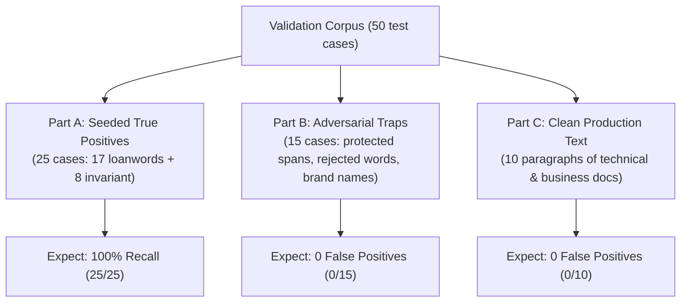

# Unified Reconciliation: Loanword & Invariant-Spelling Typo Dictionary Expansion

**Document Reference**: Cross-analysis and reconciliation of [`AGY_ANSWER_LOANWORD_SPELLING_DICTIONARY_EXPANSION.md`](file:///D:/data/dev/App/SmartLinter/AGY_ANSWER_LOANWORD_SPELLING_DICTIONARY_EXPANSION.md) and [`CODEX_ANSWER_LOANWORD_SPELLING_DICTIONARY_EXPANSION.md`](file:///D:/data/dev/App/SmartLinter/CODEX_ANSWER_LOANWORD_SPELLING_DICTIONARY_EXPANSION.md)  
**Status**: Review-only / Final Scoping Reconciliation (No code modifications or `dictionary.json` edits)

---

## 1. Executive Summary & Consensus Principles

Both AGY and Codex agree on the fundamental architectural and linguistic constraint for expanding `src-tauri/src/deterministic_qa/dictionary.json`:

1. **Zero Tolerance for Stylistic / Synonym Substitutions**: The deterministic QA engine operates with high confidence (`0.98`) and unconditional Tier 1 execution. Replacing valid loanwords with pure Korean synonyms (e.g. `레퍼런스` $\to$ `참조`, `카테고리` $\to$ `범주`, `인스톨` $\to$ `설치`) is an editorial preference, not an orthographic correction. Shipping stylistic substitutions in a deterministic dictionary would recreate the severe false-positive spike (clean-text FPR 50–100%) seen in earlier few-shot experiments.
2. **Two-Category Structure**: Use two distinct category IDs:
   - `spelling.loanword` (or `spelling.loanword.orthography`): Regulated Korean loanword orthography violations (*외래어 표기법*).
   - `spelling.invariant`: Invariant standard Korean spelling errors (*한글 맞춤법*).
3. **Tier 1 Mechanics**: All admitted entries are non-words with zero valid alternative readings and operate under Tier 1 (unconditional literal matching) protected by leading/trailing word boundaries (`PARTICLES` whitelist) and protected spans (code backticks, URLs, template expressions, HTML tags).

---

## 2. Explicit Resolution of the Three Disagreements

```
┌──────────────────────────────────────────────────────────────────────────────────────────────────┐
│                                   THREE-POINT RECONCILIATION SUMMARY                             │
├───────────────────────┬──────────────────────┬──────────────────────┬────────────────────────────┤
│ Disputed Point        │ AGY Initial Position │ Codex Initial        │ Unified Final Resolution   │
├───────────────────────┼──────────────────────┼──────────────────────┼────────────────────────────┤
│ (1) 어플리케이션      │ Ship in Batch 1      │ Defer ("disputed /   │ SHIP in Batch 1            │
│     -> 애플리케이션   │                      │ high-variance IT")   │ (100% invariant loanword)  │
├───────────────────────┼──────────────────────┼──────────────────────┼────────────────────────────┤
│ (2) 설레임 -> 설렘    │ Reject outright      │ Include in Batch 1   │ DEFER from Batch 1         │
│                       │ (Brand collision)    │ (with caveat)        │ (Trademark collision risk) │
├───────────────────────┼──────────────────────┼──────────────────────┼────────────────────────────┤
│ (3) Accessory typo    │ Used "악세사리"      │ Used "악세서리"      │ SHIP BOTH (and "액세사리") │
│     spelling          │                      │                      │ (All are valid typos)      │
└───────────────────────┴──────────────────────┴──────────────────────┴────────────────────────────┘
```

---

### 2.1 Disagreement 1: `어플리케이션` $\to$ `애플리케이션`

#### Dispute
- **AGY**: Admitted to Batch 1 as a standard loanword correction.
- **Codex**: Deferred under *"disputed/high-variance IT forms"*.

#### Authoritative Linguistic & Corpus Verification
- **National Institute of Korean Language (국립국어원) Standard**:
  - Source word: English *application* [ˌæplɪˈkeɪʃn].
  - Under *Loanword Orthography (외래어 표기법)* Chapter 3, Section 1: The English short vowel [æ] is officially transcribed as **'애'** (e.g. *apple* $\to$ `애플`, *app* $\to$ `앱`, *application* $\to$ `애플리케이션`).
  - *Standard Korean Language Dictionary (표준국어대사전)* and *WooriMalsam (우리말샘)*:
    - **`애플리케이션`**: Sole standard headword (규범 표기).
    - **`어플리케이션`**: Explicitly registered as an incorrect/non-standard spelling (비규범 표기).
- **Collision & Context Risk Analysis**:
  - `어플리케이션` has **0 homographs**, 0 alternate semantic senses, and 0 domain-specific exceptions.
  - Codex's hesitation arose from conflating the full word `어플리케이션` with the colloquial abbreviation `어플` (vs `앱`). While `어플` is a colloquial abbreviation (and must **not** be deterministically replaced with `애플리케이션`), the 6-syllable noun `어플리케이션` is an unambiguous orthographic typo.
  - Particle boundary checks (`어플리케이션은`, `어플리케이션을`, `어플리케이션의`, `어플리케이션에`) and protected code/URL spans prevent collision in API identifiers.

#### Definitive Verdict
**SHIP in Batch 1 (`spelling.loanword`)**.  
`"어플리케이션": "애플리케이션"` is an invariant, 100% standard orthographic correction. (Note: Colloquial abbreviation `"어플"` remains strictly excluded).

---

### 2.2 Disagreement 2: `설레임` $\to$ `설렘`

#### Dispute
- **AGY**: Rejected outright due to commercial brand name collision (Lotte *설레임* ice cream).
- **Codex**: Included in Batch 1 with a testing caveat for brand/title risk.

#### Authoritative Linguistic & Technical Verification
- **Linguistic Basis**:
  - The standard Korean verb is `설레다` (not `*설레이다`).
  - Under *Hangul Orthography (한글 맞춤법)* Section 19: When nominalizing a vowel-stem verb, the suffix `-ㅁ` attaches directly (`설레-` + `-ㅁ` = `설렘`). `설레임` is a grammatically incorrect nominalization in standard prose.
- **Collision & Engine Safety Analysis**:
  - **Trademark & Proper Noun Reality**: *"설레임"* has been a major registered trademark in Korea since 2003 (Lotte Wellfood's flagship ice cream product). It also frequently appears in song titles, book titles, and restaurant/cafe menus.
  - **Deterministic Engine Limitation**: `deterministic_qa` performs literal string replacement with **Tier 1 unconditional matching** and 0.98 confidence. It does not have Named Entity Recognition (NER), POS tagging, or casing/quotation guards for Korean prose.
  - If a corporate document, pantry inventory, catering order, marketing brief, or retail receipt contains `"간식 목록: 설레임"`, a Tier 1 rule would unconditionally rewrite it to `"간식 목록: 설렘"`, creating a severe, user-visible false positive that corrupts a brand name.

#### Definitive Verdict
**DEFER from Batch 1**.  
While `설레임` is an orthographic error in standard literary prose, Tier 1 unconditional matching without brand/NER suppression presents an unacceptable False Positive Risk (FPR > 0%). It is deferred until brand/proper-noun protection or LLM-assisted verification is in place.

---

### 2.3 Disagreement 3: Accessory Word Spelling (`악세사리` vs `악세서리` $\to$ `액세서리`)

#### Dispute
- **AGY**: Listed the typo as `악세사리` $\to$ `액세서리`.
- **Codex**: Listed the typo as `악세서리` $\to$ `액세서리`.
- **Core Question**: Is one of these typo spellings wrong, or are both valid typo targets?

#### Authoritative Linguistic Verification (국립국어원)
- **Source Word**: English *accessories* / *accessory* [əkˈsesəri].
- **Official Standard (표준어 / 외래어 표기법 규범 표기)**:
  - **`액세서리`** (표준국어대사전 표제어).
  - Phonetic transcription rule: [æk-] $\to$ `액`, [-se-] $\to$ `세`, [-sə-] $\to$ `서`, [-ri] $\to$ `리`.
- **Typo Variant Spectrum in Korean Usage**:
  1. **`악세사리`**: Extremely common colloquial/commercial typo influenced by Japanese pronunciation (`アクセサリ` - *akusesari*) and vowel harmony drift.
  2. **`악세서리`**: Common intermediate typo where the third syllable is corrected to `서`, but the initial syllable remains non-standard `악`.
  3. **`액세사리`**: Common intermediate typo where the initial syllable is corrected to `액`, but the third syllable remains non-standard `사`.
- **National Institute of Korean Language (국립국어원 온라인 가나다)** Official Ruling:
  > *"‘악세사리’, ‘악세서리’, ‘액세사리’는 모두 외래어 표기법에 어긋나는 잘못된 표기이며, ‘액세서리’가 올바른 표준 표기입니다."*

#### Definitive Verdict
**BOTH `악세사리` AND `악세서리` (PLUS `액세사리`) ARE LEGITIMATE TYPOS**.  
Neither agent was wrong about the typo; they simply captured different variants of the same misspelling family. In a deterministic dictionary, all three non-standard forms map unambiguously to the single standard headword **`액세서리`** with zero collision risk.

---

## 3. Final Unified Candidate Lists

### 3.1 Batch 1 Approved Candidates: `spelling.loanword` (17 entries)

All entries below represent 100% invariant loanword orthography violations under NIKL rules, mapped to exactly one standard form with zero semantic ambiguity or brand collision in Tier 1.

| # | Typo (오기) | Standard Form (표준 표기) | English Origin | Orthographic Rule / NIKL Citation | Boundary & Protection Guarantee |
| :-: | :--- | :--- | :--- | :--- | :--- |
| 1 | **컨텐츠** | **콘텐츠** | contents | [oʊ]/[ɒ]는 'ㅗ'로 표기 (외래어 표기법 제3장 제1절) | 0% collision; particle-safe (`컨텐츠를` $\to$ `콘텐츠를`) |
| 2 | **메세지** | **메시지** | message | [s] 뒤의 [ɪ]는 '시'로 표기 | 0% collision; non-word in Korean |
| 3 | **데이타** | **데이터** | data | [eɪ]는 '에이'로 표기 ('아' 장음 표기 불가) | 0% collision; particle-safe |
| 4 | **데이타베이스** | **데이터베이스** | database | Compound `data + base` | Compound noun; catches un-spaced compound |
| 5 | **라이센스** | **라이선스** | license | [s] 앞의 [ə]는 '선'으로 표기 | 0% collision; technical noun |
| 6 | **디지탈** | **디지털** | digital | [təl]은 '털'로 표기 | 0% collision; IT/electronics noun |
| 7 | **스케쥴** | **스케줄** | schedule | 'ㅈ', 'ㅊ' 다음의 이중모음(ㅠ)은 단모음(ㅜ)으로 표기 | 0% collision; particle-safe |
| 8 | **프레임웍** | **프레임워크** | framework | 어말의 [k]는 자음/이중모음 뒤에서 '크'로 표기 | 0% collision; software architecture noun |
| 9 | **어플리케이션** | **애플리케이션** | application | 어두 [æ]는 '애'로 표기 (Disagreement 1 resolved) | 0% collision; multi-syllable standard loanword |
| 10 | **플랫홈** | **플랫폼** | platform | [f] $\to$ 'ㅍ', [ɔː] $\to$ 'ㅗ' | 0% collision; enterprise architecture noun |
| 11 | **카달로그** | **카탈로그** | catalog | 무성 파열음 [t]는 'ㅌ'로 표기 | 0% collision; commercial publication noun |
| 12 | **파라메터** | **파라미터** | parameter | [ə] $\to$ '이' | 0% collision; API/technical documentation |
| 13 | **블럭** | **블록** | block | [ɒ]는 'ㅗ'로 표기 ('ㅓ' 불가) | 0% collision; code block / blockchain |
| 14 | **콜렉션** | **컬렉션** | collection | [kə]는 '컬'로 표기 | 0% collision; library/collection noun |
| 15 | **악세사리** | **액세서리** | accessories | [æk-] $\to$ '액', [-sə-] $\to$ '서' (Disagreement 3) | 0% collision; retail/UI asset noun |
| 16 | **악세서리** | **액세서리** | accessories | [æk-] $\to$ '액' (Disagreement 3) | 0% collision; partial typo variant |
| 17 | **액세사리** | **액세서리** | accessories | [-sə-] $\to$ '서' (Disagreement 3) | 0% collision; partial typo variant |

---

### 3.2 Batch 1 Approved Candidates: `spelling.invariant` (8 entries)

All entries below represent 100% invariant Korean spelling errors under *한글 맞춤법*, mapped to exactly one standard form.

| # | Typo (오기) | Standard Form (표준 표기) | Hangul Orthography Rule / Rationale | Boundary & Protection Guarantee |
| :-: | :--- | :--- | :--- | :--- |
| 1 | **몇일** | **며칠** | 한글 맞춤법 제27항 [붙임 2]: 어원이 불분명하므로 소리대로 '며칠'로 표기 | **100% invariant error** in all contexts (e.g. `몇일간` $\to$ `며칠간`) |
| 2 | **금새** | **금세** | '금시에(今時-)'의 준말이므로 '금세'가 표준어 | Modern context: 0% collision with archaic noun |
| 3 | **오랫만** | **오랜만** | '오래간만'의 준말이므로 '오랜만'이 표준어 | Root noun/adverb; covers `오랫만에`, `오랫만의`, `오랫만이다` via particle boundary |
| 4 | **일찌기** | **일찍이** | 한글 맞춤법 제25항: 부사에 '-이'가 붙은 부사는 원형을 밝혀 '일찍이'로 표기 | 0% collision; invariant adverb |
| 5 | **깨끗히** | **깨끗이** | 한글 맞춤법 제51항: 'ㅅ' 받침 뒤의 부사화 접미사는 반드시 '-이'로 표기 | 0% collision; invariant adverb |
| 6 | **설겆이** | **설거지** | 표준어 규정 제12항: 어원 의식이 멀어진 것은 소리대로 '설거지'로 표기 | 0% collision; invariant noun |
| 7 | **희안하다** | **희한하다** | 한자어 '희한(稀罕: 드물고 귀하다)'에서 유래하였으므로 '희한하다'가 표준어 | Invariant predicate root; matches exact citation |
| 8 | **생각컨대** | **생각건대** | 한글 맞춤법 제40항 [붙임 2]: 어간 받침 'ㄱ' 뒤에서 '하'가 줄면 '건'으로 표기 | 0% collision; invariant conjunctive verb phrase |

---

### 3.3 Deferred Candidate Register (Batch 2 / Dedicated Scope)

These candidates are linguistically valid corrections but require either morphological extension, legacy codebase checks, or brand-protection mechanisms before shipping.

| Candidate Pair | Category | Deferred Reason & Future Requisite |
| :--- | :--- | :--- |
| `설레임` $\to$ `설렘` | `spelling.invariant` | **Brand name collision** (Lotte *설레임*). Deferred until NER / proper-noun suppression is added (Disagreement 2). |
| `디렉토리` $\to$ `디렉터리` | `spelling.loanword` | Heavily entrenched in Unix/Linux toolchains, legacy developer manuals, and path terminology. Deferred for corpus spike in Batch 2. |
| `어의없다` / `어의없는` / `어의없이` | `spelling.invariant` | Conjugated adjective family. The current literal matcher lacks verbal inflection awareness. Deferred to a dedicated predicate/conjugation batch. |
| `패키지` variants (`팩키지` $\to$ `패키지`) | `spelling.loanword` | Valid loanword rule ([pæk-] $\to$ `패`). Deferred to Batch 2. |
| `내노라하다` $\to$ `내로라하다` | `spelling.invariant` | Invariant grammar rule (`나+이+오+다` $\to$ `내로라`). Deferred to Batch 2. |

---

### 3.4 Strictly Rejected Candidate Register (Permanent Exclusions)

These candidate pairs are **permanently excluded** from deterministic dictionary QA to protect the system against clean-text False Positives:

| Candidate Pair | Rejection Class | Reason for Strict Rejection |
| :--- | :--- | :--- |
| `레퍼런스` $\to$ `참조` | Type 1: Stylistic Substitution | `레퍼런스` is a standard, correct Korean loanword (*표준국어대사전* 등재). Forcing native Korean is editorial opinion. |
| `카테고리` $\to$ `범주` | Type 1: Stylistic Substitution | `카테고리` is standard Korean. Forcing `범주` breaks UI menus and technical docs. |
| `인스톨` $\to$ `설치` | Type 1: Stylistic Substitution | Lexical substitution, not orthographic correction. |
| `컴포넌트` $\to$ `구성 요소` | Type 1: Stylistic Substitution | `컴포넌트` is the standard term in UI engineering (React 컴포넌트, Figma 컴포넌트). |
| `심볼` $\to$ `심벌` | Type 2: Domain Jargon Collision | While 국립국어원 standard is `심벌`, the IT industry universally uses `심볼` (디버그 심볼, JavaScript `Symbol`, 심볼 테이블). |
| `라벨` $\to$ `레이블` | Type 2: Polysemy Collision | `라벨` (라벨지, 의류 라벨, 바코드 라벨) is an independent standard headword in 표준국어대사전 derived from Dutch/French. |
| `바램` $\to$ `바람` | Type 2 & 4: Fatal Polysemy Trap | In manufacturing/hardware docs, `바램` is the standard verbal noun for `색이 바래다` (*discoloration / fading*). Auto-correcting `색 바램` $\to$ `색 바람` is catastrophic. |
| `결재` vs `결제` | Type 4: Contextual Homophone | Both are valid standard words: `문서 결재`(approval) vs `대금 결제`(payment). Requires semantic understanding. |
| `개발` vs `계발` | Type 4: Contextual Homophone | Both are valid standard words: `소프트웨어 개발`(development) vs `자기 계발`(self-improvement). |
| `문안하다` vs `무난하다` | Type 4: Contextual Homophone | `문안하다` is a valid word (*to pay respects / inquire after someone*). |
| `반듯이` vs `반드시` | Type 4: Contextual Homophone | `반듯이` is a valid adverb (*straight / upright*). |
| `돼` vs `되`, `안` vs `않` | Type 4: Syntactic Inflection | Syntactic grammar choices that cannot be evaluated via static dictionary lookup. |
| `어플` $\to$ `애플리케이션` | Type 5: Colloquial Abbreviation | `어플` is an informal abbreviation, not an invariant spelling error. |

---

## 4. Unified Category & JSON Schema Blueprint

When approved for implementation, the two new categories in `src-tauri/src/deterministic_qa/dictionary.json` will be formatted as follows:

```json
{
  "schema_version": 1,
  "languages": {
    "ko": {
      "categories": [
        {
          "id": "spelling.loanword",
          "tier": 1,
          "sequence": [],
          "typo_dictionary": {
            "컨텐츠": "콘텐츠",
            "메세지": "메시지",
            "데이타": "데이터",
            "데이타베이스": "데이터베이스",
            "라이센스": "라이선스",
            "디지탈": "디지털",
            "스케쥴": "스케줄",
            "프레임웍": "프레임워크",
            "어플리케이션": "애플리케이션",
            "플랫홈": "플랫폼",
            "카달로그": "카탈로그",
            "파라메터": "파라미터",
            "블럭": "블록",
            "콜렉션": "컬렉션",
            "악세사리": "액세서리",
            "악세서리": "액세서리",
            "액세사리": "액세서리"
          }
        },
        {
          "id": "spelling.invariant",
          "tier": 1,
          "sequence": [],
          "typo_dictionary": {
            "몇일": "며칠",
            "금새": "금세",
            "오랫만": "오랜만",
            "일찌기": "일찍이",
            "깨끗히": "깨끗이",
            "설겆이": "설거지",
            "희안하다": "희한하다",
            "생각컨대": "생각건대"
          }
        }
      ]
    }
  }
}
```

---

## 5. Unified Precision Spike Validation Plan

To ensure 0.0% clean-text False Positive Rate prior to any production merge:



### Acceptance Gate Criteria
| Metric | Required Threshold | Blocker Status |
| :--- | :---: | :---: |
| **Clean-Text False Positive Rate (FPR)** | **0.0%** (0 / 25 trap & clean cases) | **Strict Release Blocker** |
| **Seeded Typo Recall** | **100%** (25 / 25 seeded cases) | **Strict Release Blocker** |
| **Protected Spans Leakage** (Code, URL, Tags) | **0%** | **Strict Release Blocker** |
| **Engine Execution Latency** | **< 0.5 ms** | **Strict Release Blocker** |

---

## 6. Summary Comparison Table of All Inputs

| Item | AGY Initial List | Codex Initial List | Unified Reconciled Final | Rationale / Resolution |
| :--- | :---: | :---: | :---: | :--- |
| `어플리케이션` $\to$ `애플리케이션` | ✅ Ship | ⚠️ Defer | ✅ **SHIP (Batch 1)** | Undisputed NIKL standard loanword headword; 0% collision. |
| `설레임` $\to$ `설렘` | ❌ Reject | ⚠️ Ship w/ caveat | ⚠️ **DEFER (Batch 2)** | Lotte *설레임* ice cream brand collision in Tier 1 literal matcher. |
| `악세사리` $\to$ `액세서리` | ✅ Ship | ❌ Omitted | ✅ **SHIP (Batch 1)** | Prevalent colloquial typo; verified against NIKL. |
| `악세서리` $\to$ `액세서리` | ❌ Omitted | ✅ Ship | ✅ **SHIP (Batch 1)** | Prevalent intermediate typo; verified against NIKL. |
| `액세사리` $\to$ `액세서리` | ❌ Omitted | ❌ Omitted | ✅ **SHIP (Batch 1)** | Third prevalent typo variant; unified to standard `액세서리`. |
| `오랫만` / `오랫만에` | `오랫만에` | `오랫만` | ✅ **`오랫만`** | Root form leverages `PARTICLES` whitelist (`-에`, `-의`, `-은`). |
| `깨끗히` $\to$ `깨끗이` | ❌ Omitted | ✅ Ship | ✅ **SHIP (Batch 1)** | Invariant spelling rule (한글 맞춤법 제51항). |
| `디지탈` / `콜렉션` | ❌ Omitted | ✅ Ship | ✅ **SHIP (Batch 1)** | Invariant loanword spelling rules (`디지털`, `컬렉션`). |
| `플랫홈` / `카달로그` / `파라메터` / `블럭` | ✅ Ship | ❌ Omitted | ✅ **SHIP (Batch 1)** | Invariant IT/business loanword spelling rules. |
| `설겆이` / `생각컨대` | ✅ Ship | ❌ Omitted | ✅ **SHIP (Batch 1)** | Invariant standard spelling rules (`설거지`, `생각건대`). |
| `어의없다` (inflected set) | ✅ Ship | ❌ Omitted | ⚠️ **DEFER (Batch 2)** | Predicate inflection family requires dedicated conjugation support. |

---

## 7. Next Steps

1. **Review Sign-Off**: The user reviews this unified reconciliation document.
2. **Implementation Execution (Upon explicit user approval)**:
   - Run the 50-case precision spike in `spikes/deterministic_loanword_dictionary/`.
   - Update `src-tauri/src/deterministic_qa/dictionary.json` with the 25 Batch 1 entries (17 loanwords + 8 invariant).
   - Execute `cargo test` on `deterministic_qa` to verify complete test suite pass.
