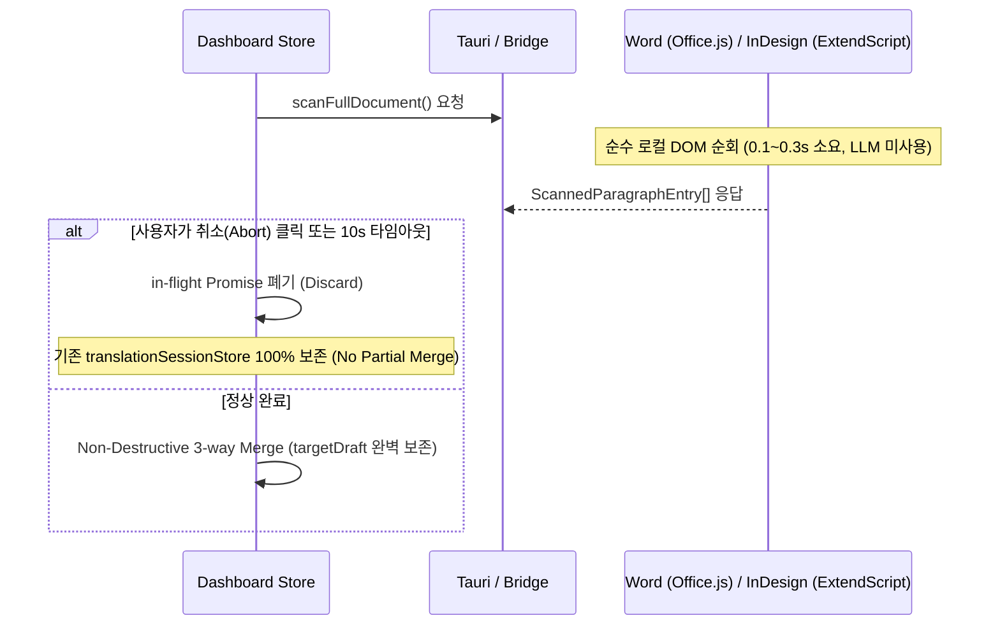

# AGY_RECONCILED_TRANSLATION_MODE_T3.md: 트랙 C 번역 모드 T3 설계 자문 재조율 및 최종 확정

---

## 1. 쟁점 1: InDesign 미배치(Unplaced) 및 오버셋(Overset) 스토리 수집 범위 재조율

### 1.1 개념 명확화 및 이전 답변의 모호성 정정

InDesign DOM 구조상 **"오버셋 텍스트(Overset Text)"**와 **"미배치 스토리(Unplaced Story)"**는 물리적·의미론적으로 완전히 다른 객체 상태입니다. 이전 AGY 답변에서 이를 "숨김 텍스트"로 묶어 일괄 제외 대상으로 기술했던 것은 **개념적 엄밀성이 부족했던 오류**이며, 이를 명확히 분리하여 재정의합니다.

```
[InDesign Document DOM 구조]
Document
└── Stories (doc.stories)
    ├── [A] Placed Stories (story.textContainers.length > 0)
    │   ├── Frame-fitting Paragraphs (프레임 내 표시 문단) ───────────▶ [100% 수집 포함]
    │   └── Overset Paragraphs (프레임 크기 초과 오버셋 문단) ────────▶ [100% 수집 포함] (정정)
    └── [B] Unplaced Stories (story.textContainers.length === 0)
        └── Orphaned Paragraphs (프레임이 없는 고스트/초안 문단) ────▶ [기본 제외 + 메타데이터 투명 통지]
```

1. **오버셋 텍스트 (Overset Text):**
   - **정의:** 텍스트 프레임에 정상 연결(`textContainers.length > 0`)되어 있으나, 프레임 박스 크기나 페이지 여백 제한으로 인해 화면에 표시 영역을 넘쳐난(`textFrame.overflows === true`) 본문 문단입니다.
   - **판정:** **100% 수집 대상에 포함합니다.** (이전 답변 정정)
   - **근거:** 오버셋은 DTP 실무에서 카피 수정 중 빈번히 발생하는 정상 본문이며, 특히 외국어 번역 시 텍스트 팽창(Text Expansion)으로 인해 필연적으로 발생합니다. 이를 제외하면 스토리 후반부 문단이 **치명적인 영구 데이터 누락(Data Loss)**으로 이어집니다. 또한 ExtendScript에서 `story.paragraphs`를 순회하면 오버셋 여부와 무관하게 스토리 전체 텍스트가 자연스럽게 추출됩니다.

2. **미배치 스토리 (Unplaced Story):**
   - **정의:** 문서 내 어떤 스프레드/페이지/페이스트보드의 텍스트 프레임에도 연결되어 있지 않은(`story.textContainers.length === 0`), `Document.stories` 컬렉션에만 존재하는 고립된(Orphaned) 스토리입니다.
   - **판정:** **기본 수집 대상에서 제외하되, `ScanSummary` 메타데이터와 UI 통지로 투명하게 알리는 "투명한 제외(Transparent Exclusion)" 절충안을 채택합니다.**

---

### 1.2 실사용 시나리오 분석: 왜 무조건 포함(Codex)도, 조용한 제외(AGY 구안)도 아닌 "통지 동반 제외"인가?

#### A. Codex 안(무조건 포함)의 실무적 위험성
실제 InDesign 편집 실무에서 `textContainers.length === 0`인 미배치 스토리가 발생하는 원인의 90% 이상은 **(a) 레이아웃 수정 중 사용자가 프레임만 삭제하고 남은 쓰레기 고스트 데이터**, 또는 **(b) 서드파티 플러그인/스크립트가 임시로 생성한 버퍼**입니다.
- **비용 및 혼선:** 이를 무조건 XLIFF 번역 대상으로 추출하면, 번역가/CAT 툴에 수십~수백 개의 불필요한 삭제 텍스트가 청구 비용과 함께 넘어갑니다.
- **Round-trip(T5/T6) 불가:** 번역된 XLIFF를 다시 InDesign 문서로 가져와 배치(T6/T7)할 때, 미배치 스토리는 연결된 프레임 좌표가 전혀 없으므로 시각적으로 배치할 캔버스가 존재하지 않아 레이아웃 복원 단계에서 치명적인 고아 데이터가 됩니다.

#### B. AGY 구안(조용한 제외)의 위험성
- 사용자가 스토리 편집기(Story Editor)에서 작업한 뒤 아직 프레임을 그리지 않은 실제 초안(c)이 존재할 경우, 사용자 모르게 번역에서 빠지는 **"조용한 누락(Silent Omission)"** 위험이 발생합니다.

#### C. 최종 수렴 결론: "투명한 통지 동반 제외 (Transparent Exclusion with Metadata Notice)"
- **스캔 엔진:** `story.textContainers.length > 0`인 유효 스토리의 본문(오버셋 포함)만 세그먼트 인벤토리로 수집합니다.
- **메타데이터 보고:** `textContainers.length === 0`인 미배치 스토리가 발견되면, 이를 버리지 않고 개수와 문단 수를 집계하여 반환합니다.
- **UI 알림:** 대시보드 상단에 `partial-coverage` 안내를 표시하여 사용자에게 선택권을 제공합니다.
  > **ℹ️ 문서 수집 완료 (일부 미배치 항목 제외)**
  > 유효 본문 52개 문단을 수집했습니다. (레이아웃 프레임에 배치되지 않은 고아 스토리 2개[총 8문단]는 제외되었습니다.)

---

### 1.3 InDesign T3 최종 수집/제외 매트릭스

| 대상 객체 | 상태 조건 | T3 수집 여부 | 처리 방식 및 UI 표기 |
| :--- | :--- | :---: | :--- |
| **일반 본문 프레임 문단** | `textContainers.length > 0` | **포함** | 정상 번역 세그먼트로 등록 |
| **오버셋 텍스트 (Overset)** | `textFrame.overflows === true` | **포함** | 정상 번역 세그먼트로 등록 (`isOverset: true` 메타 표기) |
| **미배치 스토리 (Unplaced)** | `textContainers.length === 0` | **제외** | `ScanSummary.skippedUnplacedStoriesCount` 집계 + 경고 배너 |
| **표 셀 (Table Cells)** | `story.tables.length > 0` | **제외** | `ScanSummary.skippedTablesCount` 집계 + 경고 배너 |
| **각주/미주 (Footnotes)** | `story.footnotes.length > 0` | **제외** | `ScanSummary.skippedFootnotesCount` 집계 + 경고 배너 |

---

## 2. 확인 1: 취소(Cancel) 처리 깊이 및 정합성 확인

### 2.1 결론: "호스트 레벨 Atomic 실행 + 스토어 레벨 Rollback/Discard"로 충분

Codex가 제시한 "청크 경계 협조적 취소"와 AGY의 "10초 타임아웃 가드 + 롤백" 중, **실제 구현에서는 AGY의 단순·견고한 스토어 레벨 Discard 모델을 기본으로 채택**합니다.



### 2.2 기술적 근거
1. **호스트 실행의 원자성(Atomicity):**
   - **Word:** `context.document.body.paragraphs.load('text')` 후 단 1회의 `context.sync()`로 수천 문단을 읽어오며, 실행 시간은 100~300ms에 불과합니다. 청크 단위로 나누어 `Word.run`을 반복 실행하면 오히려 Office.js 컨텍스트 오버헤드와 문서 동시 편집 충돌 위험만 증가합니다.
   - **InDesign:** ExtendScript는 단일 스레드 동기 인터프리터(`DoScript`)로 실행되므로, 스크립트 실행 도중 외부에서 우아하게(graceful) 청크 신호를 주입하기 어렵습니다.
2. **무결성 보장:**
   - 취소/실패 시 가장 중요한 불변식은 **"부분 수집 데이터(Partial Inventory)가 기존 세션에 오염되지 않아야 한다"**는 점입니다.
   - 따라서 프런트엔드 `translationSessionStore`가 응답 수신 전 취소 신호를 받으면 해당 응답을 완전히 무시(Discard)하고 기존 세션 상태를 유지하는 것으로 완벽하게 보호됩니다.

---

## 3. 종합 프로토콜 및 인터페이스 최종 사양 (`shared/protocol/types.ts`)

쟁점 1과 확인 1의 재조율 결과를 반영한 최종 인터페이스 사양입니다:

```typescript
/** InDesign/Word 공통 전체 문서 스캔 요청 */
export interface EnumerateDocumentRequest {
  requestId: string;
  editorType: 'word' | 'indesign';
  options?: {
    includeLocked?: boolean;
  };
}

/** 수집된 개별 문단 엔트리 */
export interface ScannedParagraphEntry {
  paragraphId: string;           // Word: word-para-body-<index>-<hash12>
                                 // InDesign: indesign-para-<storyId>-<index>-<hash12>
  text: string;                  // 정규화된 원문 텍스트
  hash: string;                  // SHA-256 전체 해시 (stale 판정용)
  documentOrderIndex: number;    // 문서 내 물리적 순서 (정렬용)
  storyId?: string;              // InDesign 전용 스토리 ID
  isOverset?: boolean;           // InDesign 오버셋 텍스트 여부
  isLocked?: boolean;            // 잠금 상태 여부
}

/** 스캔 통계 및 제외 항목 요약 (투명 통지용) */
export interface ScanSummary {
  totalScannedParagraphs: number;
  skippedUnplacedStoriesCount: number; // 미배치(Unplaced) 스토리 제외 수
  skippedTablesCount: number;          // 표 셀 문단 제외 수
  skippedFootnotesCount: number;       // 각주/미주 제외 수
  lockedParagraphsCount: number;       // 잠긴 문단 수
  warnings?: string[];
}

/** 전체 문서 스캔 응답 */
export interface EnumerateDocumentResponse {
  requestId: string;
  sourceDocumentName: string;
  paragraphs: ScannedParagraphEntry[];
  summary: ScanSummary;
}
```

---

## 4. 최종 착수 합의 요약

1. **Word 선행 착수 (T3a):**
   - `plugins/word/src/document_scanner.ts` 신규 구현 (`word-para-body-<index>-<hash12>` ID 체계 적용).
   - `translationSessionStore.ts`의 비파괴적 3-way 병합(`targetDraft` 절대 보존) 및 문서 순서 정렬 완성.
2. **InDesign 후속 착수 (T3b):**
   - `doc.stories` 중 `textContainers.length > 0`인 스토리 전체 순회(오버셋 포함).
   - 미배치 스토리 및 표/각주는 `ScanSummary`로 집계하여 `partial-coverage` 투명 통지 배너 제공.
3. **취소 모델:**
   - 10초 타임아웃 + 스토어 레벨 Atomic Discard(부분 병합 원천 차단)로 과설계 없이 신속 구현.
