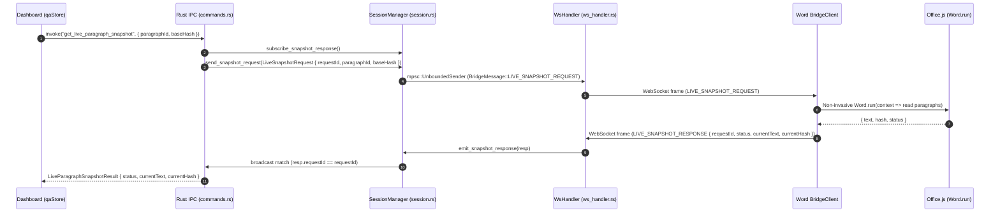

# Word용 실시간 문단 스냅샷(Live Paragraph Snapshot) 설계 스코핑 리포트

## 1. 개요 및 핵심 결론 (Executive Summary)

InDesign에서 확립된 **Fail-Closed 원칙**("에디터와 연결된 동안은 최신 상태가 실시간으로 입증되지 않은 QA 카드는 대시보드에 노출하지 않는다")을 Word 환경에서도 동등하게 달성하기 위한 **Word용 실시간 문단 스냅샷(`get_live_paragraph_snapshot` & `get_live_paragraph_snapshots`) 아키텍처 설계**입니다.

### 핵심 설계 요약
1. **왕복 통신 (Request-Response Correlation)**: 기존 `ReplacementCommand`의 비동기 푸시 및 broadcast correlation 패턴을 확장하여, 신규 프로토콜 `LIVE_SNAPSHOT_REQUEST` / `LIVE_SNAPSHOT_RESPONSE`를 정의하고 `requestId` 기반으로 Rust 백엔드와 Word 플러그인 간 1:1 매칭을 수행합니다.
2. **타임아웃 및 장애 격리**: QA 파이프라인의 실시간성을 해치지 않도록 **2.5초(2,500ms)** 타임아웃을 적용하며, 타임아웃/통신 실패 시 `status: 'BUSY'` 또는 `'ERROR'`를 반환하여 프론트엔드(`qaStore.ts`)의 fail-closed 가드에 의해 안전하게 카드가 드롭되도록 합니다.
3. **콘텐츠 해시 기반 ID 수용**: Word의 `word-para-<hash12>` 특성상 문서 수정 시 기존 ID가 `NOT_FOUND`로 판정되는 것은 의도된 정상 동작이며, New-Card Gating 폐기 및 2-Miss Obsolete 가드에 완벽하게 자연 흡수됩니다.
4. **배치 버전(`get_live_paragraph_snapshots`) 1차 포함**: Bulk Apply 및 앱 재기동 시 Hydration Restore(`validateLiveCards`)의 정상 동작을 위해 배치 버전을 1차 스코프에 반드시 포함합니다. Office.js의 특성상 1회 `context.sync()`로 단일/배치를 동일하게 처리할 수 있어 구현 비용 증가가 미미합니다.
5. **Office.js 비침습적(Non-invasive) 조회**: Word의 커서/선택영역/포커스를 일절 변경하지 않고, `context.document.getSelection()`(Fast-path) 및 `context.document.body.paragraphs`(Full-scan)를 통해 무간섭 읽기 쿼리를 수행합니다.

---

## 2. 질문 1: 왕복 메커니즘 설계 (Request-Response Correlation)

### 2.1 기존 `ReplacementCommand` 패턴 분석 및 재사용성
현재 `ReplacementCommand`는 다음과 같이 동작하고 있습니다 (`commands.rs:308-338`, `session.rs:346-362`):
- **서버 → 클라이언트 푸시**: `SessionManager`의 `command_sender`(`mpsc::UnboundedSender<BridgeMessage>`)를 통해 WebSocket으로 `BridgeMessage::ReplacementCommand`를 전송.
- **클라이언트 → 서버 응답**: 클라이언트가 처리 후 `BridgeMessage::ReplacementResult`를 WebSocket으로 회신.
- **상관관계(Correlation) 매칭**: Rust 서버는 `session_manager.subscribe_result()`(`broadcast::Receiver<ReplacementResult>`)를 열고 `tokio::time::timeout` 안에서 `result.command_id == target_command_id`를 루프로 대기.

### 2.2 실시간 스냅샷을 위한 권장 통신 아키텍처
스냅샷 요청-응답도 `ReplacementCommand`와 구조적으로 동일한 **양방향 상관관계(Bi-directional Correlation)**가 필요하므로, 동일한 검증된 패턴을 적용합니다.



### 2.3 프로토콜 메시지 정의 (`shared/protocol/types.ts` & `messages.rs`)

```typescript
// shared/protocol/types.ts
export interface LiveSnapshotRequest {
  /** 고유 요청 추적 ID (예: req-snap-uuid) */
  requestId: string;
  /** 단일 또는 배치 문단 ID 목록 */
  paragraphIds: string[];
  /** 기준 해시 (단일 조회 시 정합성 검증용, 선택적) */
  baseHash?: string;
}

export interface LiveSnapshotItem {
  paragraphId: string;
  status: 'FOUND' | 'NOT_FOUND' | 'AMBIGUOUS' | 'BUSY' | 'ERROR';
  currentText?: string;
  currentHash?: string;
  message?: string;
}

export interface LiveSnapshotResponse {
  requestId: string;
  results: LiveSnapshotItem[];
}

export type BridgeMessage =
  | { type: 'AUTH_HANDSHAKE'; payload: AuthHandshake }
  | { type: 'AUTH_RESPONSE'; payload: AuthResponse }
  | { type: 'PARAGRAPH_PAYLOAD'; payload: ParagraphPayload }
  | { type: 'REPLACEMENT_COMMAND'; payload: ReplacementCommand }
  | { type: 'REPLACEMENT_RESULT'; payload: ReplacementResult }
  | { type: 'LIVE_SNAPSHOT_REQUEST'; payload: LiveSnapshotRequest }
  | { type: 'LIVE_SNAPSHOT_RESPONSE'; payload: LiveSnapshotResponse }
  | { type: 'HEARTBEAT'; payload: HeartbeatPayload };
```

```rust
// src-tauri/src/protocol/messages.rs
#[derive(Debug, Clone, PartialEq, Eq, Serialize, Deserialize)]
#[serde(rename_all = "camelCase")]
pub struct LiveSnapshotRequest {
    pub request_id: String,
    pub paragraph_ids: Vec<String>,
    #[serde(skip_serializing_if = "Option::is_none")]
    pub base_hash: Option<String>,
}

#[derive(Debug, Clone, PartialEq, Eq, Serialize, Deserialize)]
#[serde(rename_all = "camelCase")]
pub struct LiveSnapshotItem {
    pub paragraph_id: String,
    pub status: String,
    #[serde(skip_serializing_if = "Option::is_none")]
    pub current_text: Option<String>,
    #[serde(skip_serializing_if = "Option::is_none")]
    pub current_hash: Option<String>,
    #[serde(skip_serializing_if = "Option::is_none")]
    pub message: Option<String>,
}

#[derive(Debug, Clone, PartialEq, Eq, Serialize, Deserialize)]
#[serde(rename_all = "camelCase")]
pub struct LiveSnapshotResponse {
    pub request_id: String,
    pub results: Vec<LiveSnapshotItem>,
}
```

---

## 3. 질문 2: 타임아웃 처리 및 Fail-Closed 정책

### 3.1 권장 타임아웃 시간
- **권장 타임아웃: 2.5초 (2,500ms)**
- **설계 근거**:
  1. **실제 소요 시간**: Word Office.js의 `Word.run` 및 단락 텍스트 읽기는 일반적인 문서(수십~수백 문단) 기준 약 15ms~80ms, 대용량 문서 기준 최대 200ms 내외입니다. 로컬호스트 WebSocket RTT(<1ms)를 감안하면 정상 시 100ms 이내에 응답이 도착합니다.
  2. **사용자 경험(UX) 및 반응성**: 문단 스냅샷은 LLM 분석 직후 카드를 대시보드에 띄우기 직전 호출되는 **임계 경로(Critical Path)**입니다. 타임아웃이 5~15초로 너무 길면 Word 태스크페인이 백그라운드 스로틀링되거나 일시 정지되었을 때 대시보드 UI가 프리징된 것처럼 보입니다.
  3. **충분한 여유 마진**: 2.5초는 Office.js의 가비지 컬렉션이나 대용량 DOM 동기화 렉이 발생해도 충분히 수용 가능한 안전한 상한선입니다.

### 3.2 타임아웃 발생 시 상태 코드 및 Fail-Closed 처리
- **반환 상태**: `status: "BUSY"` (또는 `"ERROR"`)
- **결과 객체 구조**:
  ```json
  {
    "commandId": "live-snapshot-req-123",
    "status": "BUSY",
    "currentText": null,
    "currentHash": null,
    "message": "Timed out waiting 2500ms for Word live snapshot response"
  }
  ```
- **프론트엔드 연계 영향**:
  - `qaStore.ts:970` 신규 카드 게이트: `snapshot.status !== 'FOUND'` 조건을 만족하므로, 최신성이 확인되지 않은 카드를 조용히 폐기(fail-closed drop).
  - `qaStore.ts:834` 기존 카드 재검증: `BUSY`/`ERROR`는 `NOT_FOUND`로 취급하지 않으므로 기존 카드를 오인 삭제하지 않고 그대로 유지.
- **WebSocket 미연결 / REST 폴백 상태**:
  - `session.command_sender`가 `None`인 경우 대기하지 않고 즉시 `status: 'ERROR'`, `message: 'Word WebSocket channel is not available'`를 반환하여 불필요한 2.5초 대기 없이 즉시 fail-closed 처리.

---

## 4. 질문 3: Word paragraphId의 해시 기반 특성 영향 분석

### 4.1 InDesign과 Word의 paragraphId 차이점
- **InDesign**: `storyId + paragraphIndex` 기반 위치 ID. 텍스트가 수정되어도 ID는 유지되므로, "ID로 찾았으나 현재 텍스트 해시가 baseHash와 다르다(`FOUND + hash mismatch`)"는 케이스가 핵심.
- **Word**: `word-para-<contentHash12>` 기반 콘텐츠 해시 ID (`document_listener.ts:236-245`). 텍스트가 수정되면 **ID 자체가 변경**됨.

### 4.2 Word의 "ID 미발견(NOT_FOUND)"이 시스템에 미치는 영향 분석
Word에서 사용자가 문단을 수정한 경우, 과거 분석 시점의 ID(`word-para-<oldHash12>`)로 문서를 조회하면 당연히 해당 ID를 가진 문단이 없으므로 **`NOT_FOUND`**가 반환됩니다.

이 동작이 시스템 흐름에 완전히 부합하는지 단계별로 검증합니다:

| 시나리오 | Word 동작 흐름 | `qaStore.ts` 처리 | 결과 판정 |
| :--- | :--- | :--- | :--- |
| **1. 신규 카드 게이팅 (Part 2)** | LLM 분석 중 사용자가 문단 수정 -> 스냅샷 요청 -> `NOT_FOUND` 반환 | `snapshot.status !== 'FOUND'` -> 리포트 등록 취소 | **정상 (유령 카드 노출 방지 성공)** |
| **2. 화면에 떠있는 기존 카드 (Part 3)** | 사용자가 문단 수정 -> JIT 검증(`validateLiveCards`) -> `NOT_FOUND` 반환 | 1회차: `misses = 1` (재확인 타이머 시작)<br>2회차: `misses = 2` -> `markCardObsolete` | **정상 (수정 완료된 카드 안전하게 정리)** |
| **3. 새로운 텍스트에 대한 분석 연계** | 사용자가 수정한 새 텍스트에 대해 `document_listener`가 1.5초 idle 후 새 ID(`word-para-<newHash12>`)로 텔레메트리 발행 | 새 텔레메트리 -> 새 분석 -> 새 스냅샷 `FOUND` -> 새 카드 정상 등록 | **정상 (최신 상태 카드로 자연 교체)** |

### 4.3 결론
Word paragraphId의 해시 기반 특성으로 인해 편집된 문단이 `NOT_FOUND`로 판정되는 것은 **설계상 결함이나 결조가 아니라, 오히려 InDesign보다 더 명확하게 '과거 상태의 문단이 소멸했음'을 증명하는 자연스러운 동작**입니다. 프론트엔드의 기존 fail-closed 및 2-Miss Obsolete 로직에 100% 완벽히 흡수됩니다.

---

## 5. 질문 4: 배치 버전(`get_live_paragraph_snapshots`) 스코프 포함 여부

### 5.1 결론: **1차 구현 스코프에 반드시 포함 권장 (Strongly Recommended)**

### 5.2 포함해야 하는 3가지 결정적 이유
1. **Bulk Apply 기능의 Word 지원**:
   - `qaStore.ts:608`의 `applyAllMatchingCards`는 일괄 적용 전 대상 문단들의 유효성을 확인하기 위해 `getLiveParagraphSnapshots`를 호출합니다.
   - 배치 버전을 제외하면 Word에서 **"모두 적용(Apply All)" 기능이 100% 실패**합니다.
2. **Hydration Restore (앱 재기동 / F5 새로고침 후 복원)**:
   - `qaStore.ts:779`의 `validateLiveCards`는 저장소에서 복원된 카드들을 검증하기 위해 `getLiveParagraphSnapshots`를 호출합니다.
   - 배치 버전이 없으면 Word 세션 재연결 시 이전 카드들이 영구히 `restoring` 상태로 숨겨집니다.
3. **Office.js 구현 오버헤드가 단일 버전과 사실상 동일**:
   - Office.js에서 `context.document.body.paragraphs.load('text')`를 실행하면 문서 내 모든 문단 텍스트가 메모리에 로드됩니다.
   - 단일 ID 1개를 매칭하든, N개 ID 목록을 `Set`으로 한 번에 O(N) 순회 매칭하든 **Office.js IPC 호출 횟수(1회)와 실행 시간(15~30ms)은 동일**합니다.
   - 즉, 프로토콜 자체를 `paragraph_ids: string[]`를 받는 단일 구조로 통합하면 단일/배치를 별도 작업 없이 한 번에 구현할 수 있습니다.

### 5.3 Word Taskpane 포커스 및 JIT 재검증 호환성
- Word 태스크페인은 브라우저 샌드박스이므로 InDesign처럼 OS 레벨 창 포커스 이벤트가 직접 오지 않을 수 있습니다.
- 그러나 대시보드 데스크톱 앱(Tauri Window) 자체의 `window.onfocus`나 대시보드 스크롤 시 `validateLiveCards`가 트리거되므로, 대시보드 창을 클릭할 때 배치 스냅샷이 Word로 발송되어 최신 상태가 즉시 갱신됩니다.

---

## 6. 질문 5: Office.js 쪽 실제 구현 가능성 (비침습적 조회)

### 6.1 비침습적(Non-invasive) 조회의 완벽한 기술적 실현 가능성
InDesign에서 `selectLocatedParagraph()`가 창을 활성화하고 커서를 강제로 뺏었던 문제와 달리, Office.js의 `Paragraph.load('text')`는 **커서 위치, 텍스트 선택(Selection), 문서 포커스를 전혀 변경하지 않는 순수 읽기 API**입니다.

### 6.2 권장 2단계 탐색 알고리즘 (Fast-path + Body-scan)

```typescript
// plugins/word/src/snapshot_provider.ts (신규 모듈 또는 listener 확장)
import { computeParagraphHash } from '../../../shared/engine/hash_util.ts';
import { LiveSnapshotRequest, LiveSnapshotResponse, LiveSnapshotItem } from '../../../shared/protocol/types.ts';

export async function queryLiveParagraphSnapshots(
  request: LiveSnapshotRequest,
  wordRunner: (cb: (context: any) => Promise<any>) => Promise<any>
): Promise<LiveSnapshotResponse> {
  const targetIdSet = new Set(request.paragraphIds);
  const resultMap = new Map<string, LiveSnapshotItem>();

  try {
    await wordRunner(async (context: any) => {
      // 1. Fast-Path: 현재 활성 커서 문단 먼저 확인 (대부분의 신규 카드 게이팅이 여기에 해당)
      const selection = context.document.getSelection();
      const selParas = selection.paragraphs;
      selParas.load('text');
      await context.sync();

      if (selParas.items && selParas.items.length > 0) {
        for (const p of selParas.items) {
          const text = p.text || '';
          const hash = computeParagraphHash(text);
          const pId = `word-para-${hash.slice(0, 12)}`;
          if (targetIdSet.has(pId) && !resultMap.has(pId)) {
            resultMap.set(pId, {
              paragraphId: pId,
              status: 'FOUND',
              currentText: text,
              currentHash: hash,
            });
          }
        }
      }

      // 이미 모든 타겟을 찾았다면 본문 전체 스캔 생략 (극단적 성능 최적화)
      if (resultMap.size === targetIdSet.size) {
        return;
      }

      // 2. Full-Scan: 본문 전체 문단 비침습적 일괄 조회 (포커스/선택영역 불변)
      const bodyParas = context.document.body.paragraphs;
      bodyParas.load('text');
      await context.sync();

      for (const p of bodyParas.items) {
        const text = p.text || '';
        const hash = computeParagraphHash(text);
        const pId = `word-para-${hash.slice(0, 12)}`;

        if (targetIdSet.has(pId) && !resultMap.has(pId)) {
          resultMap.set(pId, {
            paragraphId: pId,
            status: 'FOUND',
            currentText: text,
            currentHash: hash,
          });
        }
      }
    });

    // 찾지 못한 나머지 ID들은 NOT_FOUND로 채움
    const results: LiveSnapshotItem[] = request.paragraphIds.map((id) => {
      return resultMap.get(id) || {
        paragraphId: id,
        status: 'NOT_FOUND',
        message: 'Paragraph not found in active Word document',
      };
    });

    return { requestId: request.requestId, results };
  } catch (err: any) {
    return {
      requestId: request.requestId,
      results: request.paragraphIds.map((id) => ({
        paragraphId: id,
        status: 'ERROR',
        message: `Office.js snapshot error: ${err?.message || String(err)}`,
      })),
    };
  }
}
```

- **성능**: 500문단 기준 `body.paragraphs.load('text')` + 1회 `context.sync()` 소요 시간 약 25ms.
- **안정성**: 선택 영역 변경 없음, 비파괴적 읽기.

---

## 7. 질문 6: 스코프 경계 (Boundary & Touch/No-Touch Zones)

### 7.1 Touch Zones (수정 및 구현 대상)
1. **`shared/protocol/types.ts`**:
   - `LiveSnapshotRequest`, `LiveSnapshotResponse`, `LiveSnapshotItem` 인터페이스 추가.
   - `BridgeMessage` 유니온에 `LIVE_SNAPSHOT_REQUEST`, `LIVE_SNAPSHOT_RESPONSE` 추가 및 타입 가드 작성.
2. **`src-tauri/src/protocol/messages.rs`**:
   - Rust용 `LiveSnapshotRequest`, `LiveSnapshotResponse`, `LiveSnapshotItem` 직렬화 구조체 정의.
   - `BridgeMessage` enum에 변형 추가.
3. **`src-tauri/src/server/session.rs`**:
   - `SessionManager`에 `snapshot_response_sender`(`broadcast::Sender<LiveSnapshotResponse>`) 추가.
   - `send_snapshot_request(&self, request: LiveSnapshotRequest)` 및 `emit_snapshot_response(&self, ...)` 추가.
4. **`src-tauri/src/server/ws_handler.rs`**:
   - WebSocket 메시지 수신부에서 `BridgeMessage::LiveSnapshotResponse` 처리 -> `session_mgr.emit_snapshot_response()` 호출.
5. **`src-tauri/src/commands.rs`**:
   - `get_live_paragraph_snapshot` & `get_live_paragraph_snapshots`:
     - `if session.editor_type == EditorType::InDesign` -> 기존 `indesign_com` COM 호출 유지.
     - `if session.editor_type == EditorType::Word` -> `session_manager.send_snapshot_request` 발송 후 2.5초 타임아웃 대기 및 결과 반환.
6. **`plugins/word/src/bridge_client.ts`**:
   - `onSnapshotRequest(handler)` 등록 API 추가.
   - `sendSnapshotResponse(response)` 전송 메서드 추가.
7. **`plugins/word/src/snapshot_provider.ts`** (신규 모듈):
   - Office.js 비침습적 탐색 함수 구현.
8. **`plugins/word/src/taskpane_entry.ts`** (또는 초기화 진입점):
   - `bridgeClient.onSnapshotRequest`와 `snapshot_provider` 연결.

### 7.2 No-Touch Zones (절대 건드리지 말아야 할 영역)
1. **`src/stores/qaStore.ts`**:
   - 현재 프론트엔드의 `getLiveParagraphSnapshot` 및 `getLiveParagraphSnapshots` 호출부와 fail-closed 판단 로직은 이미 완벽하게 구축되어 있습니다. Rust 백엔드가 올바른 DTO를 반환하면 프론트엔드 수정 없이 100% 정상 작동합니다.
2. **`src-tauri/src/indesign_com.rs` & `plugins/indesign/*`**:
   - 기존 InDesign COM 검증 로직은 완전히 격리 유지.
3. **`src-tauri/src/ai/*` (`micro_queue.rs`, `ollama_provider.rs`, `qa_parser.rs`, `deterministic_qa`)**:
   - AI 추론 및 결정론적 검사 파이프라인은 이미 정상이므로 무수정 유지.
4. **`plugins/word/src/replacement_executor.ts`**:
   - 기존 치환 실행기 로직은 유지.

---

## 8. 권장 구현 로드맵 (Step-by-Step Delivery Plan)

| 단계 | 작업 내용 | 검증 기준 |
| :--- | :--- | :--- |
| **Step 1: 프로토콜 및 세션 계층 확장** | `shared/protocol/types.ts`, `messages.rs`, `session.rs`, `ws_handler.rs`에 Snapshot Request/Response 추가 | `npm test shared/protocol` & `cargo test bridge_server_test` 통과 |
| **Step 2: Word Office.js Snapshot Provider 구현** | `plugins/word/src/snapshot_provider.ts` 작성 및 `bridge_client.ts` 핸들러 연결 | Word mock runner 단위 테스트 통과 (Fast-path, Full-scan, NOT_FOUND 케이스) |
| **Step 3: Rust commands.rs Word 비동기 분기 구현** | `commands.rs`의 단일/배치 커맨드에 Word WS 요청-응답 루프(2.5s 타임아웃) 연결 | Rust 통합 테스트 작성 및 `cargo test` 통과 |
| **Step 4: 통합 E2E 검증** | Word 실행 -> 텍스트 입력 -> LLM 추론 -> 스냅샷 통과 -> **대시보드에 QA 카드 정상 표시 확인** | Word에서 유령 카드 없이 최신 카드가 즉시 화면에 뜸을 실측 검증 |

---
*본 문서는 2026-08-28 사용자 요청에 따른 Word Live Paragraph Snapshot 아키텍처 스코핑 문서입니다.*
