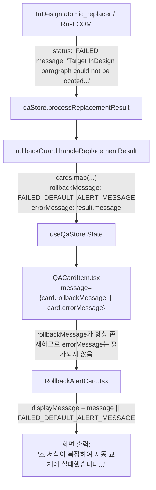
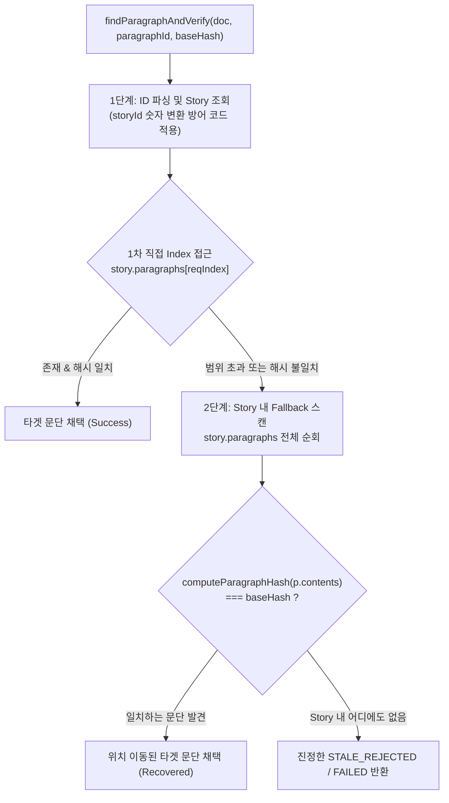

# 단순 텍스트 치환 시 "서식이 복잡하여 실패" 발생 원인 진단 및 해결 제안 (AGY)

## 1. 개요 및 요약

### 현상 재현 요약
Task A(명시적 `pendingCommands` 레지스트리)와 Task B(`paragraphId` 기반 ExtendScript 문단 탐색 `findParagraphById`)를 반영하고 InDesign 데몬을 재실행한 뒤, 특수 서식이나 하이퍼링크가 전혀 없는 평범한 문단의 단순 오탈자 카드("일오일" -> "일요일")에 대해 **[적용]**을 클릭했으나, 뜬금없이 `RollbackAlertCard`의 **`FAILED` 경고 ("⚠️ 서식이 복잡하여 자동 교체에 실패했습니다. 수동으로 확인해 주세요.")**가 발생함.

---

### 핵심 진단 요약
이 현상은 **InDesign 문서 편집에 따른 문단 Index 이동(Shifting)**과 **프론트엔드/UI의 에러 메시지 은폐(Masking)**가 결합되어 발생한 문제입니다.

1. **[직접 원인 1 - 문단 Index 밀림]**:
   - `TextObserver`가 생성하는 `paragraphId`(`indesign-para-{storyId}-{paragraphIndex}`)는 문서가 편집되면 실시간으로 변하는 **상대적 순서 번호(Index)**에 의존합니다.
   - 카드가 생성된 이후 사용자가 다른 문단에서 엔터를 치거나 지우는 등 편집을 수행하면, 대상 문단의 실제 Index가 바뀌어 `findParagraphById`가 (a) 범위를 벗어나 `null`을 반환하여 즉시 `FAILED`가 되거나, (b) 엉뚱한 다른 문단을 찾아 해시/Hunk 불일치로 `FAILED`가 됩니다.
2. **[직접 원인 2 - ExtendScript `itemByID` 타입 불일치 가능성]**:
   - `findParagraphById`가 `doc.stories.itemByID(storyId)`를 호출할 때 `storyId`를 문자열(`"214"`)로 전달합니다. InDesign DOM 사양에 따라 숫자 ID를 기대하는 경우 `itemByID`가 실패하여 `null`을 반환하고 `FAILED`로 귀결될 수 있습니다.
3. **[UX 결함 - 실제 원인 메시지 완전 은폐]**:
   - InDesign 및 Rust COM 레이어는 실제 실패 사유(`"Target InDesign paragraph could not be located..."` 또는 `"Hunk validation failed..."`)를 `ReplacementResult.message`에 정확히 담아 반환하고 있습니다.
   - 그러나 `rollback_guard.ts`와 `QACardItem.tsx`의 렌더링 로직이 `card.rollbackMessage`의 고정 안내문(`FAILED_DEFAULT_ALERT_MESSAGE`)만 참조하고 `card.errorMessage`를 화면에 전혀 렌더링하지 않아, 모든 실패가 "서식이 복잡하여 실패"로 둔갑하여 사용자에게 노출되었습니다.

---

## 2. 근본 원인 상세 분석 (Root Cause Analysis)

### 원인 1: 문서 편집으로 인한 `paragraphIndex` 불일치 및 실패 메커니즘
* **관련 코드:**
  * `plugins/indesign/extendscript/text_observer.jsx` (L263-L272)
  * `plugins/indesign/extendscript/atomic_replacer.jsx` (L53-L89, L358-L405)

```javascript
// text_observer.jsx: 문단 인덱스를 ID에 포함
var paragraphIndex = (typeof targetParagraph.index === 'number') ? targetParagraph.index : 0;
var pId = 'indesign-para-' + storyId + '-' + paragraphIndex;
```

```javascript
// atomic_replacer.jsx: 고정된 index로만 문단 조회
var story = doc.stories.itemByID(storyId);
var paragraph = story.paragraphs[paragraphIndex];
```

* **메커니즘 분석:**
  1. **카드가 생성된 시점**: 문단 "일오일 아침에는..."이 Story의 2번째 문단이어서 `indesign-para-story-0-1` (Index 1)로 카드가 생성됨.
  2. **사용자의 문서 편집**: 그 사이 사용자가 위쪽 문단에서 엔터를 쳐서 문단을 추가하거나, 오타를 수정하면서 문단을 나누거나 삭제함.
  3. **[적용] 클릭 시점의 시나리오 분기**:
     - **시나리오 A (문단 삭제로 전체 문단 수 감소 - Out of Bounds)**:
       - 전체 문단 수가 줄어들어 `paragraphIndex >= story.paragraphs.length`가 됨.
       - `findParagraphById`는 `null`을 반환함.
       - `atomic_replacer.jsx` L358: `Target InDesign paragraph could not be located for paragraphId: ...` 에러와 함께 **즉시 `status: 'FAILED'` 반환**.
     - **시나리오 B (문단 삽입으로 Index가 밀림 - Wrong Paragraph)**:
       - Index 1에 전혀 다른 문단("제목..." 등)이 위치하게 됨.
       - `findParagraphById`는 Index 1의 다른 문단을 반환함.
       - `atomic_replacer.jsx` L383: `currentHash !== command.baseHash` 감지 -> `STALE_REJECTED` 반환.
       - `stale_conflict_resolver.ts`가 최신 텍스트 없이 기존 텍스트("일오일...")에 엉뚱한 문단의 해시를 결합하여 재스캔을 돌림.
       - 재스캔 후 [적용] 시 `validateHunks`에서 대상 문단("제목...")과 Hunk("일오일") 간의 텍스트 불일치(`Hunk #0 text mismatch`)가 발생하여 **최종적으로 `status: 'FAILED'` 반환**.

---

### 원인 2: ExtendScript `doc.stories.itemByID(storyId)`의 타입 처리 이슈
* **관련 코드:** `plugins/indesign/extendscript/atomic_replacer.jsx` (L53-L89)

```javascript
function findParagraphById(doc, paragraphId) {
    ...
    var storyId = idSuffix.substring(0, separator); // storyId는 문자열 (예: "214")
    ...
    var story = doc.stories.itemByID(storyId); // InDesign DOM에 문자열 전달
```

* **메커니즘 분석:**
  - `TextObserver`에서 `targetParagraph.parentStory.id`는 원래 정수형 숫자(e.g., `214`)입니다.
  - 이를 문자열로 직렬화하여 `indesign-para-214-1`이 되었고, `findParagraphById`에서 `storyId`는 문자열 `"214"`로 추출됩니다.
  - Adobe InDesign ExtendScript DOM의 `itemByID(id)` 메서드는 내부적으로 **정수형(Integer/Long)** 인자를 요구합니다.
  - 문자열 타입의 ID를 그대로 전달할 경우 InDesign 버전에 따라 예외가 발생하거나 `null`을 반환하며, `catch (e) { return null; }`에 의해 조용히 삼켜져 문단을 찾지 못하고 `FAILED`(`Target InDesign paragraph could not be located`)를 발생시킬 수 있습니다.

---

## 3. UX 결함 분석: 실제 에러 원인(`errorMessage`)의 완전 은폐

### 결함 메커니즘 추적



### 코드 레벨 결함 분석

1. **`rollback_guard.ts` (L195-L210)**:
   ```typescript
   case 'FAILED': {
     const alertMsg = customMessage || FAILED_DEFAULT_ALERT_MESSAGE;

     useQaStore.setState((state) => ({
       cards: state.cards.map((c) =>
         c.id === cardId
           ? {
               ...c,
               status: 'failed',
               rollbackStatus: 'FAILED',
               rollbackMessage: alertMsg,          // 항상 고정 안내문 할당
               errorMessage: result.message || alertMsg, // 실제 에러는 여기에 보관
               paragraphHash: result.currentHash || c.paragraphHash,
             }
           : c
       ),
     }));
   ```

2. **`QACardItem.tsx` (L194)**:
   ```tsx
   <RollbackAlertCard
     status={...}
     message={card.rollbackMessage || card.errorMessage}
     suggestedText={card.suggestedSegment}
     originalText={card.originalSegment}
   />
   ```
   - `card.rollbackMessage`에 이미 `'⚠️ 서식이 복잡하여...'`라는 truthy 문자열이 항상 들어있기 때문에, `|| card.errorMessage`는 **절대로 실행되지 않습니다**.

3. **`RollbackAlertCard.tsx` (L73-L84, L149-L155)**:
   - `message` prop만 단일 텍스트(`displayMessage`)로 출력하며, 실제 시스템 에러 메시지나 상세 원인을 표시하는 영역(상세 토글, 서브 텍스트, 툴팁 등)이 전혀 구현되어 있지 않습니다.
   - 따라서 실제 원인이 "문단을 찾을 수 없음", "Hunk 불일치", "COM 타임아웃", "JSON 구문 오류" 등 무엇이든 간에 사용자는 항상 **"서식이 복잡하여 실패했다"**는 엉뚱한 안내만 보게 됩니다.

---

## 4. Task B `findParagraphById`의 안전성 및 한계 검토

### 1) 현재 구현이 달성한 부분 (Positive)
- **커서 오염 방지**: 사용자가 InDesign에서 다른 문단에 커서를 두고 있더라도, `command.paragraphId`를 우선 해석함으로써 활성 선택 영역(Selection)의 무관한 문단을 덮어쓰거나 엉뚱한 문단에 치환을 적용하지 않도록 방어함.
- **Story 단위 격리**: 다른 Story(다른 텍스트 프레임 스레드)에 치환이 침범하는 것을 방지함.

### 2) 현재 구현의 치명적 한계 (Vulnerability)
- **정적 Index 의존성 (Fragile Indexing)**:
  - InDesign DOM에서 `Paragraph`는 고유하고 불변하는 GUID를 가지지 않으며, `Paragraph.index`는 Story 내 문단의 위치에 따라 실시간으로 변합니다.
  - 현재 `findParagraphById`는 오직 `story.paragraphs[paragraphIndex]`의 단일 인덱스 조회만 수행하므로, 사용자가 문서를 편집하여 문단 번호가 1칸이라도 밀리면 즉시 실패합니다.
- **Story 내 문단 탐색 Fallback 부재**:
  - 인덱스가 일치하지 않더라도 해당 `Story` 내에 카드의 `baseHash`와 동일한 문단이 여전히 존재할 수 있음에도, Story 전체를 스캔하여 원래 문단을 다시 찾아내는 복구 로직이 없습니다.
- **`itemByID`의 타입 방어 부재**:
  - 문자열 `storyId`를 숫자(Number)로 파싱하여 전달하지 않아 DOM API 레벨에서 조회 실패를 유발할 수 있습니다.

---

## 5. 구체적 개선 및 해결 방향 제안 (Actionable Solutions)

> **주의:** 본 제안은 코드 수정을 즉시 수행하지 않고, 다음 라운드 작업을 위해 설계된 개선안입니다.

---

### 제안 1. 단기 진단 가시성 확보 방안 (임시 진단 로그)

실제 InDesign ExtendScript와 Rust COM이 어떤 에러 메시지를 주고받는지 터미널과 콘솔에서 즉시 확인할 수 있도록 로그를 보강합니다.

1. **Rust COM (`src-tauri/src/indesign_com.rs`)**:
   `execute_replacement` 함수에서 DoScript 실행 결과(`output`)를 표준 출력(또는 `eprintln!`)으로 기록:
   ```rust
   // 제안 예시 (indesign_com.rs)
   let output = do_script_with_result(&dispatch, &script)
       .map_err(|error| format!("InDesign DoScript failed: {error}"))?;
   println!("[InDesign COM Replacement Result] output: {}", output);
   ```

2. **ExtendScript (`plugins/indesign/extendscript/atomic_replacer.jsx`)**:
   `findParagraphById` 및 `execute` 주요 분기마다 `$.writeln` 출력 추가:
   ```javascript
   // 제안 예시 (atomic_replacer.jsx)
   function findParagraphById(doc, paragraphId) {
       ...
       $.writeln('[SmartLinter] findParagraphById: storyId=' + storyId + ', reqIndex=' + paragraphIndex + ', storyTotal=' + (story && story.paragraphs ? story.paragraphs.length : 'N/A'));
   }
   ```

---

### 제안 2. UX 결함 개선: 실제 원인(`errorMessage`) 표시 및 Alert Card 개편

사용자가 실제 실패 원인을 파악할 수 있도록 데이터 전달 경로와 UI를 수정합니다.

1. **`rollback_guard.ts` & `QACardItem.tsx` 전달 경로 정상화**:
   - `QACardItem.tsx`에서 `RollbackAlertCard`에 `errorMessage={card.errorMessage}`를 명시적으로 전달.
2. **`RollbackAlertCard.tsx` UI 개편**:
   - **주 안내문(Title)**: 상황에 맞는 정확한 안내 (예: 문단 미발견 시 "문서 내 문단 위치가 변경되었습니다", 서식 오류 시 "치환 적용 중 오류가 발생했습니다").
   - **에러 상세(Error Details)**: `errorMessage`가 존재할 경우 카드 하단에 작고 차분한 모노스페이스 텍스트 또는 접이식(Details) 토글로 실제 시스템 에러 메시지(예: `InDesign: Target InDesign paragraph could not be located...` / `Hunk mismatch: ...`)를 표시하여 원인 파악 및 디버깅을 지원.

---

### 제안 3. ExtendScript 문단 탐색 고도화: 2단계 하이브리드 탐색 도입 (핵심)

문서 편집으로 문단 위치가 밀리더라도 정확한 문단을 찾아낼 수 있도록 `findParagraphById`를 **2단계 하이브리드 탐색**으로 개선합니다.



#### 구현 상세 설계 (개념)
```javascript
// atomic_replacer.jsx 확장 설계
function findTargetParagraph(doc, command, hashUtil) {
    // 1. paragraphId 파싱 (storyId, paragraphIndex)
    var storyId = ...;
    var reqIndex = ...;
    
    // itemByID 숫자 변환 방어
    var numStoryId = parseInt(storyId, 10);
    var story = !isNaN(numStoryId) ? doc.stories.itemByID(numStoryId) : doc.stories.itemByID(storyId);
    if (!story || !story.isValid || !story.paragraphs) return null;

    // 1차 시도: 요청된 Index의 문단 검사
    if (reqIndex >= 0 && reqIndex < story.paragraphs.length) {
        var p = story.paragraphs[reqIndex];
        if (p && p.isValid) {
            var currentHash = hashUtil.computeParagraphHash(p.contents || '', true);
            if (!command.baseHash || currentHash.toLowerCase() === command.baseHash.toLowerCase()) {
                return { paragraph: p, status: 'MATCH_EXACT' };
            }
        }
    }

    // 2차 시도 (Fallback): Story 내 전체 문단을 순회하여 baseHash와 일치하는 문단 탐색
    if (command.baseHash) {
        var targetBaseHash = command.baseHash.toLowerCase();
        for (var i = 0; i < story.paragraphs.length; i++) {
            var candidate = story.paragraphs[i];
            if (candidate && candidate.isValid) {
                var cHash = hashUtil.computeParagraphHash(candidate.contents || '', true);
                if (cHash.toLowerCase() === targetBaseHash) {
                    return { paragraph: candidate, status: 'MATCH_RECOVERED_BY_HASH', newIndex: i };
                }
            }
        }
    }

    // 3차: Story 내에서 찾지 못한 경우 (인덱스 문단이라도 반환하여 Stale 흐름을 타게 하거나 null 반환)
    return null;
}
```

---

### 제안 4. Stale 재스캔 시 최신 본문 동기화 보완

- `STALE_REJECTED` 발생 시 ExtendScript가 해당 시점의 실제 InDesign 본문(`currentText`)을 결과 페이로드에 포함하여 반환하도록 개선합니다.
- 프론트엔드의 `stale_conflict_resolver.ts`가 과거 카드 텍스트 대신 이 `currentText`를 활용하여 LLM 재스캔을 수행함으로써 Hunk Mismatch 재발을 원천 차단합니다.

---

## 6. 결론 및 권장 작업 순서 요약

| 순서 | 작업 항목 | 대상 모듈 | 목적 및 효과 |
| :--- | :--- | :--- | :--- |
| **1단계** | **임시 진단 로깅 추가** | Rust (`indesign_com.rs`), ExtendScript (`atomic_replacer.jsx`) | 실제 DoScript 실행 결과 및 InDesign 반환 에러 메시지를 터미널에서 즉시 확인 |
| **2단계** | **UX 에러 메시지 노출 및 Alert Card 개선** | Frontend (`RollbackAlertCard.tsx`, `QACardItem.tsx`, `rollback_guard.ts`) | 실제 `errorMessage`를 화면에 표시하여 "서식이 복잡하여" 고정 문구로 인한 혼란 해소 |
| **3단계** | **ExtendScript 2단계 하이브리드 문단 탐색 구현** | ExtendScript (`atomic_replacer.jsx`) | 문서 편집으로 문단 위치가 밀려도 Story 내 해시 스캔으로 원래 문단을 안전하게 찾아 치환 성공률 극대화 |
| **4단계** | **`itemByID` 숫자 타입 변환 방어 코드 적용** | ExtendScript (`atomic_replacer.jsx`) | ExtendScript DOM API 호환성 확보 및 잠재적 예외 방지 |

> **안내:** 본 문서는 사용자 요청에 따라 원인 진단 및 해결 제안으로만 구성되었으며, 소스 코드 파일의 직접 수정은 일절 진행하지 않았습니다.
