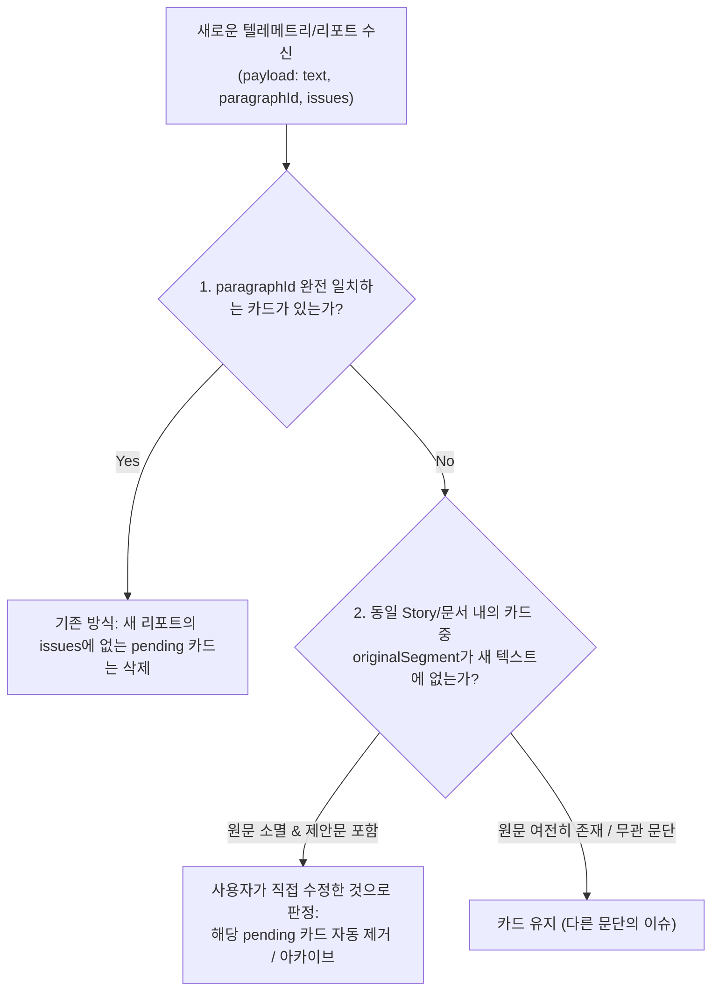

# 해결된 QA 카드가 자동으로 안 사라지는 버그 원인 진단 및 해결 방향 제안 (AGY)

## 1. 개요 및 요약

### 현상 재현 상황 요약
* **상황**: Task A(명시적 `commandId` 레지스트리 + `addReport` 해결된 카드 자동 제거), Task B/C(`paragraphId` 및 `baseHash` 기반 InDesign 문단 역추적), Task E(InDesign [위치 보기])까지 반영된 환경.
* **증상**:
  1. 상단 "InDesign 문단 감지" 텔레메트리 박스에는 방금 캡처된 타임스탬프와 함께 문단 내용이 이미 정상 텍스트인 `"일요일"`로 표시되고 있음.
  2. 그러나 바로 아래 QA 카드는 여전히 `"일오일"` $\rightarrow$ `"일요일"` 오탈자 수정 제안을 `pending` 상태로 유지하며, `[적용]`, `[무시]`, `[위치 보기]` 버튼이 모두 활성화되어 있음.
  3. `[위치 보기]`를 클릭하면 `"The paragraph could not be found. The document may have changed."` 에러로 실패함.

---

### 핵심 진단 요약

이 버그는 **InDesign 편집 특성(문단 Index 밀림 및 Character Offset 변동)과 프론트엔드 `qaStore.addReport`의 경직된 단일 `paragraphId` 문자열 일치 필터링이 결합되어 발생한 "Stale 카드 생명주기 고립(Lifecycle Isolation)" 현상**입니다.

1. **[직접 원인: `paragraphId`의 상대적 가변성]**:
   - `TextObserver`가 생성하는 `paragraphId`(`indesign-para-{storyId}-{paragraphIndex}`)는 영구 고유 식별자가 아니라 에디터 내의 **위치/오프셋 기반 상대 식별자**입니다.
   - 사용자가 InDesign 본문에서 오타를 직접 수정하거나 줄바꿈/문단 추가·삭제를 수행하면 해당 문단(또는 이후 문단들)의 `paragraphIndex`가 실시간으로 바뀝니다.
2. **[직접 원인: `addReport`의 `paragraphId` 완전 일치 조건]**:
   - `qaStore.addReport`는 `card.paragraphId === payload.paragraphId`인 카드만 검사하여 리포트에 이슈가 없으면 제거합니다.
   - 텔레메트리/새 리포트의 `paragraphId`가 옛 카드의 `paragraphId`와 단 1자라도 다르면, `card.paragraphId !== payload.paragraphId` 조건이 참(True)이 되어 **옛 카드는 필터링 대상에서 완전히 제외되어 영구 방치(Zombie Card)**됩니다.
3. **[`[위치 보기]` 실패가 증명하는 물리적 진실]**:
   - `[위치 보기]`(`locateParagraph` $\rightarrow$ `findParagraphById`)는 `baseHash`를 이용해 InDesign 문서 전체 Story를 전수 조사(Slow Path)합니다.
   - 그럼에도 `"The paragraph could not be found..."`가 반환되었다는 것은, **현재 InDesign 문서 내에 카드의 `baseHash`("일오일" 상태)를 가진 문단이 0개**라는 명백한 증거입니다.
   - 즉, 문서는 이미 수정되었으나 프론트엔드 카드는 이를 감지하고 스스로를 정리할 수단이 없습니다.

---

## 2. 근본 원인 상세 진단 (Root Cause Diagnosis)

### 진단 1: `paragraphId` 불일치 메커니즘 (Paragraph Index Drift)

* **관련 코드**:
  * `plugins/indesign/extendscript/text_observer.jsx` (L263-L273)
  * `src/stores/qaStore.ts` (L161-L167)

```javascript
// text_observer.jsx: 문단 인덱스를 결합하여 paragraphId 생성
var storyId = targetParagraph.parentStory ? (targetParagraph.parentStory.id || 'story-0') : 'story-0';
var paragraphIndex = (typeof targetParagraph.index === 'number') ? targetParagraph.index : 0;
var pId = 'indesign-para-' + storyId + '-' + paragraphIndex;
```

```typescript
// qaStore.ts: addReport의 카드 정리 로직
set((state) => ({
  cards: state.cards.filter((card) =>
    card.paragraphId !== payload.paragraphId || // 🚨 paragraphId가 다르면 무조건 유지!
    card.status !== 'pending' ||
    issueKeys.has(`${card.category}\u0000${card.originalSegment}\u0000${card.suggestedSegment}`)
  ),
}));
```

#### 메커니즘 분석
1. **InDesign DOM의 `Paragraph.index` 특성**:
   - Adobe InDesign ExtendScript DOM에서 Text/Paragraph 객체의 `.index` 프로퍼티는 부모 Story 내에서의 시작 문자 인덱스(0-based Character Offset)이거나 문단 컬렉션의 순번입니다.
   - 문서 앞쪽에서 글자를 타이핑하거나, 엔터를 치거나, 문단을 합치는 모든 편집 행위는 이후 문단들의 `index` 값을 즉각 변동시킵니다.
2. **시나리오 발생 과정**:
   - **Step 1 (초기 진단)**: 문단 `"일오일 아침에는..."`이 감지되어 `indesign-para-214-0` (baseHash: `hash_일오일`)로 QA 카드가 생성됨.
   - **Step 2 (문서 편집)**:
     - (Case A) 사용자가 앞 문단에서 엔터를 쳐서 문단 번호가 1로 밀림 $\rightarrow$ 이제 해당 문단은 `indesign-para-214-1`이 됨.
     - (Case B) 사용자가 InDesign 본문에서 직접 `"일오일"`을 `"일요일"`로 수정함.
   - **Step 3 (새 텔레메트리 & 리포트 수신)**:
     - InDesign이 `"일요일"` 문단을 캡처하여 `indesign-para-214-1` (hash: `hash_일요일`) 텔레메트리를 전송.
     - 1초 후 LLM 분석 결과가 들어와 `addReport`가 실행됨 (`payload.paragraphId = 'indesign-para-214-1'`).
   - **Step 4 (`addReport` 필터 평가)**:
     - 옛 카드의 `card.paragraphId`는 `'indesign-para-214-0'`임.
     - `card.paragraphId !== payload.paragraphId` (`'indesign-para-214-0' !== 'indesign-para-214-1'`) $\rightarrow$ **`true` 반환!**
     - 필터는 해당 카드를 정상 보존 대상으로 취급하여 삭제하지 않고 그대로 남겨둡니다.

---

### 진단 2: `addReport` 호출/실행 흐름 검증

질문: *"혹시 `addReport` 자체가 호출되지 않았거나, 리포트에 issues가 있는 것으로 잘못 나온 것인가?"*

| 점검 항목 | 분석 및 확인 결과 | 가능성 |
| :--- | :--- | :---: |
| **1. 텔레메트리 수신 여부** | 상단 텔레메트리 UI 박스에 방금 시각의 `"일요일"` 텍스트가 정상 출력되었으므로 `new-paragraph-detected` 이벤트는 정상 수신됨. | 확인됨 |
| **2. LLM 분석 이슈 생성 여부** | `"일요일"` 텍스트에 대해 LLM QA 분석이 정상 수행되었다면 오탈자가 없으므로 `issues: []` (PASS)가 반환됨. (만약 LLM이 오판했더라도 카드의 원문 `"일오일"`은 새 본문에 존재하지 않으므로 새 카드가 추가되진 않음) | 배제됨 |
| **3. Debounce 중 커서 이동에 의한 분석 취소** | 사용자가 InDesign에서 `"일오일"`을 `"일요일"`로 수정한 직후, 1초(Debounce 대기 시간)가 지나기 전에 다른 문단이나 다른 창을 클릭하여 커서를 옮긴 경우: `qaStore.ts`의 `analysisRequestVersions`가 새 문단으로 갱신되어 `"일요일"` 문단에 대한 `addReport` 호출 자체가 스킵되었을 가능성 존재. | 가능 |
| **4. 종합 결론** | `addReport`가 정상 호출되었더라도 **진단 1의 `paragraphId` 불일치로 인해 카드가 절대 지워질 수 없는 구조**이며, 커서 이동 시에는 `addReport`조차 발생하지 않아 이중으로 카드가 방치됨. | **핵심 원인** |

---

### 진단 3: `[위치 보기]` 실패 반응이 증명하는 결정적 사실

* **관련 코드**: `plugins/indesign/extendscript/atomic_replacer.jsx` (L53-L125)

```javascript
// atomic_replacer.jsx: findParagraphById
// 1. Fast Path: 인덱스로 문단 조회 후 baseHash 검증
if (paragraphIndex >= 0 && paragraphIndex < story.paragraphs.length) {
    paragraph = story.paragraphs[paragraphIndex];
    if (paragraph && getHashUtil().computeParagraphHash(paragraph.contents, true) === baseHash) {
        return paragraph;
    }
}
// 2. Slow Path: 전체 Story 문단을 순회하여 baseHash와 일치하는 문단 탐색
for (var i = 0; i < story.paragraphs.length; i++) {
    if (getHashUtil().computeParagraphHash(story.paragraphs[i].contents, true) === baseHash) {
        matches.push(story.paragraphs[i]);
    }
}
return matches.length === 1 ? matches[0] : null;
```

#### 진단 함의
* `[위치 보기]`를 눌렀을 때 `"The paragraph could not be found. The document may have changed."`가 반환된 과정:
  1. `story.paragraphs[paragraphIndex]`의 현재 해시(`hash_일요일`)가 카드의 `baseHash`(`hash_일오일`)와 일치하지 않아 Fast Path 실패.
  2. Story 전체의 모든 문단을 순회했으나 `hash_일오일`을 가진 문단이 전혀 없어 Slow Path 실패 $\rightarrow$ `null` 반환.
* **의미**: InDesign 문서 상에서 카드가 지적한 `"일오일"` 상태의 원문 문단은 **이미 영구히 소멸(사용자가 직접 고쳤거나 삭제됨)**되었습니다.
* 그럼에도 불구하고 프론트엔드의 카드는 자신이 가리키는 원문이 사라진 줄을 전혀 모르고 `pending` 상태로 멍하니 남아있는 것입니다.

---

## 3. 요청 2에 대한 의견: 프론트엔드 카드 정리 로직의 해시/내용 기반 무효화 적용 검토

> **질문**: Task B/C에서 InDesign 쪽에 도입한 "인덱스가 밀려도 baseHash로 같은 문단을 재발견" 개념을, 이 프론트엔드 `addReport`의 카드 정리 로직에도 적용해야 하는가?

### 결론: **적극 적용 필수 (Strongly Recommended)**

현재 아키텍처는 **백엔드(InDesign ExtendScript)와 프론트엔드(`qaStore`) 간의 심각한 비대칭성**을 가지고 있습니다:
* **백엔드**: "문단 Index가 밀려도 `baseHash`를 대조하여 실제 문단을 추적·복구한다." (Task B/C 반영 완료)
* **프론트엔드**: "문단 Index가 1이라도 바뀌면(`paragraphId` 불일치) 완전히 다른 문단으로 취급하고 이전 카드를 정리하지 않는다." (Task A의 한계)

사용자는 SmartLinter UI의 [적용] 버튼만 누르는 것이 아니라, **InDesign 에디터에서 직접 키보드로 오타를 수정(수동 편집)하는 경우가 매우 흔합니다.** 따라서 프론트엔드 카드 관리자(`qaStore`) 역시 내용 기반(Content/Segment/Hash)의 정합성 검증 능력을 갖추어야 합니다.

---

### 세부 메커니즘 검토 및 엣지 케이스(Edge Cases) 분석

프론트엔드 카드 정리 로직을 확장할 때 반드시 고려해야 할 항목과 해결책입니다:



#### 1. 동일 Story 스코프 한정 검증 (동음이의어 오제거 방지)
* **위험**: 문서 내에 `"입니다."`나 `"그러나"` 같은 흔한 세그먼트가 여러 문단에 걸쳐 존재할 때, 1개 문단만 수정되었는데 다른 문단의 카드까지 일괄 삭제될 위험.
* **해결책**:
  - `paragraphId`에서 추출한 `storyId`가 동일한 카드에 대해서만 내용 대조를 수행.
  - 단순 `originalSegment` 존재 여부뿐 아니라, 카드가 기억하고 있는 **과거 전체 문단 텍스트(`card.paragraphText`)와의 유사도/포함 관계** 또는 **제안문(`card.suggestedSegment`)이 새 문단에 실제로 반영되었는지 여부**를 복합 확인.

#### 2. 다중 이슈(Multi-Issue) 문단의 부분 수정 처리
* **상황**: 1개 문단에 맞춤법 이슈 A("일오일" $\rightarrow$ "일요일")와 외래어 이슈 B("컨테이너" $\rightarrow$ "컨테이너선")가 동시에 존재하는데, 사용자가 "일오일"만 수동으로 고친 경우.
* **해결책**:
  - 카드 단위로 `originalSegment`가 새 문단에서 사라졌는지 개별 평가.
  - 이슈 A의 카드는 `originalSegment`("일오일")가 새 문단 텍스트에 없으므로 제거.
  - 이슈 B의 카드는 `originalSegment`("컨테이너")가 여전히 새 문단에 남아있으므로 `paragraphId`와 `paragraphHash`를 새 값으로 갱신(Re-anchor)하며 유지.

---

## 4. 구체적 해결 방향 제안 (Actionable Architectural Proposals)

코드 수정 없이 향후 구현할 수 있는 3단계 해결 방향입니다.

### 방향 1: `qaStore.addReport`의 3단계 다층 카드 정합성 검증 (Multi-Tiered Reconciliation)

`addReport`가 새 리포트를 적용할 때, 아래 3가지 조건 중 하나라도 만족하면 해당 카드를 정리(제거)하도록 개선:

1. **Tier 1 (기존 위치 일치)**: `card.paragraphId === payload.paragraphId`이고 새 `issueKeys`에 없음.
2. **Tier 2 (직접 수정 감지 - Direct Edit Resolution)**:
   - 카드의 `storyId`가 `payload.paragraphId`의 `storyId`와 일치함.
   - 새 문단 텍스트(`payload.paragraphText`)에 카드의 `originalSegment`가 더 이상 존재하지 않음 (`!payload.paragraphText.includes(card.originalSegment)`).
   - 동시에 새 문단 텍스트에 카드의 `suggestedSegment`가 포함되어 있음 (`payload.paragraphText.includes(card.suggestedSegment)`).
   $\rightarrow$ 사용자가 직접 수정을 완료했으므로 즉시 자동 제거.
3. **Tier 3 (문단 인덱스 밀림 자동 재연결 / Re-anchoring)**:
   - 새 문단 텍스트에 카드의 `originalSegment`가 여전히 남아있고 새 리포트에도 동일 이슈가 존재하는 경우, 카드를 중복 생성하지 않고 기존 카드의 `paragraphId`와 `paragraphHash`를 최신 값으로 업데이트.

---

### 방향 2: `[위치 보기]` 및 `[적용]` 시점의 Stale 카드 능동 처리 (Active Stale Handling)

1. **`[위치 보기]`에서 `NOT_FOUND` 반환 시**:
   - 현재는 사용자에게 에러 알림만 띄우고 카드는 그대로 `pending`으로 남아있음.
   - 이를 개선하여: "해당 문단이 문서에서 수정되었거나 삭제되었습니다. 카드를 닫으시겠습니까?" 다이얼로그 제공 또는 카드의 상태를 `stale_obsolete`로 전환하여 [카드 닫기] 버튼 표시.
2. **`[적용]`에서 `STALE_REJECTED` 복구 불가 시**:
   - `baseHash`로도 문단을 찾을 수 없는 경우 카드를 에러 상태로 방치하지 않고 완료/무효 처리 유도.

---

### 방향 3: 텔레메트리 디바운스 및 포커스 아웃(Blur / Selection Change) 안정성 강화

* **원인**: 사용자가 수정한 직후 1초 이내에 다른 곳을 클릭하면 디바운스 타이머가 취소되어 수정된 문단에 대한 `addReport` 자체가 누락되는 문제.
* **해결책**:
  - `new-paragraph-detected` 발생 시, **이전 문단과 다른 `paragraphId`가 들어오면 이전 문단의 대기 중인 타이머를 `clearTimeout`하지 않고 즉시 강제 실행(Flush)**하여 마지막 수정 문단의 QA 검사가 누락되지 않도록 보장.

---

## 5. 결론

* **현상의 본질**: 버그 리포트의 스크린샷 상황은 "사용자가 InDesign에서 직접 오타를 수정하여 텔레메트리에는 반영되었으나, 문단 위치 변동(Index Drift) 및 `addReport`의 엄격한 `paragraphId` 문자열 매칭으로 인해 이전 카드가 정리되지 못한 상태"입니다.
* **결론**: Task B/C에서 InDesign 백엔드에 도입했던 `baseHash` 및 세그먼트 기반 문단 역추적 개념을 프론트엔드 `qaStore`의 카드 생명주기 관리 로직에도 대칭적으로 도입하는 것이 정답이며, 이를 통해 수동 편집과 자동 치환 양쪽 모두에서 완벽한 상태 동기화를 달성할 수 있습니다.
