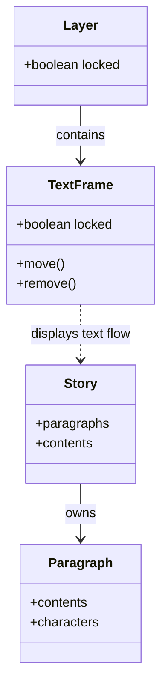
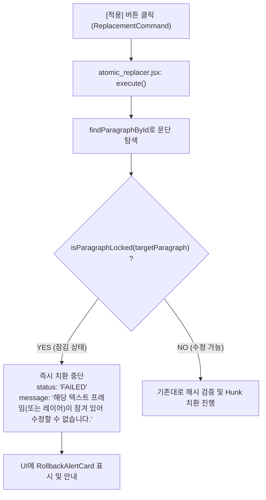

# InDesign 프레임 잠금 우회 현상 진단 및 롤백 안전망 테스트 대안 (AGY)

## 1. 개요 및 핵심 결론 요약

### 현상 요약
Task 19 시나리오 3(롤백 안전망) 라이브 테스트를 위해 InDesign에서 텍스트 프레임을 `Object > Lock` (`Ctrl+L`)으로 잠근 후 SmartLinter에서 **[적용]**을 실행했으나, 예상했던 `FAILED` 또는 `ROLLED_BACK` 실패가 발생하지 않고 **잠긴 상태의 프레임 내 텍스트가 정상적으로 치환**됨.

---

### 핵심 결론 요약

1. **[질문 1에 대한 결론]**: 
   - **InDesign ExtendScript DOM의 정상적이고 공식적인(Expected/Documented) 동작이 맞습니다.**
   - InDesign에서 `PageItem.locked = true`는 **UI 인터랙션(마우스/키보드 직접 편집) 및 레이아웃 기하 변형(이동, 크기 조절, 삭제 등)**만 차단할 뿐, ExtendScript를 통한 **Story / Paragraph / Character 레벨의 텍스트 DOM 쓰기(`contents = ...`)는 엔진 차원에서 차단하지 않습니다.**
   - 따라서 **"프레임 잠금으로 치환 실패를 유도한다"는 테스트 가설 및 방법론 자체가 InDesign DOM 구조상 잘못된 접근**이었습니다.
   - 시나리오 3(롤백 안전망)은 이미 코드에 구현되어 있는 **`simulateErrorAtHunk` 옵션(화이트박스)** 또는 **Hunk 텍스트 불일치(블랙박스)**를 통해 100% 결정론적으로 재현할 수 있습니다.

2. **[질문 2에 대한 결론]**: 
   - **SmartLinter 입장에서 반드시 명시적인 방어 로직을 갖추어야 할 실사용 안전성(Safety/Integrity) 이슈가 맞습니다.**
   - DTP 및 번역/출판 실무에서 사용자가 프레임이나 레이어를 잠그는 행위는 단순 레이아웃 고정을 넘어 **"검수 완료된 확정 문구(Sign-off / Content Freeze) 보호"** 의도를 포함합니다.
   - UI에서는 편집이 금지된 텍스트를 SmartLinter가 아무런 경고나 차단 없이 덮어써버리는 것은 사용자에게 **"통제를 벗어난 유령 수정(Ghost Mutation)"**으로 인식되어 심각한 신뢰성 문제를 야기할 수 있습니다.
   - 따라서 `atomic_replacer.jsx`에 **`parentTextFrames` 및 `itemLayer`의 잠금 여부를 사전에 검사하여 치환을 안전하게 거부(Reject with Clear Message)하는 가드 로직을 추가**할 것을 강력히 권장합니다.

---

## 2. 질문 1 상세 진단: InDesign ExtendScript Lock 동작 및 테스트 대안

### 1) InDesign ExtendScript의 Lock 객체 모델 동작 메커니즘

InDesign의 내부 객체 모델(DOM)은 **레이아웃(Layout) 계층**과 **텍스트 내용(Story/Text) 계층**이 엄격하게 분리되어 있습니다.



* **`TextFrame.locked = true`의 실제 적용 범위**:
  - UI 상에서 마우스 클릭 선택 방지, Selection 도구로 이동/크기 변경 방지.
  - UI 문자 도구(Type Tool)로 커서를 찍거나 텍스트를 입력/삭제하는 사용자 입력 차단.
  - 스크립트 상에서 `textFrame.move()`, `textFrame.remove()` 등 Frame 객체 자체를 파괴/변형하는 API 호출 시 런타임 에러 발생.
* **텍스트 내용(`Story` / `Paragraph` / `Character`)의 독립성**:
  - 텍스트의 실제 데이터는 `TextFrame`이 아니라 `Story` 객체에 존재합니다. (하나의 Story가 여러 TextFrame으로 흘러넘칠 수 있는 Threaded Text 구조 때문).
  - ExtendScript가 `story.paragraphs[i].characters.itemByRange(...).contents = newText`로 텍스트를 쓸 때, InDesign C++ 코어 엔진은 부모 `TextFrame`의 `locked` 속성을 검사하여 스크립트 예외를 던지지 않습니다.
  - Layer가 잠겨(`Layer.locked = true`) 있는 경우에도 동일하게 텍스트 DOM 직접 쓰기는 성공합니다.
* **결론**: 프레임 잠금 상태에서 치환이 성공한 것은 버그가 아니라 InDesign ExtendScript API의 본래 동작입니다.

---

### 2) 시나리오 3 (롤백 안전망) 실질적 재현 대안 제안

시나리오 3의 검증 목적은 **"치환 도중 예기치 못한 에러가 발생했을 때, `UndoModes.ENTIRE_SCRIPT`가 작동하여 이전의 모든 변경사항을 100% 원상복구하고 프론트엔드에 `ROLLED_BACK` 또는 `FAILED` 상태를 정상 보고하는가"**입니다.

이를 확실하게 검증하기 위한 3가지 현실적인 방법을 제안합니다.

---

#### 대안 A: `simulateErrorAtHunk` 옵션 활용 (가장 권장 / 결정론적 화이트박스 테스트)

`plugins/indesign/extendscript/atomic_replacer.jsx`에는 이미 롤백 검증을 위해 설계된 **`simulateErrorAtHunk`** 주입 포인트가 준비되어 있습니다.

```javascript
// atomic_replacer.jsx (L508-L525)
var simulateErrorAtHunk = (typeof options.simulateErrorAtHunk === 'number')
    ? options.simulateErrorAtHunk
    : -1;
...
if (runner) {
    txResult = runner.runInTransaction(function() {
        for (var i = 0; i < sortedHunks.length; i++) {
            var hunk = sortedHunks[i];

            // Simulated error injection for testing / verification
            if (simulateErrorAtHunk === i) {
                throw new Error('Simulated InDesign DOM mutation error at step #' + i + ' ("' + hunk.oldText + '" -> "' + hunk.newText + '")');
            }
            ...
```

* **재현 절차**:
  1. 1개 문단에 **2개 이상의 오탈자(Multi-Hunk)**가 있는 검수 카드를 준비합니다. (예: `"월요일과 일오일에는 회의를 진행합니다"` $\rightarrow$ Hunk 0: `"일오일"` $\rightarrow$ `"일요일"`, Hunk 1: ...).
  2. 치환 실행 시 `options.simulateErrorAtHunk = 1` (두 번째 Hunk 치환 시점에 에러 throw)을 주입합니다.
  3. **검증 포인트**:
     - 첫 번째 Hunk가 치환된 직후 강제 Exception 발생.
     - `transaction_runner.jsx`의 `app.doScript(..., UndoModes.ENTIRE_SCRIPT)`가 예외를 포착하여 첫 번째 Hunk로 바뀐 텍스트까지 깨끗하게 원상 복구.
     - 프론트엔드로 `{ status: 'ROLLED_BACK', message: 'Replacement error encountered (Simulated InDesign DOM mutation error...). InDesign native UndoModes.ENTIRE_SCRIPT 100% atomic rollback executed.' }` 수신.
     - UI에 `RollbackAlertCard`가 정상 렌더링되고 InDesign 본문은 1글자도 바뀌지 않은 원래 상태로 유지됨을 확인.

---

#### 대안 B: Hunk 텍스트 불일치 유발 (실제 사용자 편집 충돌 재현 / 블랙박스 테스트)

InDesign 본문을 살짝 수정하여 Hunk 치환 시점의 DOM 불일치를 유도하는 방법입니다.

* **재현 절차**:
  1. SmartLinter에 QA 카드(예: `"일오일"` $\rightarrow$ `"일요일"`)가 올라온 상태를 만듭니다.
  2. InDesign 본문에서 해당 단어의 바로 앞이나 중간 글자를 수동으로 변경합니다 (예: `"일오일"` $\rightarrow$ `"일오일!"` 또는 `"일육일"`). 단, 해시 검증을 우회하여 Hunk 단계까지 진입시키려면 멀티 Hunk 상황에서 첫 번째 Hunk 위치를 조작하거나, `validateHunks`를 통과한 후 InDesign DOM 치환 직전 불일치를 유발합니다.
  3. `applyHunkToParagraph`에서 `charRange.contents !== oldText`가 발생하여 `throw new Error('InDesign DOM range mismatch...')`가 실행되고 즉시 트랜잭션 롤백이 발동합니다.

---

#### 대안 C: 존재하지 않는 오프셋을 가진 가짜 Hunk 주입 (Edge Case 테스트)

* **재현 절차**:
  1. 단일 문단에 대해 Hunk의 범위를 문단 길이보다 큰 값(예: `start: 999, end: 1005`)으로 조작한 `ReplacementCommand`를 발송합니다.
  2. `validateHunks`에서 `out of bounds` 에러로 실패하거나, `applyHunkToParagraph`에서 인덱스 에러가 발생하여 `FAILED` / `ROLLED_BACK` 경로를 타게 됩니다.

---

## 3. 질문 2 상세 진단: 잠긴 프레임 덮어쓰기 문제 및 SmartLinter 방어 정책 의견

### 1) 실사용 워크플로우에서의 위험성 분석

질문하신 시나리오는 실제 디자인 및 출판/로컬라이제이션 현장에서 **매우 심각한 사고(Data Corruption)**를 유발할 수 있습니다.

| 사용자의 실제 상황 | 사용자의 명시적 의도 | 현재 SmartLinter의 동작 시 위험 |
| :--- | :--- | :--- |
| **다국어 번역 완료 후 프레임 잠금** | 번역 검수가 승인(Sign-off)되어 확정된 문구이므로 더 이상 누구도 수정하지 못하게 동결함 | SmartLinter가 맞춤법/용어집 규칙에 따라 잠긴 프레임을 임의로 수정하여 승인 완료 문서 훼손 |
| **마스터/템플릿의 고정 고지문 잠금** | 법적 고지(Legal Disclaimer), 상표권 표기(TM, ®) 등 원문 그대로 유지되어야 하는 필수 문구 | 린터가 오탈자로 오인하여 수정 제안 후 [적용] 시 법적 필수 문구 임의 변경 |
| **디자이너의 레이아웃 보호 잠금** | 텍스트 박스 위치/크기가 틀어지지 않도록 잠가둠 | 텍스트는 수정될 수 있으나, 글자 수가 크게 바뀌어 넘침(Overset Text)이 발생했을 때 잠긴 프레임이라 디자이너가 인지하지 못함 |

**사용자의 멘탈 모델**:
사용자는 InDesign UI에서 텍스트 도구로 클릭했을 때 커서가 들어가지 않는 프레임이라면, 당연히 **외부 플러그인이나 린터 프로그램도 해당 영역을 수정할 수 없거나 최소한 경고를 줄 것이라 기대**합니다. 잠금을 무시하고 조용히 덮어쓰는 것은 신뢰성을 떨어뜨리는 주원인이 됩니다.

---

### 2) InDesign DOM의 잠금 상태 판별 구조

InDesign ExtendScript에서 특정 문단이 잠겨있는지 정확히 판별하려면 아래 2개 계층을 검사해야 합니다.

```javascript
/**
 * 대상 문단이 속한 텍스트 프레임 또는 레이어가 잠겨있는지 확인하는 로직
 */
function isParagraphLocked(paragraph) {
    if (!paragraph || !paragraph.isValid) return false;

    // 1. 문단을 담고 있는 부모 텍스트 프레임(들) 검사
    var frames = paragraph.parentTextFrames;
    if (frames && frames.length > 0) {
        for (var i = 0; i < frames.length; i++) {
            var frame = frames[i];
            if (frame && frame.isValid) {
                // 프레임 자체가 잠겨있는 경우
                if (frame.locked === true) {
                    return true;
                }
                // 프레임이 속한 레이어가 잠겨있는 경우
                if (frame.itemLayer && frame.itemLayer.locked === true) {
                    return true;
                }
            }
        }
    }

    // 2. InCopy / Story 단위 잠금 검사 (해당 환경인 경우)
    if (paragraph.parentStory) {
        var story = paragraph.parentStory;
        if (story.lockState && story.lockState !== LockStateValues.UNLOCKED) {
            return true;
        }
    }

    return false;
}
```

---

### 3) SmartLinter 권장 방어 정책 (Safety Architecture)

린터 도구의 최우선 가치는 **"안전성(Safety)"**과 **"작업자 의도 존중"**입니다. 따라서 다음과 같은 2단계 안전망 도입을 권장합니다:



1. **치환 가드 (Execution Guard)**:
   - `atomic_replacer.jsx`의 `execute()` 시작 시, 대상 문단에 대해 `isParagraphLocked()`를 실행.
   - 잠겨있다면 트랜잭션을 시작하지도 않고 즉시 `status: 'FAILED'`, `message: '해당 텍스트 프레임 또는 레이어가 잠겨 있어 수정할 수 없습니다. InDesign에서 잠금을 해제한 후 다시 시도해 주세요.'` 반환.
2. **텔레메트리 및 UI 가시성 확보 (Telemetry & UI Extension)**:
   - `text_observer.jsx`가 활성 문단을 감지할 때 `isLocked: boolean` 플래그를 함께 전송.
   - 프론트엔드 QA 카드에 🔒 자물쇠 아이콘 표시 및 `[적용]` 버튼을 비활성화(또는 툴팁으로 "잠긴 프레임" 안내)하여 불필요한 실패 시도를 사전에 방지.

---

## 4. 요약 및 권장 사항

1. **테스트 방법론 수정**:
   - InDesign 프레임 잠금은 ExtendScript DOM 쓰기를 막지 못하므로, 시나리오 3 테스트는 **`simulateErrorAtHunk` 옵션** 또는 **텍스트 내용 변형(Hunk Mismatch)**을 통해 진행해야 합니다.
2. **잠금 방어 로직 구현 권장**:
   - 사용자가 명시적으로 잠근 프레임의 내용을 무단 수정하는 것은 실사용에서 치명적인 데이터 변조 위험을 내포하고 있습니다.
   - 추후 작업 시 `atomic_replacer.jsx`에 잠금 검사 로직(`parentTextFrames.locked` / `itemLayer.locked`)을 추가하여 명확한 실패 사유와 함께 치환을 안전하게 차단할 것을 제안합니다.

> **안내:** 본 문서는 사용자 요청에 따라 코드 수정 없이 원인 진단 및 기술적 의견만으로 작성되었습니다.
