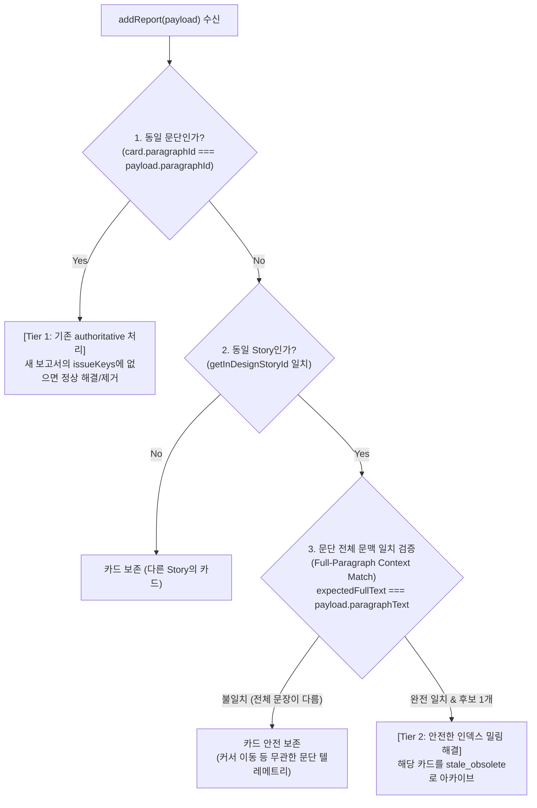

# InDesign 포커스 이동 시 무관한 QA 카드가 오탐 아카이브되는 버그 진단 및 해결 방향 (AGY)

## 1. 진단 결과 확인 (Diagnosis Verification)

### 결론: **Claude의 진단은 100% 정확하며, 명백한 로직 결함(Flawed Heuristic)입니다.**

`BUG_REPORT_FALSE_DIRECT_EDIT_ARCHIVE.md`에서 지적한 진단 내용은 코드의 실행 경로와 완전히 일치합니다.

---

### 코드 레벨의 원인 분석 (`src/stores/qaStore.ts` L173-L185)

```typescript
// src/stores/qaStore.ts: addReport 내 직접 수정 감지 로직
const storyId = getInDesignStoryId(payload.paragraphId);

set((state) => {
  const directEditCandidates = storyId === null
    ? []
    : state.cards.filter((card) =>
        card.status === 'pending' &&
        getInDesignStoryId(card.paragraphId) === storyId &&
        !payload.paragraphText.includes(card.originalSegment) &&
        payload.paragraphText.includes(card.suggestedSegment)
      );
  const obsoleteCardIds = directEditCandidates.length === 1
    ? new Set([directEditCandidates[0].id])
    : new Set<string>();
```

#### 발생 메커니즘 단계별 추적:

1. **상황 가정**:
   - 문단 0 (`indesign-para-story-1-0`): `"오늘 날씨는 일오일 입니다."` $\rightarrow$ 오탈자 카드 A (`originalSegment: "일오일"`, `suggestedSegment: "일요일"`) 생성됨.
   - 문단 5 (`indesign-para-story-1-5`): `"일요일에는 정기 휴무입니다."` $\rightarrow$ 오탈자가 없는 정상 문단.
2. **사용자 행동**:
   - 사용자는 문단 0을 **전혀 수정하지 않고**, 단순히 마우스나 방향키로 커서를 **문단 5로 이동**시킴.
3. **이벤트 전달 및 평가**:
   - InDesign Bridge가 문단 5의 텔레메트리 수신 (`payload.paragraphId = 'indesign-para-story-1-5'`, `payload.paragraphText = '일요일에는 정기 휴무입니다.'`).
   - 1초 후 LLM 분석이 완료되어 `addReport` 실행.
   - `directEditCandidates` 필터 평가:
     - `getInDesignStoryId(cardA.paragraphId) === storyId` $\rightarrow$ `'story-1' === 'story-1'` (**참**)
     - `!payload.paragraphText.includes("일오일")` $\rightarrow$ 문단 5에 "일오일"이 없음 (**참**)
     - `payload.paragraphText.includes("일요일")` $\rightarrow$ 문단 5에 "일요일"이 포함됨 (**참**)
   - `directEditCandidates` 목록에 카드 A가 유일하게 매칭되어 `length === 1` 성립.
4. **버그 발생**:
   - 카드 A가 `stale_obsolete`로 분류되어 `dismissedCards`로 이동하고 활성 카드 목록(`state.cards`)에서 **영구 제거**됨.
   - **결과**: 사용자가 아무것도 고치지 않았음에도, 문단 0의 오탈자("일오일") 카드가 사라져서 오탈자가 교정되지 않고 방치되는 심각한 검수 누락 발생.

---

## 2. 트레이드오프 및 리스크 본질 분석 (Trade-off Assessment)

### 1) 위험성의 심각한 비대칭성 (Risk Asymmetry)

| 구분 | False Positive (현재 버그: 오탐 아카이브) | False Negative (Task F 이전: 미삭제 잔존) |
| :--- | :--- | :--- |
| **현상** | 사용자가 커서만 옮겼는데 무관한 카드가 소리없이 삭제됨 | 직접 고친 오타의 카드가 UI에 `pending` 상태로 남아있음 |
| **결과** | **오탈자가 그대로 인쇄/출판/배포물에 유출 (Critical Quality Failure)** | 사용자가 [적용] 시도시 거절되거나, [위치 보기] 실패 후 수동 닫기 가능 |
| **인지 가능성** | 사용자가 버그 발생 사실을 알아차릴 수 없음 (침묵의 데이터 유실) | UI에 카드가 보이므로 사용자가 인지하고 대응 가능 |
| **위험 등급** | 🚨 **치명적 결함 (P0)** | ⚠️ **단순 UX 불편 (P2)** |

> **핵심 원칙**: 린터/QA 도구에서는 **"False Positive(오탐으로 인한 유효 카드 삭제)를 0%로 만드는 것"**이 "False Negative(이미 고쳐진 카드의 자동 정리)"보다 압도적으로 우선되어야 합니다.

---

### 2) 왜 '단순 단어 포함' 휴리스틱이 실패했는가?

- `suggestedSegment`는 주로 **"일요일", "설정", "합니다", "의하여"**와 같이 자연어에서 빈번하게 사용되는 **극히 일반적인 표준어/올바른 단어**입니다.
- Story 전체 범위에서 한 문단에 올바른 단어가 들어있다고 해서, 그것이 "이전 카드의 오탈자를 직접 수정한 결과"라고 추론하는 것은 확률적으로 반드시 거짓(False)이 되는 근본적 결함입니다.

---

## 3. 안전한 수정 방향 제안 (Actionable Solutions)

단순히 `card.paragraphId === payload.paragraphId`로 되돌리기만 하면, Task F가 해결하려 했던 **"앞 문단 편집으로 `paragraphIndex`가 밀린 상태에서 직접 수정한 케이스"**를 놓치게 됩니다.

따라서 **2계층 다층 검증(Tiered Context Verification with Full-Paragraph Matching)** 방식을 제안합니다.



---

### 제안 1 (강력 권장): 문단 전체 텍스트 대조 기반 직접 수정 판정 (Full-Paragraph Context Matching)

SmartLinter의 `QACardData`는 카드 생성 당시의 **문단 전체 텍스트(`card.paragraphText`)**를 이미 보관하고 있습니다.

이를 활용하여 **"카드의 제안이 반영되었을 때 완성되어야 할 예상 문단 전체 텍스트(`expectedFullText`)"**를 생성하고, 새 텔레메트리의 `payload.paragraphText`와 **전체 일치(Exact Full-Text Match)**를 대조합니다.

#### 1) 구체적 로직 설계

```typescript
// 1. 카드의 전체 문단 텍스트에서 originalSegment를 suggestedSegment로 치환한 '예상 완성 문단' 계산
function getExpectedFullText(card: QACardData): string | null {
  if (!card.paragraphText || !card.paragraphText.includes(card.originalSegment)) {
    return null;
  }
  const startIndex = card.paragraphText.indexOf(card.originalSegment);
  return (
    card.paragraphText.substring(0, startIndex) +
    card.suggestedSegment +
    card.paragraphText.substring(startIndex + card.originalSegment.length)
  );
}

// 2. addReport 내의 직접 수정 후보 필터링
const directEditCandidates = storyId === null
  ? []
  : state.cards.filter((card) => {
      // 1) pending 상태여야 함
      if (card.status !== 'pending') return false;
      
      // 2) 동일 Story여야 함
      if (getInDesignStoryId(card.paragraphId) !== storyId) return false;

      // 3) [핵심 안전장치]
      // Case A: 동일 문단인 경우 (paragraphId 일치)
      if (card.paragraphId === payload.paragraphId) {
        return (
          !payload.paragraphText.includes(card.originalSegment) &&
          payload.paragraphText.includes(card.suggestedSegment)
        );
      }

      // Case B: 다른 문단/인덱스가 밀린 문단인 경우 (paragraphId 불일치)
      // 반드시 '문단 전체 텍스트'가 치환 예상 텍스트와 100% 일치해야 함!
      const expectedText = getExpectedFullText(card);
      return expectedText !== null && payload.paragraphText === expectedText;
    });
```

#### 2) 이 방식이 해결하는 것:
1. **포커스 이동 오탐 100% 차단**:
   - 문단 0: `"오늘 날씨는 일오일 입니다."` $\rightarrow$ `expectedText`: `"오늘 날씨는 일요일 입니다."`
   - 문단 5: `"일요일에는 정기 휴무입니다."`
   - `payload.paragraphText !== expectedText`이므로 문단 5로 포커스를 옮겨도 카드 0은 **절대 삭제되지 않고 안전하게 보존**됩니다.
2. **Task F의 인덱스 밀림 직접 수정 100% 지원**:
   - 사용자가 문단 0 앞쪽에서 엔터를 쳐서 문단 0이 문단 1(`indesign-para-story-1-1`)로 밀림.
   - 사용자가 문단 1에서 `"일오일"`을 `"일요일"`로 직접 타이핑 수정.
   - 텔레메트리 `payload.paragraphText`는 `"오늘 날씨는 일요일 입니다."`로 수신됨.
   - `expectedText`(`"오늘 날씨는 일요일 입니다."`)와 완벽하게 일치하므로, `paragraphId`가 바뀌었어도 **안전하게 카드가 아카이브**됩니다.

---

### 제안 2: 다중 수정/부분 수정 시의 Fallback 안전 정책

만약 사용자가 오탈자("일오일" $\rightarrow$ "일요일")를 직접 수정하면서, 동시에 같은 문단의 다른 단어나 문장부호까지 함께 수정했다면?
- 이때는 `payload.paragraphText === expectedText`가 일치하지 않게 됩니다.
- **권장 정책**:
  - `paragraphId`가 동일한 경우 $\rightarrow$ 새 QA 보고서의 `issues: []` 재분석 결과에 의해 자연스럽게 정리(Tier 1).
  - `paragraphId`까지 바뀐 복합 수정인 경우 $\rightarrow$ 억지로 추측하여 삭제하지 않고 **카드를 보존(Keep Pending)**.
  - 사용자가 나중에 해당 카드의 `[위치 보기]`나 `[적용]`을 눌렀을 때 백엔드의 `NOT_FOUND` / `STALE_REJECTED` 가드가 안전하게 처리하도록 위임.

---

## 4. 권장 회귀 테스트 시나리오 (Regression Test Suite)

수정 반영 시 `src/stores/__tests__/qaStore.test.ts`에 반드시 포함되어야 할 테스트 케이스:

1. **[버그 방지 검증] 동일 Story 내 제안 단어를 포함한 다른 문단으로 포커스 이동 시 카드 보존**:
   ```typescript
   it('does not archive unrelated cards when focusing on another paragraph in the same story that contains the suggested word', () => {
     const cardId = useQaStore.getState().addCard({
       paragraphId: 'indesign-para-story-1-0',
       paragraphText: '오늘 날씨는 일오일 입니다.',
       originalSegment: '일오일',
       suggestedSegment: '일요일',
       category: '맞춤법',
       reason: '오탈자',
     });

     // 무관한 다른 문단(문단 5)에 '일요일'이 포함되어 있고 '일오일'이 없는 텔레메트리 수신
     useQaStore.getState().addReport({
       paragraphId: 'indesign-para-story-1-5',
       paragraphText: '일요일에는 쉽니다.',
       paragraphHash: 'hash-para-5',
       report: { status: 'PASS', issues: [] },
     });

     // 카드가 절대 삭제되거나 stale_obsolete로 가면 안 됨
     expect(useQaStore.getState().cards.find((c) => c.id === cardId)).toBeDefined();
     expect(useQaStore.getState().dismissedCards).toHaveLength(0);
   });
   ```

2. **[Task F 기능 유지 검증] 문단 인덱스가 밀렸으나 전체 문단이 올바르게 직접 수정된 경우 정상 아카이브**:
   ```typescript
   it('archives card when full paragraph text exactly matches expected text after direct edit despite shifted index', () => {
     const cardId = useQaStore.getState().addCard({
       paragraphId: 'indesign-para-story-1-0',
       paragraphText: '오늘 날씨는 일오일 입니다.',
       originalSegment: '일오일',
       suggestedSegment: '일요일',
       category: '맞춤법',
       reason: '오탈자',
     });

     // 인덱스가 0 -> 1로 밀렸지만 전체 문단이 '오늘 날씨는 일요일 입니다.'로 수정되어 보고됨
     useQaStore.getState().addReport({
       paragraphId: 'indesign-para-story-1-1',
       paragraphText: '오늘 날씨는 일요일 입니다.',
       paragraphHash: 'hash-para-1-fixed',
       report: { status: 'PASS', issues: [] },
     });

     expect(useQaStore.getState().cards.find((c) => c.id === cardId)).toBeUndefined();
     expect(useQaStore.getState().dismissedCards).toEqual([
       expect.objectContaining({ id: cardId, status: 'stale_obsolete' }),
     ]);
   });
   ```

---

## 5. 최종 요약

1. **진단 확인**: `BUG_REPORT_FALSE_DIRECT_EDIT_ARCHIVE.md`의 진단은 정확합니다. Story 범위에서 단순 부분문자열(`includes(suggestedSegment)`)만 검사한 것이 오탐 아카이브의 직접적 원인입니다.
2. **트레이드오프 해법**: 단순 `paragraphId` 일치로 롤백하지 않고, **"동일 문단 일치(Tier 1)" OR "동일 Story 내 문단 전체 텍스트 치환 예상 일치(`expectedFullText === payload.paragraphText`)(Tier 2)"**의 2계층 다층 검증을 적용하면, 포커스 이동 시의 오탐을 100% 방지하면서도 Task F의 인덱스 밀림 추적을 온전히 달성할 수 있습니다.
