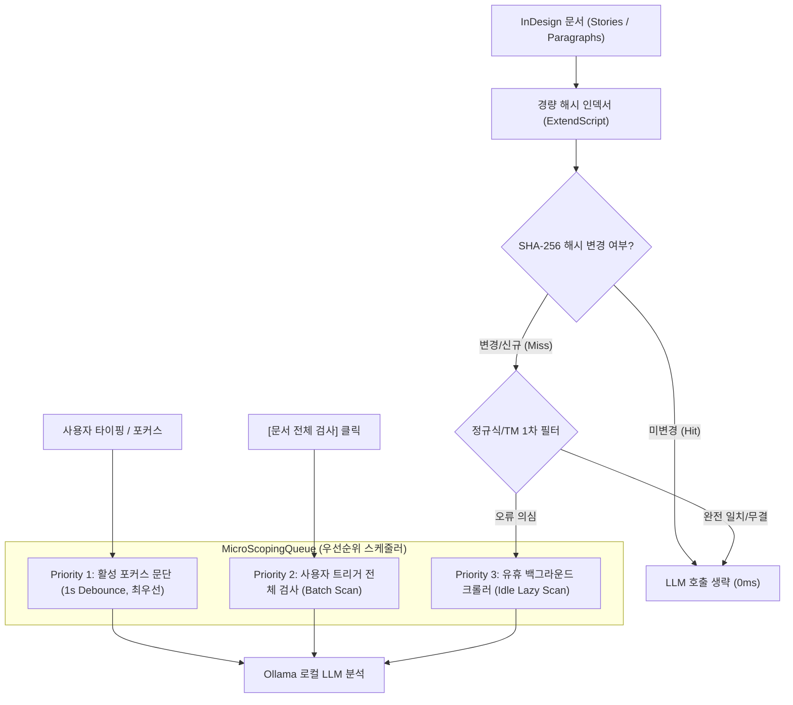

# 기능 제안 검토 의견서: 전체 문서 실시간 QA 스캔 및 상시 감시

**작성일시:** 2026-08-25  
**검토자:** agy (Antigravity Architecture & Reviewer)  
**대상 문서:** [FEATURE_PROPOSAL_FULL_DOCUMENT_SCAN.md](file:///D:/data/dev/App/SmartLinter/FEATURE_PROPOSAL_FULL_DOCUMENT_SCAN.md)  
**관련 문서:** [ORCHESTRATOR_STATUS.md](file:///D:/data/dev/App/SmartLinter/ORCHESTRATOR_STATUS.md), [TASK_REQUEST_STALE_CARD_RECONCILE_F.md](file:///D:/data/dev/App/SmartLinter/TASK_REQUEST_STALE_CARD_RECONCILE_F.md), [FEATURE_REVIEW_AGY.md](file:///D:/data/dev/App/SmartLinter/FEATURE_REVIEW_AGY.md)

---

## 1. 개요 및 총평 (Executive Summary)

사용자가 제기한 문제의식("AI 커맨드로 이미 치환·교정된 오탈자 카드가 자동 QA 카드 목록에 여전히 pending으로 남아있는 현상" 및 "문서 전체에 대한 자동 리스트업 요구")은 **실제 문서 교정 워크플로우에서 매우 자연스럽고 중요한 사용자 경험(UX) 개선 포인트**입니다.

그러나 기술 아키텍처 및 시스템 리소스 관점에서 분석한 결과:
1. **"상시 실시간 전체 문서 감시(Unthrottled Real-time Full Scan)"의 전면 도입은 로컬 LLM 환경(Ollama) 및 InDesign 단일 스레드 구조상 심각한 병목(큐 포화, UI 프리징, 실시간성 상실)을 초래**하므로 그대로 적용하는 것은 부적절합니다.
2. 사용자가 겪은 첫 번째 문제("AI 커맨드로 고쳤는데 자동 카드가 남는 현상")는 **상시 전체 스캔의 부재 때문이 아니라, 프론트엔드의 카드 생명주기 동기화(Task F 영역) 문제**입니다.
3. 따라서 올바른 접근법은 **"포커스 기반 즉시 반응(1초 디바운스)"을 코어로 유지**하면서, **"명시적 일회성 전체 스캔(`start_batch_scan`)"**과 **"유휴 시간 점진적 백그라운드 크롤러(Lazy Idle-Scan)"**를 결합하는 **3-Tier 하이브리드 아키텍처**로 설계하는 것입니다.

---

## 2. 5대 요청 항목별 상세 검토 의견

### Q1. "포커스 기반(활성 선택만 감지)"을 "전체 문서 상시 감시"로 전환하는 것의 타당성 및 부하 분석

> **결론: 구조적 전면 전환은 매우 위험하며 비권장. 로컬 LLM 지연 시간과 InDesign 엔진 특성상 시스템 마비를 유발할 수 있음.**

* **1. 로컬 LLM 처리 용량(Throughput) 및 지연 시간(Latency) 한계:**
  * SmartLinter는 클라우드 API가 아닌 로컬 Ollama(`qwen2.5:7b`, `gemma2:latest` 등)를 기반으로 동작합니다.
  * 단일 문단(100~300자) QA 분석에 평균 **1.5초 ~ 3.5초**가 소요됩니다 (GPU 사양에 따라 상이).
  * 일반적인 InDesign/Word 문서(10~50페이지)는 보통 **100개 ~ 500개 이상의 문단**으로 구성됩니다.
  * 만약 문서 전체를 LLM으로 스캔하면 1회 전체 순회에만 **최소 3분 ~ 25분 이상**의 연산 시간이 소요됩니다.
  * 사용자가 문서 앞부분에서 글자 하나를 타이핑할 때마다 전체 문서를 상시 재감시하려 한다면, LLM 큐(`MicroScopingQueue`)가 영구 포화 상태에 빠지게 됩니다.
  * **결과적으로 사용자가 지금 당장 타이핑 중인 문단의 실시간 피드백(1초 지연 피드백)이 수 분 뒤로 밀려버려, 실시간 Linter로서의 핵심 가치가 완전히 파괴**됩니다.

* **2. 하드웨어 부하 (CPU/GPU/VRAM 및 발열/배터리):**
  * 로컬 LLM이 백그라운드에서 상시 연속 추론을 돌리면 GPU/CPU 사용률이 100%에 고정되며, 노트북 환경에서는 심각한 배터리 소모와 발열, 팬 소음이 발생합니다.

* **3. InDesign ExtendScript 엔진의 단일 스레드(Single-Threaded) 블로킹:**
  * InDesign의 스크립팅 엔진은 메인 UI 스레드와 동일한 스레드에서 실행됩니다.
  * 매 1초 유휴 주기(`onIdleTick`)마다 수백 개의 Story와 Paragraph 컬렉션을 순회하며 텍스트와 해시를 추출하는 작업 자체가 대용량 문서에서 InDesign의 화면 스크롤 및 타이핑 반응성을 떨어뜨리는 마이크로 프리징(Micro-freezing)을 유발합니다.

---

### Q2. 일회성 전체 스캔(`start_batch_scan`) vs 상시 실시간 전체 감시의 관계

> **결론: 사용자가 명시한 대로 "일회성 전체 검사 버튼"은 반드시 독립된 핵심 기능으로 유지되어야 하며, 상시 감시와 상호보완적 병행이 정답입니다.**

* **일회성 전체 검사 버튼(`start_batch_scan` / `abort_batch_scan`)이 필수적인 이유:**
  1. **사용자의 멘탈 모델 및 확정성:** 실무자는 문서 번역/편집을 시작하기 전이나 최종 납품 전에 "문서 전체에 오류가 몇 개 있는지 명확히 확인"하고 싶어 합니다. 진행률(Progress: `35/120 문단 완료`)과 중단 버튼이 있는 명시적 배치가 제공되어야 작업 완료 시점을 신뢰할 수 있습니다.
  2. **시스템 자원 통제권:** 사용자가 원할 때만 집중적으로 연산 자원을 투입할 수 있어야 합니다.
* **두 기능의 올바른 역할 분담:**
  * **`[문서 전체 검사]` (일회성 배치):** 사용자가 버튼을 눌러 명시적으로 실행. 전체 문단을 큐에 인큐하고 UI에 진행률 바를 표시하며, 완료 시 전체 이슈 리포트를 확정 렌더링.
  * **`포커스 실시간 감시` (상시):** 사용자가 현재 커서를 두고 작업 중인 문단만 1초 디바운스로 즉각 분석.
  * **`유휴 백그라운드 크롤러` (보조 상시):** 에디터가 완전히 쉬고 있을 때(Idle), 아직 검사되지 않았거나 변경된 문단을 낮은 우선순위로 조금씩 백그라운드 분석.

---

### Q3. 상시 전체 감시를 위한 실용적인 절충안 설계 (3-Tier 아키텍처)

상시 감시의 이점(문서 전반의 이슈 자동 포착)을 취하면서 시스템 붕괴를 막기 위한 **구체적 절충 설계안**입니다.

1. **우선순위 선점형 큐 (Preemptive Priority Queue):**
   * `MicroScopingQueue`에 우선순위 레벨(High / Normal / Low)을 도입합니다.
   * 백그라운드 전체 스캔(Low)이 돌고 있더라도, 사용자가 특정 문단을 클릭하거나 타이핑(High)하면 백그라운드 작업을 즉시 일시정지(Yield)하고 활성 문단을 1순위로 즉시 처리합니다.
2. **SHA-256 해시 기반 Zero-LLM 캐싱 (Hash-Skip Cache):**
   * 문서 로드 시 모든 문단의 텍스트가 아닌 **해시 테이블**만 먼저 빌드합니다.
   * 이미 분석을 마친 문단은 해시가 바뀌지 않는 한 LLM을 절대 다시 호출하지 않습니다.
3. **경량 1차 필터링 (Fast Pre-filter before LLM):**
   * 모든 문단을 무조건 LLM에 보내지 않고, 가벼운 정규식 규칙(공백, 특수문자 규칙) 또는 TM 매칭 점수를 먼저 검사하여 **의심되는 문단만 선별적으로 LLM 큐에 인큐**합니다.
4. **유휴 청크 순회 (Throttled Chunked Crawler):**
   * `onIdleTick`에서 한 번에 1개 문단씩만 여유가 있을 때 백그라운드 큐에 공급하여 InDesign UI 스레드 부하를 0에 수렴하게 만듭니다.

---

### Q4. Task F("직접 수정 감지")가 이번 현상을 실제로 해결하는지 여부

> **결론: 이번 스크린샷의 문제("AI 커맨드로 고쳤는데 자동 카드가 남음")는 Task F로 90% 이상 해결됩니다. 다만 100% 즉시성 확보를 위한 '프론트엔드 크로스 스토어 동기화 1줄'이 추가로 권장됩니다.**

* **문제의 본질:**
  * 이번 현상은 "전체 문서 스캔 기능이 없어서" 생긴 것이 아니라, **"AI 커맨드로 문단 텍스트를 고쳤는데, 그 문단을 바라보던 기존 QA 카드가 자신이 해결되었다는 사실을 인지하지 못하고 방치되었기 때문"**입니다.
* **Task F 작동 시나리오:**
  1. 사용자가 하단 AI 커맨드로 "일오일" -> "일요일" 치환을 실행(`chatStore.applyCard`).
  2. InDesign 본문이 "일요일"로 변경됨.
  3. InDesign에서 텍스트 변경에 따른 새로운 텔레메트리(`paragraphText = "...일요일..."`)가 수신됨.
  4. Task F 로직 가동:
     * 원문 조건: `!newText.includes("일오일")` (참)
     * 제안문 조건: `newText.includes("일요일")` (참)
     * 단일 후보 카드 검증: 해당 Story 내 1건 매칭 확인 -> **기존 자동 QA 카드를 안전하게 즉시 제거/완료 처리.**
  5. 따라서 Task F가 배포되면 AI 커맨드로 고치든, 사용자가 직접 타이핑해서 고치든 옛날 오탈자 카드는 자동으로 정리됩니다.
* **추가 권장 보완점 (Zero-Latency Local Notification):**
  * InDesign 텔레메트리가 도착하기까지의 짧은 지연(0.5~1초)이나 포커스 이동 여부와 무관하게 즉각 반영되도록, `chatStore.applyCard` 성공 블록에서 `qaStore`로 직접 "치환 완료된 문단 정보"를 통보해주는 크로스 스토어 호출을 1줄 연결해주면 체감 반응성이 0ms로 완벽해집니다.

---

### Q5. 전체 백로그 대비 우선순위 및 로드맵 제안

현재 개발 중인 백로그들과 연계한 최적의 마일스톤 순서입니다.

```mermaid
gantt
    title SmartLinter 기능 로드맵 권고안
    dateFormat  X
    axisFormat %s

    section 1단계: 핵심 안정화
    Task F 직접 수정 감지 및 좀비 카드 제거       :active, t1, 0, 1
    
    section 2단계: UX 생산성 극대화
    적용 전 인라인 수정 (Inline Edit)            :t2, after t1, 1
    완료 카드 아카이브 (Completed Cards UI)       :t3, after t2, 1
    동일 이슈 일괄 적용 (Batch Apply)            :t4, after t3, 2
    
    section 3단계: 전체 문서 스캔 & 엔진 고도화
    일회성 전체 검사 (start_batch_scan)          :t5, after t4, 2
    수정 이력 캐시 & 무시 억제 (TM 학습)         :t6, after t5, 2
    점진적 유휴 백그라운드 크롤러 (Lazy Crawler)  :t7, after t6, 3
```

1. **1순위 (즉시): Task F 완료 및 검증**
   * 이유: 이번 사용자 불만의 직접 원인인 "해결된 카드의 잔존 현상"을 근본 해결하는 최우선 과제.
2. **2순위: 적용 전 인라인 수정 (프론트엔드 UI)**
   * 이유: AI 제안이 불완전할 때 사용자가 직접 수정 후 치환할 수 있어 실무 만족도가 가장 높고, 위험도가 낮음.
3. **3순위: 완료 카드 아카이브 1차 (Completed Cards Archive)**
   * 이유: 이미 `appliedCards` 배열이 격리되어 있으므로 상단 UI 토글만 붙이면 즉시 배포 가능.
4. **4순위: 동일 이슈 일괄 적용 (Batch Apply)**
   * 이유: 반복되는 오탈자/용어를 한 번에 치환하는 생산성 핵심 기능.
5. **5순위: 일회성 전체 문서 스캔 (`start_batch_scan` + 진행률 UI)**
   * 이유: 전체 문서 순회 인프라(ExtendScript Story/Paragraph 열거)를 이때 최초 구축.
6. **6순위: 수정 이력 캐시 & 무시 이력 억제 (TM 학습 연동)**
7. **7순위: 점진적 유휴 백그라운드 크롤러 (Lazy Idle-Scan)**
   * 이유: 5순위에서 만든 전체 문단 열거 인프라 위에 3-Tier 우선순위 큐를 얹어 자연스럽게 확장.

---

## 3. 최종 결론 및 권고사항

1. **상시 실시간 전체 감시로의 전면 전환은 기각**하고, **"포커스 실시간 + 일회성 전체 검사 버튼"** 구조를 표준으로 유지할 것을 강력히 권고합니다.
2. 사용자가 목격한 이슈는 **Task F 구현 및 배포로 즉시 해결**되므로, 별도의 무리한 아키텍처 변경 없이 Task F 검증에 집중하는 것이 가장 안전하고 효율적입니다.
3. 문서 전체 스캔 요구는 향후 로드맵 5단계(`start_batch_scan`)에서 **"진행률 표시가 있는 명시적 일괄 검사"**로 개발하고, 이후 시스템 유휴 시간을 활용하는 **점진적 크롤러**로 고도화하는 방향을 추천합니다.
