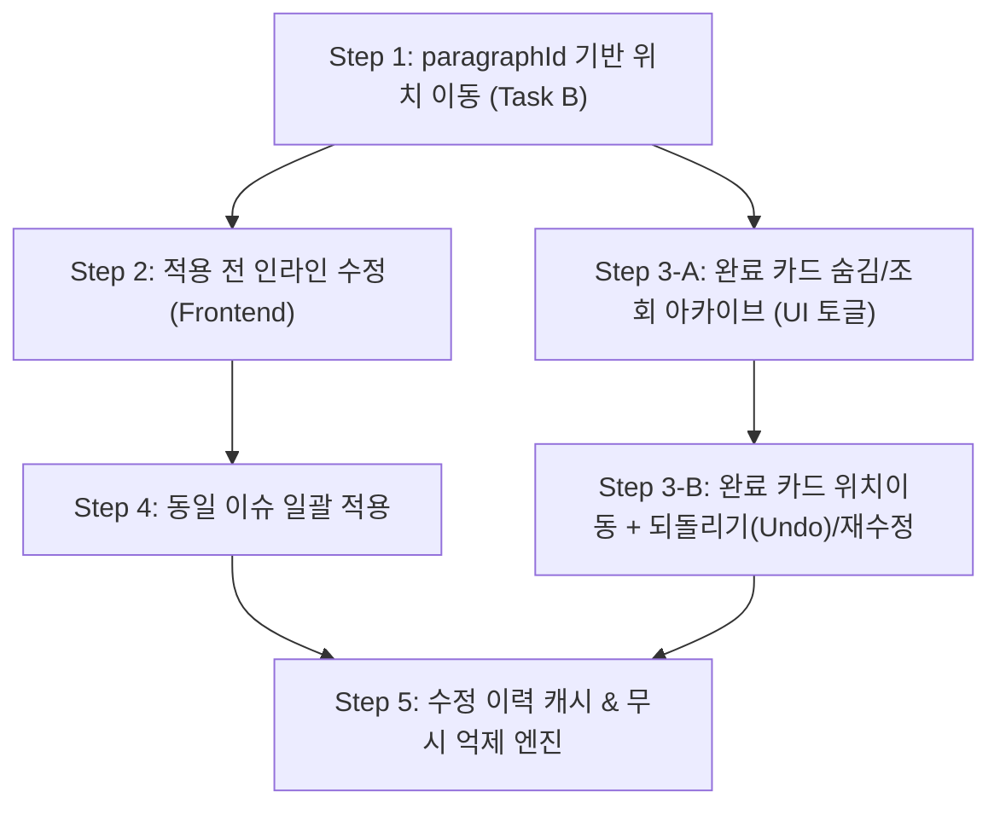

# 기능 제안 검토 의견서: 완료된 QA 카드 숨김 및 재확인

**작성일시:** 2026-08-25  
**검토자:** agy (Antigravity Architecture & Reviewer)  
**대상 문서:** [FEATURE_PROPOSAL_COMPLETED_CARD_ARCHIVE.md](file:///D:/data/dev/App/SmartLinter/FEATURE_PROPOSAL_COMPLETED_CARD_ARCHIVE.md)

---

## 1. 개요 및 총평 (Executive Summary)

본 제안(치환 완료된 카드를 삭제하지 않고 '완료' 상태로 보관/숨김 처리한 후, 필요 시 재확인 및 재수정 지원)은 **실현 가능성이 높고 번역/교정 실무자의 UX 품질을 대폭 향상시키는 매우 타당한 제안**입니다.

특히 SmartLinter의 현재 코드베이스를 분석한 결과:
1. `src/stores/qaStore.ts` 및 `src/services/rollback_guard.ts`에 이미 `appliedCards` 배열 상태와 `status: 'SUCCESS'` 시 카드를 `appliedCards`로 격리 보관하는 기초 구조가 구현되어 있습니다.
2. 최근 버그 수정으로 도입된 `pendingCommands` 레지스트리와 진행 중인 `paragraphId` 기반 InDesign 문단 탐색 인프라 덕분에, 완료된 카드가 가리키는 원본 문단과의 연결고리를 안정적으로 확보할 수 있는 토대가 마련되었습니다.

다만, **"재수정(Re-edit)"의 기술적 정의(이미 변해버린 문서 텍스트와 해시 불일치 문제)**와 **데이터 영속성 범위(세션 내 메모리 vs 영속 저장)**를 명확히 정립하지 않고 단순 재적용 형태로 접근하면 심각한 `STALE_REJECTED` 또는 문서 꼬임 현상이 발생할 수 있으므로 단계별 접근이 필요합니다.

---

## 2. 요청 항목별 심층 검토 의견

### Q1. `dismissedCards`처럼 `completedCards` 분리 배열 vs 기존 `cards` 내 status 필터링

> **결론: 분리 배열(`appliedCards`) 방식 적극 권장 (현재 구조 유지 및 확장)**

* **현재 코드 현황:**  
  `qaStore.ts`에는 이미 `cards`, `dismissedCards`, `appliedCards`로 상태가 3원화되어 있으며, `rollback_guard.ts`에서 치환 성공 시 `targetCard`를 `cards`에서 빼서 `appliedCards`로 이동시키고 있습니다.
* **비교 분석:**
  * **분리 배열 방식 (`cards` / `appliedCards` / `dismissedCards`):**
    * **안전성:** `qaStore.addReport()`는 에디터에서 타이핑이 발생할 때마다 해당 문단의 미처리(`pending`) 카드들을 갱신/청소합니다. 완료 카드가 별도 배열에 격리되어 있으면, 실시간 백그라운드 LLM 재분석 리포트가 수신되어도 완료된 카드가 실수로 유실되거나 덮어쓰여질 위험이 근본적으로 차단됩니다.
    * **성능 및 단순성:** 활성 작업 뷰(`cards`)가 가볍게 유지되므로 필터링, 정렬, 카운트 계산 비용이 최소화됩니다.
  * **단일 배열 + status 필터링 방식:**
    * 수백 개 문단을 교정하면서 완료 카드가 누적되면 `cards` 배열이 비대해지고, `addReport`의 diff 로직에서 'applied' 카드를 매번 보호하는 복잡한 조건문이 추가되어 회귀 버그 위험이 증가합니다.
* **권장 방향:** 기존 `appliedCards` 배열 명칭을 그대로 활용하거나 `completedCards`로 통일하고, UI 상태에 `showCompleted: boolean` 토글만 추가하여 뷰 레이어에서 노출을 제어하는 것이 가장 견고합니다.

---

### Q2. "재수정"의 기술적 의미와 실현 방식

> **결론: 단순 '재적용(과거 hunk 재전송)'은 불가능. "문단 이동 후 최신 텍스트 기반 인라인 재수정" 또는 "명시적 되돌리기(Undo)" 모델로 구현해야 함.**

* **기술적 제약 사항 (해시 및 오프셋 변화):**
  * 카드가 `[적용]`되어 "A -> B"로 치환된 순간, 에디터의 해당 문단 텍스트는 바뀌었고 문서 해시도 새로운 값으로 갱신되었습니다.
  * 따라서 완료 카드가 보관하고 있던 `originalSegment`("A"), `paragraphText`(과거 본문), `paragraphHash`(과거 해시)는 **이미 Stale(과거) 상태**입니다.
  * 이 완료 카드를 활성 상태로 되돌려서 원래의 치환 명령("A -> B")을 다시 보내면:
    1. 문서에는 이미 "A"가 없고 "B"가 있으므로 Hunk 검증 실패(`FAILED`) 또는 BaseHash 불일치(`STALE_REJECTED`)가 100% 발생합니다.
    2. 그 사이 사용자가 해당 문단의 다른 위치를 직접 수정했을 가능성도 있습니다.
* **올바른 재수정 시나리오 정의:**
  1. **시나리오 A — 되돌리기 (Undo / Rollback):**
     * 사용자가 "방금 적용한 교정이 마음에 안 들어서 원래대로 되돌리고 싶음".
     * 구현: 완료 카드에 `[되돌리기(Undo)]` 버튼 제공 -> 현재 문서의 최신 해시를 조회하여, "B -> A"의 역방향 TextHunk를 생성해 원자적 치환 명령 발행.
  2. **시나리오 B — 2차 재수정 (Re-edit: B -> C):**
     * "A를 B로 바꿨는데, 다시 C로 바꾸고 싶음".
     * 구현: 완료 카드의 `[재수정]` 클릭 시, **현재 에디터의 최신 문단 텍스트를 실시간으로 다시 읽어와** 인라인 편집창(추후 추가될 백로그 기능)에 띄우고, 사용자가 "B -> C"를 입력하여 새로운 치환 명령을 발행.
  3. **시나리오 C — 재분석 (Re-analyze):**
     * 해당 문단을 다시 LLM 검수 큐에 강제로 인큐하여 새로운 이슈를 재발견.

---

### Q3. InDesign 문단 위치 추적(`paragraphId`)과의 연계

> **결론: 완료 카드 재확인 기능의 실효성을 완성하는 핵심 선행/결합 요소.**

* **필요성:**  
  완료 카드가 수십 개 쌓여 있을 때, 사용자가 완료 목록을 열어보는 가장 큰 이유는 "내가 방금 또는 이전에 고친 부분이 문서 어디에 있는지 다시 눈으로 확인하기 위함"입니다.
* **연동 구조:**
  * 현재 SmartLinter는 `indesign-para-${storyId}-${paragraphIndex}` 형태의 결정론적 `paragraphId`를 생성합니다.
  * InDesign 백엔드/ExtendScript에 `selectParagraph(paragraphId)` (또는 `goToParagraph`) API가 구현되면:
    * 완료 카드(및 활성 카드)에 **`[위치 이동 / 돋보기]` 버튼**을 배치.
    * 클릭 시 InDesign 창에서 해당 Story와 Paragraph로 뷰포트를 스크롤하고 텍스트 영역을 선택(Highlight).
  * 위치 이동이 선행되어야 사용자가 에디터의 전후 문맥을 확인한 뒤 위 Q2의 "되돌리기"나 "재수정"을 안전하게 판단할 수 있습니다.

---

### Q4. 기존 백로그 "수정 이력 캐시 & 무시 이력 억제"와의 관계

> **결론: 상호 충돌이 없으며, 완벽한 '프론트엔드 작업 뷰'와 '백엔드 지식 저장소'의 상호보완 관계.**

| 구분 | 완료/무시 카드 아카이브 (본 제안) | 수정 이력 캐시 & 무시 억제 (백로그) |
| :--- | :--- | :--- |
| **스코프** | 현재 열린 문서의 단기 세션 작업 뷰 (UI 레벨) | 프로젝트/글로벌 영속 지식 베이스 (엔진/DB 레벨) |
| **단위** | 특정 문단(`paragraphId`)의 특정 치환 트랜잭션 | 일반화된 오류 패턴 (`originalSegment` -> `suggestedSegment`) |
| **주 목적** | "내가 이 문서에서 무엇을 바꿨는지 확인/취소" | "다른 문단/문서에서 같은 오타 발견 시 LLM 없이 자동 교정/억제" |

* **상호보완 시너지:**
  * 사용자가 카드를 `[적용]`하여 완료 아카이브로 넘어가는 순간, 백엔드의 "수정 이력 캐시(Tier-1 TM)"에 해당 교정 패턴을 자동 등록(학습).
  * 사용자가 카드를 `[무시]`하여 무시 아카이브로 넘어가는 순간, "무시 패턴 룰셋"에 등록하여 향후 동일 패턴 재스캔 억제.

---

### Q5. UI 상 우선순위 및 추천 로드맵

> **권장 구현 순서: 위치 보기(1) -> 인라인 수정(2) -> 완료 카드 아카이브(3-A) -> 일괄 적용(4) -> 완료 카드 재수정/Undo 연동(3-B)**

1. **1순위: QA 카드 "위치 보기" (InDesign `paragraphId` 탐색)**
   * 이유: 모든 카드 조작(활성 카드 검토, 완료 카드 재확인, 인라인 수정)의 공통 기반 인프라이므로 최우선 완료 필요.
2. **2순위: 적용 전 인라인 수정 (프론트엔드)**
   * 이유: 구현 난이도가 낮고(UI 작업 위주), 잘못된 AI 제안을 사용자가 즉시 다듬어 적용할 수 있어 실무 만족도 최상.
3. **3순위 (A단계): 완료 카드 숨김 및 아카이브 토글 (조회 전용 1차 구현)**
   * 이유: 이미 `appliedCards` 배열이 격리되어 있으므로, 상단 헤더에 `[완료 보이기]` 토글 스위치와 읽기 전용 완료 카드 뷰를 붙이는 것은 1~2시간 내로 구현 가능하며 사이드이펙트가 없음.
4. **4순위: 동일 이슈 일괄 적용 (Batch Apply)**
   * 이유: 반복 문서 작업 생산성 극대화.
5. **5순위 (B단계): 완료 카드의 역방향 되돌리기(Undo) 및 수정 이력 캐시 연동**
   * 이유: 역방향 Hunk 생성, Stale 검증 등 정밀 트랜잭션 제어가 수반되므로 1차 안정화 후 순차 탑재.

---

## 3. 추가 검토: 데이터 영속성 (Persistence) 방안

제안서에서 짚어달라고 요청한 **"앱 재시작 시 완료 카드의 영속성"**에 대한 검토 의견입니다.

* **현 상태:**  
  모든 카드 데이터(`cards`, `appliedCards`, `dismissedCards`)는 Zustand 메모리 상태로 앱 종료 시 휘발됩니다.
* **영속화 도입 시 고려사항:**
  * 만약 앱을 껐다 켰을 때도 이전 완료 카드를 복원하려면, 문서 경로(예: `C:/docs/manual.indd`)별로 로컬 스토리지/SQLite에 직렬화 저장해야 합니다.
  * **치명적 위험:** 앱이 꺼져 있는 동안 사용자가 InDesign에서 문서를 직접 수정하거나 단락을 추가/삭제하면, 저장된 `paragraphId`와 `baseHash`가 완전히 어긋나 영속 복원된 카드가 가짜 위치를 가리키거나 작동하지 않는 "유령 카드(Ghost Cards)"가 됩니다.
* **권장안:**
  * **1단계 (기본): "세션 단위 인메모리(Session-scoped) 보관"**으로 출발합니다. 사용자가 문서를 열고 작업하는 동안에는 완벽하게 완료 내역을 추적할 수 있으며, 구조가 매우 가볍고 안전합니다.
  * **2단계 (확장):** 앱 재시작 후의 지식 유지는 카드의 개별 문단 위치를 복원하는 방식이 아니라, **"수정 이력 캐시(전역 룰 영속화)"**를 통해 "이전에 승인했던 단어 교정 패턴"을 다음 세션에 자동으로 제안/적용하는 방식으로 푸는 것이 아키텍처상 훨씬 안전하고 우아합니다.

---

## 4. 잠재적 위험 및 방어 설계 (Edge Cases)

1. **문단 삭제/병합 후 완료 카드 접근:**
   * 사용자가 에디터에서 특정 문단을 적용 완료한 후, 해당 문단을 통째로 삭제하거나 다른 문단과 병합한 경우.
   * **방어책:** 완료 카드의 `[위치 이동]` 또는 `[재수정]` 클릭 시, 해당 `paragraphId`를 찾을 수 없으면 에러로 뻗지 않고 `"해당 문단이 문서에서 삭제되었거나 이동되었습니다"`라는 토스트 알림을 띄우고 안전하게 취소.
2. **UI 혼란 방지 (활성 카드와 완료 카드의 시각적 차별화):**
   * 완료 카드가 목록에 섞여 나오면 사용자가 아직 처리 안 한 위반 사항으로 착각할 수 있음.
   * **방어책:**
     * `[완료 보이기]` 토글 활성화 시, 카드 배경을 차분한 딤드(Dimmed) 스타일로 처리하고 우측 상단에 초록색 `[적용 완료 (체크)]` 뱃지 고정.
     * 하단 액션 버튼을 `[적용]` 대신 `[위치 이동]`, `[되돌리기(Undo)]`로 교체하여 오조작 방지.

---

## 5. 최종 종합 요약

* 본 제안은 **적극 추천**하며, 이미 `appliedCards` 격리 구조가 마련되어 있어 착수가 용이합니다.
* **1차 구현 스코프 (권장):**
  1. `qaStore.ts`의 `appliedCards` 배열 기반으로 헤더에 `[완료 보이기 (N건)]` 토글 UI 추가.
  2. 완료 카드는 읽기 전용 뷰(원문 -> 수정본 Diff 확인)로 렌더링.
  3. Task B(`paragraphId` 문단 탐색) 완료 후 완료 카드에 `[문단 위치 이동]` 버튼 연결.
* **2차 확장 스코프:**
  1. `[되돌리기(Undo)]` 역방향 치환 트랜잭션 추가.
  2. 수정 이력 캐시 엔진과 연동하여 영속 학습 체계 구축.
