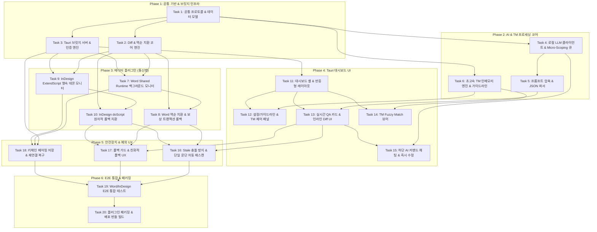

# SmartLinter 본 구현(프로덕트 코드) 전체 태스크 목록

본 문서는 `SmartLinter_Plan.md` 설계도 및 선행 스파이크 3종([Task 1](./SPIKE_RESULTS_TASK1.md), [Task 2](./SPIKE_RESULTS_TASK2.md), [Task 3](./SPIKE_RESULTS_TASK3.md)) 검증 결과를 바탕으로 작성된 **실제 프로덕트 코드 구현 단계의 전체 태스크 목록 및 실행 로드맵**입니다.

모든 태스크는 선행 의존성과 계층 구조(공통 인프라 → 백엔드 코어 → 에디터 플러그인 → 프론트엔드 UI → 안전장치 및 예외 UX → E2E 통합 및 배포)를 고려하여 번호순으로 정렬되어 있습니다.

---

## 📌 전체 구현 로드맵 요약



---

## Phase 1: 공통 기반 및 브릿지 통신 인프라 (Core Infrastructure & Communication)

### Task 1: 공통 통신 프로토콜 및 데이터 모델 정의 (Shared Protocol & Data Models)
* **(1) 목표:**
  * 대시보드(Tauri/Rust), Word 통신병(Office.js/TS), InDesign 통신병(ExtendScript/JS) 간에 교환되는 모든 메시지 규격(페어링, 문단 텔레메트리, TM 조회, 치환 요청/응답, 롤백, 헬스체크)의 공통 JSON 스키마 및 TypeScript / Rust 타입을 정의합니다.
* **(2) 설계 근거:**
  * `SmartLinter_Plan.md` > `1. 전체 시스템 아키텍처 (브릿지 패턴)`
  * `SmartLinter_Plan.md` > `1.C. 로컬 통신 보안 및 페어링 UX`
  * `SmartLinter_Plan.md` > `2.B. Stale 상태 경쟁 조건 방지`
* **(3) 완료조건 (Acceptance Criteria):**
  * `ParagraphPayload` (`paragraphId`, `text`, `hash`, `source`, `target`, `timestamp`, `editorType`) 타입 및 스키마 정의 완료.
  * `ReplacementCommand` (`commandId`, `paragraphId`, `baseHash`, `expectedHash`, `hunks: [{start, end, oldText, newText}]`) 타입 정의 완료.
  * `ReplacementResult` (`commandId`, `status: SUCCESS | STALE_REJECTED | FAILED | ROLLED_BACK`, `currentHash`, `message`) 타입 정의 완료.
  * `AuthHandshake` (`token`, `editorType`, `version`, `clientNonce`) 스키마 정의 완료.
  * Rust (`serde::Serialize`, `serde::Deserialize`)와 TypeScript 간 직렬화/역직렬화 교차 호환성 단위 테스트 100% 통과.
* **(4) 선행 조건/의존성:**
  * 없음 (최초 기반 태스크)
* **(5) 예상 산출물:**
  * `shared/protocol/types.ts`
  * `shared/protocol/schema.json`
  * `src-tauri/src/protocol/mod.rs`
  * `src-tauri/src/protocol/messages.rs`
  * `tests/unit/protocol_serialization_test.rs`

---

### Task 2: 텍스트 Diff 파서 및 Multi-Hunk 역순 치환 코어 엔진 모듈화 (Core Diff & Multi-Hunk Replacement Engine)
* **(1) 목표:**
  * Task 1 스파이크에서 실증된 Multi-Hunk 역순 치환, 오프셋 드리프트 방어, 특수 인라인 마크다운(각주, 하이퍼링크) 보존 알고리즘을 독립된 프로덕션 코어로 모듈화하고 고속 해시 유틸리티를 구축합니다.
* **(2) 설계 근거:**
  * `SmartLinter_Plan.md` > `2. 런(Run) 단위 서식 보존 및 안정성 확보 전략` > `A. Multi-Hunk 역순 치환 (Reverse-order) 및 롤백`
  * `SPIKE_RESULTS_TASK1.md` > `3.1. Multi-Hunk 역순 치환 & 오프셋 드리프트 방어`
* **(3) 완료조건 (Acceptance Criteria):**
  * 원본 텍스트와 수정 제안 텍스트 간 최소 Hunk 추출(Diff 알고리즘) 및 내림차순(Reverse Order: 높은 오프셋 → 낮은 오프셋) 정렬 로직 완비.
  * 각주(`[^1]`), 하이퍼링크(`[text](url)`) 등 인라인 특수 요소가 포함된 복합 문단에서 역순 치환 시 오프셋 드리프트 0건 및 특수 태그 100% 보존 검증.
  * SHA-256 기반 문단 고속 정규화 해시 생성기(`computeParagraphHash`) 구현 및 공백/개행 정규화 일관성 테스트 통과.
  * 단위 테스트 스위트(Jest / Vitest) 100% 통과.
* **(4) 선행 조건/의존성:**
  * Task 1 (공통 데이터 모델 정의)
* **(5) 예상 산출물:**
  * `shared/engine/diff_engine.ts`
  * `shared/engine/hash_util.ts`
  * `shared/engine/special_elements.ts`
  * `shared/engine/__tests__/diff_engine.test.ts`
  * `shared/engine/__tests__/hash_util.test.ts`

---

### Task 3: 로컬 브릿지 서버 및 자동 페어링/보안 엔진 (Local Bridge Server & Auth Engine - Tauri Rust Backend)
* **(1) 목표:**
  * Tauri Rust 백엔드 프로세스 내에 에디터 플러그인과 통신할 로컬 HTTP/WebSocket 브릿지 서버(기본 포트 49152)를 구현하고, 1회 페어링 후 무개입 자동 연결(Auto-connect)을 지원하는 보안 토큰 관리 파이프라인을 구축합니다.
* **(2) 설계 근거:**
  * `SmartLinter_Plan.md` > `1. 전체 시스템 아키텍처` > `B. 메인 두뇌 (Standalone Dashboard App)`, `C. 로컬 통신 보안 및 페어링 UX`
  * `SPIKE_RESULTS_TASK2.md` > `4.3. Live Local Bridge 통신`
* **(3) 완료조건 (Acceptance Criteria):**
  * `127.0.0.1:49152` 바인딩 기반 비동기 HTTP REST / WebSocket 서버 구동 (`axum` 또는 `warp` / `tokio-tungstenite`).
  * 32바이트 암호학적 난수 기반 페어링 토큰 생성 및 검증 핸드셰이크 프로토콜 완성.
  * 에디터 접속 시 토큰 검증 성공률 100%, 유효하지 않은 토큰 접속 시 401 Unauthorized 즉시 반환.
  * 활성 연결 상태(Connected / Disconnected / Heartbeat Timeout)를 Tauri 프론트엔드로 실시간 이벤트 디스패치 (`emit("bridge-status-changed")`).
  * 서버 기동/종료 및 클라이언트 동시 다중 접속 방어(단일 에디터 세션 락킹) 단위 테스트 통과.
* **(4) 선행 조건/의존성:**
  * Task 1 (공통 프로토콜 정의)
* **(5) 예상 산출물:**
  * `src-tauri/src/server/mod.rs`
  * `src-tauri/src/server/router.rs`
  * `src-tauri/src/server/ws_handler.rs`
  * `src-tauri/src/server/auth_manager.rs`
  * `src-tauri/src/server/session.rs`
  * `src-tauri/tests/bridge_server_test.rs`

---

## Phase 2: AI & TM 프로세싱 코어 엔진 (AI Core & Translation Memory)

### Task 4: 로컬 LLM 통합 클라이언트 및 Micro-Scoping 큐 관리자 (Local LLM Client & Micro-Scoping Worker Queue)
* **(1) 목표:**
  * Ollama 로컬 API와 비동기 스트리밍으로 연동하고, 8GB VRAM 환경에서 시스템 및 에디터와의 공존을 보장하기 위해 단일 문단 단위 요청을 순차 처리하는 `Micro-Scoping Worker Queue`(동시 실행 수 Concurrency = 1)를 구현합니다.
* **(2) 설계 근거:**
  * `SmartLinter_Plan.md` > `4. 로컬 하드웨어(VRAM/RAM) 다운 방지 최적화 전략` > `1, 2`
  * `SPIKE_RESULTS_TASK3.md` > `6.2. 8GB VRAM 하드웨어 예산 및 공유 검증`
* **(3) 완료조건 (Acceptance Criteria):**
  * Ollama REST API (`http://127.0.0.1:11434/api/generate` 및 `/api/chat`) 비동기 호출 클라이언트 완성.
  * Ollama 데몬 헬스체크 및 모델(`qwen2.5:7b` 등) 로드 상태 실시간 감지.
  * **[설계 결정 완료 사항 (2026-08-24, 사용자 위임에 따른 기본값 확정)]** 모델은 하드코딩하지 않고 **런타임에 설치된 Ollama 모델 중에서 자유 선택** 가능해야 함:
    * `GET /api/tags`로 로컬에 설치된 Ollama 모델 목록(이름, 파라미터 크기, 양자화 레벨, 대략적 디스크/VRAM 용량)을 조회하는 API 완성.
    * 사용자가 다른 모델을 선택하면 재시작 없이 다음 요청부터 즉시 적용(Micro-Scoping Queue가 다음 작업부터 새 모델명 사용).
    * 현재 선택 모델이 VRAM 예산(8GB, Plan.md 4번 섹션)을 초과할 가능성이 있으면 경고 플래그를 UI로 전달(차단은 하지 않고 경고만 — Task 12에서 배지로 표시).
  * `MicroScopingQueue`: LLM 추론 작업을 항상 1개(Concurrency=1)로 직렬화하여 VRAM 폭증 방지.
  * 사용자가 동일 문단을 연속 수정할 경우 이전 대기 큐 작업을 취소하고 최신 문단으로 교체하는 디바운스/취소(Debounce & Cancel) 메커니즘 동작 확인.
  * 큐 과적 방지를 위한 작업 타임아웃(기본 20초) 및 에러 격리 처리.
* **(4) 선행 조건/의존성:**
  * Task 1 (데이터 모델)
* **(5) 예상 산출물:**
  * `src-tauri/src/ai/mod.rs`
  * `src-tauri/src/ai/ollama_client.rs`
  * `src-tauri/src/ai/micro_queue.rs`
  * `src-tauri/src/ai/types.rs`
  * `src-tauri/tests/micro_queue_test.rs`

---

### Task 5: 프롬프트 압축 템플릿 및 구조화된 QA 파서 엔진 (Prompt Compression & Structured QA Parser)
* **(1) 목표:**
  * Task 3 스파이크에서 검증된 `No Samples & JSON Force` 기법을 적용하여 입력 토큰을 70% 이상 절감하는 고속 프롬프트 템플릿을 탑재하고, LLM의 JSON 출력을 파싱·검증하여 UI용 구조체로 변환하는 엔진을 구현합니다.
* **(2) 설계 근거:**
  * `SmartLinter_Plan.md` > `4. 로컬 하드웨어 최적화 전략` > `3. No Samples & JSON Force`
  * `SmartLinter_Plan.md` > `3. 대시보드 앱 UI` > `② QA 영역`
  * `SPIKE_RESULTS_TASK3.md` > `4.1. 프롬프트 구성 전략 차이 & 5.1. 종합 통계`
* **(3) 완료조건 (Acceptance Criteria):**
  * Zero-Shot 프롬프트 압축 템플릿 빌더 구현 (입력 토큰 수평균 200토큰 이내 유지).
  * Ollama 호출 시 `format: "json"` 옵션 강제 주입.
  * 출력 JSON 스키마 (`issues: [{category, originalSegment, suggestedSegment, reason, severity}]`) 유효성 검증 및 타입 매핑.
  * 불완전 JSON이나 마크다운 펜스(```json ... ```) 래핑 시에도 자동 추출/복구하는 내결함성(Robust) 파서 구축 (파싱 실패율 0%).
  * 스파이크 데이터셋 기반 10종 샘플 파싱 단위 테스트 100% 통과.
* **(4) 선행 조건/의존성:**
  * Task 4 (로컬 LLM 클라이언트)
* **(5) 예상 산출물:**
  * `src-tauri/src/ai/prompt_builder.rs`
  * `src-tauri/src/ai/qa_parser.rs`
  * `src-tauri/src/ai/templates/qa_compressed.tera`
  * `src-tauri/tests/qa_parser_test.rs`

---

### Task 6: 초고속 인메모리 TM (Translation Memory) 매칭 엔진 및 가이드라인 로더 (TM In-Memory Matcher & Guideline Loader)
* **(1) 목표:**
  * TMX / JSON 번역 메모리 파일을 고속으로 로드하여 문단 수신 시 0.1초(100ms) 이내에 Fuzzy Match 제안을 산출하는 인메모리 검색 엔진과 프로젝트별 가이드라인(`.agents`) 파서를 구현합니다.
* **(2) 설계 근거:**
  * `SmartLinter_Plan.md` > `3. 대시보드 앱 UI` > `① 설정 및 제어, ③ TM (Translation Memory) & TQA 영역`
  * `SmartLinter_Plan.md` > `5. 작업 플로우` > `3. 비동기 피드백 팝업 (TM 0.1초 즉각 표시)`
* **(3) 완료조건 (Acceptance Criteria):**
  * TMX (XML) 및 구조화된 JSON TM 파일 파서 구현.
  * N-gram 토큰화 및 Levenshtein 거리 기반 인메모리 유사도 검색기 구현 (10,000 Translation Unit 기준 쿼리 응답 시간 < 50ms).
  * 매칭 점수(75% ~ 100%) 기준 상위 매치 후보군(Top N) 반환.
  * 프로젝트 루트의 `.agents` 및 커스텀 QA 룰 파일 파싱하여 LLM 프롬프트 주입용 규칙 세트 빌드.
  * TM 파일이 로드되지 않았을 때의 Empty 상태 플래그 정상 전달.
* **(4) 선행 조건/의존성:**
  * Task 1 (공통 데이터 모델)
* **(5) 예상 산출물:**
  * `src-tauri/src/tm/mod.rs`
  * `src-tauri/src/tm/tmx_parser.rs`
  * `src-tauri/src/tm/fuzzy_matcher.rs`
  * `src-tauri/src/tm/guideline_loader.rs`
  * `src-tauri/tests/tm_matcher_test.rs`

---

## Phase 3: 에디터 플러그인 (통신병 - Bridge Plugins)

### Task 7: MS Word 플러그인 — Shared Runtime 백그라운드 구동 및 유휴 감지 모니터 (Word Bridge: Runtime & Idle Monitor)
* **(1) 목표:**
  * Office.js 기반 MS Word Web Add-in에서 Task 2 스파이크 결과를 적용하여 `Shared Runtime (lifetime: "long")`과 `Office.addin.hide()`를 통해 화면 점유 없이 백그라운드에서 구동되고, 타이핑 유휴(Idle) 시 수정된 문단을 브릿지 서버로 전송하는 통신병을 구현합니다.
* **(2) 설계 근거:**
  * `SmartLinter_Plan.md` > `1. 전체 시스템 아키텍처` > `A. 통신병 (Word Office.js)`
  * `SPIKE_RESULTS_TASK2.md` > `4.1. MS Word (Office.js) Shared Runtime 검증`
* **(3) 완료조건 (Acceptance Criteria):**
  * `manifest.xml` 내 Shared Runtime (`lifetime="long"`) 선언 및 로드 완료.
  * Add-in 시작 즉시 `Office.addin.hide()`를 호출하여 Task Pane을 100% 숨긴 상태로 백그라운드 전환.
  * 브릿지 서버(Task 3)로의 자동 페어링 토큰 로드 및 WebSocket/REST 연결 수립.
  * Word `context.document.onSelectionChanged` 이벤트 및 디바운스 타이머(1.5초 Idle) 연동.
  * 커서가 위치한 단일 문단의 텍스트, 고유 `paragraphId`, SHA-256 해시값을 추출하여 브릿지 서버로 전송 성공.
* **(4) 선행 조건/의존성:**
  * Task 2 (Diff/Hash 엔진), Task 3 (브릿지 서버)
* **(5) 예상 산출물:**
  * `plugins/word/manifest.xml`
  * `plugins/word/src/index.ts`
  * `plugins/word/src/runtime_manager.ts`
  * `plugins/word/src/document_listener.ts`
  * `plugins/word/src/bridge_client.ts`

---

### Task 8: MS Word 플러그인 — 무손실 역순 치환 및 보상 트랜잭션 롤백 (Word Bridge: Reverse Replacement & Rollback)
* **(1) 목표:**
  * 대시보드로부터 수신한 Multi-Hunk 치환 명령을 Word 문서에 역순으로 적용하고, Stale 상태 해시 검증 및 실패 시 저널 기반 보상 트랜잭션과 Pre-rollback Hash Check를 실행하는 텍스트 교체 모듈을 구현합니다.
* **(2) 설계 근거:**
  * `SmartLinter_Plan.md` > `2. 런 단위 서식 보존` > `A. Multi-Hunk 역순 치환 및 롤백, B. Stale 상태 경쟁 조건 방지`
  * `SPIKE_RESULTS_TASK1.md` > `3.2. Word 보상 트랜잭션 실증 & 4. 사용자 편집 간섭 관찰`
* **(3) 완료조건 (Acceptance Criteria):**
  * 대시보드 치환 명령 수신 시, 현재 Word 문단의 해시값과 명령의 `expectedHash` 대조 (불일치 시 즉시 거부 및 `STALE_REJECTED` 통보).
  * 해시 일치 시 Word Range API를 사용하여 높은 오프셋부터 낮은 오프셋 순으로 Multi-Hunk 치환 실행.
  * 각 치환 단계를 작업 저널(`CompensatingJournal`)에 실시간 기록.
  * 치환 중 에러 발생 시, 저널 역순 재생 전 `Pre-rollback Hash Check` 1회 수행:
    * 사용자 타이핑/Undo 등 외부 간섭 미감지 시: 100% 원본 보상 복구 수행 (`ROLLED_BACK`).
    * 사용자 타이핑 등 문단 해시 변형 감지 시: 롤백을 강제하지 않고 안전하게 Abort (`ROLLBACK_ABORTED`).
  * 인라인 각주, 링크 등 특수 서식 런(Run) 보존 검증.
* **(4) 선행 조건/의존성:**
  * Task 7 (Word 런타임 및 통신 클라이언트), Task 2 (Diff 엔진)
* **(5) 예상 산출물:**
  * `plugins/word/src/replacement_executor.ts`
  * `plugins/word/src/compensating_journal.ts`
  * `plugins/word/src/hash_verifier.ts`
  * `plugins/word/tests/replacement_executor.test.ts`

---

### Task 9: Adobe InDesign 플러그인 — ExtendScript 영속 엔진 기반 모니터링 데몬 (InDesign Bridge: Persistent Daemon)
* **(1) 목표:**
  * Task 2 스파이크 결과에 따라 `#targetengine` + `IdleTask` 기반의 ExtendScript 영속 백그라운드 엔진을 구축하여, UXP 패널 열림/닫힘과 무관하게 상시 백그라운드에서 활성 문단을 감지하고 브릿지 서버로 텔레메트리를 전송하는 데몬을 구현합니다.
* **(2) 설계 근거:**
  * `SmartLinter_Plan.md` > `1. 전체 시스템 아키텍처` > `A. 통신병 (InDesign UXP/ExtendScript)`
  * `SPIKE_RESULTS_TASK2.md` > `4.2. Adobe InDesign UXP vs ExtendScript 수명주기 검증`
* **(3) 완료조건 (Acceptance Criteria):**
  * `#targetengine "smartlinter_persistent_engine"` 기반 상주 스크립트 작성.
  * `app.idleTasks.add({ name: "smartlinter_monitor", sleep: 1000 })` 등록을 통한 1초 주기 유휴 감지 루프 구동.
  * Socket 또는 로컬 HTTP 모듈을 통해 브릿지 서버(Task 3)와의 페어링 및 하트비트 유지.
  * 현재 사용자가 편집 중인 `TextFrame` / `Story`의 문단 텍스트 및 해시값 추출 후 브릿지 서버로 전송.
  * UXP 패널이 완전히 닫힌(Closed) 상태에서도 데몬 이벤트 루프가 100% 유지됨을 확인.
  * (선택적) 상태 확인 및 포트 설정을 위한 경량 UXP 설정 패널(`manifest.json`, `index.html`) 제공.
* **(4) 선행 조건/의존성:**
  * Task 2 (Diff/Hash 엔진), Task 3 (브릿지 서버)
* **(5) 예상 산출물:**
  * `plugins/indesign/extendscript/smartlinter_daemon.jsx`
  * `plugins/indesign/extendscript/bridge_socket.jsx`
  * `plugins/indesign/extendscript/text_observer.jsx`
  * `plugins/indesign/uxp/manifest.json`
  * `plugins/indesign/uxp/index.html`
  * `plugins/indesign/uxp/index.js`

---

### Task 10: Adobe InDesign 플러그인 — 원자적 역순 치환 및 doScript 트랜잭션 롤백 (InDesign Bridge: Atomic Replacement)
* **(1) 목표:**
  * InDesign의 `app.doScript(..., UndoModes.ENTIRE_SCRIPT)`를 활용하여 Multi-Hunk 역순 치환을 단일 원자적 트랜잭션으로 실행하고, Stale 상태 방어 및 예외 발생 시 네이티브 원자적 롤백을 수행하는 교체 엔진을 구현합니다.
* **(2) 설계 근거:**
  * `SmartLinter_Plan.md` > `2. 런 단위 서식 보존` > `A. Multi-Hunk 역순 치환 및 롤백, B. Stale 상태 경쟁 조건 방지`
  * `SPIKE_RESULTS_TASK1.md` > `3.3. InDesign 원자적 롤백 실증`
* **(3) 완료조건 (Acceptance Criteria):**
  * 브릿지 서버로부터 치환 명령 수신 시 대상 InDesign Paragraph의 현재 해시값 대조 (불일치 시 `STALE_REJECTED` 회신).
  * `app.doScript` 내부에서 역순(Reverse Order) 오프셋 기준 텍스트 치환 수행.
  * 치환 도중 예외/에러 발생 시 `UndoModes.ENTIRE_SCRIPT` 플래그에 의해 InDesign 네이티브 Undo 스택에서 100% 자동 원자적 롤백(Discard) 수행.
  * InDesign의 문자 스타일(Character Style), 단락 스타일(Paragraph Style), 특수 문자 및 하이퍼링크 손상 0건 확인.
  * 치환 결과를 브릿지 서버로 회신.
* **(4) 선행 조건/의존성:**
  * Task 9 (InDesign 영속 데몬), Task 2 (Diff 엔진)
* **(5) 예상 산출물:**
  * `plugins/indesign/extendscript/atomic_replacer.jsx`
  * `plugins/indesign/extendscript/transaction_runner.jsx`
  * `plugins/indesign/tests/test_atomic_replacement.jsx`

---

## Phase 4: Tauri 대시보드 프론트엔드 UI (Dashboard Frontend UI)

### Task 11: 대시보드 UI 프레임워크 셋업 및 반응형 레이아웃 구축 (Dashboard Shell & Responsive Layout)
* **(1) 목표:**
  * Tauri 웹뷰 환경에서 동작하는 프론트엔드(React + Tailwind CSS + Vite) 기본 골격을 구축하고, 상단 헤더/제어바, 메인 스플릿 뷰(QA 리스트 / TM 패널), 하단 AI 커맨드 입력창을 포함하는 반응형 대시보드 셸을 구현합니다.
* **(2) 설계 근거:**
  * `SmartLinter_Plan.md` > `1.B. 메인 두뇌 (Standalone Dashboard App)`
  * `SmartLinter_Plan.md` > `3. 대시보드 앱(상황판) UI 및 주요 기능 영역`
* **(3) 완료조건 (Acceptance Criteria):**
  * Vite 기반 React/TypeScript SPA 프로젝트 셋업 및 Tailwind CSS 테마/디자인 시스템 구축.
  * 상단 헤더: 에디터(Word/InDesign) 연결 인디케이터, LLM 상태, TM 로드 뱃지 표시.
  * 메인 영역: QA 영역과 TM 영역을 좌우/상하로 분할하고, TM 미로드 시 QA 영역이 100% 가변 확장되는 레이아웃 스위처 동작.
  * 하단 영역: AI 커맨드 고정 바 배치.
  * Tauri Rust 백엔드 이벤트(`bridge-status-changed`, `new-paragraph-detected` 등)와의 실시간 상태 스토어(Zustand) 연동.
* **(4) 선행 조건/의존성:**
  * Task 3 (Tauri 백엔드 브릿지 서버)
* **(5) 예상 산출물:**
  * `src/App.tsx`
  * `src/components/layout/Header.tsx`
  * `src/components/layout/MainLayout.tsx`
  * `src/components/layout/StatusBar.tsx`
  * `src/stores/bridgeStore.ts`
  * `src/styles/tailwind.css`

---

### Task 12: 설정, 가이드라인 및 TM 제어 패널 (Config, Guideline & TM Panel with Batch Progress)
* **(1) 목표:**
  * 프로젝트 가이드라인(`.agents`) 및 TM 파일을 로드/관리하고, 대용량 문서 일괄 스캔 시 상단 진행률 프로그레스 바와 [취소] 액션을 제어하는 컴포넌트를 구현합니다.
* **(2) 설계 근거:**
  * `SmartLinter_Plan.md` > `3. 대시보드 앱 UI` > `① 설정 및 제어`
* **(3) 완료조건 (Acceptance Criteria):**
  * `.agents` 가이드라인 파일 및 TMX/JSON TM 파일 드래그앤드롭/파일 브라우저 로드 UI.
  * 로드된 규칙 및 TM 엔트리 수 요약 뷰어 제공.
  * 대용량 문서 일괄 스캔(Batch Scan) 트리거 시 상단에 진행률 바(Progress Bar: 0%~100%) 및 "현재 N / M 문단 분석 중..." 텍스트 노출.
  * `[취소(Cancel)]` 버튼 클릭 시 백엔드 마이크로 큐의 일괄 스캔 작업을 즉시 Abort 처리.
  * **[설계 결정 완료 사항 (2026-08-24, 사용자 위임에 따른 기본값 확정)]** Ollama 모델 설정 모달:
    * Task 4의 `GET /api/tags` 기반으로 설치된 모델 목록을 드롭다운으로 표시하고, 사용자가 자유롭게 선택.
    * 각 모델 항목에 파라미터 크기/양자화 레벨과 함께, 8GB VRAM 예산 초과 가능성이 있으면 경고 배지(예: "⚠️ VRAM 예산 초과 가능") 표시 — 선택 자체를 막지는 않음.
    * 선택 즉시 반영(앱 재시작 불필요), 마지막 선택 모델은 로컬 설정에 저장되어 다음 실행 시에도 유지.
* **(4) 선행 조건/의존성:**
  * Task 6 (TM/가이드라인 엔진), Task 11 (레이아웃)
* **(5) 예상 산출물:**
  * `src/components/config/SettingsModal.tsx`
  * `src/components/config/GuidelineViewer.tsx`
  * `src/components/config/BatchProgressBar.tsx`
  * `src/stores/configStore.ts`

---

### Task 13: 실시간 QA 카드 리스트 및 인라인 Diff 렌더링 컴포넌트 (QA Issue Cards & Inline Diff Viewer)
* **(1) 목표:**
  * 백그라운드 LLM 분석 결과를 비동기로 수신하여 실시간으로 카드 리스트에 추가하고, 원본 대비 수정 제안을 단어/문자 단위 인라인 Diff로 시각화하며 `[적용]`, `[무시]` 액션을 처리하는 핵심 UI를 구현합니다.
* **(2) 설계 근거:**
  * `SmartLinter_Plan.md` > `3. 대시보드 앱 UI` > `② QA (Quality Assurance) 영역`
  * `SmartLinter_Plan.md` > `5. 작업 플로우` > `3, 4`
* **(3) 완료조건 (Acceptance Criteria):**
  * LLM 분석 결과 도착 시 부드러운 애니메이션과 함께 새 QA 카드 비동기 삽입.
  * 위반 유형 태그(용어 혼용, 번역투, 맞춤법, 오역 등), 심각도(Error, Warning, Info), 위반 사유 툴팁 표시.
  * 원본 문장과 제안 문장의 차이점을 인라인 Diff(추가분: 녹색 하이라이트, 삭제분: 붉은색 취소선)로 정확히 렌더링.
  * `[적용(Accept)]` 클릭 시 에디터 브릿지로 치환 명령 전송 및 처리 중 스피너 표시.
  * `[무시(Dismiss)]` 클릭 시 카드를 리스트에서 즉시 제거/보관.
* **(4) 선행 조건/의존성:**
  * Task 5 (QA 파서), Task 11 (레이아웃)
* **(5) 예상 산출물:**
  * `src/components/qa/QACardList.tsx`
  * `src/components/qa/QACardItem.tsx`
  * `src/components/qa/InlineDiffViewer.tsx`
  * `src/stores/qaStore.ts`

---

### Task 14: 고속 TM Fuzzy Match 제안 뷰어 (TM Match Viewer & Instant Replacer)
* **(1) 목표:**
  * 문단 수신 시 0.1초 만에 계산된 TM Fuzzy Match 후보군을 카드 형태로 표시하고, 일치율(Score %)에 따른 시각적 뱃지와 원클릭 교체 기능을 제공하는 전용 패널을 구현합니다.
* **(2) 설계 근거:**
  * `SmartLinter_Plan.md` > `3. 대시보드 앱 UI` > `③ TM & TQA 영역`
  * `SmartLinter_Plan.md` > `5. 작업 플로우` > `3. 비동기 피드백 팝업 (TM 0.1초 즉시)`
* **(3) 완료조건 (Acceptance Criteria):**
  * 문단 입력 이벤트 발생 후 100ms 이내에 TM 매칭 후보 리스트가 즉시 렌더링됨.
  * 일치율 뱃지(100% Exact Match: 녹색, 85%~99%: 파란색, 75%~84%: 노란색) 및 소스/타깃 텍스트 차이점 표시.
  * `[TM 적용]` 클릭 시 에디터로 전체/부분 치환 명령 즉각 전송.
  * TM 파일 미로드 시 UI가 자동으로 접히며 QA 패널 100% 확장 전환 연동.
* **(4) 선행 조건/의존성:**
  * Task 6 (TM 엔진), Task 11 (레이아웃)
* **(5) 예상 산출물:**
  * `src/components/tm/TMMatchPanel.tsx`
  * `src/components/tm/TMMatchCard.tsx`
  * `src/stores/tmStore.ts`

---

### Task 15: 하단 AI 커맨드 채팅창 및 In-Card 즉시 수정 연동 (AI Commands Chat & Action-First Inline Card)
* **(1) 목표:**
  * 사용자가 하단 자연어 입력창을 통해 문맥 기반 교정 지시를 입력하면, 대화형 카드 내에 실시간 Diff를 제시하고 즉시 에디터에 반영(Action-First)할 수 있는 인터랙티브 챗 모듈을 구현합니다.
* **(2) 설계 근거:**
  * `SmartLinter_Plan.md` > `3. 대시보드 앱 UI` > `④ 하단 AI Commands (채팅창)`
  * `SmartLinter_Plan.md` > `5. 작업 플로우` > `4. 수정 지시 및 자동 반영`
* **(3) 완료조건 (Acceptance Criteria):**
  * 하단 고정 챗 입력창 및 빠른 프롬프트 칩("더 간결하게", "능동태로 변경", "기술 용어 표준화" 등) 제공.
  * 현재 선택된 문단 텍스트와 사용자 자연어 지시를 조합하여 LLM 질의.
  * LLM 응답을 텍스트 설명 대신 'In-card Diff 카드'로 렌더링하고 `[즉시 반영]` 버튼 노출.
  * `[즉시 반영]` 클릭 시 브릿지를 통해 에디터 문서의 해당 문단이 즉시 치환됨.
* **(4) 선행 조건/의존성:**
  * Task 4 (LLM 클라이언트), Task 13 (Diff 뷰어)
* **(5) 예상 산출물:**
  * `src/components/chat/AICommandBar.tsx`
  * `src/components/chat/CommandResponseCard.tsx`
  * `src/stores/chatStore.ts`

---

## Phase 5: 안전장치, 충돌 방지 및 예외 UX 고도화 (Resilience & Edge-Case UX)

### Task 16: Stale 상태 충돌 방지 및 단일 문단 자동 재스캔 UX (Stale Conflict Rejection & Auto-Rescan UX)
* **(1) 목표:**
  * 대시보드에서 `[적용]` 클릭 시 사용자가 이미 에디터에서 타이핑하여 해시가 불일치할 경우, 치환을 안전하게 거부(Reject)하고 해당 단일 문단만 수 밀리초 내에 백그라운드 재스캔하여 대시보드 카드를 자동 갱신하는 완결형 UX를 구현합니다.
* **(2) 설계 근거:**
  * `SmartLinter_Plan.md` > `2. 런 단위 서식 보존` > `B. Stale 상태 경쟁 조건 방지 및 재스캔 UX`
* **(3) 완료조건 (Acceptance Criteria):**
  * 에디터 통신병에서 해시 불일치(`STALE_REJECTED`) 응답 수신 시 대시보드 이벤트 처리기 동작.
  * 해당 QA 카드 상단에 **"문서가 방금 수정되었습니다. 최신 상태로 새로고침합니다 🔄"** 노란색 안내 뱃지 즉각 노출.
  * 문서 전체가 아닌 해당 단일 문단(`paragraphId`)에 대해서만 백그라운드 즉시 재스캔 트리거.
  * 최신 문단 텍스트로 TM/QA 분석을 재실행하여 카드를 새로운 Diff 상태로 매끄럽게 교체(체감 지연 최소화).
* **(4) 선행 조건/의존성:**
  * Task 8 (Word 교체 엔진), Task 10 (InDesign 교체 엔진), Task 13 (QA 카드 UI)
* **(5) 예상 산출물:**
  * `src/services/stale_conflict_resolver.ts`
  * `src/components/qa/StaleNotificationBadge.tsx`
  * `src-tauri/src/server/conflict_dispatcher.rs`

---

### Task 17: 롤백 실패 방어 및 사용자 친화적 폴백 UX (Rollback Guard & User-Friendly Fallback UX)
* **(1) 목표:**
  * 서식 복잡성으로 인한 치환 실패나 사용자 중간 타이핑으로 인한 Pre-rollback Hash 불일치 발생 시, 앱 크래시나 침묵의 데이터 오염 없이 안전하게 Abort하고 친화적 안내 카드를 제공하는 안전망을 구축합니다.
* **(2) 설계 근거:**
  * `SmartLinter_Plan.md` > `2. 런 단위 서식 보존` > `A. Multi-Hunk 역순 치환 및 롤백 (안전망 UX)`
  * `SPIKE_RESULTS_TASK1.md` > `4. 사용자 편집 간섭 및 롤백 충돌 현상 관찰 리포트`
* **(3) 완료조건 (Acceptance Criteria):**
  * 복잡한 서식 등으로 치환 실패(`FAILED`) 시: 카드에 **"⚠️ 서식이 복잡하여 자동 교체에 실패했습니다. 수동으로 확인해 주세요."** 경고 카드 및 "수정 텍스트 클립보드 복사" 버튼 노출.
  * 사용자 타이핑 감지로 롤백 중단(`ROLLBACK_ABORTED`) 시: 카드에 **"사용자 편집이 감지되어 자동 롤백을 안전하게 건너뛰었습니다. 🔄"** 안내 메시지 노출.
  * 어떤 에러 상황에서도 대시보드나 에디터 플러그인이 비정상 종료되지 않고 정상 유휴 상태로 복귀함을 확인.
* **(4) 선행 조건/의존성:**
  * Task 8, Task 10 (에디터 롤백 엔진), Task 13 (QA 카드 UI)
* **(5) 예상 산출물:**
  * `src/services/rollback_guard.ts`
  * `src/components/qa/RollbackAlertCard.tsx`
  * `src/components/common/ClipboardCopyButton.tsx`

---

### Task 18: 자동 페어링 키체인 저장소 및 네트워크 단절 복구 (Auto-pairing Keyring & Connection Resilience)
* **(1) 목표:**
  * 최초 1회 인증된 페어링 토큰을 로컬 안전 저장소(OS Keyring / 암호화 스토리지)에 보관하여 이후 무개입 자동 연결(Auto-connect)을 지원하고, 일시적 네트워크 단절 시 자동 재시도(Exponential Backoff) 파이프라인을 구축합니다.
* **(2) 설계 근거:**
  * `SmartLinter_Plan.md` > `1.C. 로컬 통신 보안 및 페어링 UX`
  * `SmartLinter_Plan.md` > `5. 작업 플로우` > `1. 환경 세팅 (자동 페어링)`
* **(3) 완료조건 (Acceptance Criteria):**
  * Windows Credential Manager / macOS Keychain API 연동을 통한 페어링 토큰 영구 안전 보관 (`keyring-rs`).
  * 대시보드 또는 에디터 재시작 시 1초 이내에 사용자 팝업 없이 100% 무개입 자동 페어링(Auto-connect) 성공.
  * 에디터 또는 대시보드 비정상 종료 후 재실행 시 지수 백오프(1s, 2s, 4s, 최대 10s) 기반 자동 재연결.
  * 연결 단절 시 상단 상태바에 '연결 재시도 중...' 노란색 배너 노출.
* **(4) 선행 조건/의존성:**
  * Task 3 (브릿지 서버), Task 7, Task 9 (에디터 통신 클라이언트)
* **(5) 예상 산출물:**
  * `src-tauri/src/server/keyring_store.rs`
  * `shared/protocol/connection_manager.ts`
  * `src/components/layout/ConnectionBanner.tsx`

---

## Phase 6: E2E 통합 검증 및 패키징/배포 (E2E Integration & Packaging)

### Task 19: Word & InDesign 전체 워크플로우 E2E 통합 검증 (End-to-End Integration Test Suite)
* **(1) 목표:**
  * 실제(또는 헤드리스 하네스) Word/InDesign 환경과 Tauri 대시보드, 로컬 LLM(Ollama), TM 엔진을 유기적으로 연동하여 상시 백그라운드 모니터링부터 치환, 롤백, Stale 재스캔까지 전체 워크플로우를 자동화된 E2E 시나리오로 검증합니다.
* **(2) 설계 근거:**
  * `SmartLinter_Plan.md` > `5. 작업 플로우 (User Workflow - 상시 백그라운드 어시스턴트 모드) 1~5단계 전체`
* **(3) 완료조건 (Acceptance Criteria):**
  * **시나리오 1 (기본 QA 사이클):** 에디터 문단 작성 → 0.1초 TM 매칭 → 비동기 LLM QA 카드 생성 → `[적용]` 클릭 → 무손실 역순 치환 완료 (통과율 100%).
  * **시나리오 2 (Stale 충돌 재스캔):** 분석 완료 후 에디터 텍스트 수정 → `[적용]` 클릭 시 `STALE_REJECTED` 수신 → 단일 문단 자동 재스캔 및 최신 카드 갱신 (통과율 100%).
  * **시나리오 3 (롤백 및 폴백 안전망):** 치환 실패 주입 시 보상 트랜잭션/원자적 롤백 복원 및 안내 카드 표출 (통과율 100%).
  * **시나리오 4 (무UI 백그라운드 유지):** Word `Office.addin.hide()` 및 InDesign 패널 닫힘 상태에서 10분간 지속 모니터링 정상 동작 확인.
* **(4) 선행 조건/의존성:**
  * Task 1 ~ Task 18 전체
* **(5) 예상 산출물:**
  * `tests/e2e/workflow_word.test.ts`
  * `tests/e2e/workflow_indesign.test.ts`
  * `tests/e2e/harness/mock_word_host.ts`
  * `tests/e2e/harness/mock_indesign_host.ts`
  * `tests/e2e/run_all_e2e.ts`

---

### Task 20: 플러그인 패키징, 매니페스트 번들링 및 데스크톱 배포 빌드 (Packaging, Manifests & Release Build)
* **(1) 목표:**
  * MS Word Add-in 매니페스트 및 웹 자산 배포 패키지, InDesign ExtendScript/UXP 플러그인 인스톨러, Tauri 데스크톱 애플리케이션 설치 파일(.msi/.exe, .dmg)을 빌드하는 완성형 릴리스 파이프라인을 구축합니다.
* **(2) 설계 근거:**
  * `SmartLinter_Plan.md` > `1. 전체 시스템 아키텍처 (A, B)`
  * `SmartLinter_Plan.md` 전체
* **(3) 완료조건 (Acceptance Criteria):**
  * Word Add-in 사이드로딩용 `word_manifest.xml` 및 번들 정적 자산 자동 빌드 스크립트 (`npm run build:word`) 구축.
  * InDesign Scripts Panel 자동 복사 및 UXP 플러그인 패키징 스크립트 (`npm run build:indesign`) 구축.
  * Tauri 데스크톱 앱의 프로덕션 바이너리 빌드 및 인스톨러 생성 (`npm run tauri build`) 성공.
  * 최종 설치 및 초기 실행 가이드 문서 작성.
* **(4) 선행 조건/의존성:**
  * Task 19 (E2E 통합 검증 완료)
* **(5) 예상 산출물:**
  * `scripts/build_all.js`
  * `plugins/word/dist/`
  * `plugins/indesign/dist/`
  * `src-tauri/target/release/bundle/`
  * `docs/INSTALLATION_GUIDE.md`

---

## 📊 태스크 의존성 및 권장 실행 순서 매트릭스

| 실행 순서 | 태스크 번호 및 명칭 | 분류 | 주요 선행 태스크 | 비고 |
| :---: | :--- | :---: | :---: | :--- |
| **1** | **Task 1: 공통 통신 프로토콜 및 데이터 모델 정의** | Infra | - | 기반 스키마 및 타입 |
| **2** | **Task 2: Diff & Multi-Hunk 역순 치환 코어 엔진** | Core Engine | Task 1 | 스파이크 1 코어 모듈화 |
| **3** | **Task 3: 로컬 브릿지 서버 및 자동 페어링 엔진** | Backend Infra | Task 1 | Tauri Rust 백엔드 서버 |
| **4** | **Task 4: 로컬 LLM 클라이언트 & Micro-Scoping 큐** | AI Core | Task 1 | Concurrency=1 큐 관리 |
| **5** | **Task 5: 프롬프트 압축 & JSON 파서 엔진** | AI Core | Task 4 | 스파이크 3 최적화 반영 |
| **6** | **Task 6: 초고속 TM 인메모리 엔진 & 가이드라인** | TM Core | Task 1 | 0.1초 매칭 엔진 |
| **7** | **Task 7: Word Shared Runtime 백그라운드 모니터** | Word Plugin | Task 2, 3 | 스파이크 2 Word 반영 |
| **8** | **Task 8: Word 역순 치환 & 보상 트랜잭션 롤백** | Word Plugin | Task 7, 2 | 스파이크 1 Word 반영 |
| **9** | **Task 9: InDesign ExtendScript 영속 데몬 모니터** | InDesign Plugin | Task 2, 3 | 스파이크 2 InDesign 반영 |
| **10** | **Task 10: InDesign doScript 원자적 롤백 치환** | InDesign Plugin | Task 9, 2 | 스파이크 1 InDesign 반영 |
| **11** | **Task 11: 대시보드 셸 & 반응형 레이아웃** | Frontend UI | Task 3 | React/Tailwind 골격 |
| **12** | **Task 12: 설정/가이드라인 & TM 제어 패널** | Frontend UI | Task 6, 11 | 배치 진행률 및 설정 |
| **13** | **Task 13: 실시간 QA 카드 리스트 & 인라인 Diff** | Frontend UI | Task 5, 11 | 핵심 QA UI |
| **14** | **Task 14: 고속 TM Fuzzy Match 제안 뷰어** | Frontend UI | Task 6, 11 | 0.1초 TM 카드 |
| **15** | **Task 15: 하단 AI 커맨드 채팅 & 즉시 수정** | Frontend UI | Task 4, 13 | Action-First 채팅 |
| **16** | **Task 16: Stale 충돌 방지 & 단일 문단 자동 재스캔** | Resilience | Task 8, 10, 13 | 재스캔 UX 완결 |
| **17** | **Task 17: 롤백 실패 방어 & 친화적 폴백 UX** | Resilience | Task 8, 10, 13 | Pre-rollback Abort UX |
| **18** | **Task 18: 키체인 페어링 저장 & 재연결 복구** | Security/Infra | Task 3, 7, 9 | OS 보안 스토리지 |
| **19** | **Task 19: Word & InDesign E2E 통합 검증** | QA/E2E | Task 1 ~ 18 전체 | 4대 시나리오 실증 |
| **20** | **Task 20: 플러그인 패키징 & 릴리스 빌드** | Release/Build | Task 19 | 인스톨러 및 매니페스트 |
