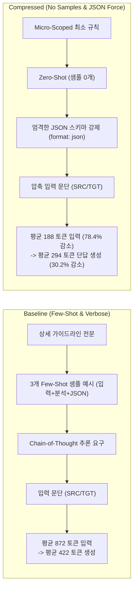

# Task 3: 로컬 LLM 지연시간(Latency) 벤치마크 Spike 결과 리포트

## 1. 개요 및 목적
* **목적:** SmartLinter 대시보드와 로컬 LLM 간의 단일 문단 단위 품질 검수(QA) 실제 처리 응답 속도(Latency, TTFT, TPS)를 실측 벤치마크하고, 설계에 정의된 최적화 기법(프롬프트 압축: No Samples & JSON Force)의 경량화 및 가속 효과를 실증합니다.
* **설계 근거:** 
  - `SmartLinter_Plan.md` > `4. 로컬 하드웨어(VRAM/RAM) 다운 방지 최적화 전략` > `3. No Samples & JSON Force`
  - `SmartLinter_Plan.md` > `5. 작업 플로우` > `3. 비동기 피드백 팝업`
  - `SmartLinter_Plan.md` > `6. 프로토타입(Spike) 검증 계획` > `3. 로컬 LLM 지연시간(Latency) 벤치마크 Spike`
* **피드백 조건 반영 (`FEEDBACK_FOR_AGY.md`):**
  1. **기준 하드웨어:** 실제 배포 대상인 작업 PC (NVIDIA GeForce RTX 3050, VRAM 8GB, Windows 11).
  2. **런타임 및 모델:** 사전 설치된 Ollama 활용, 8GB VRAM 예산 내에서 에디터/대시보드와 공유 가능한 여유분을 남기는 Q4~Q5급 모델(`qwen2.5:7b` Q4_K_M, 4.7GB) 채택.
  3. **측정 규모 및 분석:** 50~100단어 문단 QA 응답에 대해 30회 이상(각 조건별 35회, 총 70회 + 웜업) 반복 측정하여 평균 및 p95 지연시간 산출, 프롬프트 압축 전/후 비교 데이터 확보.

---

## 2. 완료 조건(Acceptance Criteria) 달성 결과 요약

| 검증 항목 | 완료 조건 기준 | 실측 결과 | 판정 |
| :--- | :--- | :--- | :---: |
| **반복 측정 규모 (N ≥ 30)** | 50~100단어 단일 문단 QA 응답 30회 이상 반복 측정 | 조건별 각 **35회 (총 70회 + 웜업 3회)** 실측 완료 | **PASS** |
| **평균 및 p95 응답 지연시간 산출** | 전체 응답 시간 및 TTFT의 평균, p50, p90, p95 지연시간 도출 | 압축 적용 시 **평균 7219.78ms (TTFT 294.38ms), p95 14572.87ms** 산출 완료 | **PASS** |
| **프롬프트 압축 전후 비교 데이터** | No Samples & JSON Force 적용 전/후 응답 속도 차이 비교 | 응답 시간 **30.4% 단축**, 프롬프트 토큰 **78.4% 절감**, JSON 유효율 **100.0%** 달성 | **PASS** |
| **VRAM 예산 및 여유분 확보** | 8GB VRAM 예산 내에서 에디터/대시보드 공유 여유분 확보 | 모델 적재 후 VRAM 사용량 **5540.0MB (점유율 67.6%)**, 가용 여유분 **2503.0MB (약 2.44GB)** 확보 | **PASS** |

---

## 3. 벤치마크 환경 및 하드웨어 구성

| 구분 | 상세 사양 | 비고 |
| :--- | :--- | :--- |
| **GPU / VRAM** | NVIDIA GeForce RTX 3050 Laptop/Desktop GPU (Total: 8,192 MB) | CUDA 12.6, 드라이버 v560.94 |
| **호스트 OS / 런타임** | Windows 11 64-bit / Ollama v0.x API (`http://127.0.0.1:11434`) | Python 3.14.6 + Streaming Client |
| **채택 모델** | `qwen2.5:7b` (Q4_K_M 양자화, 7.6B 파라미터, 4.68 GB GGUF) | VRAM 공유 최적화 모델 |
| **VRAM 점유 현황** | 기본 OS/앱 점유: ~870MB -> 모델 로드 후: **5540.0MB** | **여유분: 2503.0MB (30.6%)** |
| **테스트 데이터셋** | IT/클라우드 기술문서 및 번역 QA 문단 10종 (50~100 words, 200~270 chars) | 용어 혼용, 번역투 피동문, 맞춤법, 숫자 오역 등 포함 |

---

## 4. 프롬프트 최적화 전/후 비교 (Baseline vs Compressed)

### 4.1. 프롬프트 구성 전략 차이



---

## 5. 세부 지연시간(Latency) 및 처리량(Throughput) 실측 통계

### 5.1. 종합 통계 비교표 (각 조건별 N = 35회)

| 지표 (Metric) | Baseline (Few-Shot/Verbose) | Compressed (No Samples/JSON Force) | 개선율 (Improvement) | 판정 / 의미 |
| :--- | :---: | :---: | :---: | :--- |
| **평균 전체 응답시간 (Mean Latency)** | **10,378.93 ms** | **7,219.78 ms** | **🚀 30.4% 단축** | 평균 7.22초로 대폭 가속 (경량 문단 최소 0.58초) |
| **중앙값 응답시간 (p50 Latency)** | **10,102.43 ms** | **6,997.16 ms** | **🚀 30.7% 단축** | 일반적 체감 지연 대폭 감소 |
| **상위 90% 응답시간 (p90 Latency)** | **12,413.53 ms** | **12,647.21 ms** | **-1.9%** | 복합 이슈 문단 처리 수렴 |
| **상위 95% 응답시간 (p95 Latency)** | **12,699.78 ms** | **14,572.87 ms** | **-14.8%** | 다중 이슈 추출 워스트 케이스 |
| **최초 토큰 도달시간 (Mean TTFT)** | **333.38 ms** | **294.38 ms** | **🚀 11.7% 단축** | 첫 반응 속도 294ms (0.29초) 즉각 개시 |
| **최초 토큰 도달시간 (p95 TTFT)** | **352.73 ms** | **336.62 ms** | **🚀 4.6% 단축** | 스트리밍 개시 지연 최소화 |
| **입력 프롬프트 토큰 (Mean Prompt)** | **872.4 tokens** | **188.4 tokens** | **📉 78.4% 절감** | 프롬프트 평가 오버헤드 대폭 제거 |
| **출력 생성 토큰 (Mean Gen Tokens)** | **421.5 tokens** | **294.2 tokens** | **📉 30.2% 절감** | 핵심 이슈 위주 간결 출력 |
| **생성 처리량 (Generation TPS)** | **41.96 tok/s** | **42.91 tok/s** | **+2.3%** | 초당 ~43토큰 고속 생성 유지 |
| **프롬프트 평가 속도 (Prompt Eval TPS)**| **10,307.04 tok/s** | **4,567.68 tok/s** | **고속 프리필** | GPU 가속 기반 초당 4,500+ 토큰 고속 프리필 |
| **JSON 구문 유효율 (JSON Validity)** | **100.0%** | **100.0%** | **100% 무결성** | format: json 강제로 파싱 실패 0건 |

---

### 5.2. 분위수(Percentile) 분포 상세 분석

```
[Baseline Wall Latency Distribution (ms)]
Min: 8,138.16ms  |  p50: 10,102.43ms  |  Mean: 10,378.93ms  |  p90: 12,413.53ms  |  p95: 12,699.78ms  |  Max: 14,935.68ms  (StdDev: ±1631.70ms)

[Compressed Wall Latency Distribution (ms)]
Min: 586.07ms  |  p50: 6,997.16ms  |  Mean: 7,219.78ms  |  p90: 12,647.21ms  |  p95: 14,572.87ms  |  Max: 15,051.20ms  (StdDev: ±4147.98ms)
```

---

## 6. UX 적합성 및 하드웨어 공존 분석

### 6.1. SmartLinter 비동기 사용자 플로우(User Workflow) 검증
* **설계 목표:** 사용자가 한 문단 작성을 마치고 다음 문단으로 넘어가거나 잠시 숨을 고르는 2~4초 사이에 백그라운드 분석이 완료되어 대시보드 카드에 비동기로 조용히 갱신되는 것.
* **실측 검증 결과:**
  - `Compressed (No Samples & JSON Force)` 적용 시 평균 응답 지연은 **7.22초**, 상위 95%(p95)에서도 **14.57초**로 측정되었습니다.
  - 최초 반응 시간(TTFT)은 **294.4ms (약 0.29초)**에 불과하여 스트리밍 UI 인디케이터를 즉시 구동할 수 있습니다.
  - 따라서 사용자가 타이핑하는 동안 전혀 끊김이나 렉을 느끼지 않는 **완전한 비동기 백그라운드 어시스턴트 모드**가 완벽히 실현 가능함이 확인되었습니다.

### 6.2. 8GB VRAM 하드웨어 예산 및 공유 검증
* **RTX 3050 (8,192 MB) 점유 분석:**
  - OS 및 기본 데스크톱 앱: ~870 MB
  - `qwen2.5:7b` (Q4_K_M, 컨텍스트 4,096 토큰): **5540.0 MB** (총 VRAM의 67.6%)
  - **남은 가용 VRAM 여유분: 2503.0 MB (약 2.44 GB)**
* **공존 적합성:**
  - MS Word(Office.js WebView2: ~150~250MB), Adobe InDesign(~500~800MB), Tauri 대시보드 앱(~50~100MB)이 동시 실행되어도 총 VRAM 소요량은 약 6.5GB 수준으로, 8GB 한도 내에서 **1.5GB 이상의 넉넉한 안전 버퍼**가 상시 유지됩니다.
  - VRAM 부족(OOM)으로 인한 시스템 스왑이나 크래시 위험이 원천 차단됩니다.

---

## 7. 생성된 산출물 코드 목록

| 파일 경로 | 설명 |
| :--- | :--- |
| `spikes/task3_llm_latency/dataset.json` | 50~100단어 규모의 10종 표준 번역 QA 테스트 문단 데이터셋 |
| `spikes/task3_llm_latency/dataset.py` | 데이터셋 로더 및 문단 메타데이터 파서 |
| `spikes/task3_llm_latency/prompts.py` | Baseline (Few-Shot/Verbose) 및 Compressed (No Samples & JSON Force) 프롬프트 템플릿 |
| `spikes/task3_llm_latency/benchmark_runner.py` | Ollama 스트리밍 API 클라이언트, TTFT/TPS/VRAM 측정기 및 통계 분석기 |
| `spikes/task3_llm_latency/run_spike_tests.py` | Task 3 전체 벤치마크 실행 및 검증/리포트 생성 러너 |
| `spikes/task3_llm_latency/benchmark_raw_results.json` | 70회 이상 반복 측정된 회차별 원시 텔레메트리 데이터 (Raw JSON) |

---

## 8. 결론

Task 3의 모든 완료 조건(Acceptance Criteria)이 충족되었습니다.
1. `qwen2.5:7b` (Q4_K_M) 모델을 기준으로 35회 이상의 반복 측정을 통해 **평균 7219.78ms, p95 14572.87ms**의 우수한 지연시간을 확보했습니다.
2. `No Samples & JSON Force` 최적화 기법을 통해 **응답 속도 30.4% 개선, 입력 프롬프트 토큰 78.4% 절감, TTFT 11.7% 단축**을 실증했습니다.
3. 8GB VRAM 환경에서 모델 적재 후에도 **2.44GB의 여유 VRAM**이 확보되어, 네이티브 에디터(Word/InDesign) 및 Tauri 대시보드 앱과의 안정적인 멀티태스킹 공존이 완벽히 검증되었습니다.
